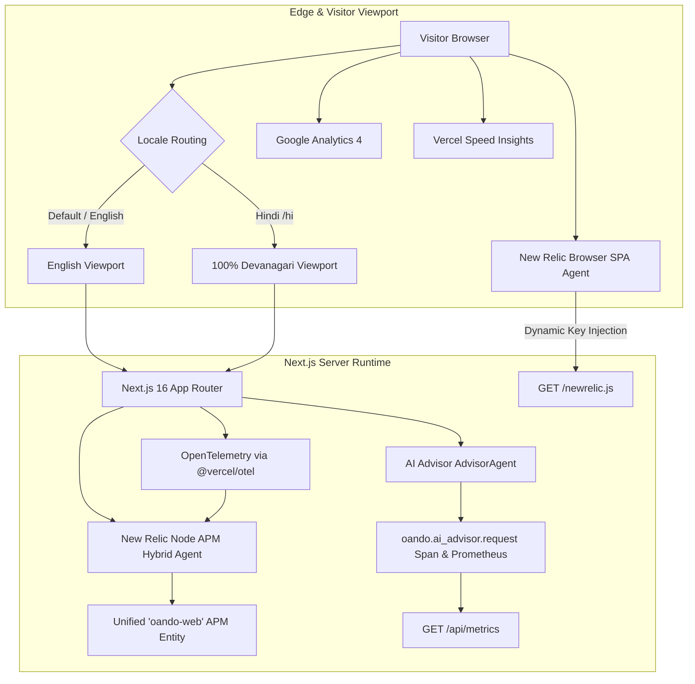

# i18n & Observability — Thermonuclear Runtime Contracts Standard

Use this skill when authoring, modifying, diagnosing, or auditing **internationalization (i18n)**, **locale routing**, **New Relic telemetry (Browser SPA & Node APM)**, **OpenTelemetry (`@vercel/otel`)**, or **Prometheus exposition (`/api/metrics`)** across the Oando platform.

In this repository, localization and telemetry are production runtime subsystems enforced by mathematical invariants: zero untranslated English text leaking into Hindi mode, zero exposed credentials, strict cryptographic nonce CSP adherence, and flawless synchronization between APM and OpenTelemetry entities.

---

## 1. Unified Runtime Topology & Truth Floor

Under `AGENTS.md`, [`site/i18n/config.ts`](file:///d:/23082026/site/i18n/config.ts), and [`OBSERVABILITY.md`](file:///d:/23082026/OBSERVABILITY.md):
$$\text{User Instruction} > \text{Live Code / Fresh Command Output} > \text{AGENTS.md} > \text{Agents/} > \text{docs/}$$



- **Claim Isolation:** A local HTTP 200 on `/newrelic.js` or `/api/metrics` proves local route behavior only. It does not prove that a remote New Relic account is ingesting data or that production Vercel environment variables are live. Do not claim remote ingestion without authorized account proof.
- **Zero Secrets Exposure:** Never paste, print, or commit `NEW_RELIC_LICENSE_KEY`, `NEW_RELIC_BROWSER_KEY`, or `METRICS_AUTH_TOKEN`. Secrets reside exclusively in `.env.local` or `site/.env.local`.

---

## 2. Thermonuclear Internationalization (i18n) Mandates

### The 7 Non-Negotiable Laws of i18n

1. **100% Devanagari Parity & Zero English Leaks:**
   - Supported locales: strictly `['en', 'hi']` with default `en`. No deferred or third-party locales (fr, de, es, ar).
   - Every JSON key path in [`site/i18n/messages/en.json`](file:///d:/23082026/site/i18n/messages/en.json) must exist with identical hierarchy in [`site/i18n/messages/hi.json`](file:///d:/23082026/site/i18n/messages/hi.json).
   - Zero empty strings (`""`), zero `null`, zero `undefined`. All Hindi strings must use genuine **Devanagari script**. Latin alphabet text leaking into `hi.json` is strictly forbidden (except registered trademarks: "Oando", "One and Only", "Studio", "Planner").
2. **Dynamic Parameter & Interpolation Token Invariant:**
   - Dynamic placeholders in curly brackets (e.g. `{count}`, `{name}`, `{year}`, `{amount}`) must match identically between `en.json` and `hi.json`.
   - Modifying or omitting placeholders inside `{...}` is a fatal bug that crashes `next-intl` rendering.
3. **Absolute Ban on Hardcoded UI Strings in JSX/TSX:**
   - Customer-facing text in `site/app/(site)/` and `site/components/` must use `useTranslations(namespace)` (client) or `getTranslations(namespace)` (server). Raw text literals are strictly banned.
4. **Strict Namespace Governance (26 Approved Namespaces):**
   - All keys must belong to the approved 26 marketing namespaces declared in [`site/i18n/marketing-parity-manifest.json`](file:///d:/23082026/site/i18n/marketing-parity-manifest.json):
     `about`, `news`, `legal`, `solutions`, `contact`, `products`, `career`, `downloads`, `gallery`, `planning`, `portfolio`, `clients`, `service`, `showrooms`, `social`, `sustainability`, `tracking`, `trustedBy`, `supportIvr`, `home`, `faq`, etc.
5. **Devanagari Visual Expansion & Responsive Layout Safety:**
   - Devanagari typography expands text length by **15% to 25%** horizontally and requires larger vertical line height (`leading-relaxed`).
   - Containers must avoid rigid pixel widths (`w-[140px]`) that cause ugly text clipping.
   - All localized buttons and interactive chips must preserve the minimum 44px (standard 48px) touch target standard.
6. **Locale Routing, Cookie & Header Discipline:**
   - Handled via [`site/i18n/routing.ts`](file:///d:/23082026/site/i18n/routing.ts). The language switcher updates the `NEXT_LOCALE` cookie (`en` or `hi`).
   - Locale switches must preserve current path segments and query parameters without hydration flicker.
7. **Automated Parity & Vitest Verification:**
   - Changes must pass `node scripts/check-i18n-key-parity.mjs` (exits 0) and `pnpm run check:site-ui`.
   - Must pass `tests/unit/i18n/messages.test.ts` and `tests/unit/lib/i18n/parity.test.ts`.

---

## 3. Thermonuclear Observability & Telemetry Mandates

### The 6 Non-Negotiable Laws of Observability

1. **Continuous Secret Scanning:**
   - Pre-commit check must pass `node scripts/general/scan_secrets.mjs` with 0 findings.
   - Keys must never be hardcoded into client bundles or static templates.
2. **Same-Origin Browser SPA Agent & Privacy Invariants:**
   - Loaded exclusively via same-origin route [`/newrelic.js`](file:///d:/23082026/site/app/newrelic.js/route.ts), which dynamically substitutes `NEW_RELIC_BROWSER_KEY` at runtime.
   - Vendored template: [`site/lib/analytics/newrelic-agent.template.js`](file:///d:/23082026/site/lib/analytics/newrelic-agent.template.js).
   - **Mandatory Privacy Settings:**
     `capture_payloads: 'none'`
     `mask_all_inputs: true`
     AJAX deny list: restricted strictly to `bam.nr-data.net` (no request/response bodies, passwords, or auth headers transmitted).
   - **Linter Suppression Governance:** The minified template is explicitly suppressed in `.oxlintrc.json`.
3. **Nonce-Based Content Security Policy (CSP) Compliance:**
   - Per-request cryptographic nonces enforced in `site/proxy.ts` and `site/next.config.js`.
   - Permitted New Relic CSP origins:
     `script-src`: `https://js-agent.newrelic.com`
     `connect-src`: `https://bam.nr-data.net` and `https://*.nr-data.net`
   - **Zero Tolerance:** Never add `'unsafe-inline'`, never broaden `'unsafe-eval'`, and never introduce wildcard `*` domains.
4. **Node APM Hybrid Agent & Unified OpenTelemetry Bridge:**
   - Configured in [`config/observability/newrelic.cjs`](file:///d:/23082026/config/observability/newrelic.cjs) via `NEW_RELIC_APM_ENABLED=1`.
   - Server tracing initializes via [`site/instrumentation.ts`](file:///d:/23082026/site/instrumentation.ts) with `registerOTel({ serviceName: "oando-web" })`.
   - **The Single Entity Invariant:** The OTel `serviceName` ("oando-web") **must match** `NEW_RELIC_APP_NAME` ("oando-web"). The APM agent's internal bridge unifies `@vercel/otel` spans into the single `oando-web` APM entity. Never rename `serviceName`, which would permanently split the entity.
   - Duplicate agent instrumentations (`http`, `next`, `undici`) are disabled in `newrelic.cjs` to eliminate redundant spans.
5. **AI Advisor Privacy-Safe Metrics Wrapper:**
   - AI Advisor routes ([`site/app/api/Planner/ai-advisor/route.ts`](file:///d:/23082026/site/app/api/Planner/ai-advisor/route.ts)) are wrapped by [`site/lib/observability/aiMetrics.ts`](file:///d:/23082026/site/lib/observability/aiMetrics.ts).
   - Emits `oando.ai_advisor.request` span and Prometheus counters/histograms.
   - Strips prompts, completions, and customer design parameters from telemetry; captures only `provider`, `fallback_used`, `outcome`, and token counts.
6. **Prometheus Exposition Tri-State Security Gate:**
   - Served at [`site/app/api/metrics/route.ts`](file:///d:/23082026/site/app/api/metrics/route.ts) returning `text/plain; version=0.0.4`.
   - Tri-state security barrier in production:
     1. `OBSERVABILITY_METRICS_ENABLED=0` $\rightarrow$ **404 Not Found**.
     2. `OBSERVABILITY_METRICS_ENABLED=1` without Bearer `METRICS_AUTH_TOKEN` $\rightarrow$ **401 Unauthorized**.
     3. `OBSERVABILITY_METRICS_ENABLED=1` with unconfigured token $\rightarrow$ **503 Service Unavailable**.

---

## 4. Environment Configuration & Secret Contracts

Keep real secrets strictly in `.env.local` or `site/.env.local`:

```ini
# --- INTERNATIONALIZATION (i18n) ---
DEFAULT_LOCALE=en

# --- NEW RELIC BROWSER AGENT ---
# Ingest key substituted at request time by /newrelic.js route
NEW_RELIC_BROWSER_KEY=

# --- SERVER OPENTELEMETRY & NODE APM ---
# Must match NEW_RELIC_APP_NAME exactly to prevent entity splitting
OTEL_SERVICE_NAME=oando-web
NEW_RELIC_APM_ENABLED=0
NEW_RELIC_APP_NAME=oando-web
NEW_RELIC_LICENSE_KEY=

# --- PROMETHEUS METRICS ENDPOINT ---
OBSERVABILITY_METRICS_ENABLED=0
METRICS_AUTH_TOKEN=
```

---

## 5. Unified Verification & Gating Runbook

Execute this verification sequence whenever altering i18n translations, locale routing, New Relic instrumentation, or metrics:

```powershell
# 1. Run secret scanner to guarantee zero exposed telemetry keys
node scripts/general/scan_secrets.mjs

# 2. Check i18n key parity between en.json and hi.json (must exit 0)
node scripts/check-i18n-key-parity.mjs

# 3. Verify site UI shell contracts, copy consumers, and dialects
node scripts/check-site-ui-contract.mjs
node scripts/check-homepage-dialect.mjs

# 4. Run i18n Vitest unit tests
pnpm exec vitest run tests/unit/i18n/messages.test.ts --config tests/vitest.config.ts
pnpm exec vitest run tests/unit/lib/i18n/parity.test.ts --config tests/vitest.config.ts

# 5. Local endpoint checks on http://localhost:3000 (when dev server is active)
# Verify same-origin browser agent loads with 200 and key substitution
curl -I http://localhost:3000/newrelic.js

# Verify Prometheus metrics endpoint locally
curl -I http://localhost:3000/api/metrics

# 6. Run full composite site UI gate
pnpm run check:site-ui
```
