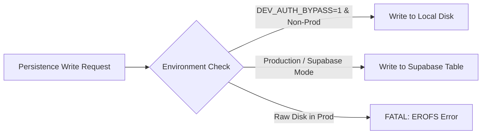

# Oando Tech Stack — All-in-One Platform Technical Reference

Use this skill as the master architectural and technological reference for the Oando platform repository (`d:/23082026`). It consolidates all system specifications, invariant rules, framework contracts, and operational requirements across the entire software lifecycle.

---

## 1. System Topology & Repository Layout

```
d:/23082026/
├── site/                     # Core Next.js 16 (App Router) Application
│   ├── app/
│   │   ├── (site)/           # Marketing routes, Client Hub, /trusted-by, /clients
│   │   ├── admin/            # Administrative Backoffice (/admin/*)
│   │   ├── api/              # API endpoints (AI Advisor, metrics, persistence)
│   │   └── newrelic.js/      # Dynamic same-origin New Relic browser agent route
│   ├── components/
│   │   ├── Studio/           # Furniture Studio UI (Fork Tree 1)
│   │   └── Planner/          # Floor Planner UI (Fork Tree 2)
│   ├── lib/
│   │   ├── Studio/           # Studio business logic & state
│   │   ├── Planner/          # Planner persistence, solvers, geometry
│   │   ├── ai/mastra/        # Mastra AI framework & advisor agents
│   │   └── clients/          # 116-client canonical enterprise registry
│   ├── focss/                # FOCSS Tokenized CSS System (@focss/*)
│   ├── i18n/                 # next-intl configuration, messages (en, hi)
│   └── platform/             # Supabase migrations, Drizzle schemas
├── tech-docs-generator/      # Vite-based Documentation Explorer SPA (port 3001)
├── tests/                    # Vitest unit/integration suites & Playwright specs
├── scripts/                  # Operations runner, gates, and governance ratchets
└── plans/                    # Markdown plans & flowcharts (strictly code-free)
```

---

## 2. Core Framework & Runtime Stack

- **Framework:** Next.js 16 (App Router) with React 19.
- **Language:** TypeScript in strict mode. **Zero handwritten `any`**.
- **Node Runtime:** Node.js LTS (v20+).
- **Package Manager:** `pnpm` exclusively, run strictly from the **repository root**. Never create worktrees or execute installs within subdirectories.
- **Local Origin:** Always access local UI via `http://localhost:3000` (never `127.0.0.1`).

---

## 3. The Dual Fork Architecture: Studio vs. Planner

The Furniture Studio (`/oostudio`) and Floor Planner (`/ooplanner`) are strictly forked, autonomous subsystems:

```
┌─────────────────────────────────┐       ┌─────────────────────────────────┐
│         FURNITURE STUDIO        │       │          FLOOR PLANNER          │
│   site/**/Studio (@studio/*)    │       │   site/**/Planner (@planner/*)  │
└────────────────┬────────────────┘       └────────────────┬────────────────┘
                 │                                         │
                 │ (Writes catalog)       (Reads catalog)  │
                 ▼                                         ▼
         ┌─────────────────────────────────────────────────────────┐
         │             SHARED PERSISTENCE CATALOG                  │
         │           Admin DB: 'furniture_catalog'                 │
         └─────────────────────────────────────────────────────────┘
```

- **Fork Boundary Invariant:** Studio code must **never** import Planner code, and Planner code must **never** import Studio code.
- **Enforcement:** Verified via `pnpm run scan:boundaries`. Any cross-import breaks CI immediately.
- **Meeting Point:** The two systems interact only through the shared furniture backing store: the Studio writes furniture definitions; the Planner rail consumes them.

---

## 4. Dual-Database Supabase Topology

Data persistence is split across two dedicated Supabase project instances:

| Database Instance | Ref ID | Managed Data Domains |
|---|---|---|
| **Admin Database** | `rxzpznmxbaoxpikowmfc` | Staff/customer authentication, profiles, user projects (`oando_plans`), furniture catalog (`furniture_catalog`), block descriptors, price books, handoffs. |
| **Products Database** | `erpweaiypimorcunaimz` | Public marketing catalog, configurator 3D models, themes, feature flags. |

### Database Rules & Invariants
1. **Migration Rollback Standard:** Every SQL migration file in `site/platform/supabase/migrations/` **must** contain an explicit `-- rollback` block.
2. **Dry-Run Preflight:** Always execute migrations in dry-run mode before applying:
   `pnpm run db:apply -- --dry` (Products DB)
   `pnpm run db:apply:admin -- --dry` (Admin DB)
3. **Security Grants & Policies:** Every table requires explicit `GRANT` statements and enabled Row Level Security (`ENABLE ROW LEVEL SECURITY`) with defined policies.
4. **Type Generation:** Keep TypeScript Drizzle definitions in lockstep:
   `pnpm run db:types:admin`
   `pnpm run db:types`

---

## 5. Persistence Engine: Mode-Aware Exclusive Writes

> **CRITICAL INVARIANT:** Production Vercel serverless filesystems are strictly read-only (`EROFS`). Direct calls to `fs.writeFileSync` or `fs.promises.writeFile` will crash in production.



- **Exclusive Persistence Mode:**
  - `DEV_AUTH_BYPASS=1` on non-production builds selects **local disk**.
  - All other environments (including production) select **Supabase**.
  - **No Dual-Write:** The system never writes to disk and database simultaneously.
- **Mode-Aware Wrappers (Mandatory):**
  - Floor Plans: Handled via [`plannerPersistenceMode.ts`](file:///d:/23082026/site/lib/Planner/plannerPersistenceMode.ts) (`oando_plans`).
  - Furniture Items: Handled via `writeFurnitureItem` in [`furnitureCatalogMode.ts`](file:///d:/23082026/site/lib/catalog/furnitureCatalogMode.ts) (`furniture_catalog`).
  - Block Descriptors: Handled via mode-aware catalog wrappers.

---

## 6. Design System & Styling: FOCSS

- **CSS Architecture:** High-performance, tokenized CSS system (`@focss/*`) located under `site/focss/`.
- **Zero Arbitrary Tailwind Values:** Banned syntax includes `p-[13px]`, `w-[342px]`, `text-[#ff0000]`. All spacing, colors, and elevations must resolve through semantic FOCSS tokens.
- **Style Token Ratchet:** Verified by `node scripts/general/check-style-tokens.mjs` (must remain at or below baseline debt cap).
- **CSS Validation Commands:**
  `pnpm run verify:focss`
  `pnpm run lint:ui:strict`
  `pnpm run check:style-tokens`

---

## 7. Mobile Architecture & Motion Standards

- **Mobile Viewport Breakpoint:** Viewports `<768px` activate mobile application chrome.
- **Bottom Navigation Dock:** Fixed 5-tab dock (64px height + `env(safe-area-inset-bottom)`).
- **Page Container Offset:** All mobile pages must declare `pb-20` (or safe area padding) to prevent dock overlap.
- **Touch Targets:** Minimum 44px (standard 48px) clickable touch areas for all interactive controls.
- **GSAP / ScrollTrigger Mobile Invariant:**
  - On mobile, `window` scrolling is disabled; scrolling belongs exclusively to `.mobile-app-main`.
  - Any ScrollTrigger animation must explicitly bind to `scroller: ".mobile-app-main"` on viewports `<768px`.
- **Iconography:** Phosphor Icons exclusively (`@phosphor-icons/react`). Zero inline SVGs or third-party iconography libraries.

---

## 8. Observability & Telemetry Subsystem

- **Browser SPA Telemetry:**
  - Served via same-origin dynamic route `/newrelic.js` ([`site/app/newrelic.js/route.ts`](file:///d:/23082026/site/app/newrelic.js/route.ts)) substituting `NEW_RELIC_BROWSER_KEY` at runtime.
  - Template privacy controls: `capture_payloads: 'none'`, `mask_all_inputs: true`, AJAX deny list restricted to `bam.nr-data.net`.
- **Node APM Hybrid Agent & OTel Bridge:**
  - Configured in [`config/observability/newrelic.cjs`](file:///d:/23082026/config/observability/newrelic.cjs) via `NEW_RELIC_APM_ENABLED=1`.
  - Bridges native `@vercel/otel` spans initialized in [`site/instrumentation.ts`](file:///d:/23082026/site/instrumentation.ts).
  - **Entity Naming Invariant:** `registerOTel({ serviceName: "oando-web" })` **must match** `NEW_RELIC_APP_NAME="oando-web"`. Never rename `serviceName`, as this permanently splits the entity in New Relic.
- **AI Advisor Telemetry:**
  - Wrapped by [`site/lib/observability/aiMetrics.ts`](file:///d:/23082026/site/lib/observability/aiMetrics.ts).
  - Emits `oando.ai_advisor.request` spans and Prometheus metrics. Prompts and completions are strictly stripped to protect user privacy.
- **Prometheus Metrics Route (`GET /api/metrics`):**
  - Emits `text/plain; version=0.0.4`.
  - Tri-state security gate in production: `404` if disabled, `401` if missing Bearer `METRICS_AUTH_TOKEN`, `503` if token unconfigured.
- **Nonce CSP Strictness:** Only `https://js-agent.newrelic.com` (script-src) and `https://bam.nr-data.net https://*.nr-data.net` (connect-src) are permitted. Zero `unsafe-inline`.

---

## 9. AI Engine: Mastra Framework

- Built on Mastra (`@mastra/core`) located under `site/lib/ai/mastra/`.
- Multi-provider fallback chain: Google Gemini $\rightarrow$ Anthropic Claude $\rightarrow$ OpenAI GPT.
- Streaming advisor routes in `site/app/api/Planner/ai-advisor/route.ts` and `site/app/api/ai-advisor/route.ts`.
- Server external packages: `sharp`, `@lancedb/lancedb`, `@mastra/core` configured in `site/next.config.js`.

---

## 10. Internationalization (i18n)

- Supported locales strictly `['en', 'hi']` with default `en` ([`site/i18n/config.ts`](file:///d:/23082026/site/i18n/config.ts)).
- 100% key parity between `en.json` and `hi.json` across all 26 marketing namespaces cataloged in `site/i18n/marketing-parity-manifest.json`.
- Dynamic interpolation placeholders (`{count}`, `{name}`) must match identically between languages.
- Hardcoded customer-facing string literals in JSX/TSX are banned; components must consume keys via `useTranslations()`.
- Verified via `node scripts/check-i18n-key-parity.mjs` and `pnpm run check:site-ui`.

---

## 11. Testing Subsystem & Verification Lanes

### Dual-Lane Vitest Setup
- **Default Next App Lane:** Run with `--config tests/vitest.config.ts` using `happy-dom` environment. Maps `@/` to `site/`.
- **Tech-Docs SPA Lane:** Run with `--config tests/vitest.tech-docs.config.ts`.
- `pnpm run test` executes both lanes. A green report on one lane does not constitute a passed suite.

### The 5 Static Test Integrity Audits
1. `node scripts/general/audit-hollow-tests.mjs` (Rejects hollow assertions and empty catch blocks).
2. `node tech-docs-generator/scripts/fake-test-audit.mjs` (Rejects mocked units under test).
3. `node scripts/general/audit-gate-skips.mjs` (Rejects unauthorized `.skip` and `.only`).
4. `node scripts/general/audit-eslint-disable.mjs` (Enforces 5-file cap on `react-hooks/exhaustive-deps`).
5. `node scripts/general/audit-api-route-safety.mjs` (Validates route handlers and auth barriers).

### Playwright E2E Testing
- Origin must be `http://localhost:3000` (never `127.0.0.1`).
- Verified against standard viewports: Desktop (1280x800) and Mobile (390x844).

---

## 12. Release Gating & Quality Floors

```powershell
# Development loop fast gate (layout, style tokens, boundaries, unit tests)
pnpm run gate:fast

# Full release ship gate (full suite, build, coverage, governance ratchet)
pnpm run gate

# Secrets and credentials pre-commit scanner
pnpm run scan:secrets

# Failures.md governance check (zero forbidden keywords)
node scripts/general/check-failures.mjs
```

- **Blocker Governance:** The file `Failures.md` is the sole repository record of hard blockers. Blockers are cleared **only by deleting their entire row** after an authorized passing rerun.
- **Quarantine Floor:** Directory `docs/protected-folder/` is strictly quarantined. Never read, search, list, or reference it.

---

## 13. Deployment, Vercel Linking & Cloud Operations

- **Vercel Remote Link Verification:** Always verify both Git remote (`git remote -v`) and `.vercel/project.json` before diagnosing why deployments appear absent; a Vercel project linked to a different repository will not reflect pushes.
- **Production Deployment:** Run `pnpm run vercel:prod` only after ship gate passes.
- **Cloudflare R2 Backups:** Managed through `pnpm run r2:backup` for asset storage and furniture catalog backups.
- **Worker Deployments:** Managed via `pnpm run worker:deploy`.
- **Operations Runner:** Centralized script runner via `node scripts/run-ops.mjs` (list available tasks via `pnpm run ops:list`).
