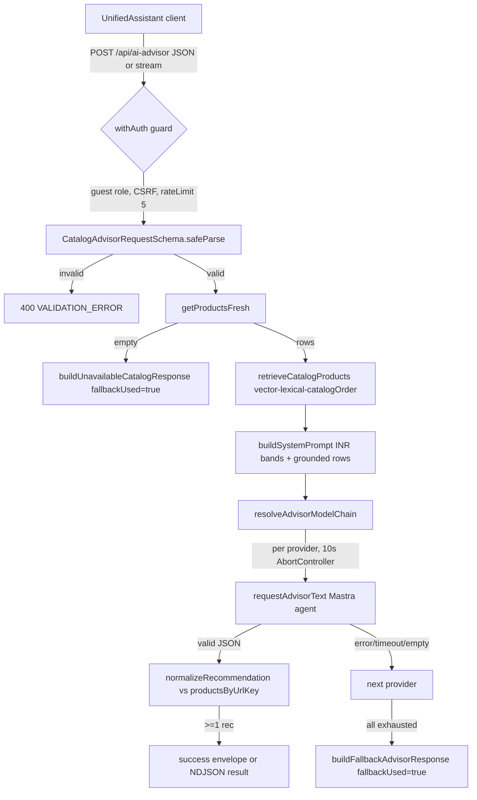
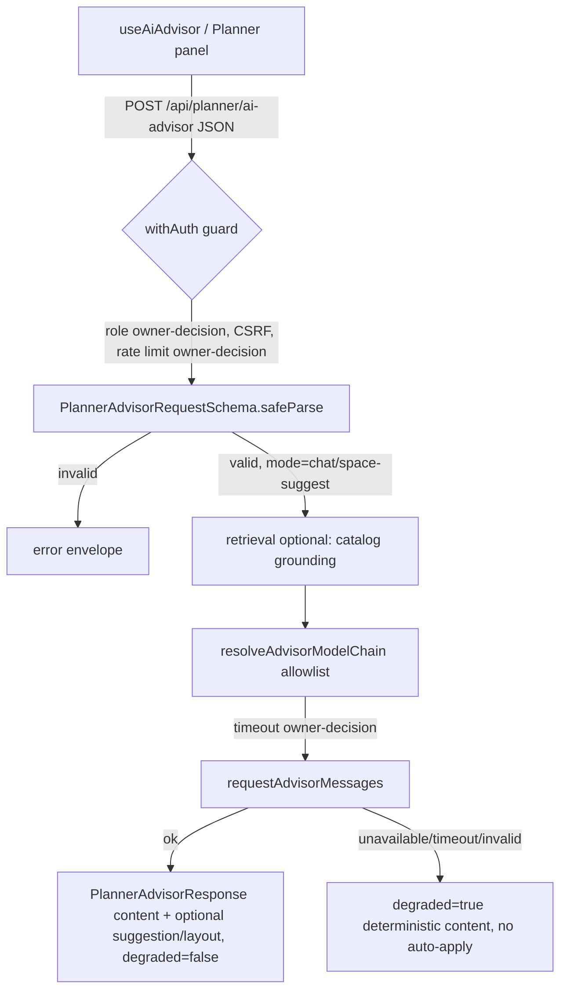
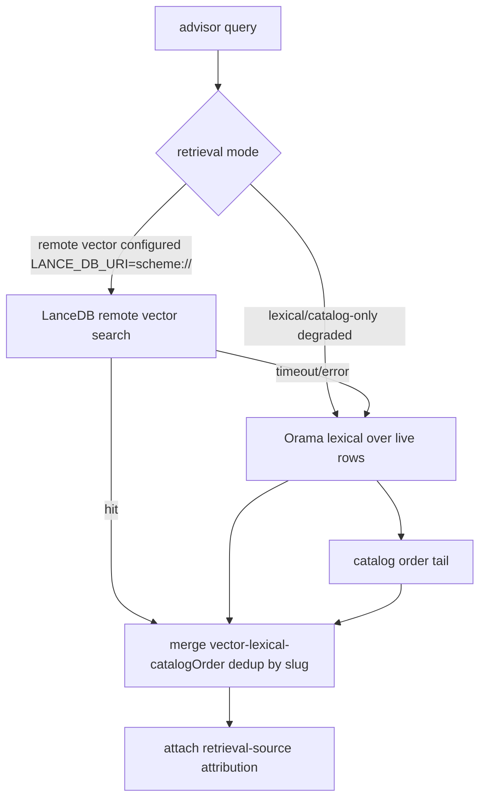

# AI Package Remediation Bugfix Design

## Overview

This design formalizes a decision-ready remediation for One & Only Furniture's AI
assistance surfaces: the **catalog advisor** (`POST /api/ai-advisor`, live) and the
**Planner advisor** (`callPlannerAdvisor` → `POST /api/planner/ai-advisor`, whose route
handler is absent from the source tree). It also addresses a retrieval-persistence
boundary (LanceDB defaulting to a local filesystem path) that cannot rely on the
production filesystem, an under-specified provider/data policy, and the absence of an
AI-specific evaluation/observability contract.

The bug being fixed is **decision-integrity**, not a single crash: the program lacks
evidenced, phase-scoped remediation records and contracts that let maintainers change
packages, providers, retrieval, and response formats without treating model output as
authoritative or writing to a read-only production filesystem. The general strategy is
to (a) separate observed static facts from unverified runtime behavior, (b) define
independent typed contracts, deterministic fallbacks, and an owner-gated retrieval
architecture, (c) produce an evidence-cited dependency comparison that minimizes churn,
and (d) stage every implementation behind explicit owner approval.

This is the **design phase only**. Nothing here authorizes package installation, version
changes, lockfile edits, provider calls, secret changes, production configuration, data
migration, route deployment, or automatic application of AI suggestions. Per repository
authority order (user instruction > live code and fresh command output > `AGENTS.md` >
`Agents/` > `docs/`), the system remains read-only until the owner grants exact
current-session approval for a named scope, and any protected command additionally
requires enabled-hook permission.

### Evidence classification convention

Every claim in this document is tagged:

- **[STATIC-FACT]** — read directly from live source in this session; cited by path.
- **[MANIFEST]** — declared in root `package.json` (live file).
- **[WEB-VERIFIED]** — confirmed against an official/registry source this session; cited inline.
- **[UNVERIFIED]** — plausible but not confirmed this session; must not be relied on.
- **[OWNER-DECISION]** — deliberately deferred to the owner.

No runtime behavior, provider reachability, build result, or test result is asserted as
observed. An unobserved command is unrun.

---

## Glossary

- **Bug_Condition (C)**: An AI delivery decision (package, provider, retrieval, response
  format, or persistence boundary) is exercised **without** an evidenced, phase-scoped
  contract/record governing it — or a runtime path attempts a production filesystem
  write or targets a non-existent route.
- **Property (P)**: The desired behavior for a bug-condition input — a matching handler
  returns a contract-conforming (or clearly-marked deterministic degraded) response;
  vector recall reports "unavailable" without writing to disk; every package/provider
  change is owner-approved and pinned.
- **Preservation**: Existing catalog-advisor behavior, security controls, INR pricing
  discipline, advisory-only semantics, and the separation of Orama vs Fuse.js must remain
  unchanged for inputs that are not the bug condition.
- **F / F′**: The original (unfixed) implementation / the fixed implementation.
- **Catalog advisor**: `POST /api/ai-advisor` — `site/app/api/ai-advisor/route.ts` **[STATIC-FACT]**.
- **Planner advisor client**: `callPlannerAdvisor` in
  `site/lib/ai/mastra/plannerAdvisorClient.ts`, targeting
  `PLANNER_ADVISOR_API_PATH = "/api/planner/ai-advisor"` **[STATIC-FACT]**.
- **Retrieval stack**: LanceDB vector recall (`catalogRag.ts` + `lanceVectorStore.ts`) →
  Orama lexical (`catalogLocalSearch.ts`) → catalog order, orchestrated by
  `retrieveCatalogProducts` in `catalogRetrieval.ts` **[STATIC-FACT]**.
- **Deterministic degraded response**: A non-model, catalog-grounded response marked
  `fallbackUsed: true` (catalog) or `degraded: true` (Planner).
- **Provider allowlist**: The explicitly owner-approved set of AI providers/models the
  server may call; distinct from "any provider whose key is present".
- **Production FS read-only**: `AGENTS.md` §5 — raw disk helpers throw `EROFS`; runtime
  writes must use mode-aware wrappers **[STATIC-FACT]**.

---

## Bug Details

### Bug Condition

The bug manifests when an AI delivery decision is made or a runtime path executes without
an evidenced, phase-scoped contract, **or** when a runtime path targets a route that does
not exist or attempts a production filesystem write. Concretely, static inspection
identifies:

- **Missing Planner route.** `callPlannerAdvisor` posts to `/api/planner/ai-advisor`
  **[STATIC-FACT: `plannerAdvisorClient.ts`]**, but the API tree under
  `site/app/api/` contains only a capitalized `Planner/` directory with
  `catalog/`, `handoff/`, `projects/`, `sketch-to-plan/` and **no** `ai-advisor` handler
  **[STATIC-FACT: directory listing]**. There is both a *missing-handler* problem and a
  *case-mismatch* risk (`Planner` vs `planner`) on case-sensitive hosts (Linux/Vercel).
- **Local-path vector store.** `resolveLanceDbUri()` defaults to
  `path.join(process.cwd(), ".data", "lancedb", "catalog")` — a local filesystem path —
  and `conn()` calls `assertDevDiskWritable()` then `fs.mkdirSync(...)` for non-remote URIs
  **[STATIC-FACT: `lanceVectorStore.ts`]**.
- **No AI evaluation/observability contract.** `metrics.ts` registers only
  `collectDefaultMetrics({ prefix: "oando_" })`; there are no AI relevance, validity,
  fallback, provider-selection, retrieval-contribution, or latency metrics
  **[STATIC-FACT: `metrics.ts`]**.
- **Provider set by key presence.** `resolveAdvisorModelChain()` enables gemini →
  openrouter(primary) → openrouter(backup) → openai → bedrock purely on env-key presence,
  with no explicit owner allowlist gate **[STATIC-FACT: `providers.ts`]**.

**Formal Specification:**

```
FUNCTION isBugCondition(input)
  INPUT: input of type AiDeliveryDecision | RuntimeInvocation
  OUTPUT: boolean

  RETURN
       (input.kind = "decision"
          AND NOT existsEvidencedPhaseContract(input.decisionTarget))
    OR (input.kind = "planner-advisor-request"
          AND NOT routeHandlerExists("/api/planner/ai-advisor"))
    OR (input.kind = "vector-recall"
          AND isProduction()
          AND NOT remoteVectorStoreConfigured()
          AND attemptsLocalFilesystemWrite())
    OR (input.kind = "package-or-provider-change"
          AND NOT ownerApprovedAndPinned(input.change))
END FUNCTION
```

### Examples

- **[STATIC-FACT]** A browser calls `useAiAdvisor().sendMessage(...)` →
  `callPlannerAdvisor({mode:"chat", ...})` → `POST /api/planner/ai-advisor`. No handler
  exists at that path, so the client cannot receive a `PlannerAdvisorResponse`. Expected:
  a matching handler returns `{ content, degraded?, provider?, suggestion?, layout? }` or a
  clearly-marked degraded response.
- **[STATIC-FACT]** In production with no `LANCE_DB_URI`, `resolveLanceDbUri()` returns a
  local path; `conn()` calls `assertDevDiskWritable()`, which throws `EROFS` (production FS
  read-only). The throw is caught downstream in `recallVectorProductIds` (fail-open → `[]`),
  so retrieval silently degrades — but control flow is exception-based rather than an
  explicit "vector unavailable" capability signal, and the default target is a disk path
  rather than a configured remote store. Expected: report vector retrieval unavailable
  and preserve the request **without** any local write attempt.
- **[STATIC-FACT]** A maintainer wants to bump `@mastra/core` from the declared `^1.63.0`.
  There is no package-specific record identifying approver, exact pinned version,
  compatibility, migration, and rollback. Expected: an approved comparison-chart
  recommendation and an exact pinned version before any `package.json`/lockfile edit.
- **Edge case [STATIC-FACT]** A `stream:true` catalog request with an empty catalog:
  `handleCatalogAdvisor` returns `buildUnavailableCatalogResponse` (marked
  `fallbackUsed: true`). This is correct degraded behavior to preserve, not a defect.

---

## Expected Behavior

### Preservation Requirements

**Unchanged behaviors (must continue to work exactly as today):**

- Catalog advisor returns advisory-only, catalog-grounded guidance and never changes a
  plan, catalog item, price, or order **[STATIC-FACT: route has no write path; only reads
  `getProductsFresh`, `user_history` select]**.
- When a provider or retrieval layer is unavailable, the advisor returns a clearly
  identifiable deterministic degraded fallback (`fallbackUsed: true`) rather than
  presenting unavailable AI output as authoritative **[STATIC-FACT:
  `buildFallbackAdvisorResponse`, `buildUnavailableCatalogResponse`]**.
- Pricing stays INR-oriented: budget bands or "On request"; no fabricated final BOQ or
  precise authoritative totals **[STATIC-FACT: system prompt + `sanitizeAdvisorPriceText`
  + `parsePriceRange`]**.
- The catalog route continues to enforce guest auth, CSRF, rate limiting (scope
  `ai-advisor`, limit 5), input validation (`CatalogAdvisorRequestSchema`), response
  normalization, unknown-product rejection (recommendations normalized against
  `productsByUrlKey`), and the server-only secret boundary; any control that rejects a
  request rejects it before a provider call **[STATIC-FACT: `withAuth(..., {role:"guest",
  rateLimitScope:"ai-advisor", rateLimit:5, requireCsrf:true})`, `normalizeRecommendation`,
  `parsePayload`]**.
- Orama's advisor retrieval path and Fuse.js product filtering remain **separate concerns**
  unless live import evidence and an approved design deliberately join them. Fuse.js does
  not appear in the advisor retrieval stack today **[STATIC-FACT: `catalogRetrieval.ts`,
  `catalogLocalSearch.ts` import only `@orama/orama`]**.
- Existing `ai-implementation-audit` artifacts, unrelated source, package declarations,
  lockfiles, dependencies, secrets, and provider configuration stay intact until a later
  approved phase.

**Scope.** All inputs that are **not** the bug condition — a valid catalog request, a
non-production disk-mode vector recall, an already-approved dependency, an existing route —
must be completely unaffected by this remediation.

---

## Hypothesized Root Cause

Based on static inspection, the most likely causes are:

1. **Contract/route drift.** The Planner client and its request/response types plus
   `PlannerAdvisorRequestSchema` were authored, but the server handler at
   `/api/planner/ai-advisor` was never added (or was placed under a case-mismatched path).
   The catalog advisor and Planner advisor were not given **independent** typed contracts.
2. **Persistence-mode assumption.** LanceDB was integrated with a local-path default
   (`process.cwd()/.data/lancedb/catalog`) suited to local disk mode, then guarded reactively
   with `assertDevDiskWritable()` rather than being designed around an explicit
   remote-store-or-degrade capability check. Production is read-only, so the local path is
   never a valid production target.
3. **Policy-by-configuration.** Provider selection derives from env-key presence, not an
   explicit owner allowlist, so "which providers may we call and with what data" is
   implicit rather than an approved record.
4. **Observability gap.** Metrics cover process defaults only; no instrumentation exists to
   measure grounded accuracy, structured-response validity, fallback visibility, provider
   selection, retrieval contribution, latency, or error rate for AI paths.
5. **Change-governance gap.** No per-package decision record ties a dependency to an
   approving authority, pinned version, compatibility review, migration, and rollback.

These are hypotheses about *why* the defects exist; they are validated by the exploration
tests defined in the Testing Strategy, not asserted as runtime truth here.

---

## Observed Baseline and Defect Model

### A. Static facts (read from live source this session)

| # | Component | Observed fact | Source |
|---|-----------|---------------|--------|
| S1 | Catalog route | Exists; `withAuth` guest, `requireCsrf:true`, `rateLimit:5`, scope `ai-advisor` | `site/app/api/ai-advisor/route.ts` |
| S2 | Catalog timeout | `AI_ADVISOR_TIMEOUT_MS = 10_000`, enforced via `AbortController` per provider attempt | same |
| S3 | Catalog grounding | Prompt built from `retrieveCatalogProducts(query, products, 80)`; limit `ADVISOR_PROMPT_PRODUCT_LIMIT = 80` | same |
| S4 | Catalog fallback | `buildFallbackAdvisorResponse` / `buildUnavailableCatalogResponse` return `fallbackUsed:true` | same |
| S5 | Catalog INR discipline | System prompt forbids USD; `sanitizeAdvisorPriceText`; `pricingMode` band/on-request | same |
| S6 | Catalog streaming | NDJSON (`application/x-ndjson`) via `ReadableStream`; test-mode buffered path | same |
| S7 | Unknown-product grounding | LLM recommendations normalized against `productsByUrlKey`; unmatched entries dropped | `normalizeRecommendation` |
| S8 | Planner client | Posts to `/api/planner/ai-advisor`; typed `PlannerAdvisorRequest`/`Response` | `plannerAdvisorClient.ts` |
| S9 | Planner route | **No** handler at that path; only `site/app/api/Planner/{catalog,handoff,projects,sketch-to-plan}` | directory listing |
| S10 | Planner consumer | `useAiAdvisor` calls `callPlannerAdvisor` in chat mode | `useAiAdvisor.ts` |
| S11 | Vector store URI | Default `process.cwd()/.data/lancedb/catalog`; remote iff `scheme://` | `lanceVectorStore.ts` |
| S12 | Vector write guard | `assertDevDiskWritable()` throws `EROFS` outside dev bypass; then `fs.mkdirSync` | `lanceVectorStore.ts`, `assertDevDiskWritable.ts` |
| S13 | Retrieval fail-open | `recallVectorProductIds`/`recallLexicalSlugs` catch errors → `[]`; ordering vector→lexical→catalog-order; dedup by slug | `catalogRetrieval.ts` |
| S14 | Retrieval sources | `sources: ("vector"\|"lexical"\|"catalog-order")[]` returned (attribution exists but is not surfaced to the client) | `catalogRetrieval.ts` |
| S15 | Provider chain | gemini → openrouter(primary) → openrouter(backup) → openai → bedrock, gated by env-key presence | `providers.ts` |
| S16 | Bedrock | `createAmazonBedrock` with region + bearer token or access keys or session token | `providers.ts` |
| S17 | Embedder | Gemini `google/gemini-embedding-001` (768-d) preferred, else `openai/text-embedding-3-small` via OpenRouter | `embedder.ts` |
| S18 | Agents/memory | `@mastra/core/agent`, `Memory` with `InMemoryStore` + optional Lance vector semantic recall; `@mastra/rag` `createVectorQueryTool` | `advisorAgent.ts`, `catalogAdvisorAgent.ts`, `advisorMemory.ts`, `catalogRag.ts` |
| S19 | Lexical | `@orama/orama` `create`/`insertMultiple`/`search` (tolerance 1) | `catalogLocalSearch.ts` |
| S20 | Fuse.js | Not imported by advisor retrieval; separate concern | grep across `site/lib/ai` |
| S21 | Metrics | Only `collectDefaultMetrics({prefix:"oando_"})` | `metrics.ts` |
| S22 | Index freshness | `ensureCatalogVectorIndex` re-indexes at most every 5 minutes (`5 * 60 * 1000`) when enabled | `catalogRag.ts` |
| S23 | Tests present | `catalogRetrieval.test.ts`, `lanceVectorStore.test.ts`, `plannerAdvisorClient.test.ts`, `useAiAdvisor.test.ts`, `ai-advisor/route.test.ts`, schema + route-safety matrices | `tests/unit/...` |

### B. Unverified runtime behavior (NOT observed this session)

- **[UNVERIFIED]** Whether `/api/planner/ai-advisor` actually 404s in a running app
  (static evidence strongly indicates a missing handler; a runtime request was not made).
- **[UNVERIFIED]** Whether `assertDevDiskWritable()` throws before or after any partial
  directory creation in production (source order shows the assert precedes `mkdirSync`, but
  no production run was observed).
- **[UNVERIFIED]** Whether any provider is currently reachable, which keys are configured
  in any environment, or what latency/error rates occur. No provider call was made and no
  environment values were read.
- **[UNVERIFIED]** Whether `@lancedb/lancedb@^0.37.1` resolves to an installed version
  matching the declared range (see Dependency Inventory discrepancy note).
- **[UNVERIFIED]** Whether the case-mismatch (`Planner` vs `planner`) causes a runtime
  routing failure on the deployment host; behavior differs by filesystem case sensitivity.

---

## Architecture and Data Flow

### C. Catalog advisor (as-built) — component and data flow



Controls present at the boundary **[STATIC-FACT]**: authentication (guest), CSRF
(`requireCsrf:true`), rate limit (`rateLimit:5`, scope `ai-advisor`), request validation
(`CatalogAdvisorRequestSchema`), provider allowlist-by-presence (`resolveAdvisorModelChain`),
per-attempt timeout (10s), normalized/degraded response (`fallbackUsed`), and **no
automatic writes** (read-only catalog + session-bound history select).

### D. Planner advisor (proposed) — component and data flow

The proposed handler mirrors the catalog boundary controls and reuses the existing
retrieval/provider stack, but keeps an **independent** contract and a Planner-specific
degraded response. No automatic mutation of plans is permitted (advisory-only; a
`suggestion`/`layout` is a proposal a human applies).



Boundary decisions to record before owner approval **[OWNER-DECISION]**: exact route path
and case (`/api/planner/ai-advisor`) and whether to rename the existing `Planner/`
directory or add a lowercase alias; auth role (guest vs authenticated Planner user);
CSRF requirement; rate-limit scope and count; streaming vs non-streaming (the current
`PlannerAdvisorResponse` is non-streaming — `content` is a whole string); and whether
catalog grounding participates in Planner answers.

### E. Retrieval architecture (proposed, owner-gated)



Rule **[OWNER-DECISION between two modes]**:
1. **Lexical/catalog-only degraded mode** — production default until a remote store is
   approved. Vector recall reports unavailable; no filesystem write; deterministic Orama +
   catalog-order ordering preserved.
2. **Explicitly configured remote vector store** — `LANCE_DB_URI` is a remote
   `scheme://` URI; retrieval reads only from that store; **no** production filesystem
   writes; owner-approved index freshness and retrieval-failure policy apply.

Production filesystem writes are prohibited in both modes (production FS is read-only;
`assertDevDiskWritable` throws `EROFS`). The current local-path default and reactive `mkdir`
must be replaced by an explicit capability check that resolves to mode (1) unless a remote
store is configured.

---

## Contracts

### F. Independent typed contracts

**Catalog request** (existing) **[STATIC-FACT: `CatalogAdvisorRequestSchema`, `parsePayload`]**:
`{ query: string (1..2000), stream?: boolean, context?: ConfiguratorAdvisorContext, userId?: (deprecated, ignored) }`.

**Catalog response** (existing) `AdvisorResult & { fallbackUsed: boolean }`:
`{ recommendations: AdvisorRecommendation[], totalBudget: string, summary: string, nextActions: string[], warnings: string[], pricingMode: "band"|"on-request", fallbackUsed: boolean }`.

**Planner request** (existing type/schema, no handler) **[STATIC-FACT:
`PlannerAdvisorRequest`, `PlannerAdvisorRequestSchema`]**:
`{ mode: "chat"|"space-suggest", messages: {role, content}[], context?: PlannerAdvisorContext }`.

**Planner response** (existing type) **[STATIC-FACT: `PlannerAdvisorResponse`]**:
`{ content: string, suggestion?: PlannerAdvisorLayoutSuggestion, degraded?: boolean, provider?: string, layout?: Record<string,unknown> }`.

The two request/response contracts are **independent**: the Planner handler must not be a
thin re-export of the catalog contract, and vice versa. Shared building blocks (provider
chain, retrieval) may be reused, but each surface owns its schema and normalization.

### G. Deterministic fallback contracts

- **Catalog degraded**: `fallbackUsed: true`, catalog-grounded heuristic recommendations,
  INR band or "On request". (Existing.)
- **Planner degraded**: `degraded: true`, deterministic `content` (no model claim),
  optional `suggestion` marked as a proposal, **never** an applied layout.

### H. Error envelopes

- Catalog uses `success(...)` / `error(new ApiError(...))` with `API_ERROR_CODES`
  **[STATIC-FACT]**. Planner client already parses `{ error: string | { message } }`
  **[STATIC-FACT: `resolvePlannerAdvisorError`]**, so the Planner handler must emit an
  error envelope whose `error` is a string or `{ message }`. Validation → 400; rate limit →
  429; unexpected → 500; **degraded is a 200 with `degraded:true`, not an error**.

### I. Streaming decision boundary

Catalog streaming is NDJSON when `stream:true` **[STATIC-FACT]**. The Planner contract is
**non-streaming today** (`content` is a full string). Whether Planner adopts streaming is an
**[OWNER-DECISION]**; if not, the handler returns a single JSON `PlannerAdvisorResponse`.

### J. Unknown-product grounding enforcement

Catalog recommendations are dropped unless their `productUrlKey` resolves in
`productsByUrlKey` **[STATIC-FACT: `normalizeRecommendation`]**. The Planner handler, if it
recommends catalog items, must apply the same known-catalog gate; free-text guidance must
not assert specific SKUs that are not in the live catalog.

---

## Provider, Data, and Security Design

- **Server-only credentials.** All provider modules import `"server-only"` and read keys
  from `@/lib/env.server`; no key reaches the client **[STATIC-FACT: `providers.ts`,
  `providerFetch.ts`, `embedder.ts`]**. Preserve this.
- **Approved provider/model allowlist [OWNER-DECISION].** Replace "enabled iff key present"
  with an explicit owner-approved allowlist of `{provider, model}` pairs. Candidates
  observed today: Gemini (`gemini-2.5-flash`, embedding `gemini-embedding-001`), OpenRouter
  (`openrouter/auto` default), OpenAI (`gpt-4o-mini` default), Bedrock
  (`us.amazon.nova-lite-v1:0` default) **[STATIC-FACT: defaults in `providers.ts`/`embedder.ts`]**.
  The allowlist and any change to it require an owner decision.
- **Data minimization.** Only catalog rows and the approved context summary reach the
  prompt; `userId` in the body is ignored and history is session-bound to prevent IDOR
  **[STATIC-FACT: `parsePayload`, `buildHistoryContext`]**. No PII by default; do not add
  personal/sensitive data to prompts without an owner decision.
- **Retention/cost decision records [OWNER-DECISION].** Record per-provider retention and
  cost assumptions; this design makes **no** provider reachability, pricing, or retention
  claim.
- **No provider reachability claim.** Provider availability is unverified this session.

---

## Dependency Inventory and Comparison Chart

**Scope note.** Rows cover the direct AI/retrieval dependencies named in the task plus
genuinely relevant alternatives. Versions in the "Manifest" column are **[MANIFEST]** from
root `package.json`. "Official version" is only stated when **[WEB-VERIFIED]** this session;
otherwise it is marked unverified. **No versions are invented.** Access: current session
(exact calendar date unavailable to the agent). Licensed web content is paraphrased.
`Content was rephrased for compliance with licensing restrictions`.

### Current direct AI/retrieval dependency inventory [MANIFEST]

| Package | Manifest range | Live role / import evidence |
|---------|----------------|-----------------------------|
| `@ai-sdk/amazon-bedrock` | `5.0.66` (pinned) | `createAmazonBedrock` for Bedrock language model — `providers.ts` |
| `@lancedb/lancedb` | `^0.37.1` | `connect`, `Table` vector store — `lanceVectorStore.ts` |
| `@mastra/core` | `^1.63.0` | `Agent`, `MastraVector`, `embedV2`, `InMemoryStore`, `ModelRouterEmbeddingModel` — agents, memory, embedder, store |
| `@mastra/memory` | `^1.28.0` | `Memory` (advisor conversational memory) — `advisorMemory.ts` |
| `@mastra/rag` | `^2.6.0` | `createVectorQueryTool` — `catalogRag.ts` |
| `@orama/orama` | `^3.1.18` | lexical `create`/`insertMultiple`/`search` — `catalogLocalSearch.ts` |
| `fuse.js` | `^7.5.0` | Fuzzy product filtering elsewhere; **not** in advisor retrieval — separate concern |

### Comparison chart

Legend for recommendation: `retain` · `upgrade candidate` · `replace candidate` · `defer` ·
`out of advisor scope`. All recommendations are advisory and require owner approval before
any manifest change.

**`@ai-sdk/amazon-bedrock`**
- Live role: Bedrock provider adapter in the fallback chain **[STATIC-FACT]**.
- Manifest: `5.0.66` (exact-pinned) **[MANIFEST]**.
- Official: part of Vercel AI SDK; the AI SDK is Apache-2.0 (e.g. `@ai-sdk/provider`
  shows Apache-2.0) and described as free open-source
  ([npm @ai-sdk/amazon-bedrock](https://www.npmjs.com/package/@ai-sdk/amazon-bedrock),
  [npm @ai-sdk/provider](https://www.npmjs.com/package/@ai-sdk/provider),
  [github.com/vercel/ai](https://github.com/vercel/ai)) **[WEB-VERIFIED: license]**. Exact
  current version **[UNVERIFIED]**.
- Next 16 / React 19 / TS: AI SDK targets modern Next.js/TypeScript; suitability
  **[UNVERIFIED]** for exact versions.
- Security/data/provider/cost/ops: server-side credentials only; Bedrock reachability and
  cost **[UNVERIFIED]**.
- Maintenance: actively developed **[WEB-VERIFIED: recent npm publish activity]**.
- Migration difficulty: low to retain; **replace candidate** consideration = Vercel AI
  Gateway can reach Bedrock and many models without extra provider packages/keys/cost per
  the provider page
  ([yarnpkg @ai-sdk/amazon-bedrock](https://yarnpkg.com/en/package/@ai-sdk/amazon-bedrock))
  **[WEB-VERIFIED: claim exists]** — routing/cost trade-offs **[UNVERIFIED]**.
- Rollback: revert pin.
- **Recommendation: retain** (pinned). Evaluate AI Gateway only as a separate owner-approved
  spike (`defer`).

**`@lancedb/lancedb`**
- Live role: local/remote vector store backing catalog vector recall + Mastra memory **[STATIC-FACT]**.
- Manifest: `^0.37.1` **[MANIFEST]**.
- Official: Apache-2.0
  ([npm @lancedb/lancedb](https://www.npmjs.com/package/@lancedb/lancedb),
  [docs.lancedb.com FAQ](https://docs.lancedb.com/faq/faq-oss)) **[WEB-VERIFIED: license]**;
  supports Linux/macOS/Windows native binaries **[WEB-VERIFIED]**. **Version discrepancy:**
  platform binaries were observed around `0.22.0` this session while the manifest declares
  `^0.37.1`; whether `0.37.1` resolves/exists was **[UNVERIFIED]** — owner must verify the
  installed version against the registry.
- Next 16 / React 19 / TS: server-only native module (not bundled to client); TS types
  present **[STATIC-FACT: typed import]**; exact-version suitability **[UNVERIFIED]**.
- Security/data/provider/cost/ops: **embedded/local by default** — conflicts with read-only
  production FS unless pointed at a remote `scheme://` store; native binary adds
  supply-chain surface **[STATIC-FACT + standards]**.
- Maintenance: active **[WEB-VERIFIED: recent publishes]**.
- Migration difficulty: medium — behind the `MastraVector` interface, so a remote store or
  degraded lexical mode can be swapped without touching callers.
- Rollback: retain lexical/catalog-only mode.
- **Recommendation: retain but reconfigure** (remote-or-degrade). Treat the version
  discrepancy as an owner verification item before any change.

**`@mastra/core`**
- Live role: agents, vector base class, `embedV2`, in-memory store, embedding model router **[STATIC-FACT]**.
- Manifest: `^1.63.0` **[MANIFEST]**.
- Official: Mastra is Apache-2.0
  ([mastra.ai licensing](https://mastra.ai/docs/community/licensing)) **[WEB-VERIFIED:
  license]**; Mastra v1 released ~January 2026
  ([v1 migration guide](https://mastra.ai/guides/migrations/upgrade-to-v1/overview))
  **[WEB-VERIFIED: existence of v1]**. Exact current `@mastra/core` version **[UNVERIFIED]**
  — registry search returned an ambiguous version scheme; do not rely on a specific number.
- Next 16 / React 19 / TS: TypeScript-native agent framework **[WEB-VERIFIED: description]**;
  exact-version suitability **[UNVERIFIED]**.
- Security/data/provider/cost/ops: orchestrates provider calls server-side; broad surface.
- Maintenance: very active **[WEB-VERIFIED]**.
- Migration difficulty: high (central dependency).
- Rollback: revert range.
- **Recommendation: retain** (defer any major upgrade to a dedicated owner-approved spike).

**`@mastra/memory`**
- Live role: advisor conversational memory (`InMemoryStore` + optional Lance semantic recall) **[STATIC-FACT]**.
- Manifest: `^1.28.0` **[MANIFEST]**.
- Official: Apache-2.0 (Mastra family) **[WEB-VERIFIED: license]**; exact current version
  **[UNVERIFIED]**.
- Suitability/security/cost: memory store is in-process today; no external persistence in
  the advisor path **[STATIC-FACT]**.
- Maintenance: active **[WEB-VERIFIED]**.
- Migration difficulty: medium (coupled to `@mastra/core` version).
- Rollback: revert range.
- **Recommendation: retain**; keep version aligned with `@mastra/core` (owner-approved).

**`@mastra/rag`**
- Live role: `createVectorQueryTool` for the catalog vector search tool **[STATIC-FACT]**.
- Manifest: `^2.6.0` **[MANIFEST]**.
- Official: Apache-2.0 (Mastra family) **[WEB-VERIFIED: license]**; RAG module description
  confirmed ([npm @mastra/rag](https://www.npmjs.com/package/@mastra/rag)) **[WEB-VERIFIED]**;
  exact current version **[UNVERIFIED]**.
- Suitability/security/cost: only meaningful when embeddings + a usable vector store exist;
  currently degrades to lexical when vector recall is unavailable.
- Maintenance: active **[WEB-VERIFIED]**.
- Migration difficulty: medium (coupled to core + vector store).
- Rollback: disable the vector query tool (already conditional).
- **Recommendation: retain**; its value depends on the retrieval-mode owner decision.

**`@orama/orama`**
- Live role: lexical fallback search over live catalog rows **[STATIC-FACT]**.
- Manifest: `^3.1.18` **[MANIFEST]**.
- Official: Apache-2.0
  ([github.com/oramasearch/orama](https://github.com/oramasearch/orama),
  [npm @orama/orama](https://www.npmjs.com/package/@orama/orama)) **[WEB-VERIFIED: license]**;
  in-memory full-text/vector/hybrid search **[WEB-VERIFIED: description]**; exact current
  version **[UNVERIFIED]** (companion `@orama/tokenizers` observed at `3.1.7`).
- Next 16 / React 19 / TS: pure TS, no native binary, no network — strong fit for a
  read-only, serverless environment **[WEB-VERIFIED + STATIC-FACT]**.
- Security/data/provider/cost/ops: no external calls, no keys, low risk.
- Maintenance: active **[WEB-VERIFIED]**.
- Migration difficulty: low.
- Rollback: n/a (fallback layer).
- **Recommendation: retain** — the deterministic degraded-mode backbone.

**`fuse.js`**
- Live role: fuzzy product filtering elsewhere; **not** in the advisor retrieval stack **[STATIC-FACT]**.
- Manifest: `^7.5.0` **[MANIFEST]**.
- Official: Apache-2.0
  ([fusejs.io team plans](https://www.fusejs.io/team-plans.html),
  [github.com/krisk/Fuse](https://github.com/krisk/Fuse)) **[WEB-VERIFIED: license]**;
  lightweight, zero-dependency, TypeScript **[WEB-VERIFIED: description]**; exact current
  version **[UNVERIFIED]**.
- **Recommendation: out of advisor scope** — keep separate from Orama unless approved
  evidence deliberately joins them (preserves regression requirement 3.5).

### Relevant alternatives (evaluation only, not proposals)

| Alternative | Why relevant | Status |
|-------------|-------------|--------|
| Vercel AI SDK / AI Gateway | Could reach Bedrock + many models without per-provider packages/keys/extra cost ([yarnpkg](https://yarnpkg.com/en/package/@ai-sdk/amazon-bedrock)) **[WEB-VERIFIED: claim]** | `defer` — owner-approved spike; routing/cost/latency **[UNVERIFIED]** |
| Remote-managed vector store (e.g. LanceDB Cloud / object-store URI, or a hosted vector DB) | Removes local-FS dependency for production vector recall | `defer` — only if owner chooses the remote-vector mode; specific product/version **[UNVERIFIED]** |
| Supabase `pgvector` (Products/Admin DBs already exist) | Reuses existing managed Postgres instead of a new store | `defer` — architecture/migration cost **[OWNER-DECISION]** |

---

## Recommendation (Minimize Package Churn)

The evidence-preferred path changes **no packages** in the first phases:

1. **Add the missing Planner route** and correct the path/case using existing packages,
   the existing provider chain, and the existing schemas. No dependency change.
2. **Reconfigure retrieval** to an explicit remote-or-degrade capability check (default:
   lexical/catalog-only degraded mode). No dependency change; removes reliance on
   production-FS writes.
3. **Introduce an explicit provider allowlist + AI observability** using packages already
   present (`@prometheus-io/client`, `@vercel/otel`). No dependency change.
4. **Retain** `@ai-sdk/amazon-bedrock` (pinned), `@lancedb/lancedb` (reconfigured),
   `@mastra/*`, `@orama/orama`; keep `fuse.js` out of advisor scope.

Dependency changes remain **unapproved**. No `package.json` or lockfile edit occurs until
the owner approves an exact package **and** a pinned version. The one item requiring owner
verification regardless is the `@lancedb/lancedb` manifest-vs-registry version discrepancy.

---

## Fix Implementation

_(Phased Plan)_

Each phase lists Goal · candidate paths · ownership boundary · prerequisites · feature
flags · rollback/recovery. All work is repository-root, pnpm-only, no worktrees, and
preserves the Studio/Planner fork boundary. Every phase is gated on exact owner approval.

### Phase 0 — Audit baseline (this design)
- Goal: evidenced baseline + contracts + comparison chart (this document).
- Paths: `.kiro/specs/ai-package-remediation/design.md` only.
- Prereq: none. Flags: none. Rollback: n/a (docs).

### Phase 1 — Contract repair (Planner route)
- Goal: add `POST /api/planner/ai-advisor` returning a `PlannerAdvisorResponse` or a
  clearly-marked `degraded:true` response; resolve the `Planner` vs `planner` path/case.
- Candidate paths: `site/app/api/planner/ai-advisor/route.ts` (new) or an owner-approved
  rename of `site/app/api/Planner/`; reuse `plannerAdvisorClient.ts` types,
  `PlannerAdvisorRequestSchema`, `withAuth`, `resolveAdvisorModelChain`,
  `requestAdvisorMessages`.
- Ownership boundary: Planner fork only; must not import Studio; must not alter the catalog
  route.
- Prereq: owner decisions on auth role, CSRF, rate-limit scope/count, streaming, grounding.
- Flags: optional `PLANNER_ADVISOR_ENABLED` to ship dark.
- Rollback: remove the route file / flag off; client already handles non-OK via
  `PlannerAdvisorClientError`.

### Phase 2 — Retrieval safety
- Goal: explicit remote-or-degrade capability check; production never attempts a local
  vector write; deterministic lexical/catalog fallback preserved; retrieval-source
  attribution surfaced.
- Candidate paths: `site/lib/ai/mastra/lanceVectorStore.ts` (capability check /
  `resolveLanceDbUri` behavior), `catalogRag.ts`, `catalogRetrieval.ts`.
- Ownership boundary: AI retrieval modules only.
- Prereq: owner decision on retrieval mode (lexical-only vs configured remote store) and
  freshness policy (current re-index throttle is 5 min).
- Flags: `LANCE_DB_URI` presence (remote scheme) selects mode; absence → degraded.
- Rollback: unset `LANCE_DB_URI` → lexical/catalog-only.
- Recovery: index rebuild via existing `ensureCatalogVectorIndex(force)` against the remote
  store only.

### Phase 3 — Provider policy
- Goal: explicit owner-approved allowlist gating `resolveAdvisorModelChain`; data
  minimization + retention/cost decision records.
- Candidate paths: `site/lib/ai/mastra/providers.ts`, `site/lib/env.server.ts` (read-only
  review of key names — no secret values).
- Ownership boundary: provider modules only; secrets untouched.
- Prereq: owner-approved `{provider, model}` allowlist.
- Flags: allowlist config value. Rollback: revert to prior chain.

### Phase 4 — Observability / evaluation
- Goal: privacy-safe AI metrics + an evaluation harness (see next section).
- Candidate paths: `site/lib/observability/` (new AI metrics module), reuse
  `@prometheus-io/client` via `metrics.ts`; evaluation fixtures under `tests/`.
- Ownership boundary: observability + tests; no product behavior change.
- Prereq: owner-approved metric set + thresholds (or explicit no-fixed-threshold).
- Flags: none. Rollback: remove metrics module.

### Phase 5 — Controlled rollout
- Goal: enable Planner route + chosen retrieval/provider policy behind flags, with the
  release-validation map.
- Prereq: Phases 1–4 approved; owner authorization for any gate/build/test/provider call.
- Flags: `PLANNER_ADVISOR_ENABLED`, `LANCE_DB_URI`. Rollback: flags off.

---

## Observability and Evaluation Architecture (Privacy-Safe)

### Scenarios
- **Catalog**: seating/workstation/storage briefs; budget-led vs ergonomics-led; INR band
  vs "On request".
- **Planner**: chat guidance; space-suggest for a given room size/seat count.
- **Adverse**: unavailable provider, malformed model output (non-JSON / unknown SKUs),
  retrieval failure, timeout (10s), and authorization/CSRF/rate-limit rejection.

### Metrics (no secrets, no unnecessary PII)
- Grounded-catalog accuracy (recommended SKUs ∈ live catalog).
- Structured-response validity (schema-valid rate).
- Fallback visibility (`fallbackUsed` / `degraded` rate).
- Latency (p50/p95 per surface and provider).
- Provider selection (which chain entry answered).
- Retrieval contribution (share of `vector` / `lexical` / `catalog-order` sources — data
  already produced by `retrieveCatalogProducts` **[STATIC-FACT]**).
- Error rate by class (validation / auth / provider / timeout).

### Thresholds
All numeric targets are **[OWNER-DECISION]**: either an explicit owner-approved threshold
or a documented owner decision that no fixed target applies. This design proposes none.

### Privacy
Record aggregate counters/histograms only; never log prompts containing personal data,
provider keys, or raw session identifiers. Use existing OpenTelemetry
(`site/instrumentation.ts` / `@vercel/otel`) and Prometheus (`metrics.ts`) plumbing.

---

## Failure-Mode Matrix

| Failure mode | Trigger | Current behavior | Target behavior |
|--------------|---------|------------------|-----------------|
| Missing Planner handler | `POST /api/planner/ai-advisor` | No handler; client cannot get a response **[STATIC-FACT/UNVERIFIED runtime]** | Route returns contract or `degraded:true` |
| Path/case mismatch | `Planner` vs `planner` on case-sensitive host | Risk of route miss **[UNVERIFIED]** | Single canonical path, consistent case |
| Vector store on read-only FS | Prod, no remote URI | `assertDevDiskWritable` throws `EROFS`; caught → `[]` (fail-open) **[STATIC-FACT]** | Explicit "vector unavailable"; no write attempt |
| Provider unavailable/timeout | 10s abort or error | Try next provider; else deterministic fallback **[STATIC-FACT]** | Preserve; add provider-selection metric |
| Malformed model output | Non-JSON / unknown SKU | `parseAdvisorJson`→null and/or `normalizeRecommendation` drops → fallback **[STATIC-FACT]** | Preserve; add validity metric |
| Unauthorized / CSRF / rate-limit | Guard rejects | Reject before provider call **[STATIC-FACT]** | Preserve |
| Package drift | Unapproved dependency change | No governing record **[STATIC-FACT]** | Approved, pinned, with rollback |

---

## Migration / Rollback Matrix

| Change | Migration | Rollback | Recovery |
|--------|-----------|----------|----------|
| Add Planner route | New file (+ optional dir rename) behind flag | Delete file / flag off | Client tolerates non-OK |
| Retrieval remote-or-degrade | Capability check; set `LANCE_DB_URI` (remote) or leave unset | Unset URI → lexical/catalog-only | `ensureCatalogVectorIndex(force)` on remote store |
| Provider allowlist | Add allowlist config gate | Revert to key-presence chain | n/a |
| AI observability | Add metrics module | Remove module | n/a |
| Any dependency change | Owner-approved pinned bump | Revert manifest + lockfile | Reinstall prior pinned version |

---

## Validation Strategy and Release Gates

No command runs during design. Every future test/build/provider call/package action
requires exact current-session owner authorization **and** enabled-hook permission
(`AGENTS.md` §1/§6). When authorized, the release-validation map (per changed surface) is:
source-level review → `typecheck` → `lint` / `lint:ui:strict` → targeted unit/integration
(`tests/unit/lib/ai/**`, `tests/unit/app/api/**`) → retrieval-evaluation → security/privacy
review → controlled end-to-end (`tests/e2e/planner-ai-assist.spec.ts` and related) →
`check:governance` for any migration. `pnpm run test` spans two vitest lanes; both must be
checked. Migrations (if any) require a `-- rollback` and dry-run first.

## Testing Strategy

### Validation Approach
Two phases: first surface counterexamples that demonstrate the bug on **unfixed** code,
then verify the fix works and preserves existing behavior. Exploration and preservation
tests are written **before** any fix. No provider network calls are made in unit tests.

### Exploratory Bug Condition Checking
- Goal: surface counterexamples confirming the defects before fixing.
- Test plan / cases (run on UNFIXED code, expect FAILURE):
  1. **Missing Planner route**: assert a `POST /api/planner/ai-advisor` handler module
     exists and returns a `PlannerAdvisorResponse` for a valid `PlannerAdvisorRequest`
     (fails: no handler).
  2. **Path/case**: assert the route path resolves consistently regardless of host case
     (fails: only `Planner/` exists).
  3. **Vector recall unavailable-not-write**: in a simulated production (non-dev-bypass),
     assert vector recall returns an explicit "unavailable" signal and performs no
     filesystem write (fails/degrades via thrown `EROFS`).
  4. **Package governance**: assert each AI/retrieval dependency has an approval+pin record
     (fails: none today).
- Expected counterexamples: missing handler; exception-based degrade instead of explicit
  unavailability; no governance record.

### Fix Checking
```
FOR ALL input WHERE isBugCondition(input) DO
  result := fixedImplementation(input)
  ASSERT expectedBehavior(result)   // handler returns contract/degraded;
                                     // vector reports unavailable, no write;
                                     // change is approved + pinned
END FOR
```

### Preservation Checking
```
FOR ALL input WHERE NOT isBugCondition(input) DO
  ASSERT originalImplementation(input) = fixedImplementation(input)
END FOR
```
Observation-first: capture current behavior on UNFIXED code for valid catalog requests,
dev-mode vector recall, existing routes, and approved deps, then assert it is unchanged.
Property-based testing (`fast-check`, already a devDependency **[MANIFEST]**) is
recommended for preservation because the guarantee is universal over non-bug inputs.

### Unit / Property-Based / Integration Tests
- **Unit**: Planner handler contract + degraded path; retrieval capability check; provider
  allowlist gate; catalog route controls unchanged.
- **Property-based**: for all valid catalog queries, response conforms to schema and never
  contains unknown SKUs; for all non-remote production configs, no filesystem write occurs;
  retrieval ordering (vector→lexical→catalog-order) holds for arbitrary catalogs.
- **Integration/E2E** (owner-authorized only): `UnifiedAssistant` catalog flow;
  `planner-ai-assist` drawer.

---

## Correctness Properties

Property 1: Bug Condition — Evidenced, safe, contract-conforming AI delivery

_For any_ input where the bug condition holds (`isBugCondition` returns true) — a Planner
advisor request to a missing/mismatched route, a production vector recall without a
configured remote store, or an unapproved/unpinned package-or-provider change — the fixed
implementation SHALL route the request to a matching handler that returns a
contract-conforming or clearly-marked deterministic degraded response, SHALL report vector
retrieval as unavailable and preserve the request without any production filesystem write,
and SHALL require owner-approved, exactly-pinned package/provider changes before any
manifest edit.

**Validates: Requirements 2.1, 2.2, 2.3, 2.4, 2.5, 2.6, 2.7, 2.8, 2.9, 2.10**

Property 2: Preservation — Unchanged catalog behavior, security, and separation

_For any_ input where the bug condition does NOT hold (`isBugCondition` returns false) — a
valid catalog advisor request, a dev-mode disk vector recall, an existing route, or an
already-approved dependency — the fixed implementation SHALL produce the same result as the
original implementation, preserving advisory-only catalog grounding with no automatic
writes, deterministic degraded fallbacks, INR budget bands / "On request", the guest-auth /
CSRF / rate-limit / validation / normalization / unknown-product controls enforced before
any provider call, and the separation of Orama advisor retrieval from Fuse.js product
filtering.

**Validates: Requirements 3.1, 3.2, 3.3, 3.4, 3.5, 3.6, 3.7**

### Executable properties for later property-based tests

1. **No production disk writes** — for all non-remote configs in a simulated production
   environment, vector-store initialization performs zero filesystem writes and yields an
   explicit "unavailable" result. (2.4, 3.6)
2. **Deterministic degraded behavior** — for all inputs where provider/retrieval is
   unavailable, the response is marked (`fallbackUsed`/`degraded`) and is non-model-authored.
   (3.2)
3. **Catalog grounding** — for all catalog responses, every recommended `productUrlKey`
   exists in the live catalog map. (2.3, 3.1)
4. **Provider allowlisting / data minimization** — for all provider selections, the chosen
   `{provider, model}` is in the owner allowlist, and prompts contain no PII beyond the
   approved context. (2.6)
5. **Contract normalization** — for all requests, responses conform to the surface's typed
   schema (catalog vs Planner, independently). (2.3)
6. **Retrieval fallback ordering** — for all queries, contributing sources appear in
   vector→lexical→catalog-order with slug-level dedup. (2.5)
7. **Package approval / pinning** — for all AI/retrieval dependency changes, an approval
   record with an exact pinned version exists before manifest edit. (2.8, 2.2)
8. **Evidence honesty** — for all claims in remediation records, each is tagged
   static-fact / web-verified / unverified, and no unobserved command/runtime state is
   asserted as observed. (2.1, 2.7, 2.9, 2.10)

---

## Requirements Traceability

| bugfix.md clause | Addressed by (design section) |
|------------------|-------------------------------|
| 1.1 no phase record | Observed Baseline; Fix Implementation (phased) |
| 1.2 no comparison chart | Dependency Inventory and Comparison Chart |
| 1.3 missing Planner route | Bug Details; Architecture §D; Phase 1; Property 1 |
| 1.4 local vector write in prod | Bug Details; Architecture §E; Phase 2; Property 1 / exec-prop 1 |
| 1.5 remote store contract absent | Architecture §E; Phase 2 |
| 1.6 no eval/observability contract | Observability and Evaluation Architecture |
| 1.7 no package decision record | Comparison Chart; Recommendation; exec-prop 7 |
| 2.1 phase record | Fix Implementation; Validation Strategy |
| 2.2 comparison chart contents | Comparison Chart |
| 2.3 route to matching/degraded handler | Contracts §F–J; Architecture §C/§D; Property 1 |
| 2.4 no write, report unavailable, preserve | Architecture §E; Phase 2; exec-prop 1 |
| 2.5 remote-only retrieval + fallback | Architecture §E; Phase 2; exec-prop 6 |
| 2.6 provider allowlist + data policy | Provider/Data/Security Design; Phase 3; exec-prop 4 |
| 2.7 evaluation scenarios + metrics | Observability and Evaluation Architecture |
| 2.8 package change gate | Comparison Chart; Recommendation; Migration/Rollback |
| 2.9 staged plan + validation map | Fix Implementation; Validation Strategy and Release Gates |
| 2.10 read-only until approval | Overview; Validation Strategy; Property 1 |
| 3.1 advisory-only, no auto change | Preservation Requirements; Property 2 |
| 3.2 deterministic degraded fallback | Contracts §G; Property 2; exec-prop 2 |
| 3.3 INR bands / no fake BOQ | Preservation Requirements; Property 2 |
| 3.4 security controls before provider call | Preservation Requirements; Architecture §C; Property 2 |
| 3.5 Orama vs Fuse separate | Comparison Chart (fuse.js out of scope); Property 2 |
| 3.6 preserve unrelated artifacts | Overview; Preservation Requirements |
| 3.7 authorization + hook permission | Overview; Validation Strategy and Release Gates |

---

## Unresolved Owner Decisions

1. Planner route: canonical path/case, and rename `site/app/api/Planner/` vs add lowercase
   alias.
2. Planner handler auth role (guest vs authenticated Planner user), CSRF, rate-limit scope
   and count, and streaming vs single-JSON.
3. Whether catalog grounding participates in Planner answers.
4. Retrieval mode: lexical/catalog-only degraded (default) vs explicitly configured remote
   vector store; and, if remote, which store/URI and the index-freshness policy.
5. Approved provider/model allowlist and per-provider retention/cost decision records.
6. Evaluation thresholds — explicit values or a documented "no fixed target".
7. `@lancedb/lancedb` manifest (`^0.37.1`) vs registry version discrepancy — verify the
   installed/resolvable version before any change.
8. Whether to spike Vercel AI Gateway or a remote/`pgvector` store (both currently `defer`).

## Non-Goals

- Installing, upgrading, removing, or replacing any package; editing `package.json` or the
  lockfile.
- Making provider calls or asserting provider reachability, latency, or cost.
- Changing secrets, production configuration, migrations, or deployment.
- Applying AI suggestions automatically or altering plans/catalog/pricing/orders.
- Joining Fuse.js into the advisor retrieval path.
- Implementing the fix — this is the design phase; implementation is a later, owner-approved
  phase.

_Content was rephrased for compliance with licensing restrictions._
