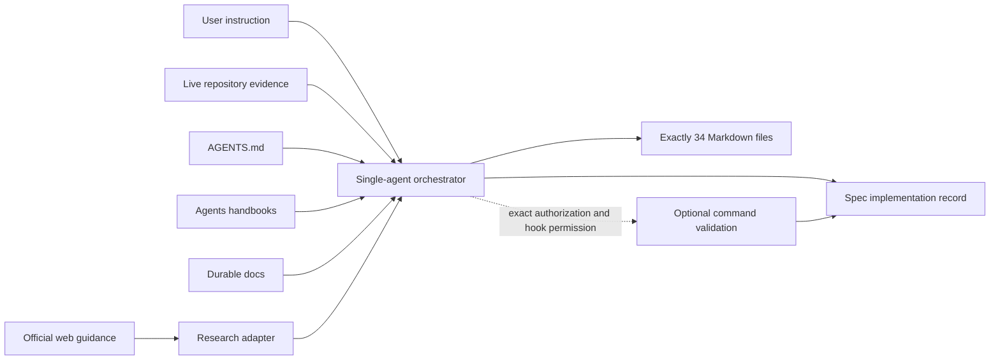
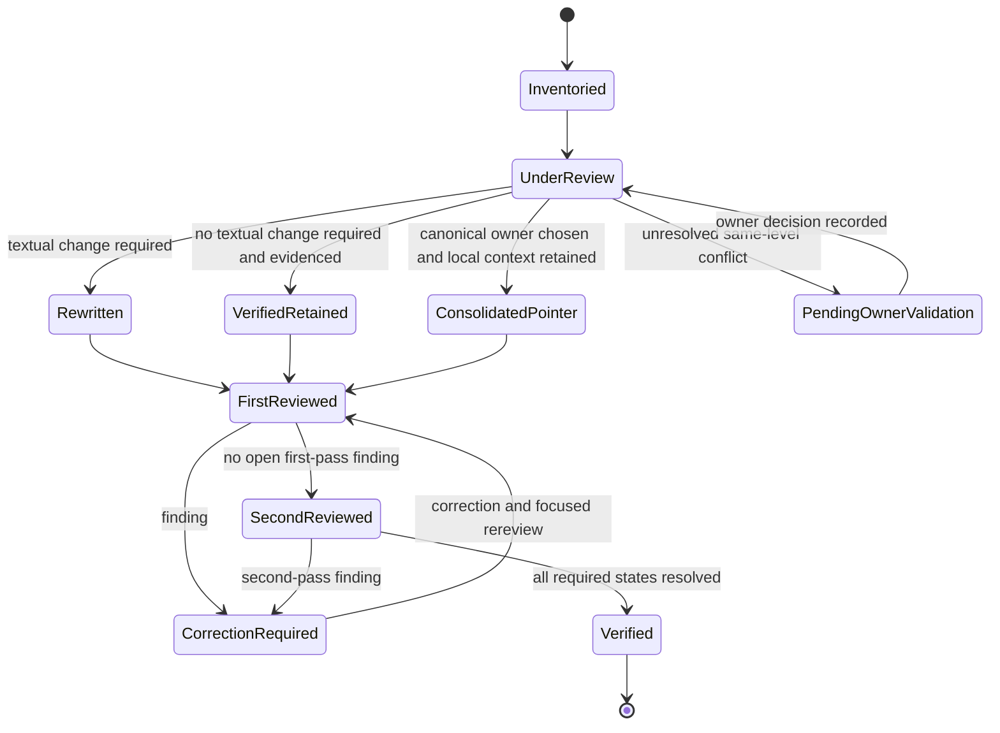

# Documentation global standards design

This design defines a single-agent, evidence-led rewrite of exactly 34 repository Markdown files. It converts the approved requirements into an implementation workflow while preserving the authority order `user > live code and fresh commands > AGENTS.md > Agents/ > docs/` and keeping all implementation records inside `.kiro/specs/documentation-global-standards/`.

## Contents

- [Overview](#overview)
- [Goals and non-goals](#goals-and-non-goals)
- [Research findings and source register](#research-findings-and-source-register)
- [Architecture](#architecture)
- [Components and interfaces](#components-and-interfaces)
- [Data models](#data-models)
- [Correctness properties](#correctness-properties)
- [Error handling](#error-handling)
- [Testing strategy](#testing-strategy)
- [Risks and mitigations](#risks-and-mitigations)
- [Requirements traceability](#requirements-traceability)

## Overview

The implementation is a bounded document transformation, not a repository reorganization. A single agent inventories the declared corpus, records baseline evidence, researches current official guidance, assigns each file to an authority-preserving work package, rewrites one package at a time, and performs two complete static reviews separated by a correction loop. Commands remain optional evidence: the agent may run an exact command only after the user authorizes that command in the current session and the enabled pre-execution hook permits it. An unrun, denied, interrupted, blocked, or unobserved command remains pending and never becomes a pass claim.

The design uses a plan-owned `implementation-record.md` under `.kiro/specs/documentation-global-standards/` as the human-readable source register, coverage matrix, claim ledger, conflict ledger, review ledger, command ledger, and changed-path ledger. `requirements.md`, `.config.kiro`, and `design.md` remain specification inputs; a later `tasks.md` may coordinate implementation. No report is written under `results/`, and no application, database, infrastructure, generated evidence, existing `kiro-config-rewrite` artifact, or file outside the declared 34-document corpus is edited.

### Design principles

1. **Containment before prose:** establish the exact path allowlist and baseline hashes before any corpus edit.
2. **Evidence before assertion:** resolve facts from current source, configuration, and permitted fresh observations before lower-authority prose.
3. **Authority before consolidation:** choose canonical owners by authority and document role, not by whichever passage is longest.
4. **Reader need before format:** assign one primary Diátaxis-style need and purpose to every file, while retaining repository placement.
5. **Static truth before command claims:** static review can prove structure and source correspondence; only an observed authorized command can prove that command's result.
6. **Two-pass closure:** every file receives a first review and a second review, with affected references rechecked after each correction.
7. **Reversibility:** preserve baseline content and use file-level rollback when a cohort cannot be completed without weakening rules or crossing scope.

## Goals and non-goals

### Goals

- Rewrite or explicitly retain every one of the 34 in-scope Markdown paths with a recorded rationale.
- Improve task orientation, information architecture, global-English clarity, accessibility, CommonMark structure, navigation, status honesty, and security hygiene.
- Preserve all repository operational rules, unique local exceptions, warnings, prerequisites, recovery steps, and user-authored changes unless a recorded higher-authority conflict requires resolution.
- Make every command, path, version, route, schema, persistence, deployment, observability, analytics, and security claim traceable to live evidence or an explicit pending state.
- Establish canonical owners for shared topics and replace lower-authority duplication with concise contextual links.
- Produce complete source, coverage, conflict, accuracy, security, verification, command, and changed-path records within the spec directory.
- Keep the execution sequence compatible with one agent and bounded file cohorts.

### Non-goals

- Changing application code, tests, database schema, migrations, infrastructure, package configuration, generated documents, generated evidence, or environment files.
- Editing `.kiro/specs/kiro-config-rewrite/`, `requirements.md`, or `.config.kiro`.
- Adding, deleting, moving, or renaming any of the 34 original documentation paths.
- Reorganizing root, `Agents/`, or `docs/` directories to mirror Diátaxis.
- Claiming formal Web Content Accessibility Guidelines (WCAG) conformance from Markdown inspection.
- Running tests, gates, builds, browser checks, coverage, or test-like documentation commands without exact-command user authorization and hook permission.
- Treating plans, generated output, prior handoffs, or prior command logs as proof of current behavior.
- Introducing a new package, validation program, application feature, or automated scoring system.

## Research findings and source register

Official guidance was retrieved successfully on 2026-08-28 UTC. The implementation must recheck source availability and supersession status at the time each source is applied and again during second-pass verification. The design applies guidance only to its governing subject; repository truth and the approved authority order remain controlling.

### Design-relevant findings

- [W3C Writing for Web Accessibility](https://www.w3.org/WAI/tips/writing/) supports unique titles, meaningful heading structure, descriptive links, purposeful text alternatives, clear instructions, concise language, first-use acronym expansion, and glossaries where needed.
- [WCAG 2.2 guidance for headings and labels](https://www.w3.org/WAI/WCAG22/Understanding/headings-and-labels.html) explains that descriptive headings and labels help readers identify content and relationships. The design therefore checks semantic hierarchy and predictive wording separately.
- [WCAG 2.2 guidance for link purpose](https://www.w3.org/WAI/WCAG22/Understanding/link-purpose-in-context.html) supports link text whose destination or outcome can be understood from the link and its programmatically related context. The repository adopts the stronger local rule that link text should stand alone wherever practical.
- [Diátaxis](https://diataxis.fr/) distinguishes tutorial, how-to, reference, and explanation by reader need without imposing implementation structure. The design uses this as a per-document classification and sectioning tool, not as permission to move files.
- [Microsoft guidance for scannable content](https://learn.microsoft.com/en-us/style-guide/scannable-content/) supports leading with important information, concise headings and paragraphs, navigation for long documents, and parallel patterns.
- [Google guidance for accessible developer documentation](https://developers.google.com/style/accessibility) supports direct language, acronym expansion, parallel structures, non-visual status cues, textual table headers, meaningful alternatives, and avoiding directional or visual-only instructions.
- [Google guidance for link text](https://developers.google.com/style/link-text) supports selective links, relevant destinations, and short, unique, descriptive link phrases rather than vague calls to action.
- [Google guidance for global audiences](https://developers.google.com/style/translation) supports short unambiguous sentences, active voice, consistent terminology, and removal of idioms and culture-dependent references.
- [CommonMark 0.31.2](https://spec.commonmark.org/0.31.2/) is the syntax baseline for headings, lists, block quotes, fenced code blocks, links, and other Markdown structures. Repository-supported extensions require separate live renderer evidence.
- [RFC 2119](https://www.rfc-editor.org/rfc/rfc2119) defines requirement-level keywords, and [RFC 8174](https://www.rfc-editor.org/rfc/rfc8174) limits those special meanings to uppercase forms. Normative terms are used only where the document intentionally establishes a requirement.

Content was rephrased for compliance with licensing restrictions.

### Source-register workflow

For each applied source, the agent records a `SourceRecord` before using the guidance. The record contains publisher, title, canonical HTTPS URL, UTC access timestamp, displayed publication or update date when available, current-status decision, governed concern, paraphrased principle, affected paths, and retrieval evidence. A source is `current` only when its official publisher presents it without a withdrawn or superseded marker; otherwise it is `unverified`. Failure to retrieve a source during re-verification changes its status to `unverified` and creates a correction item for every dependent decision, but does not erase the earlier observation.

The source decision order is:

1. Select the official publisher responsible for the subject.
2. Confirm canonical HTTPS destination, applicability, and non-superseded status.
3. Prefer the latest applicable official edition within that subject.
4. Record the principle in original paraphrased wording and map affected files.
5. Reject or mark inapplicable any external recommendation that conflicts with repository evidence or authority.
6. Recheck the URL and status in the second review; record retrieval failure honestly.

## Architecture

### System context



The arrows into the orchestrator are evaluated in authority order. Official guidance informs editorial quality but never outranks repository truth. The implementation record is plan-owned evidence; it does not become repository authority.

### Processing sequence

```mermaid
sequenceDiagram
    actor User
    participant Agent as Single agent
    participant Repo as Repository sources
    participant Web as Official sources
    participant Record as implementation-record.md
    participant Docs as 34-file corpus
    participant Hook as Pre-execution hook

    User->>Agent: Approve implementation task
    Agent->>Repo: Inventory allowlist, baseline paths, content, and status
    Agent->>Web: Retrieve and classify official guidance
    Agent->>Record: Write source, coverage, baseline, and claim ledgers
    loop Authority-ordered cohort
        Agent->>Repo: Resolve claims against live source
        Agent->>Docs: Rewrite cohort with preserved local rules
        Agent->>Record: Record dispositions, conflicts, and first review
    end
    Agent->>Docs: Apply correction loop
    Agent->>Docs: Perform second review of all 34 paths
    opt User authorizes an exact command
        Agent->>Hook: Request exact command
        alt Hook permits
            Hook-->>Agent: Permit
            Agent->>Repo: Run exact command from repository root
            Agent->>Record: Record command, arguments, exit status, output summary
        else Hook denies or interrupts
            Hook-->>Agent: Deny or interrupt
            Agent->>Record: Record pending reason; no pass claim
        end
    end
    Agent->>Repo: Compare final changed paths with allowlist
    Agent->>Record: Calculate completion from explicit states
    Agent-->>User: Report complete or incomplete with pending items
```

### Authority-preserving work packages

Packages execute serially. Later packages may link upward but cannot redefine an earlier package's rules.

| Order | Cohort | Paths | Purpose and authority protection |
|---|---|---|---|
| 0 | Baseline and research | Spec artifacts only | Freeze allowlist and baseline; establish sources, claims, terminology, and conflicts before corpus edits. |
| 1 | Process floor | `AGENTS.md` | Reconcile against user instruction and live evidence first; preserve generated Next.js block and operational contract. |
| 2 | Root navigation | `README.md`, `START.md`, `CONTENTS.md`, `DOC-MAP.md` | Establish shared destinations after the process floor; update all four as one navigation transaction. |
| 3 | Root operations and ownership | `Failures.md`, `HANDOVER.md`, `OPERATIONS_RUNBOOK.md`, `owners.md`, `Testing-handbook.md` | Separate blockers, handoff status, procedures, ownership, and evidence boundaries; never promote historical handoff claims to current truth. |
| 4 | Agent navigation and execution | `Agents/INDEX.md`, `Agents/01-standard.md`, `Agents/02-testing.md`, `Agents/03-browser.md`, `Agents/04-failures.md`, `Agents/05-documentation.md`, `Agents/06-architecture.md`, `Agents/07-css.md` | Keep concise session guidance subordinate to `AGENTS.md`, preserving unique task context and linking canonical owners. |
| 5 | Agent research | `Agents/research-gap-areas.md`, `Agents/research-practices.md` | Reconcile research status and methods without converting observations into durable repository facts. |
| 6 | Durable navigation and architecture | `docs/README.md`, `docs/architecture/css.md`, `docs/architecture/layout.md`, `docs/architecture/product-map.md`, `docs/architecture/routes.md`, `docs/architecture/scripts.md`, `docs/architecture/stack.md` | Rebuild durable references from source/configuration and canonical root navigation. |
| 7 | Durable database | `docs/database/drizzle.md`, `docs/database/ops.md`, `docs/database/schema.md` | Preserve two-database ownership, migrations, row-level security (RLS), persistence modes, and operational safety. |
| 8 | Durable governance | `docs/governance/benchmarks.md`, `docs/governance/charter.md`, `docs/governance/focss-stop-drift.md`, `docs/governance/rules.md` | Retain only evidence-backed governance status; distinguish configured, observed, pending, and historical claims. |
| 9 | Corpus correction and verification | Same 34 paths; spec record | Resolve first-pass findings, perform second review, validate cross-cohort links and changed paths, and calculate completion. |

Each cohort has a checkpoint: all paths present, baseline preserved in version control, decisions recorded, no outside changes introduced by the cohort, and no unresolved higher-authority conflict. A checkpoint failure prevents advancement.

### Review pipeline

For each file, the pipeline is:

`inventory -> classify -> source claims -> resolve conflicts -> draft -> accessibility/CommonMark review -> accuracy review -> security review -> first-reviewed -> correct -> second-reviewed -> verified`

A file may remain unchanged only after the same pipeline proves `verified-retained`. A pointer remains substantive enough to name its audience, local operational context, and canonical destination.

## Components and interfaces

### Corpus controller

The corpus controller owns the immutable 34-path allowlist, baseline content identifiers, path-presence checks, cohort order, and changed-path comparison. Before each write it checks that the target is an in-scope path. It rejects deletion, rename, and outside-path writes. Spec artifacts are accepted only under `.kiro/specs/documentation-global-standards/`; existing protected artifacts are read-only unless the current task explicitly permits them.

### Evidence resolver

The evidence resolver turns each factual or operational statement into a `ClaimRecord`. It searches owning live sources first: root `package.json` for command names, scripts and configuration for behavior, route and schema sources for inventories, migration directories for database ownership, and current paths for existence. A claim unsupported by live evidence receives a pending status and names the evidence needed; it is not silently retained.

Accuracy decisions use this order:

1. Parse the claim and classify its domain.
2. Identify the expected owning source by the canonical-owner map.
3. Observe the exact source location and value.
4. Compare documented and observed values.
5. Set `verified`, `corrected`, `historical`, `planned`, `absent`, or `pending`.
6. If the underlying source changes during implementation, invalidate and rerun every dependent review.

The known absent `scripts/tsconfig.json` makes `pnpm run typecheck:scripts` ineligible for documentation as an available validation command even though a stale script key exists. Commands are documented from repository root with `pnpm`; no command result is inferred from its declaration.

### Research adapter

The research adapter retrieves only public official guidance needed for editorial decisions. It records status and citation metadata in the implementation record, applies licensing-safe paraphrases, and never sends repository code, secrets, or user data to external services.

### Information-architecture classifier

The classifier assigns each file exactly one primary reader need (`tutorial`, `how-to`, `reference`, or `explanation`) and one purpose. Mixed content is separated with descriptive sections or replaced with a link to its canonical owner. Existing placement remains fixed. Long documents use a complete level-two table of contents or a verified unskipped heading hierarchy, as required by the approved requirements.

### Terminology and canonical-owner registry

The registry prevents synonym drift and assigns shared subjects to one home.

| Concept | Canonical term | Canonical owner | Allowed local treatment |
|---|---|---|---|
| Authority | Authority order | `AGENTS.md` | Concise linked summary; no reordered hierarchy. |
| Hard blocker | Blocker | `Failures.md` | Procedure links may explain when to record one. |
| Repository navigation | Documentation map | `DOC-MAP.md` and `CONTENTS.md` for placement and index respectively | Front doors link by reader task. |
| Standard execution | Process floor | `AGENTS.md` | `Agents/01-standard.md` supplies session procedure without weakening the floor. |
| Test evidence | Validation evidence | `Testing-handbook.md` | Agent and operations docs link with local prerequisites. |
| Browser evidence | Browser validation | `Agents/03-browser.md` | Other files avoid restating browser proof rules. |
| Deployment and migration | Operations procedure | `OPERATIONS_RUNBOOK.md` | Durable docs retain architecture facts and link procedures. |
| Product and code placement | Product map | `docs/architecture/product-map.md` | Navigation files link by task. |
| Command inventory | Script reference | `package.json` as live truth; `docs/architecture/scripts.md` as durable explanation | Procedure files include only commands needed locally. |
| Studio/Planner separation | Fork boundary | `AGENTS.md`; detailed architecture under `docs/architecture/` | Never imply cross-fork imports are permitted. |
| Products database | Products | `docs/database/schema.md` and live migrations | Operations retains exact apply/type commands. |
| Admin database | Admin | `docs/database/schema.md` and live migrations | Operations retains exact apply/type commands. |
| Persistence | Exclusive persistence mode; no dual write | `AGENTS.md` and owning selectors | Other docs link and preserve local safety warnings. |
| Styling | FOCSS on Tailwind CSS v4 | `docs/architecture/css.md` | `Agents/07-css.md` keeps the editing workflow. |
| Current work | Active plan | `plans/README.md` and active plan | Never treated as durable fact evidence. |
| Generated output | Generated evidence | `results/` placement rule in `AGENTS.md` | Never described as proof without originating source or command. |
| Status | observed, configured, present-but-unverified, planned, historical, deprecated, blocked, pending-owner-validation | This spec's status vocabulary | Avoid ambiguous labels such as current, done, or supported without evidence. |

### Conflict resolver

The conflict resolver operates deterministically:

```text
resolve(passages):
  normalize each claim without removing conditions
  group claims by subject and scope
  for each group:
    identify each passage's authority level and document role
    attach live evidence and unique local context
    if live evidence decides the claim:
      select the evidence-consistent form
    else if authority levels differ:
      select the higher-authority form
    else if same-level claims agree:
      choose the established canonical owner
    else:
      mark pending-owner-validation and do not invent a resolution
    classify every passage as exact-duplicate, deliberate-linked-summary,
      authority-conflict, or unique-local-detail
    preserve unique prerequisites, exceptions, warnings, and recovery steps
    replace only exact lower-authority duplication with minimum local context
      plus a descriptive link
    update all affected in-scope indexes and references
    record the decision, evidence, and affected paths
```

A conflict cannot be closed merely by deleting one side. Closure requires classification, canonical owner, preserved local detail, controlling evidence, and updated references.

### Accessibility and CommonMark reviewer

The reviewer performs static checks for one non-empty level-one heading, unskipped heading hierarchy, descriptive headings, meaningful link text, repository-relative local destinations, textual table headers, linear table comprehension, labeled warnings and statuses, image alternative text, first-use acronym expansion, language-tagged known code fences, copyable command blocks, and CommonMark-safe structure. It replaces an unsuitable table with headings or lists. Markdown extensions are retained only with live renderer support recorded. The result is an accessibility review, not a WCAG conformance claim.

### Security reviewer

For every file, the reviewer records five results: sensitive-data exposure, server/client credential boundary, accuracy of security status, warning quality for risky procedures, and output redaction. Real secrets, tokens, keys, credentials, customer identifiers, personally identifiable information (PII), or environment values block completion. Secret references use only `.env.local` or `site/.env.local` and unassigned variable names. Server credentials are labeled server-only and prohibited from client code, browser output, and client-visible configuration. Risky steps receive a preceding warning that names prerequisites, scope, impact, and recovery or explicitly says no recovery is available.

### Verification coordinator

The coordinator requires two independent file-specific review entries per path. First review detects findings after the initial rewrite. The correction loop updates the file and every affected source dependency, link, index, canonical reference, and ledger entry. Second review starts only after first-pass findings are resolved or explicitly pending. Any second-pass correction triggers a focused rereview of the corrected file and its dependency closure.

Completion is a derived state, never editorial judgment. It requires:

- all 34 paths present and represented exactly once;
- one resolved disposition and one final verification state per path;
- two file-specific reviews per path;
- all required review dimensions recorded;
- all correction loops closed;
- zero changed-path exceptions;
- zero required pending or failed verification outcomes; and
- command outcomes represented only at their observed authorization-aware state.

### Command-validation adapter

The adapter accepts an `AuthorizationRecord` containing the exact command text authorized in the current session. It confirms repository-root working directory and requests hook permission without modifying or bypassing the hook. It runs no broader or substitute command. The only named documentation candidates are `pnpm run check:docs-all`, `pnpm run docs:check:root-links`, and `pnpm run check:layout`; tests, gates, builds, coverage, and browser checks follow the same exact-command rule. A failed command creates findings but not an automatic rerun entitlement. Correction and rerun require scope compliance plus fresh exact authorization if the original authorization does not explicitly cover the rerun.

### Changed-path controller

The controller records baseline and final path states as `unmodified`, `modified`, `created`, `deleted`, or `renamed`. Allowed corpus outcomes are `unmodified` or `modified`; allowed new spec artifacts are `created` or `modified` only when the workflow permits them. Any deleted or renamed corpus path, any change under `.kiro/specs/kiro-config-rewrite/`, or any outside change is an unresolved exception. Pre-existing outside changes are recorded as baseline-owned and must remain byte-for-byte untouched by this feature.

## Data models

These TypeScript-like interfaces define logical records in `implementation-record.md`; they do not require application code or a new runtime. Markdown tables may hold summaries, while stable record identifiers and detail blocks preserve traceability.

```ts
type InScopePath =
  | "AGENTS.md"
  | "CONTENTS.md"
  | "DOC-MAP.md"
  | "Failures.md"
  | "HANDOVER.md"
  | "OPERATIONS_RUNBOOK.md"
  | "owners.md"
  | "README.md"
  | "START.md"
  | "Testing-handbook.md"
  | "Agents/01-standard.md"
  | "Agents/02-testing.md"
  | "Agents/03-browser.md"
  | "Agents/04-failures.md"
  | "Agents/05-documentation.md"
  | "Agents/06-architecture.md"
  | "Agents/07-css.md"
  | "Agents/INDEX.md"
  | "Agents/research-gap-areas.md"
  | "Agents/research-practices.md"
  | "docs/README.md"
  | "docs/architecture/css.md"
  | "docs/architecture/layout.md"
  | "docs/architecture/product-map.md"
  | "docs/architecture/routes.md"
  | "docs/architecture/scripts.md"
  | "docs/architecture/stack.md"
  | "docs/database/drizzle.md"
  | "docs/database/ops.md"
  | "docs/database/schema.md"
  | "docs/governance/benchmarks.md"
  | "docs/governance/charter.md"
  | "docs/governance/focss-stop-drift.md"
  | "docs/governance/rules.md";

type AuthorityLevel = "user" | "live-evidence" | "AGENTS.md" | "Agents" | "docs";
type ReaderNeed = "tutorial" | "how-to" | "reference" | "explanation";
type Disposition = "rewritten" | "verified-retained" | "consolidated-as-pointer";
type VerificationState = "not-reviewed" | "first-reviewed" | "correction-required" | "second-reviewed" | "verified" | "pending" | "failed";
type EvidenceClass = "static-inspection" | "observed-command-result" | "pending-validation";
type ClaimStatus = "verified" | "corrected" | "configured" | "observed" | "present-but-unverified" | "planned" | "historical" | "deprecated" | "absent" | "blocked" | "pending-owner-validation";

interface CoverageRecord {
  path: InScopePath;
  cohort: number;
  audience: string;
  primaryNeed: ReaderNeed;
  primaryPurpose: string;
  authorityRole: string;
  requiredChecks: ReviewDimension[];
  sourceDependencies: string[] | "none";
  disposition?: Disposition;
  dispositionRationale?: string;
  canonicalDestination?: InScopePath;
  localContextRetained?: string;
  verificationState: VerificationState;
  evidenceRefs: string[];
  firstReviewRef?: string;
  secondReviewRef?: string;
}

type ReviewDimension =
  | "scope"
  | "information-architecture"
  | "language"
  | "accessibility"
  | "commonmark"
  | "links"
  | "accuracy"
  | "conflicts"
  | "security"
  | "operational-contract";

interface SourceRecord {
  id: string;
  publisher: string;
  title: string;
  canonicalUrl: `https://${string}`;
  accessedAtUtc: string;
  displayedDate: string | "not-displayed";
  status: "current" | "unverified" | "inapplicable";
  governedConcern: string;
  appliedPrinciple: string;
  affectedPaths: InScopePath[];
  retrievalEvidence: string;
}

interface ClaimRecord {
  id: string;
  path: InScopePath;
  location: string;
  normalizedClaim: string;
  domain: "command" | "path" | "version" | "route" | "schema" | "persistence" | "deployment" | "observability" | "analytics" | "security" | "date" | "other";
  authority: AuthorityLevel;
  evidenceSource: string;
  evidenceLocation: string;
  observedValue: string;
  status: ClaimStatus;
  neededEvidence?: string;
  dependentReviewIds: string[];
}

interface ConflictRecord {
  id: string;
  subject: string;
  passages: Array<{ path: InScopePath; location: string; authority: AuthorityLevel }>;
  classification: "exact-duplicate" | "deliberate-linked-summary" | "authority-conflict" | "unique-local-detail";
  canonicalOwner: InScopePath;
  controllingEvidence: string;
  preservedLocalDetail: string | "none";
  resolution: string;
  affectedPaths: InScopePath[];
  state: "open" | "pending-owner-validation" | "resolved";
}

interface SecurityReviewRecord {
  path: InScopePath;
  sensitiveData: "clear" | "rejected";
  credentialBoundary: "verified" | "not-applicable" | "pending" | "failed";
  securityStatusAccuracy: "verified" | "not-applicable" | "pending" | "failed";
  riskyProcedureWarning: "verified" | "not-applicable" | "pending" | "failed";
  outputRedaction: "verified" | "not-applicable" | "pending" | "failed";
  evidenceRefs: string[];
}

interface ReviewRecord {
  id: string;
  path: InScopePath;
  pass: "first" | "second" | "focused-rereview";
  dimensions: Record<ReviewDimension, "pass" | "finding" | "pending" | "not-applicable">;
  findingIds: string[];
  evidenceClass: EvidenceClass;
  reviewedAtUtc: string;
}

interface CorrectionRecord {
  id: string;
  finding: string;
  affectedPaths: InScopePath[];
  affectedRecords: string[];
  action: string;
  state: "open" | "corrected" | "reverified" | "blocked";
  reReviewRefs: string[];
}

interface AuthorizationRecord {
  id: string;
  exactCommand: string;
  authorizedInCurrentSession: boolean;
  repositoryRoot: string;
  hookDecision: "not-requested" | "permitted" | "denied" | "interrupted";
}

interface CommandRecord {
  authorizationRef: string;
  exactCommand: string;
  arguments: string[];
  workingDirectory: string;
  state: "unrun" | "blocked" | "denied" | "interrupted" | "passed" | "failed";
  exitStatus?: number;
  observedResult?: string;
  sensitiveOutputRedacted: boolean;
  evidenceClass: EvidenceClass;
}

interface ChangedPathRecord {
  path: string;
  baselineState: "tracked" | "untracked" | "absent";
  finalState: "unmodified" | "modified" | "created" | "deleted" | "renamed";
  ownership: "feature" | "pre-existing-user-change" | "unexpected";
  allowed: boolean;
  evidenceRef: string;
}
```

### Coverage-matrix invariants

The matrix contains exactly 34 unique `CoverageRecord` entries, one per `InScopePath`, and no other path. Audience, purpose, authority role, checks, source dependency, evidence references, disposition, and final state are non-empty at completion. `verified-retained` requires evidence that the original text already satisfies every required check. `consolidated-as-pointer` requires a canonical destination and retained local operational context.

### Disposition state machine



No path can have two dispositions. `PendingOwnerValidation`, `CorrectionRequired`, `pending`, and `failed` are non-complete states. A second-pass correction returns through correction and focused rereview before verification.

## Correctness properties

*A property is a characteristic or behavior that should hold true across all valid executions of a system-essentially, a formal statement about what the system should do. Properties serve as the bridge between human-readable specifications and machine-verifiable correctness guarantees.*

Property-based testing (PBT) applies to the pure set, ordering, state-machine, graph, and record-validation logic in this design. It does not apply to editorial judgment, web retrieval itself, or command execution. The reflection step consolidated overlapping clauses so each property has distinct validation value.

### Property 1: Bounded change set

For all baseline and final repository path maps, every feature-owned content change is either one of the exact 34 in-scope paths or a permitted new spec artifact under `.kiro/specs/documentation-global-standards/`; all excluded and protected paths preserve baseline content and identity.

**Validates: Requirements 1.1, 1.2, 1.3, 1.8, 1.10, 1.11, 8.9**

### Property 2: Authority selection is deterministic

For all sets of conflicting claims with known authority levels, the selected claim is the live-evidence-consistent claim or otherwise the claim at the highest available authority level; unresolved conflicts at the same level produce `pending-owner-validation`.

**Validates: Requirements 1.4, 1.5, 1.6, 1.7, 8.3, 10.13**

### Property 3: Conflicting user changes require evidence before modification

For all pre-existing user changes that conflict with a named higher-authority source or acceptance criterion, modification is prohibited until a record identifies the original change, controlling source or criterion, and resolution.

**Validates: Requirements 1.9**

### Property 4: Applicable source selection

For all candidate source sets, the selected source is official for the governed subject, applicable to that subject, and the latest non-superseded edition known at access time; secondary or externally inapplicable advice cannot override an authoritative source or repository truth.

**Validates: Requirements 2.2, 2.3, 2.4, 2.7, 2.8, 2.9**

### Property 5: Source records are complete and failure-honest

For all applied source decisions, the source record includes every required metadata and affected-path field; for all failed re-retrievals, status is `unverified` and the failed access attempt remains recorded.

**Validates: Requirements 2.5, 2.10**

### Property 6: Coverage matrix is an exact bijection

For all candidate coverage matrices, the matrix is valid if and only if its paths form a bijection with the 34-path allowlist, every row has all required non-empty fields and resolvable evidence, and every completed row has exactly one disposition and one final verification state.

**Validates: Requirements 3.1, 3.2, 3.3, 3.4, 3.5, 3.8, 3.9**

### Property 7: Dispositions carry required evidence

For all coverage rows, `verified-retained` implies evidence that every required check passed without a textual change, while `consolidated-as-pointer` implies a valid canonical destination and preserved local operational context.

**Validates: Requirements 3.6, 3.7, 8.8**

### Property 8: Information architecture remains coherent

For all in-scope documents and shared-topic maps, each document has one primary reader need, one purpose, and one unique title; mixed content has an explicit separation strategy, prerequisites precede dependent steps, established directory placement is unchanged, and all six navigation documents agree on canonical owners.

**Validates: Requirements 4.1, 4.2, 4.3, 4.5, 4.6, 4.8**

### Property 9: Long-document and local-link structure is valid

For all in-scope Markdown documents, documents meeting the heading or word-count threshold have the required navigation structure, and every repository-local link is repository-relative and resolves to an existing destination.

**Validates: Requirements 4.7, 4.10, 11.3**

### Property 10: Required meaning survives editing

For all source-supported conditions, exceptions, warnings, recovery steps, operational clauses, unique local details, and canonical terms tagged in the baseline, the final corpus contains an equivalent canonical representation and never replaces a measurable criterion with an unsupported vague qualifier.

**Validates: Requirements 5.2, 5.3, 5.5, 5.6, 5.7, 8.4, 10.12**

### Property 11: Markdown accessibility invariants

For all in-scope Markdown abstract syntax trees, the document begins with exactly one non-empty level-one heading, heading levels do not skip, retained tables have textual headers, warnings and statuses have textual labels, known-language fences declare a language, commands exclude prompts and output, and the structure is CommonMark-compatible.

**Validates: Requirements 6.1, 6.2, 6.6, 6.8, 6.9, 6.10, 6.11, 11.4**

### Property 12: Images, symbols, and acronyms retain non-visual meaning

For all informative images, decorative images, Unicode symbols, and acronym occurrences, informative images have purpose-specific alternative text of at most 150 characters, decorative images have empty alternative text, symbols have textual context, and first-use acronyms are expanded or defined.

**Validates: Requirements 6.4, 6.5, 6.13**

### Property 13: Claims remain evidence-traceable

For all command, path, date, behavior, version, route, schema, persistence, deployment, observability, analytics, and security claims, the final status and wording are derived from an owning evidence source, location, and observed value; missing evidence yields an explicit pending or allowed non-current status and identifies the evidence needed.

**Validates: Requirements 7.1, 7.2, 7.3, 7.4, 7.5, 7.6, 7.10, 7.12, 11.5, 11.7**

### Property 14: Evidence changes invalidate dependent reviews

For all claim and source dependency graphs, changing a source value invalidates every transitively dependent claim, review, link, index, canonical reference, and evidence record until each affected node is reverified.

**Validates: Requirements 7.11, 8.7, 11.11**

### Property 15: Conflict closure is complete

For all repeated or conflicting passage groups, each passage receives exactly one allowed classification and the group cannot become resolved until it has one canonical owner, controlling evidence, a resolution, preserved unique local detail, and updated affected references.

**Validates: Requirements 8.1, 8.2, 8.5, 8.6, 11.6, 11.9**

### Property 16: Security review fails closed

For all in-scope files, any detected real secret or sensitive identifier prevents completion; credential mentions, risky procedures, security claims, URLs, and captured output satisfy their respective boundary, warning, evidence-status, HTTPS, and redaction rules, and each file has all five security-review dimensions.

**Validates: Requirements 9.1, 9.2, 9.3, 9.4, 9.5, 9.6, 9.7, 9.8, 9.9**

### Property 17: Operational contract is preserved as a complete set

For all final corpora, the canonical operational-contract representation retains root-only `pnpm`, no worktrees, unrelated-work preservation, `http://localhost:3000`, Next.js guide prerequisite, fork isolation, database ownership and migration safeguards, exclusive persistence modes, blocker/evidence ownership, two Vitest lanes, and evidence-scope distinctions.

**Validates: Requirements 10.1, 10.2, 10.3, 10.4, 10.5, 10.6, 10.7, 10.8, 10.9**

### Property 18: Command states cannot overclaim

For all authorization, hook, execution, and rerun histories, a command can be `passed` only when its exact text was authorized in the current session, the hook permitted it, execution completed from the repository root, and exit status was observed as successful; every other state remains unrun, blocked, denied, interrupted, failed, or pending as applicable.

**Validates: Requirements 7.7, 7.13, 10.10, 10.11, 10.14, 11.12, 11.13, 11.14, 11.15, 11.16, 11.17, 11.22**

### Property 19: Outside-scope failures are report-only

For all observed command failures whose cause is outside the declared corpus and spec artifacts, the workflow records the failure but performs no corrective edit outside scope.

**Validates: Requirements 11.18**

### Property 20: Changed-path ledger is complete

For all baseline and final path maps, the changed-path ledger equals the complete set of created, modified, deleted, and renamed paths; every feature-owned outside path, protected-spec change, corpus deletion, or corpus rename creates an unresolved exception.

**Validates: Requirements 11.19, 11.20**

### Property 21: Completion requires total verification closure

For all implementation records, feature completion is true if and only if all 34 paths have first and second reviews, one resolved disposition, one verified final state, closed correction loops, complete evidence classifications, zero changed-path exceptions, and zero required pending or failed outcomes.

**Validates: Requirements 1.12, 11.1, 11.2, 11.10, 11.21, 11.23, 11.24**

## Error handling

### Failure classes and responses

| Failure | Detection | Required response | Completion effect |
|---|---|---|---|
| Missing, duplicate, outside, deleted, or renamed corpus path | Allowlist/matrix/path comparison | Stop the current cohort; restore the original path where feature-owned; record finding. | Incomplete until corrected and reverified. |
| Unexpected outside change | Baseline/final changed-path comparison | Do not modify or revert user-owned work; identify ownership. If feature-owned, roll back only that change. | Unresolved exception until clean. |
| Protected spec change | Protected-subtree comparison | Stop; restore only the feature-owned change. Never modify `kiro-config-rewrite`. | Incomplete. |
| Same-level unresolved conflict | Conflict resolver | Preserve both baseline meanings, set `pending-owner-validation`, and request owner decision. | Incomplete. |
| Unsupported or stale factual claim | Accuracy review | Correct from owning evidence or mark pending with needed evidence. | Pending if unresolved. |
| Source unavailable or supersession uncertain | Source re-verification | Record failed access and set source/dependent decisions to `unverified`; do not substitute a secondary source silently. | Pending when required. |
| Broken local link or anchor | Link graph review | Correct the in-scope source or target reference, then rereview its dependency closure. | Incomplete until resolved. |
| CommonMark or accessibility defect | Static structure review | Make the smallest in-scope structural correction; avoid conformance claims. | Incomplete until rereviewed. |
| Secret, credential, PII, or unsafe output | Security review | Stop processing the file, remove/redact only within scope, and avoid reproducing the value in records. | Rejected until clean. |
| Operational rule weakened or omitted | Tagged-rule comparison | Restore complete canonical meaning before continuing. | Incomplete. |
| Unauthorized, denied, blocked, or interrupted command | Authorization/hook/command record | Do not execute, retry, bypass, or infer a result; record pending reason. | Command remains pending, without pass. |
| Authorized command failure caused by in-scope docs | Observed command result | Record exact failure; correct in scope; request/confirm exact rerun authorization before rerun. | Failed until observed successful authorized rerun. |
| Authorized command failure outside scope | Observed command result | Record result and leave excluded assets untouched. | Incomplete only when the command is a required completion condition. |

### Rollback behavior

Rollback is file-level and cohort-bounded. Before a cohort, the agent records baseline status and content identity from version control and preserves any pre-existing user changes. If the cohort introduces an unresolved authority regression, security exposure, path exception, or cross-cohort inconsistency, the agent restores only its own changes in that cohort and retains the implementation record describing the failed attempt. It never uses destructive repository-wide reset, checkout, clean, or force operations.

A successful cohort is not rolled back merely because a later cohort has findings. Instead, the correction graph identifies affected files and performs targeted corrections. If a correction would require an excluded edit, the correction remains blocked and the feature remains incomplete. True hard blockers belong only in root `Failures.md`, but this design does not authorize editing it outside the later 34-file implementation task; ordinary review findings stay in the spec implementation record.

### Recovery checkpoints

1. **Baseline checkpoint:** exact corpus, protected paths, pre-existing changes, and source records captured.
2. **Cohort checkpoint:** all cohort files have dispositions, claim/conflict/security records, and first-review status.
3. **Correction checkpoint:** every first-pass finding is corrected and focused rereviews are complete.
4. **Second-pass checkpoint:** all 34 second reviews are recorded and dependency closures are clean.
5. **Command checkpoint:** only authorized observed commands have terminal outcomes; all others state why they remain pending.
6. **Completion checkpoint:** changed-path and completion properties hold.

## Testing strategy

The implementation uses a dual approach: property tests for pure validation logic and example/static reviews for human language, source use, and integrations. Tests do not replace the required two human-readable file reviews.

### Static review lane

Static inspection is always described as inspection, never as a command pass. The single agent reviews:

- exact allowlist membership and path presence;
- title, purpose, heading, list, table, image, code-fence, and command-block structure;
- local link and anchor targets by source/destination mapping;
- terminology, canonical owners, repeated claims, and conflict records;
- package/config/source correspondence for commands and facts;
- operational-rule tags and unique local detail preservation;
- security-review dimensions and redaction;
- first/second review cardinality, correction closure, and changed paths.

A static result records the inspected source, location, observed value, reviewer pass, and timestamp. It must not say that `check:docs-all`, a gate, a test, a build, or a browser flow passed unless that exact command was authorized, permitted, run, and observed.

### Property-test lane

If pure audit helpers are later implemented under a separately approved task, use the existing pinned `fast-check` dependency with Vitest. Do not implement a custom generator. Each property runs at least 100 iterations and has exactly one property test. Each test includes a comment in this form:

```ts
// Feature: documentation-global-standards, Property 6: Coverage matrix is an exact bijection
```

Generators should cover path sets, authority-ranked claims, source editions, coverage rows, state transitions, Markdown abstract syntax trees, dependency graphs, authorization histories, and changed-path maps. Shrunk counterexamples must be copied exactly into the spec task evidence when a property fails. Editorial qualities such as meaningful prose, active voice, or inclusive tone remain checklist-based examples rather than forced PBT claims.

No PBT implementation is required to perform the documentation rewrite, and this design proposes no application-code or test-file edit. The properties are executable specifications for any separately authorized validator work.

### Example-based review lane

Use concrete examples for:

- all 34 expected matrix rows and all six shared navigation files;
- `pnpm run typecheck:scripts` exclusion while `scripts/tsconfig.json` is absent;
- each documented risky command warning;
- representative title, purpose, link-text, table, image, warning, code-fence, and acronym decisions;
- historical claims in `HANDOVER.md` and research documents;
- server-only credential wording and `.env.local` references;
- each official citation and licensing-safe paraphrase;
- every `verified-retained` rationale and pointer destination.

### Integration review lane

External retrieval and shell execution are integrations:

- Citation verification retrieves each official canonical URL, records successful UTC access or failure, publisher authority, applicability, and displayed date.
- Live-source review reads repository files and configurations but does not infer runtime behavior beyond the source.
- Command validation is optional and authorization-aware. Candidate documentation commands are `pnpm run check:docs-all`, `pnpm run docs:check:root-links`, and `pnpm run check:layout`. A user may instead authorize another exact test, gate, build, coverage, or browser command. The agent runs only the exact authorized command from the root after hook permission.
- `pnpm run typecheck:scripts` is neither offered nor used while `scripts/tsconfig.json` is absent.

### Two-pass verification protocol

**First pass:** after each cohort rewrite, inspect every file in that cohort across all required review dimensions. Record findings per file, not only per cohort.

**Correction loop:** process findings in authority order. After each correction, rereview the file plus every affected link, index, canonical-owner entry, claim, conflict, source dependency, and operational tag. Do not mark the original first pass as replaced; append the focused rereview.

**Second pass:** after all first-pass corrections, inspect the complete 34-file corpus in path order. Use fresh reads rather than relying on first-pass notes. Confirm cross-cohort consistency, all source links, exact matrix membership, and changed paths.

**Finalization:** derive completion from records. If command authorization is absent, record the applicable commands as pending user validation rather than passed. Where a requirement makes zero pending command outcomes necessary for overall feature completion, report the feature incomplete until the user authorizes and the hook permits the required exact command.

### Acceptance evidence

| Evidence type | What it proves | What it does not prove |
|---|---|---|
| Static inspection | Content, structure, traceability, path, and source correspondence observed in files | That a repository command, renderer, browser, build, or runtime passed |
| Observed command result | The exact command completed with the recorded exit status in the recorded working directory | Broader behavior outside that command's scope |
| Pending validation | The check is known but authorization, permission, execution, or observation is absent | Any pass or fail conclusion |

## Risks and mitigations

| Risk | Consequence | Mitigation | Detection |
|---|---|---|---|
| Broad rewrite obscures unrelated user work | Lost intent or hard-to-review diffs | Baseline every file, preserve user changes, process small serial cohorts, use minimum sound edits, and prohibit repository-wide rollback. | Changed-path ledger and baseline/final comparison. |
| Stale facts survive polished prose | Confident but incorrect procedures or reference | Create claim records before editing, use owning live sources, mark unsupported claims pending, and invalidate dependents when evidence changes. | Accuracy review and second-pass fresh reads. |
| Link churn breaks navigation | Dead destinations, inconsistent indexes, or inaccessible anchors | Establish canonical-owner map first, update navigation as transactions, resolve local links statically, and rereview dependency closure after corrections. | Link graph and six-index agreement checks. |
| Historical handoff content is mistaken for current state | Old decisions or validations become false current claims | Classify each handoff statement as observed, historical, planned, deprecated, or pending; retain history only with purpose and evidence. | Dedicated `HANDOVER.md` claim review. |
| Operational rules are shortened into weaker advice | Unsafe worktrees, wrong database, dual writes, or false validation claims | Tag every operational clause, preserve complete canonical meaning, process `AGENTS.md` first, and test set preservation across the final corpus. | Operational-contract review and Property 17. |
| Duplicate removal deletes unique context | Missing prerequisite, exception, warning, or recovery step | Classify every repeated passage and explicitly capture unique local detail before consolidation. | Conflict records and Property 15. |
| Official guidance is over-applied | Repository-specific structure or truth is displaced | Record governing scope and mark conflicting recommendations inapplicable under authority order. | Source register and authority decision records. |
| Static review is described as a test pass | Misleading completion evidence | Use closed evidence classes and authorization-aware command states; prohibit inferred pass labels. | Command ledger and Property 18. |
| Security-sensitive examples leak into rewritten docs or records | Credential or PII exposure | Fail closed, redact without reproducing values, use unassigned placeholders, and record five security dimensions per file. | Security review and Property 16. |
| Single-agent context saturation causes skipped files | Incomplete coverage or inconsistent terms | Use bounded cohorts, checkpoint after each cohort, maintain exact matrix, and start second pass from fresh file reads. | Matrix bijection and review cardinality. |

## Requirements traceability

| Requirement | Design coverage | Primary verification |
|---|---|---|
| 1. Bound rewrite and preserve authority | Non-goals, corpus controller, authority-ordered cohorts, changed-path controller, rollback behavior, Properties 1-3 | Exact allowlist/protected-path comparison and authority records |
| 2. Authoritative research | Research findings, source-register workflow, research adapter, SourceRecord, Properties 4-5 | Official URL retrieval plus source-record inspection |
| 3. Per-file accounting | CoverageRecord, matrix invariants, disposition state machine, Properties 6-7 | Exact 34-row bijection and referential-integrity review |
| 4. Information architecture and navigation | Classifier, canonical-owner registry, root navigation cohort, Properties 8-9 | Per-file need/purpose review, six-index agreement, link graph |
| 5. Audience-oriented language | Design principles, terminology registry, static/example lanes, Property 10 | Editorial checklist and baseline-meaning comparison |
| 6. Markdown and accessibility | Research findings, accessibility/CommonMark reviewer, Properties 11-12 | Markdown structure and accessibility review without conformance claim |
| 7. Live-evidence alignment | Evidence resolver, accuracy algorithm, ClaimRecord, Properties 13-14 | Source/location/value traceability and dependency invalidation |
| 8. Duplicate/conflict resolution | Conflict algorithm, canonical-owner registry, ConflictRecord, Property 15 | Classification, owner, preserved context, and resolution records |
| 9. Security and secret hygiene | Security reviewer, failure table, SecurityReviewRecord, Property 16 | Five-dimension review for every file and fail-closed secret handling |
| 10. Operational contract | Process-floor cohort, canonical terms, command adapter, Property 17 | Tagged-clause preservation and exact tuple checks |
| 11. Complete honest verification | Verification coordinator, command adapter, two-pass protocol, changed-path controller, Properties 18-21 | Two reviews per path, closed corrections, exact command records, zero exceptions |

### Implementation artifact boundaries

The later implementation may create `tasks.md` through the spec workflow and `implementation-record.md` for the ledgers defined here. Those files remain under `.kiro/specs/documentation-global-standards/`. The implementation may edit only the 34 declared Markdown files and those permitted spec artifacts. It must not edit `requirements.md`, `.config.kiro`, `.kiro/specs/kiro-config-rewrite/`, application code, tests, package/configuration files, database assets, infrastructure, generated evidence, or any other repository documentation.

If implementation discovers a requirement gap, authority ambiguity, or design assumption that cannot be resolved from live evidence, it must return to requirements clarification rather than expand scope or invent policy.