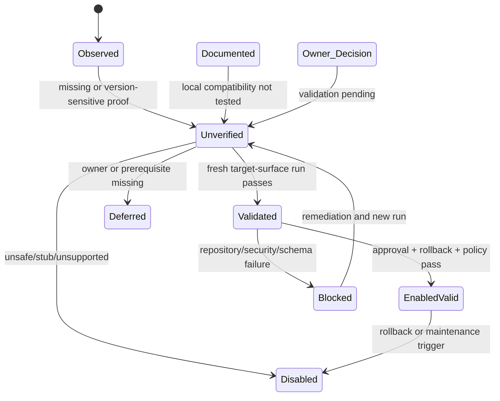
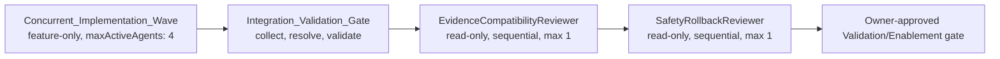
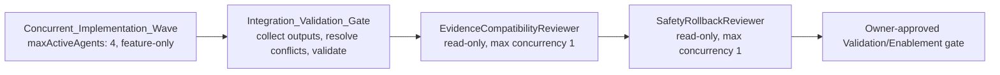

# Design: Kiro Repository Guidance Setup

## Overview

### Purpose

`kiro-repo-guidance-setup` is a repository-local governance and onboarding capability for the `oando1408` monorepo. It does not change product behavior. It inventories the repository authority chain and visible `.kiro` artifacts, records official Kiro documentation coverage, evaluates surface/version compatibility, assigns safe dispositions, validates only approved artifacts, and emits an operational handover with evidence, known gaps, and reversible rollback paths.

The implementation is a fail-closed audit-and-plan pipeline. A documented convention, an old handover statement, a registration entry, or a green repository command is never enough to mark a Kiro capability enabled, supported, or repository-compatible. Enablement requires all of the following for the exact target surface and version:

1. scope-specific owner approval;
2. fresh `Validation_Run` evidence;
3. compatibility with repository rules;
4. schema/artifact checks;
5. security and approval-boundary checks; and
6. a tested `Rollback_Path`.

The requirements document is the source of truth. This design does not authorize application-code, dependency, lockfile, production-data, secret, external-service, permission-broadening, user/global configuration, or Cloud/Crew changes. Those actions are represented as approval-boundary operations and remain blocked until separately approved and validated.

### Scope and non-goals

**In scope**

- Repository authority and onboarding-source inventory.
- The six existing local skills, existing steering, hooks, local power, and visible Kiro settings/artifacts.
- Official Kiro documentation discovery and coverage records.
- Evidence/provenance, compatibility, precedence, owner-decision, capability-disposition, validation, known-gap, and handover records.
- Repository-local guidance and configuration plans, including safe hook repair, skill manifest checks, and bounded graph-impact automation design.
- Surface-specific validation for IDE, CLI 2.x, CLI 3.x, Web, Mobile, Cloud/Crew, and the Local_Repository_Surface.
- Deterministic policy checks for no-worktree, default maximum-one-agent, the feature-only OD-04 maximum-four wave, explicit-approval, read-only-production-filesystem, persistence, database, fork-isolation, and two-test-lane rules.

**Out of scope unless an owner-approved `Approval_Boundary` is present**

- Application source, product tests, dependencies, package manifests, lockfiles, or build configuration.
- Runtime data, production filesystems, Supabase, R2, production deployments, or database migrations.
- Secrets, credentials, private URLs, personal data, or external network/MCP traffic.
- User/global Kiro settings, `KIRO_HOME`, or permission broadening.
- Enabling the LTM hook while `ltm/bin/ltm.py capture-turn` remains a stub.
- Enabling Crew behavior that creates worktrees, runs more than one concurrent agent/run, retries/replans automatically, or auto-approves work without an approved compatibility design or explicit policy exception.

### Evidence states

Every material record carries one evidence state:

| State | Meaning and implementation rule |
|---|---|
| `Documented` | Stated by an official Kiro source or repository canonical source. It describes a convention, not local compatibility. |
| `Observed` | Confirmed by a live file inspection or fresh command, with date, path/command, and result. |
| `Unverified` | Missing, version-sensitive, contradictory, inaccessible, historical, or not confirmed on the target surface. It cannot enable a capability. |
| `Owner_Decision` | A selection made by the repository owner; it still needs validation and rollback readiness. |
| `Approval_Boundary` | A proposed operation requiring explicit owner approval before execution. |
| `Validated` | A documented or observed claim confirmed by a fresh target-surface `Validation_Run`. |

Evidence state and disposition are separate. For example, OD-05 may select `enable after validation` while `oando-workflow` remains `Unverified` and inactive.

### Design inputs and research findings

The design uses the supplied 2026-08-25 audit baseline plus fresh repository inspection of `START.md`, `AGENTS.md`, `README.md`, `CONTENTS.md`, `DOC-MAP.md`, canonical architecture docs, six `SKILL.md` files, `powers-skills-model.md`, `oando-workflow/POWER.md`, its empty `mcp.json`, and five hook artifacts. The local `.kiro/settings` directory is visible, but the referenced `permissions.yaml`, `mcp.json`, `installed.json`, `agents.json`, and `config.json` were not present in the inspected repository surface; the design records them as absent/unknown rather than inferring user-level state.

Official Kiro sources used to shape the model include [Kiro documentation](https://kiro.dev/docs/), [configuration scopes](https://kiro.dev/docs/configuration/), [permissions](https://kiro.dev/docs/permissions/), [hooks](https://kiro.dev/docs/hooks/), [skills](https://kiro.dev/docs/skills/), [powers](https://kiro.dev/docs/powers/), [specifications](https://kiro.dev/docs/specs/), [custom-agent configuration reference](https://kiro.dev/docs/custom-agents/configuration-reference/), and [CLI 3.0](https://kiro.dev/docs/cli/v3/). Search results confirm that configuration, permissions, powers, and CLI-version behavior are current documentation families; the pages are client-rendered in the research fetch, so page retrieval is not treated as local feature compatibility. Content from official sources is paraphrased for compliance with licensing restrictions and linked for traceability.

Repository findings that directly inform the design:

- Authority is `user > live code and fresh commands > AGENTS.md > Agents/* > canonical docs/*`.
- Root-only `pnpm` is mandatory; worktrees are prohibited; no more than one agent may be active under the general repository rule. The only exception is a separately validated OD-04 `Concurrent_Implementation_Wave` for this feature, capped at four active Implementation_Agents.
- Production filesystem writes are forbidden; runtime persistence must use mode-aware wrappers, with no dual-write.
- Studio and Planner are fully forked and must not import each other; boundary checks are required before committing either tree.
- `pnpm run test` contains two Vitest lanes; both summaries must be recorded. `check:layout`, `gate:fast`, and the full `gate` are the repository validation bars.
- Six local skills are the exact initial candidate set: `repo-map`, `graph-impact`, `verify-and-gate`, `fork-boundaries`, `focss-css`, and `db-migrations`.
- `repo-map` is the designated primary `Repository_Guidance_Skill`; the other five remain domain skills and must reference rather than duplicate the primary authority.
- `domain-fast-check.json` is a repair candidate because its `timeout` is nested in `action`; it stays disabled or otherwise non-enabled-valid until the current schema and behavior are proven. The design does not silently rewrite the existing artifact.
- Existing stored hook commands use semicolons. A prior PowerShell `&&` error is unrelated unless a fresh inspection finds that exact stored command.
- The LTM capture hook is disabled because its implementation is a documented stub. Crew memory/knowledge evidence cannot enable local LTM.
- `oando-workflow` has `POWER.md`, an empty `mcp.json`, no `plugin.json`, and an unverified `registryId: local`; loading remains `Unverified`.

### Architectural principles

1. **Fail closed:** missing evidence, approval, compatibility, schema, or rollback blocks enablement.
2. **Surface isolation:** compatibility is a tuple `(surface, version, artifact, validation run)`, never a global boolean.
3. **Authority without duplication:** one primary onboarding path; other artifacts link to it and own only their distinct concern.
4. **Observation before mutation:** inventory and hash the pre-change state before any repair or activation attempt.
5. **No unsafe side effects:** no external network, secrets, global settings, production writes, worktrees, hidden spawning, automatic retries/replans, or multi-agent execution from documentation alone. The only multi-agent exception is the separately validated, feature-scoped OD-04 `Concurrent_Implementation_Wave` described below.
6. **Execution-layer isolation:** a feature implementation wave is distinct from default/native task execution and from the two sequential read-only review stages; an implementation wave never authorizes Crew execution or general repository concurrency.
7. **Generated evidence only:** validation output may be written to `results/` as generated `.txt`/`.json`; no hand-written Markdown reports are placed there.
8. **Repository rules are invariants:** Kiro features cannot override the process floor. OD-04 is a feature-only exception and does not modify `AGENTS.md` or the general one-agent rule.
9. **Reversible rollout:** each mutation has a concrete restore/disable action and a post-rollback validation.

### High-level flow

```mermaid
flowchart LR
  A[Sources and live repository] --> B[Discovery and inventory]
  B --> C[Evidence and provenance ledger]
  C --> D[Coverage and exclusions]
  C --> E[Surface/version compatibility]
  C --> F[Scope and permission map]
  D --> G[Capability dispositions]
  E --> G
  F --> G
  G --> H{Owner approval boundary and execution layer?}
  H -- missing --> I[Defer/observe/disable; record gap]
  H -- approved, no implementation wave --> J[Artifact + repository + surface validation]
  H -- approved, implementation wave --> K[Concurrent_Implementation_Wave<br/>maxActiveAgents: 4]
  K -- lock/ownership/failure --> L[Stop affected work; preserve state]
  K -- complete --> M[Integration_Validation_Gate<br/>collect outputs and resolve conflicts]
  J --> N[EvidenceCompatibilityReviewer<br/>read-only, sequential, max 1]
  M --> N
  N --> O[SafetyRollbackReviewer<br/>read-only, sequential, max 1]
  O -- fail/block --> P[Block; preserve prior state; emit evidence]
  O -- pass --> Q[Owner-approved enablement gate]
  Q --> R[Handover + rollback record]
  R --> S[Maintenance triggers]
```



## Architecture

### Logical components

The feature is implemented as a set of deterministic repository-local evaluators and validation adapters. They may be exposed through a repository script or equivalent Kiro workflow in a later implementation, but this design creates no implementation files and does not add dependencies.

| Component | Responsibility | Inputs | Outputs | Side-effect policy |
|---|---|---|---|---|
| `DiscoveryCollector` | Discover official candidates using official sitemap/search and inspect repository sources/artifacts. | Selected surfaces, review date, repository root, official URLs. | `Source_Inventory`, candidate list, discovery evidence. | Read-only; no network beyond explicitly approved documentation retrieval. |
| `RepositoryInventory` | Assign four-value status to canonical docs and every visible `.kiro` artifact. | Paths from requirements and filesystem listing. | Source/artifact inventory with owner, scope, risk, and disposition candidates. | Read-only. |
| `AuthorityResolver` | Compare claims by repository authority order and preserve conflicts. | Source records and claim assertions. | Selected claim, rejected/contextual claims, conflict impact. | Read-only. |
| `ProvenanceLedger` | Normalize URL/path, canonical URL, title, date, revision, method, source hash where safe, and evidence state. | Sources, commands, validation runs. | Traceable provenance references. | Redacts secrets; never stores credential values. |
| `CoverageMatrixBuilder` | Ensure each discovered official candidate has a coverage row, status, applicability, disposition, and next action. | Candidate list and exclusion register. | `Coverage_Matrix`, completeness result. | Read-only. |
| `CompatibilityMatrix` | Create exactly one record for each required surface/version. | Baseline claims, fresh validation runs. | Seven compatibility records and enablement status. | Read-only until approved validation action. |
| `ScopePrecedenceMapper` | Model global/project/agent/file-match/manual/external scopes and documented versus observed precedence. | Official docs, local settings, permission probes. | `Configuration_Precedence_Map`, approval boundaries. | Probes restricted actions; never broadens permissions. |
| `SkillEvaluator` | Validate skill manifests, choose the one primary skill, detect overlaps/prerequisites, and assign dispositions. | Six skill files, steering files, canonical docs. | Skill/steering records, overlap resolutions. | Read-only; activation remains gated. |
| `HookEvaluator` | Validate hook schema, matcher safety, commands, timeout, overlap, dependencies, surface availability, and rollback. | Hook JSON, root commands, script paths, surface probes. | Hook records, repair plan, enabled-valid decision. | No automatic command execution until gate passes. |
| `CapabilityEvaluator` | Assess powers, MCP, tools, agents, subagents, specs, task waves, review loops, continuity, and LTM boundaries. | Installed/local artifacts, docs, owner decisions. | Capability disposition table and known gaps. | No external routing or secret use by default. |
| `ImplementationWaveCoordinator` | Orchestrate the feature-only `Concurrent_Implementation_Wave` for independent coding tasks. | OD-04, frozen shared contracts, agent declarations, ownership reservations, approval boundaries. | Wave record, per-agent outputs, reservation results, conflict/failure state. | At most four active Implementation_Agents; no worktrees, hidden spawning, retries/replans, or out-of-scope mutation. |
| `IntegrationValidationGate` | Collect every implementation-wave output, resolve ownership/integration conflicts, run repository validation, and invoke both sequential reviewers before enablement. | Wave record, agent outputs, frozen contracts, validation plan, reviewer inputs. | Integrated gate result, conflict resolution, reviewer evidence, enablement recommendation. | Single post-wave gate; fail closed and never mutates to repair a failed wave. |
| `RepositoryPolicyGuard` | Enforce the default one-agent/no-worktree rule, the narrow OD-04 exception, explicit approval, root-only `pnpm`, read-only production FS, mode-aware persistence, two DBs, fork isolation, and both test lanes. | Proposed action, execution layer, wave metadata, command/config metadata. | Allow/block decision with violated invariant and scope. | Fail closed; `maxActiveAgents: 4` is valid only for the exact feature wave after all reservations and freeze checks pass. |
| `ValidationRunner` | Run artifact, repository, documentation, security, rollback, and target-surface checks. | Validation plan and explicit approval. | `Validation_Run` records and generated evidence files. | Executes only approved, bounded commands and runs after the wave gate where applicable. |
| `EvidenceCompatibilityReviewer` | Review provenance, coverage, freshness, and surface compatibility after implementation/integration validation. | Integrated wave output or no-wave validation output, source records, seven compatibility records. | Read-only compatibility findings and blockers. | Sequential stage, maximum concurrency 1, no mutation or enablement. |
| `SafetyRollbackReviewer` | Review approvals, security boundaries, policy invariants, rollback readiness, known gaps, and handover consistency after the evidence review. | Evidence reviewer output, boundaries, snapshots, rollback records, proposed handover. | Read-only safety findings and blockers. | Sequential stage after EvidenceCompatibilityReviewer, maximum concurrency 1, no mutation or enablement. |
| `EnablementGate` | Grant enabled-valid only when all predicates pass. | Dispositions, approvals, validations, gaps, rollback results. | Enabled/blocked decision and reason. | Never mutates on a failed predicate. |
| `RollbackManager` | Restore pre-change bytes/settings or disable the capability and verify restoration. | Pre-change snapshot, artifact path, rollback action. | Rollback result and evidence. | No deletion of unrelated work. |
| `HandoverGenerator` | Produce concise operational order, matrices, decisions, known gaps, and rollback instructions. | All records. | `Handover_Record` and generated evidence references. | Deterministic and redacted. |

### Record lifecycle

All records use an immutable append-only validation history and a current projection. A record may move from `Unverified` to `Validated` only through a new target-surface `Validation_Run`; it may not be upgraded by editing prose. A disposition may move from `observe/defer/disable` to an active handover state only after `EnablementGate` passes.

Execution is explicitly layered. A feature implementation may use one `Concurrent_Implementation_Wave` with `maxActiveAgents: 4` only inside the OD-04 scope and only after `Shared_Contract_Freeze`, disjoint `File_Ownership_Reservation` records, explicit read/write scopes, and all required approval boundaries are recorded. The wave is not a native/default task wave, a Crew run, or a reviewer stage. After the wave ends, exactly one `Integration_Validation_Gate` collects all outputs and runs repository validation. `EvidenceCompatibilityReviewer` then runs first and `SafetyRollbackReviewer` runs second; both are read-only, sequential, and maximum concurrency 1. A failure, conflict, stale/missing reservation, partial/abandoned agent, or failed reviewer keeps enablement blocked and preserves or restores prior state.



### Enablement predicate

For capability `c` and target `(s, v)`, enabled-valid is true only if:

```text
enabledValid(c, s, v) =
  ownerApproval(c, s, v)
  AND freshValidation(c, s, v)
  AND artifactSchemaPass(c)
  AND repositoryCompatibility(c)
  AND securityBoundaryConfirmed(c)
  AND rollbackReady(c)
  AND noBlockingKnownGap(c, s, v)
  AND policyGuardsPass(c)
```

`freshValidation` requires a post-change run when the artifact or surface/version claim changed. `ownerApproval` does not imply any other predicate. A missing predicate returns `blocked`, not `unknown success`.

### Surface/version model

The compatibility matrix contains exactly these seven records, even when a surface is not applicable:

| Surface/version | Initial baseline | Design status until fresh run | Special rule |
|---|---|---|---|
| IDE | Observed active Kiro IDE session. | `Unverified` for changed artifacts; baseline observation remains `Observed`. | IDE evidence is not transferable. |
| CLI 2.x | Observed `kiro-cli-chat 2.19.1`. | `Unverified` after changes until a fresh CLI 2.x run. | Version evidence applies only to CLI 2.x. |
| CLI 3.x | No local validation. | `Unverified`. | Requires a fresh CLI 3.x validation; CLI 2.x output cannot satisfy it. |
| Web | Documented surface behavior only. | `Unverified` unless applicable and freshly tested. | Global config/hooks may be non-applicable; record reason rather than assuming. |
| Mobile | Documented surface behavior only. | `Unverified` or `not applicable with reason`. | No global-config or hook assumption without a surface record. |
| Cloud/Crew | Crew uninstalled; docs are contextual. | `Unverified`, with incompatible behaviors deferred/excluded. | Worktree/concurrency/retry/replan/auto-approval checks are mandatory. |
| Local_Repository_Surface | `.kiro` files and root commands observed. | `Observed` for inventory; `Validated` only after artifact/repository gates. | No claim that Kiro loads an artifact until the relevant surface run passes. |

### Crew compatibility guard

The `RepositoryPolicyGuard` evaluates Crew documentation, configuration, and runtime probes separately. It searches for or observes the following prohibited behavior:

- worktree creation, worktree path configuration, or branch isolation performed by the runner;
- more than one active Crew agent/run, or any Crew attempt to use the feature-only OD-04 wave exception;
- automatic retries, replans, or loop continuation outside the bounded review policy;
- auto-approval or implicit approval of tool/action execution;
- hidden spawning or mutation outside a declared scope.

The OD-04 exception is local to this feature's `Concurrent_Implementation_Wave`; it never authorizes Crew worktrees, general Crew multi-agent execution, retries/replans, auto-approval, or concurrency above four. A positive Crew finding yields `deferred` or `excluded`, records the source and conflict with repository rules, and blocks enablement. A compatibility exception can be considered only when an `Owner_Decision` record names the exact behavior, scope, owner, date, expiration/review date, safeguards, maximum concurrency, approval behavior, failure handling, and rollback path. Such an exception still cannot convert Crew into the local implementation wave and must pass a fresh Cloud/Crew validation. If any required value is missing, adoption is rejected.

## Components and Interfaces

### Interface conventions

The following are conceptual contracts for a later implementation. They are deliberately side-effect-aware and typed around the evidence model; they do not prescribe application dependencies.

```text
DiscoveryCollector.discover(input: DiscoveryRequest)
  -> DiscoveryResult { candidates, sourceRecords, unavailable, errors }

RepositoryInventory.scan(input: InventoryRequest)
  -> InventoryResult { canonicalSources, kiroArtifacts, missingPaths, conflicts }

ProvenanceLedger.record(input: ProvenanceInput)
  -> SourceRecord { id, evidenceState, provenance, sourceHash? }

CoverageMatrixBuilder.build(input: CoverageInput)
  -> CoverageResult { matrix, exclusions, completeness, blockers }

CompatibilityMatrix.assess(input: CompatibilityInput)
  -> CompatibilityResult { records[7], transferViolations, blockers }

ScopePrecedenceMapper.assess(input: ScopeInput)
  -> ScopeResult { scopes, precedenceMap, approvalBoundaries, blockers }

CapabilityEvaluator.evaluate(input: CapabilityInput)
  -> CapabilityResult { dispositions, knownGaps, policyViolations }

ImplementationWaveCoordinator.run(input: ImplementationWaveRequest)
  -> ImplementationWaveResult { waveRecord, agentOutputs, reservations, conflicts, status }

IntegrationValidationGate.run(input: IntegrationValidationRequest)
  -> IntegrationGateResult { collectedOutputs, conflictResolutions, validationRuns, reviewerHandoff, status }

EvidenceCompatibilityReviewer.review(input: EvidenceReviewRequest)
  -> ReviewResult { findings, blockers, evidenceRefs, status }

SafetyRollbackReviewer.review(input: SafetyReviewRequest)
  -> ReviewResult { findings, blockers, evidenceRefs, status }

ValidationRunner.run(input: ValidationRequest)
  -> ValidationRun { id, target, action, result, evidence, blockers }

EnablementGate.evaluate(input: GateInput)
  -> GateResult { status: enabled-valid | blocked, failedPredicates, evidenceRefs }

RollbackManager.restore(input: RollbackRequest)
  -> RollbackResult { restored, verificationRun, limitation }

HandoverGenerator.generate(input: HandoverInput)
  -> HandoverRecord { readOrder, matrices, decisions, gaps, rollback, completeness }
```

### Discovery and source inventory

`DiscoveryCollector` has two modes:

1. **Official discovery:** read the official sitemap and run official-site search for the required documentation families. Each candidate is recorded before it is used as evidence.
2. **Repository discovery:** inspect the required canonical files, `.kiro` directories, package scripts, and referenced paths. Missing files are records with `absent` or `unknown`, never silently skipped.

A source record includes source kind (`official_url`, `repository_file`, `command`, `surface_probe`), URL/path, canonical URL, title, family, displayed publication/update date if available, ISO review date, retrieval method, revision/version, applicability, trust/integrity, evidence state, and references to claims and validation runs.

### Approval boundary interface

Any proposed operation that changes global/user configuration, `KIRO_HOME`, permission breadth, secrets, external services/MCP, Cloud/Crew, production data/filesystem, dependencies, or application code must be converted to:

```text
ApprovalBoundary {
  id,
  scope,
  requestedChange,
  targetSurface,
  owner,
  approvalStatus,
  approvalDate,
  preChangeStateRef,
  securityBoundary,
  expectedSideEffects,
  rollbackPathRef,
  status: pending | approved | rejected | expired
}
```

`RepositoryPolicyGuard` returns `blocked` while `approvalStatus` is not `approved`. An approved boundary does not waive validation or repository invariants.

### Hook evaluator interface

`HookEvaluator` parses only standalone `.kiro/hooks/*.json` files. It verifies:

- JSON syntax and root `version: "v1"`;
- PascalCase trigger;
- supported command or agent action;
- command action receives JSON on stdin where applicable;
- target-only, narrow matcher;
- hook-level boolean `enabled`;
- hook-level timeout within the design range and current schema bounds;
- referenced command/script paths;
- root `pnpm` working directory and bounded side effects;
- dependencies, overlap, order independence, owner, surface availability, and rollback.

For `domain-fast-check.json`, the evaluator must report the action-level timeout placement as `Unverified` and require schema repair plus a fresh post-repair run before enablement. The implementation must snapshot the original bytes, make one focused repair, validate, and restore the original on failure.

For a file hook, the record explicitly says that available evidence covers agent-made changes only unless a fresh run proves user-made file-change coverage. No hook may write secrets, production data, unrelated files, or persistence records outside its approved scope.

### Skills and steering evaluator interface

The evaluator validates the six exact candidate folders and their `SKILL.md` frontmatter. For each skill:

- folder name must equal frontmatter `name`;
- `description` must state purpose, activation, and scope specifically;
- canonical source files, root commands, constraints, prerequisites, activation scope, owner, risk, evidence, and rollback must be recorded;
- overlap with steering or another skill must resolve to one authoritative path;
- missing scripts, powers, MCP services, secrets, permissions, or network services block activation.

`repo-map` is the single primary `Repository_Guidance_Skill` because it is the repository orientation entry point and routes to canonical docs and graph tooling. `graph-impact`, `verify-and-gate`, `fork-boundaries`, `focss-css`, and `db-migrations` remain specialized secondary skills. `powers-skills-model.md` remains a relationship/activation model, not a replacement for `AGENTS.md` or canonical source rules.

The evaluator must not claim always-on, on-demand, or slash-command behavior solely from documentation; OD-08 and a fresh activation run are required.

### Capability evaluator interface

Capabilities are assessed separately, never collapsed into “Kiro support”:

- legacy power vs Agent Plugin format;
- local/installed powers and repository-answer routing;
- MCP services and external network boundaries;
- built-in tools and custom agents;
- subagents, DAGs, waves, and bounded review loops;
- feature specs, bugfix specs, plans, correctness, analysis, best practices;
- local compaction, checkpoints/rewind, CLI sessions;
- Crew memory/knowledge;
- LTM capture.

For every power, `format` is exactly one of `Legacy_POWER`, `Agent_Plugin`, `Both`, or `Neither`. The local `oando-workflow` record must preserve separate observations for `POWER.md` present, empty `mcp.json`, `plugin.json` absent, and `registryId: local` unverified. Activation stays `Unverified` until a current Active_Surface loading test passes.

Before external routing, the evaluator performs a repository-answer check with exactly one result: `Answered`, `Not_Answered`, or `Not_Testable`. `Answered` means canonical repository sources/tools can fulfill the request and no external capability is needed.

### Graph-impact automation interface

The observed manual workflow remains the fallback:

```text
inspect graph -> scope tests -> fix -> repeat (maximum 3 iterations) -> gate:fast
```

OD-03 may introduce automation only after a reviewed root `Repository_Command`, narrow matcher/event, timeout, side-effect inventory, explicit approval gate, failure signal, and rollback path are recorded. The automation must:

- invoke `node scripts/graph-impact.mjs` from the repository root;
- use the returned scoped test suggestion rather than inventing a test scope;
- stop after at most three fix/validation iterations;
- preserve the manual workflow when the command, graph, test, or gate fails;
- never create worktrees or activate more than one agent outside the exact OD-04 feature-scoped implementation wave;
- emit each iteration as a separate `Validation_Run`.

### Spec DAGs, task waves, and review loops

Native specification and execution capabilities are modelled as separate entries. Default/native task graphs and waves have `maximumConcurrency` of `0` (not adopted) or `1`; review stages have `maximumConcurrency: 1` and an `iterationCeiling` from `0` through `3`. These fields apply to default/native task execution and the two review-only stages, not to the feature-scoped implementation wave.

The feature's `Concurrent_Implementation_Wave` is a separate, local orchestration layer permitted only by the OD-04 feature-only exception. It may run independent coding tasks concurrently with `maxActiveAgents: 4`, but only when all four agents have disjoint declared file ownership and shared-output ownership, explicit read/write scopes, successful `File_Ownership_Reservation` records, and a completed `Shared_Contract_Freeze` before dependent work starts. It runs from the repository root with `pnpm`, creates no worktrees, permits no hidden spawning or automatic retries/replans, and requires an `Approval_Boundary` for any external, global, secret-bearing, production, or Crew action. A stale/missing/conflicting reservation or ownership violation stops the affected agent or wave fail-closed. The wave ends at one `Integration_Validation_Gate`, which collects every output, resolves conflicts, runs required repository validation, and then hands off to the sequential read-only reviewers.

The general repository default remains one active agent and no worktrees. This exception does not modify `AGENTS.md`, does not authorize general multi-agent execution, and does not make the OD-04 wave available to Crew or unrelated features. Adoption of any native/default feature is blocked when it cannot guarantee no worktree, default one-agent execution, explicit approval, bounded failure behavior, and rollback. A future implementation must not translate generic “parallel waves” into parallel agents outside this exact wave.

### Feature implementation and review orchestration

The execution DAG has two distinct layers:



| Layer/stage | Role | Inputs | Outputs | Execution limits | Approval/failure behavior | Rollback behavior |
|---|---|---|---|---|---|---|
| 1 | `Concurrent_Implementation_Wave` | Frozen shared contracts, independent coding tasks, agent declarations, ownership reservations, read/write scopes, OD-04 and applicable boundaries | Per-agent changes/results, reservation records, conflicts, partial/abandoned status | One feature only; `maxActiveAgents: 4`; disjoint writes and shared-output ownership; no worktrees, hidden spawning, automatic retries/replans, or out-of-scope mutation; root-only `pnpm` | Ownership conflict, stale/missing lock, failed/partial/abandoned agent, boundary failure, or scope violation stops the affected work and blocks dependent work | Release reservations, disable the wave, restore affected artifacts from snapshots, and preserve unrelated state |
| 2 | `Integration_Validation_Gate` | Every wave output, reservation state, conflict reports, frozen contracts, validation plan | One integrated result, resolved conflicts, repository validation, and handoff evidence | Exactly one post-wave gate; no parallel gate; must run both reviewer checks before enablement | Collects all outputs, resolves conflicts explicitly, runs required validation, and fails closed on missing/partial/conflicting output; no automatic retry/replan | Preserve/restore prior state and record failed gate; no repair by hidden mutation |
| 3 | `EvidenceCompatibilityReviewer` | Integrated gate output or no-wave validation output, source/provenance records, Coverage_Matrix, Exclusion_Register, artifact inventory, seven surface/version records, owner decisions, and validation freshness | Coverage/exclusion completeness, compatibility/freshness findings, unsupported enablement claims, blockers | Sequential first review stage; `maximumConcurrency: 1`; `iterationCeiling: 3`; read-only; no spawned agents | Missing/stale/contradictory evidence blocks or remains `Unverified`; cannot enable, repair, or run an unapproved action | `no rollback applies`; preserve all pre-change state and append review evidence |
| 4 | `SafetyRollbackReviewer` | Stage 3 findings and blockers, Approval_Boundaries, security checks, policy results, snapshots, Known_Gaps_Register, rollback records, proposed handover | Safety findings, approval/boundary gaps, policy violations, rollback blockers, known-gap and handover consistency evidence | Runs only after Stage 3 handoff; `maximumConcurrency: 1`; `iterationCeiling: 3`; read-only; no spawned agents | Missing approval, unsafe boundary, policy violation, failed rollback, or inconsistency blocks downstream enablement; cannot repair or approve | `no rollback applies`; preserve pre-change state and require separate rollback validation |

### Continuity and LTM interface

Continuity records are separate:

| Capability | Boundary | Enablement rule |
|---|---|---|
| Local compaction | Local session context | Validate on the selected local surface; do not equate with memory persistence. |
| Checkpoints/rewind | Local artifact/session state | Validate restore semantics and rollback separately. |
| CLI session persistence | CLI version/session store | Validate per CLI version; no transfer from CLI 2.x to 3.x. |
| Crew memory | Cloud/Crew data boundary | Documentation is not local LTM proof; requires Cloud/Crew validation and approval. |
| Crew knowledge | Cloud/Crew knowledge boundary | Keep separate from memory and local records. |
| LTM capture | `ltm/bin/ltm.py capture-turn` | Hook remains disabled until implementation is no longer a stub and a fresh execution run passes. |

No continuity capability may write production data or secrets. The LTM hook's current disabled state is preserved during all failed or incomplete phases.

## Data Models

The model is designed for JSON or typed in-memory records. Identifiers are stable within one review run and references are explicit so a handover can be regenerated without copying claims into multiple files.

### Enumerations

```text
EvidenceState = Documented | Observed | Unverified | Owner_Decision |
                Approval_Boundary | Validated

InventoryStatus = present and readable | present but unreadable | absent | unknown

CapabilityDisposition = apply | retain | update | merge | add | observe |
                       defer | disable | retire | exclude

HandoverDisposition = installed | retained | updated | merged | added |
                     deferred | observed | retired | excluded | disabled

CompatibilityStatus = applicable | not applicable with reason | Unverified

ValidationResult = pass | fail | blocked | not_run | partial

MaintenanceRisk = low | medium | high | unknown with reason

RepositoryAnswer = Answered | Not_Answered | Not_Testable
```

### `SourceRecord` and provenance

```text
SourceRecord {
  sourceId,
  kind: official_url | repository_file | command | surface_probe,
  locator,
  canonicalLocator?,
  title?,
  officialDocumentationFamily?,
  displayedDate?,
  reviewDateUtc,
  retrievalMethod,
  revisionOrVersion?,
  surfaceApplicability[],
  versionSensitiveClaim,
  availability: available | redirected | inaccessible | contradictory | impossible_to_match,
  evidenceState,
  provenance: { observer, cwdOrSurface, commandOrPath, result, integrityBasis? },
  trustDecision,
  claims[],
  validationRunRefs[],
  disposition,
  limitation?
}
```

A source URL alone is not sufficient evidence. `provenance` always identifies how the source was obtained and what it proves. Secret values, tokens, private URLs, and personal data are rejected before recording.

### `CoverageEntry` and `ExclusionEntry`

```text
CoverageEntry {
  coverageId,
  sourceId,
  url,
  canonicalUrl?,
  currentTitle?,
  family,
  discoveryMethod: sitemap | official_search | linked_page | repository_seed,
  reviewDateUtc,
  surface,
  applicability: applicable | not_applicable_with_reason | unresolved,
  keyConvention,
  versionSensitiveClaim,
  evidenceProvenanceRef,
  availability,
  disposition,
  validationAction,
  status: reviewed | excluded | unavailable | pending,
  limitation?
}

ExclusionEntry {
  exclusionId,
  candidateRef,
  family,
  reason,
  scopeBoundary,
  owner,
  reviewDateUtc,
  reconsiderationTrigger,
  evidenceRef,
  status: excluded
}
```

`CoverageMatrixBuilder` rejects a completion result if a discovered relevant candidate has neither a coverage entry nor an exclusion/unavailable record. The handover completion sentence is fixed: **“Complete review covers all relevant current official pages recorded in the Coverage_Matrix; it does not claim that every Kiro webpage was read.”**

### `OwnerDecision` and `ApprovalBoundary`

```text
OwnerDecision {
  decisionId: OD-01..OD-10,
  owner,
  decisionDate,
  selectedPolicy,
  scope,
  rejectedOptions[],
  approvalStatus,
  unresolvedStatus?,
  requiredValidation[],
  rollbackBoundary,
  evidenceRef,
  limitations[]
}
```

All ten decisions are required records. The selected policy is `enable after validation`; “None explicitly rejected” is recorded where supplied. The records do not grant permission to bypass a boundary.

### `CompatibilityRecord`

```text
CompatibilityRecord {
  surface,
  version,
  status: applicable | not applicable with reason | Unverified,
  documentedBehavior[],
  observedBehavior[],
  evidenceFreshness: fresh | historical | none,
  versionSensitiveClaim,
  validationAction,
  validationRunRefs[],
  enablementStatus: blocked | deferred | enabled-valid,
  unsupportedClaims[],
  migrationConstraints[],
  rollbackPathRef
}
```

There must be exactly one record per required surface/version. Evidence cannot be copied between records.

### `ScopeRecord` and `PrecedenceMap`

```text
ScopeRecord {
  scope: global | project | agent | file_match | manual | workspace_root_permission |
         user_permission | external_service,
  surface,
  pathOrService,
  applicability,
  access,
  actions,
  documentedPrecedence,
  observedPrecedence,
  denyOverridesAllow: observed | Unverified | contradicted,
  evidenceRefs[],
  approvalBoundaryRef?,
  rollbackPathRef
}

ConfigurationPrecedenceMap {
  records[],
  documentedOrder[],
  observedOrder[],
  conflicts[],
  unresolved[],
  generatedAtUtc
}
```

The map keeps documented and observed precedence in different fields. A mismatch becomes a known gap and blocks affected enablement.

### Artifact records

#### Skills and steering

```text
SkillRecord {
  path,
  folderName,
  manifestName,
  description,
  inventoryStatus,
  disposition,
  isPrimaryRepositoryGuidanceSkill,
  activationScope,
  canonicalSources[],
  rootCommands[],
  constraints[],
  prerequisites[],
  overlapResolutions[],
  owner,
  maintenanceRisk,
  evidenceRefs[],
  validationRunRefs[],
  rollbackPath
}

SteeringRecord {
  path,
  inclusion,
  inventoryStatus,
  ownedRules[],
  referencedCanonicalSources[],
  overlapResolution,
  disposition,
  evidenceRefs[],
  rollbackPath
}
```

#### Hooks

```text
HookRecord {
  path,
  name,
  hookEvent,
  matcher,
  actionType,
  enabled,
  hookLevelTimeoutSeconds?,
  schemaResult,
  commandOrPromptSummary,
  commandInputContract,
  dependencies[],
  surfaceAvailability[],
  overlapRefs[],
  owner,
  maintenanceRisk,
  disposition,
  preChangeSnapshotRef,
  validationRunRefs[],
  disableAction,
  expectedSideEffects[],
  rollbackPath,
  rollbackValidationRef?
}
```

#### Powers, MCP, tools, agents, and subagents

```text
PowerRecord {
  pathOrInstallation,
  format: Legacy_POWER | Agent_Plugin | Both | Neither,
  powerManifestPresent,
  pluginManifestPresent,
  mcpConfigSummary,
  registryObservation?,
  repositoryAnswer: Answered | Not_Answered | Not_Testable,
  migrationOrRetainPath,
  provenance,
  secrets: none_declared | named_boundary,
  permissions: none_declared | named_boundary,
  surfaceValidationRefs[],
  ownerApprovalRef?,
  disposition,
  rollbackPath
}

ExtensionRecord {
  kind: MCP_Service | Tool_Surface | Custom_Agent | Subagent,
  executionLayer: default_native_task | reviewer_stage | implementation_wave | crew,
  configurationFormat,
  surfaceAvailability,
  scope,
  activation,
  authorityRelationship,
  resourceUris[] | [None],
  serviceAndDataBoundary?,
  secretBoundary?,
  permissionBoundary?,
  dagOrReviewGraph?,
  maximumConcurrency: 0 | 1, // default/native task execution and reviewer stages only
  iterationCeiling: 0..3, // review stages and bounded loops only
  approvalBehavior,
  failureBehavior,
  repositoryCompatibility,
  validationRunRefs[],
  owner,
  disposition,
  rollbackPath
}

ConcurrentImplementationWaveRecord {
  waveId,
  featureName: kiro-repo-guidance-setup,
  scope: feature_only,
  maxActiveAgents: 4,
  activeAgentCount,
  implementationAgents[],
  declaredFileOwnership[],
  declaredSharedOutputOwnership: none | named_disjoint_outputs,
  readWriteScopes[],
  fileOwnershipReservations[],
  sharedContractFreezeRef,
  rootWorkingDirectory,
  packageManager: pnpm,
  worktrees: prohibited,
  hiddenSpawning: prohibited,
  automaticRetries: prohibited,
  automaticReplans: prohibited,
  approvalBoundaryRefs[],
  conflictPolicy: stop_affected_agent_or_wave_fail_closed,
  integrationValidationGateRef,
  status: pending | running | blocked | partial | completed | rolled_back,
  rollbackPath,
  validationRunRefs[]
}

FileOwnershipReservation {
  reservationId,
  waveId,
  agentId,
  targetPaths[],
  sharedOutputs[],
  readScope[],
  writeScope[],
  acquiredBeforeMutation,
  status: active | released | stale | conflicting | missing,
  conflictRefs[],
  releasedAt?
}

SharedContractFreeze {
  freezeId,
  waveId,
  contracts[],
  frozenAtUtc,
  dependentWorkAllowed,
  owner,
  validationRunRef
}

IntegrationValidationGateRecord {
  gateId,
  waveId,
  collectedAgentOutputs[],
  conflictResolutions[],
  repositoryValidationRuns[],
  reviewerStages: [EvidenceCompatibilityReviewer, SafetyRollbackReviewer],
  sequentialReviewerHandoffRefs[],
  status: pending | pass | fail | blocked | partial,
  enablementAllowed,
  rollbackPath
}

ReviewerStageRecord {
  reviewer: EvidenceCompatibilityReviewer | SafetyRollbackReviewer,
  executionLayer: reviewer_stage,
  maximumConcurrency: 1,
  iterationCeiling: 0..3,
  readOnly: true,
  inputStageRef,
  outputFindings[],
  blocker,
  status: pending | pass | fail | blocked,
  rollbackPath: no rollback applies
}
```

### Capability disposition and handover records

```text
CapabilityDispositionRecord {
  capabilityId,
  kind,
  name,
  disposition,
  configurationScope,
  canonicalSource,
  surfaceVersionApplicability[],
  activationCondition,
  owner,
  approvalBoundaryRef | no_boundary,
  evidenceRefs[],
  validationAction,
  expectedSideEffects,
  rollbackPath,
  reason,
  knownGapRefs[]
}

HandoverRecord {
  generatedAtUtc,
  reviewDateUtc,
  completeReviewStatement,
  firstReadPath[],
  coverageMatrixRef,
  exclusionRegisterRef,
  officialFamilyStatuses[],
  surfaceCompatibilityStatement,
  configurationPrecedenceMapRef,
  capabilityDispositionTableRef,
  implementationWaveRef?,
  integrationValidationGateRef?,
  reviewerStageRefs: [EvidenceCompatibilityReviewer, SafetyRollbackReviewer],
  ownerDecisionRefs[OD-01..OD-10],
  evidenceStateLegend,
  artifactDispositions[],
  validationRuns[],
  knownGaps[],
  rollbackRecords[],
  maintenanceTriggers[],
  limitations[]
}
```

The ordered handover read path is `START.md`, `AGENTS.md`, applicable `Agents/*`, canonical `docs/*`, the single `repo-map` skill, steering scopes, hook manifests, power/MCP boundaries, custom agents/subagents, and the selected Active_Surface.

### Validation and rollback records

```text
ValidationRun {
  validationId,
  action,
  repositoryRootOrActiveSurface,
  surface,
  version,
  scope,
  executionLayer: default_native_task | implementation_wave | integration_gate | reviewer_stage | surface_validation,
  waveId?,
  reviewer?,
  startedAtUtc,
  result,
  commandOrInteraction,
  exitCodeOrOutcome,
  evidenceRefs[],
  unverifiedItems[],
  blocker: string | none,
  preChangeSnapshotRef?,
  postChangeArtifactHash?,
  laneResults?: { defaultVitest?, techDocsVitest? },
  limitation?
}

RollbackRecord {
  rollbackId,
  targetArtifactOrScope,
  preChangeStateRef,
  rollbackAction,
  expectedSuccessSignal,
  observedEvidence,
  result: pass | fail | blocked,
  verificationRunRef,
  owner,
  limitation?
}
```

Repository tests record the default and tech-docs Vitest lanes independently. No command result is called a PASS unless its evidence and limitations are present.

## Correctness Properties

A property is a characteristic or behavior that should hold true across all valid executions of a system—essentially, a formal statement about what the system should do. Properties bridge the human-readable requirements and machine-verifiable guarantees. For this feature, properties apply to pure record normalization, policy evaluation, set/cardinality checks, and fail-closed decisions. They do not replace integration validation of Kiro surfaces, commands, external services, or filesystem rollback.

### Property 1: Discovery evidence is complete and ordered

For all discovered candidate sets, every candidate used as decision evidence has a `Source_Inventory` and `Coverage_Matrix` record first; out-of-scope candidates have an `Exclusion_Register` record, unavailable relevant candidates have an `Unverified` unavailable record, and a complete-review output lists every unavailable candidate and uses the required completion statement.

**Validates: Requirements 1.1, 1.2, 1.3, 1.4, 1.5, 2.2, 13.3**

### Property 2: Authority resolution preserves evidence

For all claim sets from the repository authority ranks, the highest-ranked applicable claim is selected according to `user > live code and fresh commands > AGENTS.md > Agents/* > canonical docs/*`, while every losing claim, provenance record, rationale, and unresolved impact remains available as contextual evidence; an unconfirmed rule is `Unverified`.

**Validates: Requirements 2.3, 3.3, 3.6, 14.6, 14.7**

### Property 3: Inventory and record schemas are total

For all valid inspected artifacts, the resulting record has exactly one inventory status, non-empty owner/scope/evidence/disposition fields, an allowed maintenance-risk value, and all type-specific provenance, validation, and rollback fields required for that artifact kind; no secret value is persisted in the record.

**Validates: Requirements 2.1, 2.4, 3.1, 3.4, 6.1, 7.1, 8.4, 11.2, 12.2, 13.5, 13.6, 14.3**

### Property 4: Fixed candidate and decision sets are exact

For all inventory projections, the initial skill candidate set is exactly `{repo-map, graph-impact, verify-and-gate, fork-boundaries, focss-css, db-migrations}`, the compatibility matrix contains exactly the seven required surface/version records, the named specification/execution/continuity capabilities remain separate, and the owner-decision set contains exactly `OD-01` through `OD-10` once each.

**Validates: Requirements 2.6, 4.1, 9.1, 9.4, 10.1**

### Property 5: Evidence is isolated by surface and freshness

For any artifact, surface, and version, a historical document, URL, registration entry, or validation run for a different surface/version cannot satisfy the target’s fresh-validation predicate; a changed artifact remains `Unverified` until a post-change `Validation_Run` for that exact target passes.

**Validates: Requirements 3.2, 4.2, 4.3, 4.5, 4.6, 12.5, 12.8, 13.7**

### Property 6: Enablement is fail-closed and side-effect-free when incomplete

For all capability proposals, enabled-valid is true if and only if owner approval, fresh target-surface validation, schema/artifact validity, repository compatibility, security-boundary confirmation, rollback readiness, and absence of blocking known gaps are all true; if any condition is missing or false, the result is blocked or inactive and the pre-change/unrelated-resource state is preserved.

**Validates: Requirements 1.6, 2.7, 5.5, 6.7, 8.5, 9.7, 10.2, 11.5, 12.6, 12.7, 14.8, 14.9**

### Property 7: Scope and permission records do not broaden access

For all selected surfaces, global, project, agent, workspace-root permission, user-permission, and external-service scopes have separate documented and observed precedence fields; a pending approval boundary or unresolved deny-overrides-allow result yields a blocked action and no global/user/external mutation intent.

**Validates: Requirements 5.1, 5.2, 5.4, 5.6, 10.9, 11.6**

### Property 8: Skill authority is unique and prerequisites are explicit

For all skill and steering overlap graphs, exactly one skill is marked primary (`repo-map` in this design), every non-authoritative path has a merge/delegate/retire/reject result, and no skill activation claim is emitted without OD-08, a valid manifest, approved prerequisites, and rollback validation.

**Validates: Requirements 6.2, 6.4, 6.5, 6.6**

### Property 9: Approved hooks satisfy schema and safety bounds

For all hook manifests marked approved, the standalone JSON has version `v1`, a PascalCase event, a supported command/agent action, a narrow target-only matcher, the correct command input contract, hook-level boolean `enabled`, a hook-level timeout within the approved range, a reviewed root command, named owner, bounded side effects, and a valid rollback path; any dependency or overlap violation blocks approval.

**Validates: Requirements 7.2, 7.5, 7.6, 7.8, 7.9, 12.1**

### Property 10: Extension routing and execution plans are bounded

For all powers, MCP services, tools, custom agents, and subagents, the format and repository-answer result are recorded before external routing; every external boundary is named, every custom-agent resource is recorded or explicitly `None`, default/native task execution and reviewer stages use `maximumConcurrency` of `0` or `1`, review iterations are `0..3`, and missing or incompatible values produce an inactive disposition. The feature-only implementation wave is evaluated by Property 16 and is not represented by this default/native field.

**Validates: Requirements 8.1, 8.3, 8.4, 8.6, 8.7, 8.8, 9.2**

### Property 11: Incompatible Crew behavior is blocked

For any Cloud/Crew capability whose proposed or observed behavior includes worktrees, more than one concurrent run/agent, automatic retries or replans, hidden spawning, or auto-approval, the capability is `deferred` or `excluded`, includes conflict evidence, and cannot become enabled-valid through this feature's OD-04 decision; any future separate policy exception would require its own owner decision, compatibility design, and fresh target-surface validation.

**Validates: Requirements 9.3, 10.6, 10.11, 14.5**

### Property 12: Continuity evidence does not cross data boundaries

For all continuity records, local compaction, checkpoints/rewind, CLI sessions, Crew memory, Crew knowledge, and LTM capture remain separate capabilities with separate surfaces, data boundaries, retention limits, validations, and rollback paths; Crew documentation cannot satisfy the LTM execution predicate while the capture implementation is stubbed.

**Validates: Requirements 9.4, 9.5, 9.6**

### Property 13: Unresolved owner decisions preserve safe fallbacks

For all owner-decision records marked unresolved, OD-01 limits claims to the observed IDE session, OD-02 preserves hook states and blocks automatic execution, OD-03 preserves the manual graph loop, OD-04 preserves no-worktree/default-one-agent/explicit-approval safeguards and does not start the feature wave or use the four-agent exception, OD-05 through OD-07 keep extensions inactive, OD-08 makes no activation-scope claim, OD-09 leaves global settings unchanged, and OD-10 labels the final gate as an owner decision without enabled-valid status.

**Validates: Requirements 10.3, 10.4, 10.5, 10.6, 10.7, 10.8, 10.9, 10.10**

### Property 14: Disposition and handover projections are one-to-one

For all audited artifacts, the capability disposition table and handover contain exactly one entry, one allowed disposition, one canonical path, a resolution for every duplicate, evidence/reason, activation condition, owner, and rollback value; no-change entries use `no rollback applies`, and incomplete official-family coverage marks the handover incomplete.

**Validates: Requirements 11.1, 11.2, 11.3, 13.1, 13.2, 13.4**

### Property 15: Repository policy invariants survive every plan

For all proposed commands, hooks, default/native task graphs, powers, agents, reviewers, and handover actions, the plan uses root-only `pnpm`, creates no worktree, activates at most one agent by default, does not write the production filesystem, uses mode-aware persistence without dual-write, preserves Admin/Products database routing, preserves Studio/Planner fork isolation, records both Vitest lanes, and includes the required repository gates. A plan may use more than one agent only when it is the exact OD-04 `Concurrent_Implementation_Wave` and satisfies Property 16; Crew and unrelated features never inherit that exception.

**Validates: Requirements 9.2, 11.6, 14.2, 14.5**

### Property 16: The feature implementation wave is bounded and fail-closed

For all proposed `Concurrent_Implementation_Wave` plans, the wave is scoped only to `kiro-repo-guidance-setup`, has `maxActiveAgents` no greater than four, gives every Implementation_Agent explicit read/write scopes and disjoint declared file and shared-generated-output ownership, acquires a successful `File_Ownership_Reservation` before each mutation, and completes `Shared_Contract_Freeze` before dependent work starts; the plan uses root-only `pnpm`, no worktrees, no hidden spawning, no automatic retries/replans, and named Approval_Boundaries for external, global, secret-bearing, production, or Crew actions. For any ownership conflict, stale or missing reservation, mutation outside scope, freeze violation, agent failure/partial/abandonment, or wave limit violation, the affected agent or wave stops, dependent enablement is blocked, and prior/unrelated state is preserved or restored. For every completed wave, exactly one `Integration_Validation_Gate` collects all agent outputs, resolves conflicts, runs repository validation, and runs `EvidenceCompatibilityReviewer` followed by `SafetyRollbackReviewer` sequentially before enablement; any missing output, failed review, or failed gate remains blocked.

**Validates: Requirements 9.8, 9.9, 9.10, 9.11, 9.12, 10.12, 10.13, 11.7, 11.8, 14.10, 14.11, 14.12**

Properties 3, 6, 9, and 14 intentionally combine related acceptance criteria after reflection. The named-artifact, command, secret, permission-probe, official-retrieval, and rollback behaviors that are not pure transformations are covered by example, edge-case, integration, or smoke tests below.

## Official Documentation Coverage Matrix

The matrix is the implementation contract for complete review. The rows below are the mandatory seed families from the requirements; the discovery run must expand each family with every relevant current page found through official sitemap and official-site search. A row is not `reviewed` merely because its URL is known. The implementation records current title, displayed publication/update date, canonical URL, availability, surface/version applicability, provenance, and a fresh validation action for each page.

| Family | Mandatory candidate URLs / page groups | Target surfaces | Key convention to extract | Version sensitivity | Initial disposition and validation |
|---|---|---|---|---|---|
| Product and operation | [Docs](https://kiro.dev/docs/), `/docs/how-kiro-works/`, installation, authentication, first project | IDE, CLI, Web, Mobile | Surface boundaries and onboarding assumptions | High | Review; record current pages and validate only selected surfaces |
| IDE | `/docs/ide/` and IDE feature pages | IDE | Project loading, hooks, skills, agents, settings | High | Review; IDE smoke/interaction validation |
| CLI | `/docs/cli/`, CLI commands, slash commands, session management, CLI 2.x reference | CLI 2.x | CLI command and session behavior | High | Review; fresh `kiro-cli-chat 2.19.1` or current target run only for CLI 2.x |
| CLI 3.x | [CLI 3.0](https://kiro.dev/docs/cli/v3/), migration guide, CLI v3 hooks/agents/permissions | CLI 3.x | Migration and changed schemas | High | Review; no claim until fresh CLI 3.x run |
| Web | `/docs/web/` | Web | Global config, hooks, agents, and project behavior | High | Review; mark non-applicable with reason where documented; surface validation required |
| Mobile | `/docs/mobile/` | Mobile | Supported project/guidance behavior | High | Review; do not transfer Web/IDE evidence |
| Cloud/Crew | `/docs/cloud-sessions/`, Crew configuration, agents, templates, Task Runner, security | Cloud/Crew | Data boundary, worktrees, concurrency, retries, approvals | High | Review; prohibited behavior policy scan and approved surface validation |
| Configuration | [Configuration scopes](https://kiro.dev/docs/configuration/), settings | IDE, CLI, Web, Mobile, Cloud/Crew | Global/project/agent layering | High | Review; precedence map and scope probes |
| Permissions/security | [Permissions](https://kiro.dev/docs/permissions/), `/docs/privacy-and-security/`, `/docs/crew/security/` | Each selected surface | Capability rules, prompts, deny behavior, data boundaries | High | Review; allowed/denied/prompted/restricted probes where applicable |
| Ignore rules | `/docs/kiroignore/` | IDE, CLI, Web, Local | Protected content and matching | Medium | Review; fixture-based path validation |
| Steering | `/docs/steering/`, `/docs/crew/capabilities/steering/` | IDE, CLI, Web, Local | Inclusion scopes and precedence | High | Review; manifest/scope validation |
| Skills | [Skills](https://kiro.dev/docs/skills/), `/docs/crew/capabilities/skills/` | IDE, CLI, Web, Local | `SKILL.md` name/description, activation/discovery | High | Review; all six manifests and activation probes |
| Hooks | [Hooks](https://kiro.dev/docs/hooks/), hook types/actions/examples/management/best-practices/troubleshooting, IDE updates, CLI v3 migration | IDE, CLI, Local | Standalone v1 JSON, triggers, actions, matcher, timeout, enabled | High | Review; schema repair and one-hook-at-a-time validation |
| Agents/tools | Custom-agent overview, built-in/creating/configuration reference, subagents/examples/troubleshooting, tools, built-in tools | IDE, CLI, Web, Cloud/Crew | Resources, scope, authority, tool availability | High | Review; resource URI and surface validation |
| MCP | MCP overview/configuration/servers/usage/tool-search/examples/security/registry | IDE, CLI, Web, Cloud/Crew | Service/data/secret/permission boundaries | High | Review; repository-answer check first; approval boundary before use |
| Powers | [Powers](https://kiro.dev/docs/powers/), installation, creation, registry | IDE, CLI, Web, Cloud/Crew | Legacy power vs Agent Plugin, routing, provenance | High | Review; local power loading and external provenance validation |
| Specifications | `/docs/specs/`, feature specs, requirements-first, tech-design-first, bugfix, quick specs | IDE, CLI, Web | Inputs/outputs, review gates, artifact flow | Medium/high | Review; local spec workflow validation |
| Plans/correctness | Plans, analyze requirements, correctness, best practices | IDE, CLI, Web | DAGs, property guidance, task execution | Medium/high | Review; preserve default one-agent and approval policy; the feature-only implementation wave is recorded separately |
| Crew Task Runner | Crew Task Runner and execution pages | Cloud/Crew | Worktrees, concurrency, retries/replans, auto-approval | High | Review; conflict scan; deferred/excluded; the local OD-04 wave does not authorize Crew behavior |
| Continuity | Compaction, checkpoints/rewind, CLI chat/session/context, Crew memory, Crew knowledge | IDE, CLI, Cloud/Crew | Data boundary, retention, continuity | High | Review as separate records; cannot prove LTM |
| Version/workspace migration | CLI v3, migration, new features, permissions, hook migration, agent config, CLI 2.x reference, Crew config | All selected | Migration prerequisites and limits | High | Review; post-change surface runs required |

**Completeness rule:** the discovery implementation appends one row per discovered page, not one row per URL family. The handover reports the family status and lists unavailable candidates. The required completion statement is: **“Complete review covers all relevant current official pages recorded in the Coverage_Matrix; it does not claim that every Kiro webpage was read.”**

## Exclusion Register

These are exclusions, not unavailable pages, because the requirements establish the scope reason and reconsideration trigger. A page that is relevant but inaccessible, contradictory, redirected, or impossible to match to a selected surface instead becomes an unavailable `Unverified_Finding`.

| Exclusion ID | Candidate family/page type | Scope reason | Reconsideration trigger | Disposition |
|---|---|---|---|---|
| EX-01 | Billing, pricing, marketing, unrelated integrations | No repository-local onboarding, configuration, execution, continuity, security, or maintenance effect | Owner adds an external-service or product-management scope | `exclude` |
| EX-02 | Crew Task Runner/execution pages describing worktrees, more than one concurrent run, retries/replans, or auto-approval | Crew was uninstalled and behavior conflicts with no-worktree, maximum-one-agent, and explicit-approval rules | Owner approves a repository-compatible design and named surface | `exclude` pending reconsideration |
| EX-03 | Crew memory and Crew knowledge | Does not prove local LTM capture implementation | Supported local implementation/fresh execution evidence or owner selects Crew | `exclude` as local LTM proof; retain separate Crew review |
| EX-04 | Crew-only configuration, steering, skills, agents, and templates | Not the observed IDE/project scope | Owner selects Cloud/Crew as Active_Surface | `exclude` from local adoption |
| EX-05 | Web/Mobile global configuration and hooks | Official documentation states these surfaces do not use global config and do not support hooks | Owner selects Web/Mobile and requests surface-specific review | `exclude` from local hook/global adoption |

## Owner Decision Records

All records below are required even though the owner selected the same broad policy. The policy authorizes an attempt only after fresh validation, approval boundaries, and rollback readiness. It does not establish compatibility.

| ID | Owner/date | Selected policy and scope | Rejected options | Approval status | Required validation | Rollback boundary |
|---|---|---|---|---|---|---|
| OD-01 | Repository owner; 2026-08-25 | Enable after validation for IDE, CLI 2.x, CLI 3.x, compatible Web/Mobile, Cloud/Crew, and Local_Repository_Surface | None explicitly rejected | Owner-approved, conditional | Fresh run per surface/version; no evidence transfer | Restore prior artifact/config state; no cross-surface claim |
| OD-02 | Repository owner; 2026-08-25 | Repair/validate safe hooks; enable passing hooks; keep LTM disabled until stub implementation and execution pass | None explicitly rejected | Conditional | JSON/schema/matcher/command/timeout/dependency/overlap/surface checks | Disable hook and restore pre-repair bytes |
| OD-03 | Repository owner; 2026-08-25 | Automate graph-impact only after gates, explicit approval, reviewed command, and maximum three iterations; retain manual fallback | None explicitly rejected | Conditional | Command, trigger, cost, failure, loop ceiling, side effects | Remove automation/disable hook; use manual loop |
| OD-04 | Repository owner; 2026-08-25 | Attempt native DAGs, waves, review loops, and Cloud/Crew only after compatibility checks; for this feature only, permit a validated `Concurrent_Implementation_Wave` with at most four active Implementation_Agents, disjoint ownership reservations, a shared-contract freeze, explicit scopes, no worktrees, and one post-wave Integration_Validation_Gate. | None explicitly rejected | Conditional | Validate the feature-only maximum-four wave, reservations, freeze, no-worktree/no-hidden-spawn/no-retry-or-replan safeguards, integration gate, both sequential reviewers, and separate Crew compatibility; no Crew worktree or general multi-agent exception | Release reservations, disable the wave, restore affected artifacts, and return to sequential execution; no policy exception by implication |
| OD-05 | Repository owner; 2026-08-25 | Enable reviewed local/installed powers after repository-answer and loading validation | None explicitly rejected | Conditional | Format, routing, provenance, permissions, surface load, rollback | Remove activation/restore prior registration |
| OD-06 | Repository owner; 2026-08-25 | Enable external MCP/network capabilities only per named service/data/secret/permission boundary | None explicitly rejected | Conditional approval boundary | Service/data path, secret handling, revocation, target-surface run | Revoke service/credential and remove route/config |
| OD-07 | Repository owner; 2026-08-25 | Enable custom agents/subagents after resource, DAG, concurrency, approval, and rollback validation | None explicitly rejected | Conditional | Config, URIs, surface, one-agent limit, loop ceiling, failure behavior | Disable agent/subagent and restore config |
| OD-08 | Repository owner; 2026-08-25 | Enable all six local skills after manifest/overlap/prerequisite validation; exactly one primary | None explicitly rejected | Conditional | Six manifests, primary designation, activation behavior, rollback | Restore skill/steering files and prior activation state |
| OD-09 | Repository owner; 2026-08-25 | Named global/user changes may be attempted only after explicit boundary; unspecified global changes stay out of scope | None explicitly rejected | Conditional approval boundary | Backup pre-state, precedence, permissions, rollback | Restore backup; leave repository-local artifacts intact |
| OD-10 | Repository owner; 2026-08-25 | Enable after artifact, repository, schema, docs, surface, security, rollback, and handover gates | None explicitly rejected | Conditional | Record every Validation_Run, both lanes where applicable, gaps, sign-off | Revert the last approved change and mark enabled-valid false |

## Configuration and Permission Scopes

The implementation keeps scope records separate from capability records. The same artifact may be repository-local but invoke a user-level permission or external service; in that case the action crosses an approval boundary.

| Scope | Repository representation | Allowed design use | Approval boundary | Validation |
|---|---|---|---|---|
| Global `~/.kiro` / `KIRO_HOME` | User-side settings, installed powers, MCP, permissions | Record only; no change in this feature execution | Required before read beyond available evidence or any write | Surface-specific scope/precedence probe |
| Project `.kiro` | `skills/`, `steering/`, `hooks/`, `powers/`, `agents/`, `specs/`, visible settings | Primary feature scope; artifact validation and safe local disposition | Required only when an action invokes external/global/secret capability | Layout/schema/activation checks |
| Agent scope | Custom-agent definitions and resources | Record proposed config and URIs | Required for custom-agent enablement | IDE/CLI availability and resource checks |
| File-match scope | Steering inclusion and hook matchers | Narrow target-only activation | Required when automated command execution occurs | Matcher fixture and scope-leak tests |
| Manual scope | Slash commands, explicit workflows, human-run gates | Preferred fallback for graph-impact and unresolved automation | No additional boundary if no side effects beyond approved command | Example run with root cwd |
| Workspace-root permissions | Agent command/tool approval policy | Record documented/observed precedence; never broaden automatically | Required for any permission change | Allowed/denied/prompted/restricted probes |
| User permissions | User-level capability rules | Treat as external to repository-local plan | Required before inspection/change | Exact target-surface permission run |
| External service | MCP, registry, network, Cloud/Crew, Supabase/R2 | Record boundary and route only | Named service/data/secret/permission approval required | Service smoke/integration + revocation test |

### Permission precedence contract

The design stores documented precedence separately from observed precedence and separately records `denyOverridesAllow` as `observed`, `Unverified`, or `contradicted`. If the two precedence maps disagree, the affected capability remains `Unverified` and no permission broadening is attempted. Permission probes use four outcomes where applicable: an allowed action, a denied action, a prompted action, and a restricted action. A probe must not use production secrets or production data.

`.kiroignore` is treated as an independent ignore mechanism. Its protected content, matching behavior, surface, evidence, validation, and rollback are recorded; it is not treated as a permission substitute.

## Skills, Steering, and Authority Plan

| Artifact | Initial evidence/disposition | Activation rule | Canonical authority and overlap |
|---|---|---|---|
| `.kiro/skills/repo-map/SKILL.md` | Present/readable; `retain`; primary | Enable after manifest and activation validation | Routes to `START.md`, architecture docs, and graph tooling; does not duplicate AGENTS rules |
| `.kiro/skills/graph-impact/SKILL.md` | Present/readable; `retain` | On-demand only after OD-08 validation | Owns graph commands/loop; references repo-map |
| `.kiro/skills/verify-and-gate/SKILL.md` | Present/readable; `retain` | On-demand before done/ship claims | Owns gate sequence and two-lane rule |
| `.kiro/skills/fork-boundaries/SKILL.md` | Present/readable; `retain` | On-demand for fork work | Owns Studio/Planner separation and boundary scan |
| `.kiro/skills/focss-css/SKILL.md` | Present/readable; `retain` | On-demand for CSS/product UI | Owns FOCSS constraints and checks |
| `.kiro/skills/db-migrations/SKILL.md` | Present/readable; `retain` | On-demand for schema/DB work | Owns two-database and migration safety |
| `.kiro/steering/powers-skills-model.md` | Present/readable; `retain` as relationship model | Always inclusion only after OD-08 validation remains proven | References the distinction between powers, skills, steering, MCP; not a substitute for repository rules |

The six skills are not duplicated or renamed. If a future rule changes, the canonical source is updated and specialized skills link to it. The primary skill is not permitted to claim always-on, on-demand, or slash-command behavior until OD-08 and a fresh activation validation establish that claim.

## Hook Schema, Repair, and Safety Plan

### Current disposition matrix

| Hook | Observed state | Design disposition | Enablement condition |
|---|---|---|---|
| `domain-fast-check.json` | Present; current file places `timeout` inside `action`; source currently shows `enabled: true`, but enabled-valid is not established | `update`/repair candidate; treat as disabled for plan purposes and snapshot before any change | Correct hook-level schema, validate command/matcher/overlap/runtime, then fresh target-surface run |
| `power-capability-index.json` | Present, SessionStart agent action, enabled | `retain` after schema/safety validation | Confirm prompt scope, no external activation without task need, rollback recorded |
| `power-request-router.json` | Present, UserPromptSubmit agent action, enabled | `retain` after schema/safety validation | Confirm routing does not activate unrelated external powers |
| `postman-api-testing.json` | Present, PostFileSave agent action, enabled | `retain` after schema/safety validation | Confirm narrow matcher and no Postman MCP use without task-specific approval |
| `ltm-postturn-capture.json` | Present, Stop command action, disabled; command calls stub | `disable` | Remains disabled until full implementation and fresh execution validation |

The distinction between the observed JSON state and the disposition is intentional: the design does not edit the current hook. The future implementation must not report `domain-fast-check` as enabled-valid while its timeout placement remains unverified. If policy requires disabled bytes before repair, the implementation snapshots the current file, writes a disabled repair candidate, validates it, and only then considers enablement.

### Hook acceptance algorithm

1. Parse standalone JSON and reject malformed content.
2. Validate `version: "v1"`, PascalCase trigger, supported action, stdin contract, narrow matcher, hook-level boolean `enabled`, and hook-level timeout.
3. Resolve referenced scripts/commands from the repository root and check that each is an existing/reviewed `Repository_Command`.
4. Check timeout bounds: hooks use 1–120 seconds; command artifacts generally use 1–3600 seconds only when the wider command contract applies and the hook schema permits the selected value.
5. Classify side effects: no secrets, production writes, persistence changes, unrelated-file writes, external service, or permission broadening.
6. Detect overlap by event/resource and either deduplicate or record distinct purpose, order independence, combined runtime, and owner approval.
7. Record file-hook evidence as agent-made-only unless a fresh run proves user-made file coverage.
8. Execute an approved hook only after OD-02, target-surface validation, and rollback readiness pass.
9. On block/failure, record exact rule, exit/outcome, disable action, expected side effect, and rollback result.

Stored semicolon separators are recorded as current evidence. A PowerShell `&&` error is unrelated unless the exact stored command is found during a fresh inspection.

## Powers, MCP, Tools, Custom Agents, and Subagents

### Local power

`oando-workflow` is recorded as:

- `POWER.md`: present;
- `mcp.json`: present and empty (`{}`);
- `plugin.json`: absent;
- `registryId: local`: separate observation, `Unverified`.

Its format is `Legacy_POWER`. The retain/migrate decision remains `observe`/`defer` until a current Active_Surface confirms loading or an approved Agent Plugin migration is validated. Loading is never inferred from the installed registration. The power routes to local skills and installed powers; it must run the repository-answer check before using an external power.

### External MCP and installed powers

Each external MCP/power gets an individual record containing exact source/revision or unavailable, license/source, trust/integrity result, named service, data boundary, secret boundary, permission boundary, owner approval, target-surface validation, and revocation path. The default disposition for missing any of these is `observe`, `defer`, `disable`, or `exclude`, with a Known_Gaps_Register entry. No secret or project data is transmitted by this design.

### Custom agents and subagents

No repository-local custom agents were observed. A proposed agent must record its format, IDE/CLI availability, scope, activation, authority relationship, every resource URI or `None`, owner, validation, and rollback. A proposed subagent must also record its DAG/review graph, `maximumConcurrency` for default/native or reviewer execution, `maxActiveAgents: 4` only when it is the exact feature-scoped implementation wave, iteration ceiling, approval behavior, failure behavior, and repository compatibility. Any missing value or incompatibility rejects adoption.

#### Implementation review subagents

The implementation plan has two distinct execution layers. The feature-scoped `Concurrent_Implementation_Wave` may run independent coding tasks with at most four active Implementation_Agents under the OD-04 safeguards. After that wave, the implementation review plan defines exactly two review-only subagent roles. They are sequential stages in one bounded review, not independent agents that may fan out. Each reviewer has `maximumConcurrency: 1` and an `iterationCeiling: 3`; the ceiling limits review/fix-and-recheck cycles and never authorizes hidden replanning, automatic retries, or parallel execution. Neither reviewer mutates configuration, enables capabilities, invokes external/global/Crew services, creates worktrees, spawns additional agents, bypasses owner approval, or changes the repository process floor.

`EvidenceCompatibilityReviewer` is the first stage after the `Integration_Validation_Gate`. Its inputs are the integrated wave output when a wave was used (or the no-wave validation output), the current `Source_Inventory`, `Coverage_Matrix`, `Exclusion_Register`, repository/Kiro artifact inventory, seven surface/version compatibility records, owner-decision records, and all available `Validation_Run` freshness metadata. Its outputs are read-only review evidence, coverage and exclusion completeness findings, exact surface/version compatibility and freshness findings, unsupported or transferred enablement claims, and blockers with source/validation references. It may identify a required validation action, but it cannot run an unapproved action or convert `Documented`, historical, registered, or `Unverified` evidence into `Validated` status. If an input is missing, stale, contradictory, or incomplete, it returns a blocked or `Unverified` finding and preserves the prior artifact/configuration state. Rollback is `no rollback applies` to repository configuration; any generated review evidence is append-only and can be superseded by a later run without restoring or deleting source artifacts.

`SafetyRollbackReviewer` runs only after `EvidenceCompatibilityReviewer` completes. Its inputs are the first reviewer’s findings and blockers plus `Approval_Boundary` records, secret/permission/network boundary results, repository-policy checks, pre-change snapshots, `Known_Gaps_Register`, rollback records, and the proposed `Handover_Record`. Its outputs are read-only safety findings, approval and boundary gaps, secret/permission/network violations, repository-invariant violations, rollback-readiness blockers, known-gap disposition findings, and handover consistency findings. A missing approval, unsafe dependency/secret, policy violation, failed rollback, or inconsistent handover returns a blocked finding and prevents downstream enablement; it never repairs the input, approves the boundary, or enables a capability. Rollback is likewise non-mutating: the reviewer records `no rollback applies` for its own review stage, preserves pre-change state, and requires the implementation’s separate rollback path to pass before any later gate can proceed.

The dependency order is strict: `Concurrent_Implementation_Wave -> Integration_Validation_Gate -> EvidenceCompatibilityReviewer -> SafetyRollbackReviewer -> owner-approved Validation/Enablement gate`. The wave may have up to four active implementation agents only inside its exact feature scope; the reviewers cannot run in parallel with one another or with wave mutation. `SafetyRollbackReviewer` must not start on partial or failed evidence review output unless the failure is explicitly represented as a blocker and the sequential handoff is recorded. A failed wave, integration gate, or reviewer stage leaves capabilities inactive and routes the issue to the next bounded review or owner decision; it never authorizes a bypass.

The hard default remains one active agent and no worktrees. The OD-04 exception is feature-only, does not modify `AGENTS.md`, and does not authorize Crew worktrees, general multi-agent execution, hidden spawning, automatic retries/replans, or concurrency above four. The design does not use subagent fan-out for this document task.

## Native Spec DAGs, Task Waves, and Review Loops

The capability table keeps these distinct:

| Capability | Initial disposition | Required compatibility check | Safe local fallback |
|---|---|---|---|
| Feature/bugfix/quick specifications | `retain` as repository-local spec artifacts | Surface loading, requirements/design/tasks transitions | Current `.kiro/specs` workflow |
| Plans/correctness/analysis/best practices | `observe` then `retain` after validation | Inputs, outputs, approvals, failure state | `plans/PLAN.md` and documented gates |
| Native task graphs | `defer` | Max concurrency 0/1, no worktrees, explicit approvals | Sequential task execution |
| Parallel task waves | `defer` | Default/native waves must not create parallel agents; use one-at-a-time execution. The separate OD-04 implementation wave is not a native task-wave capability and is governed by its own record | Manual ordered list |
| Subagent DAGs | `defer` | DAG, one-agent ceiling, approval, rollback, failure behavior | Single-agent workflow |
| Bounded review loops | `defer` | Iteration ceiling 0–3, explicit approval, no hidden replan | Manual review with max three iterations |
| Crew Task Runner | `exclude`/`defer` | Detect worktrees, concurrency, retries/replans, auto-approval; the OD-04 exception is local-only and does not apply to Crew | Manual repository workflow |

The observed graph-impact loop remains the reference model. Any native feature that cannot preserve the repository safeguards is blocked, not adapted silently.

### Implementation review task execution and DAG plan

The execution plan is two-layered. The feature-scoped implementation wave runs first when independent coding tasks are approved; the two review stages run afterward in a strict sequential handoff:



| Stage | Role | Inputs | Outputs | Dependency and execution limits | Approval/failure behavior | Rollback behavior |
|---|---|---|---|---|---|---|
| 0 | `Concurrent_Implementation_Wave` | Frozen shared contracts, independent coding tasks, OD-04, agent declarations, file/shared-output ownership, reservations, read/write scopes, and applicable Approval_Boundaries | Agent outputs, reservation results, conflicts, and complete/partial/abandoned state | Feature-only; `maxActiveAgents: 4`; disjoint writes; reservation before mutation; freeze before dependent work; root-only `pnpm`; no worktrees, hidden spawning, automatic retries/replans, or out-of-scope mutation | Missing/stale/conflicting reservation, ownership conflict, scope violation, boundary failure, or agent failure stops affected work fail-closed and blocks dependent work; no automatic retry/replan | Release reservations, disable the wave, restore affected artifacts, and preserve unrelated state |
| 1 | `Integration_Validation_Gate` | Every wave output, reservation state, conflict reports, frozen contracts, and validation plan | One integrated result, conflict resolutions, repository validation, and reviewer handoff | Exactly one post-wave gate; must collect every output and run required validation before reviewers; no parallel gate | Missing output, unresolved conflict, failed validation, or partial wave blocks the handoff and enabled-valid status | Preserve/restore prior state; record failed/partial gate; no hidden repair |
| 2 | `EvidenceCompatibilityReviewer` | Integrated gate output or no-wave validation output, source/provenance records, Coverage_Matrix, Exclusion_Register, artifact inventory, seven surface/version records, owner decisions, and Validation_Run freshness | Coverage/exclusion completeness evidence, compatibility/freshness findings, unsupported enablement claims, and blockers | Runs first after the integration gate; sequential; `maximumConcurrency: 1`; `iterationCeiling: 3`; read-only; no parallel work, worktrees, retries, replans, or spawned agents | Missing/stale/contradictory evidence blocks or remains `Unverified`; no capability enablement or external/global/Crew action | No configuration mutation; record `no rollback applies` and preserve all pre-change state |
| 3 | `SafetyRollbackReviewer` | Stage 2 findings plus Approval_Boundaries, secret/permission/network checks, repository-policy results, pre-change snapshots, Known_Gaps_Register, rollback records, and proposed handover | Safety findings, approval/boundary gaps, policy violations, rollback blockers, known-gap findings, and handover consistency evidence | Runs only after Stage 2 handoff; sequential; `maximumConcurrency: 1`; `iterationCeiling: 3`; read-only; cannot run in parallel or spawn agents | Missing approval, unsafe boundary, policy violation, rollback failure, or inconsistency blocks downstream enablement; no repair or approval | No repair or enablement; record `no rollback applies`, preserve pre-change state, and require separate rollback validation |

The wave and integration gate are the only implementation orchestration stages. Both reviewer roles are review-only and cannot create worktrees, run implementation agents, bypass owner approval, invoke or enable external/global/Crew capabilities, mutate repository configuration, or turn review output into enabled-valid status. The final gate consumes all wave/integration evidence and both reviewer outputs. For orchestration purposes, `Integration_Validation_Gate` is the single post-wave gate record spanning collection, repository validation, and the two sequential reviewer checks; the reviewer rows are ordered stages within that gate, not additional gates. No enablement decision is allowed until both reviewer results are recorded. Default/native task execution remains `maximumConcurrency: 0 | 1`; only this feature's OD-04 wave has `maxActiveAgents: 4`.

## Validation Gates and Evidence Outputs

### Gate sequence

The implementation records each gate as a separate `Validation_Run`. Commands run from `D:\23082026` (Repository_Root) using `pnpm` only.

1. **Artifact gate:** JSON syntax; skill name/folder; descriptions; hook schema; references; paths; scopes; surface applicability.
2. **Repository gate:** `pnpm run check:layout`, applicable `pnpm run check:docs-all`, and documentation checks required by changed guidance. No application code/dependencies are changed.
3. **Focused gate:** run the smallest relevant pure evaluator/example checks first. If implementation later touches product code, the graph-impact skill determines scope; this design touches no product code.
4. **Fast repository gate:** `pnpm run gate:fast` from root. Record each component result and limitations.
5. **Two-lane test gate:** when `pnpm run test` is used, record the default Vitest lane and tech-docs Vitest lane independently. A single summary is not sufficient.
6. **Ship gate when requested:** `pnpm run gate`, including build/coverage/docs/governance checks. A design-only change does not claim a ship gate result without running it.
7. **Surface gate:** fresh validation for every changed target surface/version. IDE, CLI 2.x, CLI 3.x, Web, Mobile, Cloud/Crew, and Local_Repository_Surface are separate records.
8. **Security gate:** secret scan, approval boundary, permission probes, external data boundary, and no-production-write checks where applicable.
9. **Rollback gate:** restore/disable a disposable repository-local artifact or explicitly record `no rollback applies` for no-change dispositions; verify result.
10. **Handover gate:** all artifacts have dispositions, all gaps have owners/actions, all enabled-valid claims have evidence and rollback, and the complete-review statement is accurate.

No browser, external service, hook execution, or Active_Surface success is claimed from static inspection. Any browser validation, if later required, uses `http://localhost:3000`, never `127.0.0.1`.

### Evidence output layout

The later implementation should use generated evidence only:

- `results/kiro-repo-guidance-setup/*.json` for structured validation/source records;
- `results/kiro-repo-guidance-setup/*.txt` for command output and bounded logs;
- a durable handover under `Agents/` or the approved repository-local guidance location;
- the spec documents under `.kiro/specs/kiro-repo-guidance-setup/`.

`results/` must not contain hand-written Markdown reports or audit archives. Evidence records include UTC timestamp, repository root/surface, command/action, exit/outcome, artifact hash where safe, evidence references, limitations, and blocker (`none` when absent). Output is redacted and must never contain secrets, tokens, private URLs, or personal data.

## Error Handling

### Error handling

| Failure | Response | State after failure | Evidence |
|---|---|---|---|
| Official page inaccessible/redirected/contradictory | Create unavailable `Unverified_Finding`; do not exclude if relevant | Existing working convention retained; replacement inactive | URL, date, limitation, owner, next run |
| Repository artifact unreadable | Record `present but unreadable`; do not infer contents | Capability `Unverified`/deferred | Path, access result, owner, remediation |
| Schema violation | Name exact artifact and rule; block enabled-valid | Original bytes preserved or artifact disabled | ValidationRun + rule failure |
| Missing owner approval | Stop at Approval_Boundary | No change | Pending boundary record |
| Missing fresh surface evidence | Block compatibility | Unverified for exact surface/version | ValidationRun gap |
| Missing/unsafe dependency | Defer/disable capability | No activation | Known gap and remediation |
| Hook command failure/timeout | Record exit/outcome and disable or restore | Prior working state | Command output, timeout, rollback result |
| Secret detected | Reject update and preserve approved content | No secret persisted | Redacted detection record |
| Crew conflict detected | Defer/exclude | No Crew execution | Conflict evidence and policy rule |
| Implementation-wave ownership conflict or stale/missing reservation | Stop affected agent/wave and mark `blocked` | No dependent enablement; preserve or restore prior/unrelated state | Wave id, agent, target path, reservation state, conflict, and rollback result |
| Implementation-wave exceeds four agents, writes shared output, mutates before freeze, or uses hidden spawn/retry/replan | Mark `blocked` | OD-04 exception is not applied; default one-agent rule remains | Wave plan, violated guard, owner, and next action |
| Implementation agent fails, is partial, or is abandoned | Mark wave `partial`/`blocked` | No automatic retry/replan; dependent work and enablement stop | Agent output, completed/missing work, preserved state, and recovery/rollback path |
| Integration gate cannot collect outputs, resolve conflict, or run required validation | Mark gate `partial`/`blocked` | No reviewer handoff or enabled-valid claim | All agent outputs, conflict list, missing checks, limitation, and rollback evidence |
| Reviewer stage fails or receives incomplete handoff | Mark reviewer `fail`/`blocked` | Later reviewer and enablement remain blocked; reviewers do not repair or mutate | Sequential handoff, findings, blocker, and preserved state |
| Rollback failure | Mark rollback `fail` and block further enablement | Keep capability disabled; do not delete unrelated work | Rollback record, blocker, next action |
| Gate interruption | Mark `partial`/`blocked`, never PASS | No enabled-valid claim | Command and limitation |

### Status, evidence, and enablement contract

The following contract makes the state, evidence, and enablement outcome explicit for every required failure class. These outcomes are fail-closed and do not replace the detailed response and rollback records above.

| Failure class | Status | Required evidence | Enablement behavior |
|---|---|---|---|
| Discovery failure or incomplete official sitemap/search discovery | `Unverified` / incomplete | Discovery method, ISO date, attempted sitemap/search source, unavailable candidates, limitation, owner, and next `Validation_Run` | Block the complete-review claim and all affected compatibility/enablement decisions; do not use undiscovered or unavailable candidates as proof. |
| Relevant page inaccessible, redirected, contradictory, or impossible to match | `Unverified_Finding` / unavailable | URL, attempted date, redirect or contradiction result, surface/version, limitation, owner, and next `Validation_Run` | Keep the relevant candidate unavailable rather than excluded; block affected enablement while retaining the last observed working convention. |
| Repository artifact unreadable | `present but unreadable` / `Unverified` | Path, access result, artifact kind, owner, remediation, and evidence reference | Do not infer contents; leave the capability inactive or deferred and preserve the prior artifact state. |
| Schema or manifest failure | `fail` / `blocked` | Exact artifact, failed rule, parser/schema result, pre-change snapshot, and validation output | Block `enabled-valid`; preserve original bytes or leave the failed artifact disabled until repair and fresh validation pass. |
| Missing owner approval or incomplete `Approval_Boundary` | `Approval_Boundary` / `blocked` | Requested scope/change, owner, approval status, pre-change state, security boundary, and pending boundary reference | Stop before application; make no configuration, global, external, secret-bearing, permission-broadening, or Crew change. |
| Stale or missing target surface/version validation | `Unverified` | Exact target surface/version, last validation date, freshness mismatch or missing run, and required post-change action | Block the exact surface/version claim; never transfer evidence from IDE, CLI 2.x, another version, or a historical handover. |
| Unsafe dependency, secret, credential, private URL, permission, or network boundary | `deferred` / `disabled` / `blocked` | Redacted detection, dependency or boundary name, trust/integrity result, owner, and remediation | Reject or defer the capability, preserve approved content, and do not route data, broaden permissions, or enable the affected capability. |
| Hook failure, timeout, unavailable command, or unsafe side effect | `fail` / `disabled` | Hook path, event/matcher, command or prompt, exit/timeout result, expected side effects, disable action, and rollback result | Disable or restore the hook; block enablement until the command, schema, timeout, dependency, surface, and rollback checks pass. |
| Crew incompatibility involving worktrees, concurrency, retries/replans, or auto-approval | `deferred` / `excluded` | Conflicting behavior, source or probe, repository invariant, owner decision/exception status, and target-surface result | Do not enable Cloud/Crew execution; require a complete owner-approved compatible exception and fresh validation before reconsideration. |
| Implementation-wave reservation, ownership, freeze, scope, or maximum-four failure | `blocked` / `partial` | Wave id, agent declarations, file/shared-output ownership, reservation state, freeze state, violated guard, and rollback evidence | Stop the affected agent/wave, prevent dependent enablement, preserve or restore prior state, and do not apply the exception to Crew or another feature. |
| Implementation-wave agent failure or abandonment | `partial` / `blocked` | Agent output, completed and missing work, failure/abandonment state, no-retry decision, and recovery/rollback path | Do not retry or replan automatically; fail closed for the affected wave and leave dependent capabilities inactive. |
| Integration gate or sequential reviewer failure | `partial` / `blocked` | Collected outputs, conflict resolutions, validation runs, reviewer handoffs, findings, and limitations | Do not grant enabled-valid status; preserve prior state and require a new bounded owner-approved run. |
| Rollback failure or unverified rollback readiness | `fail` / `blocked` | Pre-change state reference, rollback action, expected signal, observed result, verification run, and blocker | Keep the capability disabled, do not delete unrelated resources, and block all further enablement until rollback is repaired and verified. |
| Interrupted repository or surface gate | `partial` / `blocked` | Command or interaction, repository root/surface, exit/outcome, completed and missing checks, limitation, and evidence references | Never report PASS or enabled-valid; preserve the prior state and resume only through a new bounded validation run. |

Hard blockers belong in `Failures.md` only, but this design execution does not edit that file. A future implementation records a blocker there only when the repository workflow requires it and separately references the generated validation evidence.

### Observability model

Each evaluator emits structured events with `runId`, `recordId`, `stage`, `surface`, `version`, `action`, `result`, `evidenceRefs`, and `blocker`. Logs are bounded and redacted. The handover reports counts of reviewed/excluded/unavailable sources, active/deferred/disabled capabilities, missing approvals, failed validations, and rollback results. It does not report a global success percentage as compatibility proof.

The minimum operational questions answered by evidence are:

- What was inspected, when, where, and by which command/surface?
- Which source won and which conflicting claims remain contextual?
- What capability is proposed, at what scope, on which surface/version?
- Which exact predicate blocked or enabled it?
- What side effects were possible?
- How is it disabled/restored, and was rollback verified?
- Which gaps remain, who owns them, and what is the next Validation_Run?

## Phased Rollout and Rollback Plan

### Phase 0 — Freeze and pre-change capture

- Read requirements and existing artifacts.
- Capture hashes/bytes of every candidate artifact and current hook state.
- Confirm no application/dependency/global/external changes are in the plan.
- Create no worktree and activate no additional agent.

**Exit:** pre-change snapshot, scope boundary, OD-01..OD-10 records, and pending approval boundaries exist.

**Rollback:** discard only generated planning records; restore no-change state.

### Phase 1 — Inventory and authority

- Run repository discovery and official sitemap/search discovery.
- Build source inventory, coverage matrix, exclusions, authority conflicts, six-skill inventory, and visible `.kiro` inventory.
- Record absent/unknown user-level settings without guessing.

**Exit:** every discovered candidate has a source/coverage/exclusion/unavailable record; no complete-review claim until matrix completeness passes.

**Rollback:** no mutation; remove generated evidence only from the approved generated-evidence location.

### Phase 2 — Compatibility and scope

- Create exactly seven surface/version records.
- Build configuration/permission precedence map and approval-boundary table.
- Mark CLI 3.x, Web, Mobile, Cloud/Crew, and changed IDE/CLI claims Unverified until fresh runs.

**Exit:** no evidence transfer; each selected operation has an owner/surface/version target.

**Rollback:** retain all prior capability states and mark unresolved records deferred.

### Phase 3 — Local artifact validation

- Validate six skill manifests and choose `repo-map` as primary.
- Validate steering scope and overlap.
- Parse hooks, snapshot current state, classify `domain-fast-check` timeout placement, and keep LTM disabled.
- Validate local power format and keep `oando-workflow` loading Unverified.

**Exit:** artifact gate and local repository gate pass; no external or global action occurred.

**Rollback:** restore snapshots and prior enabled/disabled states.

### Phase 4 — Feature-scoped implementation wave

- Apply OD-04 only to independent coding tasks for this feature; do not change `AGENTS.md` or the general one-agent rule.
- Complete `Shared_Contract_Freeze` before dependent work starts.
- Declare explicit read/write scopes, disjoint file ownership, and disjoint shared-output ownership for each Implementation_Agent.
- Acquire and validate a `File_Ownership_Reservation` before every mutation; stop on missing, stale, duplicate, or conflicting reservations.
- Run at most four active Implementation_Agents from the repository root with `pnpm`; create no worktrees, spawn no hidden agents, and perform no automatic retry/replan.
- Require named Approval_Boundaries before any external, global, secret-bearing, production, or Crew action; do not authorize Crew worktrees or general multi-agent execution.

**Exit:** the wave has complete outputs or an explicit failed/partial status, all reservations are accounted for, and exactly one `Integration_Validation_Gate` is ready to collect outputs.

**Rollback:** stop the affected agent/wave, release reservations, disable the wave, restore affected artifacts from pre-change snapshots, and preserve unrelated resources.

### Phase 5 — Integration validation and sequential review

- Run one `Integration_Validation_Gate` after the wave; collect every agent output, resolve conflicts, and run required repository validation.
- Run `EvidenceCompatibilityReviewer` first and `SafetyRollbackReviewer` second; both are read-only, sequential, maximum concurrency 1, and cannot repair or enable anything.
- Keep dependent enablement blocked on missing outputs, failed validation, incomplete reviewer handoff, ownership conflict, or rollback failure.
- Apply only dispositions that pass OD-08/OD-02 and all local gates.
- Validate one hook at a time; do not enable LTM.
- Preserve manual graph-impact fallback.

**Exit:** the integration gate and both reviewer stages have explicit results, every blocker is dispositioned, and only capabilities with fresh validation and rollback proof can proceed to owner-approved enablement.

**Rollback:** record the failed gate/reviewer result, preserve or restore the pre-wave state, disable affected artifacts, and return to sequential manual execution.

### Phase 6 — Bounded automation and native workflows

- Attempt OD-03 graph automation and OD-04 native DAG/wave/review behavior only if all policy guards pass; the OD-04 implementation wave remains separate from native/default task execution.
- Maximum graph/review iterations is three; default/native task execution remains at maximum concurrency one; the feature-only wave is capped at four under its separate record.
- Detect and block incompatible Crew behavior.

**Exit:** each capability has a separate surface run and an explicit compatibility result; incompatible behavior remains deferred/excluded.

**Rollback:** remove/disable automation and return to manual sequential workflow.

### Phase 7 — External, global, and Cloud/Crew boundaries

- Only after named approvals, inspect/validate external MCP, user/global settings, secrets, permissions, and Cloud/Crew.
- Record revocation and rollback before any connection.
- Never transmit project data or secrets merely because a power is installed.

**Exit:** each boundary has owner, data path, validation, and revocation evidence.

**Rollback:** revoke service/credential, restore settings backup, disable capability, and verify no unrelated resource changed.

### Phase 8 — Handover and maintenance

- Generate the operational handover, coverage/exclusion matrices, surface statement, precedence map, capability table, OD records, implementation-wave/integration/reviewer records, known gaps, validation runs, and rollback records.
- Label every historical/observed/documented/unverified/validated claim.
- Establish maintenance triggers: Kiro surface/version change, official schema change, hook/skill/power update, repository authority change, or failed gate.

**Exit:** Handover_Generator passes completeness; no unsupported enabled claim remains.

**Rollback:** revert the last approved configuration disposition and mark handover state accordingly.

## Known Gaps Register (initial design state)

| Gap ID | Evidence/state | Blocked action | Owner | Next Validation_Run | Disposition |
|---|---|---|---|---|---|
| KG-01 | CLI 3.x not locally validated; `Unverified` | CLI 3.x compatibility claim | Repository owner | Fresh CLI 3.x run after target artifact state is fixed | `defer` |
| KG-02 | Web/Mobile behavior not locally validated; documented limitations may apply | Cross-surface hook/global claims | Repository owner | Surface-specific Web/Mobile review | `defer`/`exclude` by applicability |
| KG-03 | Cloud/Crew uninstalled; Crew behavior conflicts with repository safeguards | Crew runner adoption | Repository owner | Approved compatible design or explicit policy exception, then fresh run | `exclude`/`defer` |
| KG-04 | `domain-fast-check` timeout placement is action-level and Unverified | Hook enabled-valid status | Hook owner | Repair fixture, schema check, surface execution | `update` then `defer` |
| KG-05 | LTM capture implementation is a stub | LTM hook enablement | LTM owner | Implement/verify capture and fresh Stop-hook execution | `disable` |
| KG-06 | `oando-workflow` registry loading is unverified; no plugin manifest | Power activation claim | Capability owner | Current Active_Surface load test or approved migration | `observe`/`defer` |
| KG-07 | User/global `.kiro/settings` files referenced by handover are absent from local repository inspection | Global permission/config claim | Repository owner | Approved user-surface inspection with boundary | `observe` |
| KG-08 | Official pages are client-rendered in the research fetch; page-level title/date/availability needs discovery output | Complete documentation coverage claim | Guidance auditor | Official sitemap/search discovery run | `defer` until matrix complete |
| KG-09 | Fresh full `pnpm run typecheck` and final gates were not run for this design-only change | Repository ship claim | Repository owner | Root validation when implementation artifacts change | `observe`; no PASS claim |
| KG-10 | External powers/MCP require individual provenance and data-boundary validation | External routing/secret/network operation | Repository owner | Repository-answer check then named boundary validation | `defer` |

## Handover Record Design

The handover is an operational projection, not a second source of truth. It begins with:

1. `START.md`;
2. `AGENTS.md`;
3. applicable `Agents/*` handbooks;
4. canonical `docs/*`;
5. the single `repo-map` Repository_Guidance_Skill;
6. steering inclusion scopes;
7. hook manifests and their safety/rollback status;
8. power/MCP boundaries;
9. custom agents/subagents and bounded execution rules; and
10. the selected Active_Surface and exact version.

It then includes:

- the Coverage_Matrix and Exclusion_Register;
- every official documentation family status and the exact complete-review sentence;
- the Surface_Compatibility_Statement for all seven records;
- the Configuration_Precedence_Map with documented/observed separation;
- the Capability_Disposition_Table with one record per artifact;
- OD-01 through OD-10 and conditional approval status;
- evidence-state labels and all fresh Validation_Run links;
- known gaps with owner, blocked action, next run, and disposition;
- artifact-specific rollback commands/actions and verification results; and
- maintenance triggers and limitations.

Every artifact maps to exactly one handover disposition: `installed`, `retained`, `updated`, `merged`, `added`, `deferred`, `observed`, `retired`, `excluded`, or `disabled`. A no-change artifact explicitly uses `no rollback applies`. The handover never says “supported” or “enabled” when the only evidence is documented, historical, registered, or Unverified.

## Requirements Traceability and Implementation Constraints

The implementation must keep the following constraints visible in every task and validation record:

- This design document is the only file changed by the current design phase.
- No application code, dependencies, lockfiles, production data, external services, global settings, secrets, or permission broadening are changed by this feature design.
- All future repository commands run from the root with `pnpm`; never install or run package managers in `site/` or `tech-docs-generator/`.
- The general repository rule remains no worktrees and maximum one active agent. The only exception is the exact OD-04 feature-scoped `Concurrent_Implementation_Wave`, capped at `maxActiveAgents: 4`, with disjoint ownership, reservations before mutation, a shared-contract freeze, explicit scopes, one integration gate, and no hidden spawning or automatic retries/replans; this does not modify `AGENTS.md`.
- Production filesystem remains read-only; any runtime write path is mode-aware and never dual-writes.
- Admin versus Products database routing is preserved; this feature does not add migrations or data writes.
- Studio and Planner remain isolated; if a future implementation touches either fork, run `pnpm run scan:boundaries` before commit.
- Both Vitest lanes are recorded independently whenever tests run.
- Required repository gates are `pnpm run check:layout`, applicable documentation checks, `pnpm run gate:fast`, and `pnpm run gate` when the ship bar is requested.
- External MCP, secrets, permission breadth, user/global settings, and Cloud/Crew are explicit Approval_Boundary operations.
- The LTM hook remains disabled until its stub is implemented and fresh execution evidence passes.
- Compatibility is always surface/version-specific and never inferred from an official URL, registration, historical handover, or another surface’s run.

### Execution-layer traceability

| Execution layer | Requirements covered | Required design controls | Downstream handoff |
|---|---|---|---|
| Default/native task execution | 9.1–9.7, 10.6, 11.1–11.6 | Separate capability records; `maximumConcurrency: 0 | 1`; no worktrees; default one-agent rule; explicit approval; bounded failure and rollback | Sequential repository workflow or defer/observe disposition |
| Feature-scoped `Concurrent_Implementation_Wave` | 9.8–9.12, 10.12–10.13, 11.7–11.8, 14.10–14.12 | OD-04 feature-only scope; `maxActiveAgents: 4`; disjoint declared ownership; `File_Ownership_Reservation`; `Shared_Contract_Freeze`; explicit scopes; root-only `pnpm`; no worktrees, hidden spawning, retries/replans, or out-of-scope boundaries; fail-closed conflict handling | Exactly one `Integration_Validation_Gate`, then reviewers |
| Integration validation gate | 9.11, 11.7, 14.10 | Collect every output, resolve conflicts, run repository validation, record both test lanes, and do not enable on partial/missing output | Sequential handoff to EvidenceCompatibilityReviewer |
| Review-only stages | 1.6, 10.2, 12.6–12.7, 13.4–13.8, 14.8–14.9 | `EvidenceCompatibilityReviewer` then `SafetyRollbackReviewer`; each maximum concurrency 1, read-only, no mutation/spawn/enablement | Owner-approved validation/enablement gate |
| Cloud/Crew | 9.3, 10.11, 14.5, 14.12 | No Crew worktrees, general multi-agent execution, hidden spawning, automatic retries/replans, auto-approval, or use of the OD-04 local exception | Deferred/excluded unless a separate compatible exception passes |

The implementation-wave controls are not a rewrite of the general repository policy. They are a scoped, owner-approved OD-04 exception for this feature only; unrelated workflows and `AGENTS.md` retain the one-agent/no-worktree rule.

### Implementation reviewer traceability

- `EvidenceCompatibilityReviewer` operationalizes Requirements 1.1–1.6, 2.1–2.7, 3.1–3.6, 4.1–4.6, 9.11, 10.2, 12.2, 12.5, 12.8, 13.3, and 13.7 by reviewing the post-wave or no-wave integration output, provenance, coverage/exclusions, inventory status, exact surface/version freshness, and unsupported enablement claims before any gate.
- `SafetyRollbackReviewer` operationalizes Requirements 1.6, 5.1–5.7, 7.9, 8.4–8.8, 9.2, 9.7, 9.11–9.12, 10.2, 10.11–10.13, 11.2–11.8, 12.6–12.7, 13.4–13.8, and 14.1–14.12 by reviewing approval boundaries, security and repository-policy invariants, wave/integration failures, rollback readiness, known gaps, and handover consistency after the evidence review.
- The dependency is strictly layered: `Concurrent_Implementation_Wave -> Integration_Validation_Gate -> EvidenceCompatibilityReviewer -> SafetyRollbackReviewer -> owner-approved Validation/Enablement gate`. The wave is the only layer that may have up to four active implementation agents, and only for this feature under OD-04. Both reviewers are sequential, read-only, maximum concurrency 1, and cannot run in parallel, create a worktree, spawn an agent, bypass owner approval, mutate configuration, or enable an external, global, or Cloud/Crew capability. A failed or incomplete wave, gate, or review produces blockers and leaves the owner-approved validation/enablement gate unable to grant `enabled-valid` status.

## Testing Strategy

This feature is primarily governance/configuration evaluation, so property-based testing is limited to the pure logic layer. UI rendering, simple file/configuration CRUD, hooks as side effects, external Kiro surfaces, MCP/network calls, permission prompts, command execution, and rollback are not treated as PBT targets. They use schema, example, integration, smoke, and controlled rollback tests.

### Unit and property tests

The target implementation language is TypeScript/Node, using Vitest for execution and `fast-check` for generators. The current design phase does not add a dependency; if `fast-check` is not already available at implementation time, adding a pinned version is a separate dependency/approval decision and must not be smuggled into this feature. Property tests must not implement a generator library from scratch.

Implement one property-based test per design property (16 tests), with at least 100 iterations per property. Each test carries a comment in this format:

```ts
// Feature: kiro-repo-guidance-setup, Property 6: Enablement is fail-closed and side-effect-free when incomplete
```

The generators should cover:

- candidate/source collections with reviewed, excluded, unavailable, contradictory, and inaccessible outcomes;
- authority-ranked claims and historical/fresh validation timestamps;
- seven surface/version tuples and intentionally mismatched evidence;
- artifact records with missing fields, duplicate paths, unsafe side effects, and unknown prerequisites;
- hook manifests mutated one rule at a time, including timeout placement, matchers, event casing, action type, and enabled state;
- power format presence combinations and repository-answer results;
- subagent graphs with concurrency/iteration/approval variations, keeping default/native task execution and reviewer stages at maximum concurrency 0 or 1;
- feature-scoped implementation-wave plans with up to four agents, disjoint file/shared-output ownership, reservation states, freeze states, explicit read/write scopes, and integration-gate outcomes;
- Crew behavior flags for worktrees, concurrency, retries/replans, auto-approval, and attempted use of the local wave exception;
- unresolved owner-decision combinations and pre-change snapshots; and
- repository operation plans that attempt to violate root-only pnpm, worktree, default one-agent, wave maximum-four, ownership, freeze, persistence, fork, database, or gate rules.

The property test suite must assert record projections and decisions, not invoke real external services. It must use redacted secret fixtures and assert that secret values are never included in evidence output.

### Example and edge-case tests

Use concrete fixtures for behavior that is specific, named, or not worth 100 randomized runs:

- The current six skill manifests and `repo-map` primary designation.
- `domain-fast-check.json` with action-level timeout classified as Unverified and blocked until repair.
- Current semicolon-separated hook commands versus an unrelated PowerShell `&&` error.
- `ltm-postturn-capture.json` disabled while the capture command is a stub.
- Local `oando-workflow` with `POWER.md`, empty `mcp.json`, absent `plugin.json`, and unverified `registryId: local`.
- Exactly OD-01 through OD-10, including the broad conditional `enable after validation` policy.
- Secret/token/private-URL fixtures, using placeholders and redacted diagnostics only.
- No-change dispositions using `no rollback applies`.

### Integration tests

Run only with an explicit target and approval boundary where applicable:

- Official sitemap/search discovery and page availability; record redirects/inaccessibility without converting them to exclusions.
- Repository filesystem inventory and path reference checks.
- Kiro IDE/CLI 2.x/CLI 3.x/Web/Mobile/Cloud-Crew surface probes, one compatibility record per target.
- Permission probes for allowed, denied, prompted, and restricted actions where supported.
- Hook execution with a disposable repository-local target and bounded timeout.
- Graph-impact command invocation from repository root and the three-iteration ceiling.
- Actual rollback of a disposable repository-local artifact, followed by hash/byte verification.
- External MCP/power loading only after repository-answer check, named service/data/secret/permission boundary, and owner approval.

Integration tests must not use production secrets/data, write production filesystems, create worktrees, spawn real agents outside an approved OD-04 wave, or silently enable a service. Wave orchestration tests use mocked/synthetic Implementation_Agents to exercise reservations, disjoint ownership, freeze, conflict, partial, abandonment, and integration-gate behavior; an explicitly approved real wave may run at most four agents and still must satisfy every OD-04 control. A missing surface cannot be simulated as a pass; it is recorded as Unverified or unavailable.

### Smoke and repository gates

- Validate JSON and Markdown/artifact layout.
- Run `pnpm run check:layout` from the repository root.
- Run applicable documentation checks, including `pnpm run check:docs-all` when the implementation changes repository guidance.
- Run `pnpm run gate:fast` for the development bar.
- Run `pnpm run gate` only when the ship bar is requested.
- If `pnpm run test` runs, record both the default Vitest and tech-docs Vitest lane summaries independently.
- Validate the implementation-wave plan, maximum-four bound, ownership reservations, shared-contract freeze, integration gate, and sequential reviewer handoff when an OD-04 wave is proposed.
- Run `pnpm run scan:boundaries` if any future implementation touches either Studio or Planner tree; this design touches neither.

The design-only change is not a product-code change and does not warrant fabricated typecheck/build/browser claims. Validation evidence must state exactly which commands ran and which were not run.

### Failure and rollback testing

Every negative test asserts both the failed rule and the preserved state: no enablement intent, no unrelated-resource change, disabled failed artifact, stopped affected wave/agent, released reservations, or restored pre-change bytes. Wave tests assert that ownership conflicts, stale/missing locks, freeze violations, scope violations, partial/abandoned agents, and integration-gate failures do not trigger automatic retry/replan or dependent enablement. Rollback tests record expected signal, observed evidence, result, and limitation. A failed rollback blocks subsequent enablement and is added to the Known_Gaps_Register; it is not hidden by a later green unit test.
