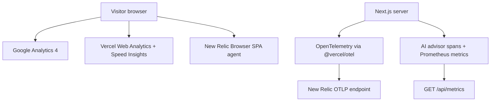

# Cloud Observability & Telemetry Guide

**Stack:** Next.js 16 (App Router) · Vercel Web Analytics · Vercel Speed Insights · Google Analytics 4 · New Relic Browser (SPA) · OpenTelemetry (`@vercel/otel`) · Prometheus exposition

This document describes the observability paths that exist in the current source. A local HTTP check is evidence of local behavior only; it is not evidence that the Vercel deployment or a New Relic account is configured.

## 1. Runtime topology



## 2. Browser analytics and monitoring

- Google Analytics is mounted by [`site/components/analytics/GoogleAnalytics.tsx`](./site/components/analytics/GoogleAnalytics.tsx) from [`site/app/layout.tsx`](./site/app/layout.tsx).
- Vercel Web Analytics and Speed Insights are mounted by [`site/components/site/SiteAnalytics.tsx`](./site/components/site/SiteAnalytics.tsx).
- New Relic Browser is mounted by [`site/components/analytics/NewRelicScript.tsx`](./site/components/analytics/NewRelicScript.tsx). It loads the same-origin [`/newrelic.js`](./site/app/newrelic.js/route.ts), which substitutes the browser ingest key at request time; no key is committed in the template.
- The vendored agent template is [`site/lib/analytics/newrelic-agent.template.js`](./site/lib/analytics/newrelic-agent.template.js). Its AJAX deny list contains only `bam.nr-data.net`, so application hosts remain observable. `capture_payloads: 'none'` and `mask_all_inputs: true` are intentional privacy controls: timing and error metadata are collected, but request/response payloads, headers, and form values are not.
- CSP keeps the per-request nonce architecture. The only New Relic additions are `https://js-agent.newrelic.com` in `script-src` and `https://bam.nr-data.net` plus `https://*.nr-data.net` in `connect-src`. Do not add `unsafe-inline`, broaden `unsafe-eval`, or add a wildcard.

## 3. Server OpenTelemetry and AI advisor

- [`site/instrumentation.ts`](./site/instrumentation.ts) calls `registerOTel({ serviceName })` and registers the AI SDK OpenTelemetry provider.
- Configure the exporter with `OTEL_EXPORTER_OTLP_ENDPOINT=https://otlp.nr-data.net:4318` and `OTEL_EXPORTER_OTLP_HEADERS=api-key=<ingest-license-key>` in the local/Vercel environment. The ingest license key is server-only; never put it in browser code or documentation.
- [`site/lib/observability/aiMetrics.ts`](./site/lib/observability/aiMetrics.ts) wraps advisor requests, records Prometheus counters/histograms, and creates the privacy-safe `oando.ai_advisor.request` span. The wrapper records provider/fallback/outcome metadata only; it does not record prompts, responses, payloads, or headers.
- [`site/app/api/Planner/ai-advisor/route.ts`](./site/app/api/Planner/ai-advisor/route.ts) applies the wrapper to both streaming and non-streaming advisor paths.

## 4. Prometheus endpoint

[`site/app/api/metrics/route.ts`](./site/app/api/metrics/route.ts) serves Prometheus exposition from `GET /api/metrics` (Next may redirect to the trailing-slash form). Locally it returns `text/plain; version=0.0.4` when the route is available.

Production safety is deliberate:

1. Without `OBSERVABILITY_METRICS_ENABLED=1`, production returns `404`.
2. When enabled, `METRICS_AUTH_TOKEN` is required; requests must use `Authorization: Bearer <token>` or receive `401`.
3. A production configuration with the flag enabled but no token returns `503`; it is never intentionally unauthenticated.

## 5. Environment checklist

Keep real values only in `.env.local`, `site/.env.local`, or the corresponding Vercel environment settings. The committed examples remain blank for secrets.

```ini
# Browser ingest (public to the browser agent by design; still supplied at runtime)
NEW_RELIC_BROWSER_KEY=

# Server OTLP ingest (server-only license key)
OTEL_SERVICE_NAME=ai-planner-backend
OTEL_EXPORTER_OTLP_ENDPOINT=https://otlp.nr-data.net:4318
OTEL_EXPORTER_OTLP_HEADERS=api-key=<ingest-license-key>

# Production metrics gate
OBSERVABILITY_METRICS_ENABLED=0
METRICS_AUTH_TOKEN=
```

## 6. Evidence status

Fresh local checks on 2026-09-06 observed:

- `/` → `200 text/html; charset=utf-8`.
- `/newrelic.js` → `200 application/javascript; charset=utf-8`; the placeholder is replaced, the configured deny list/payload/masking settings are present, and no key value is recorded here.
- `/api/metrics/` → `200 text/plain; version=0.0.4; charset=utf-8`.
- The full six-viewport browser matrix, console/CSP capture, production Vercel environment, and New Relic account data visibility were not re-run in this documentation update. Vercel CLI authentication was previously unavailable, so production configuration remains unverified. No deploy or external account change was made.
