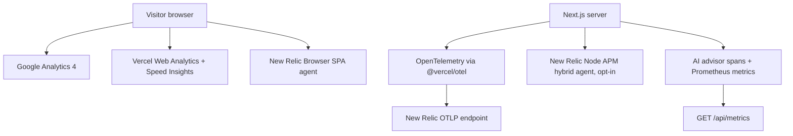

# Cloud Observability & Telemetry Guide

**Stack:** Next.js 16 (App Router) · Vercel Web Analytics · Vercel Speed Insights · Google Analytics 4 · New Relic Browser (SPA) · New Relic Node APM hybrid agent · OpenTelemetry (`@vercel/otel`) · Prometheus exposition

This document describes the observability paths that exist in the current source. A local HTTP check is evidence of local behavior only; it is not evidence that the Vercel deployment or a New Relic account is configured.

## 1. Runtime topology



## 2. Browser analytics and monitoring

- Google Analytics is mounted by [`site/components/analytics/GoogleAnalytics.tsx`](./site/components/analytics/GoogleAnalytics.tsx) from [`site/app/layout.tsx`](./site/app/layout.tsx).
- Vercel Web Analytics and Speed Insights are mounted by [`site/components/site/SiteAnalytics.tsx`](./site/components/site/SiteAnalytics.tsx).
- New Relic Browser is mounted by [`site/components/analytics/NewRelicScript.tsx`](./site/components/analytics/NewRelicScript.tsx). It loads the same-origin [`/newrelic.js`](./site/app/newrelic.js/route.ts), which substitutes the browser ingest key at request time; no key is committed in the template.
- The vendored agent template is [`site/lib/analytics/newrelic-agent.template.js`](./site/lib/analytics/newrelic-agent.template.js). Its AJAX deny list contains only `bam.nr-data.net`, so application hosts remain observable. `capture_payloads: 'none'` and `mask_all_inputs: true` are intentional privacy controls: timing and error metadata are collected, but request/response payloads, headers, and form values are not.
  > **Lint Suppression Note:** This vendored minified file is explicitly suppressed from oxlint in `.oxlintrc.json` (to prevent minification techniques from triggering `no-unused-expressions` and `eqeqeq`). Authorized by user override. (Agent: Antigravity | Time: 2026-09-06T21:59:03+05:30 | Session ID: b3ee4e9d-1db7-457a-8d6f-a5dc7005a464)
- CSP keeps the per-request nonce architecture. The only New Relic additions are `https://js-agent.newrelic.com` in `script-src` and `https://bam.nr-data.net` plus `https://*.nr-data.net` in `connect-src`. Do not add `unsafe-inline`, broaden `unsafe-eval`, or add a wildcard.

## 3. Server OpenTelemetry and AI advisor

- [`site/instrumentation.ts`](./site/instrumentation.ts) calls `registerOTel({ serviceName })` and registers the AI SDK OpenTelemetry provider.
- [`config/observability/newrelic.cjs`](./config/observability/newrelic.cjs) configures the New Relic Node APM hybrid agent. It is loaded only when `NEW_RELIC_APM_ENABLED=1` and `NEXT_RUNTIME=nodejs`; Next's native OTel spans remain the source of truth while the agent bridges them to APM.
- The hybrid configuration disables the agent's `http`, `next`, and `undici` instrumentations to prevent duplicate Next/fetch spans. It excludes request/response headers and request parameters and disables agent log forwarding; the server license key remains server-only.
- Direct OTLP exporter variables (`OTEL_EXPORTER_OTLP_ENDPOINT`, etc.) are not used in this architecture. The New Relic Node APM agent intercepts the native OTel spans via its internal bridge and sends them attached to the APM Application entity.
- [`site/lib/observability/aiMetrics.ts`](./site/lib/observability/aiMetrics.ts) wraps advisor requests, records Prometheus counters/histograms, and creates the privacy-safe `oando.ai_advisor.request` span. The wrapper records provider/fallback/outcome metadata only; it does not record prompts, responses, payloads, or headers.
- [`site/app/api/Planner/ai-advisor/route.ts`](./site/app/api/Planner/ai-advisor/route.ts) applies the wrapper to both streaming and non-streaming advisor paths.

## 4. Prometheus endpoint

[`site/app/api/metrics/route.ts`](./site/app/api/metrics/route.ts) serves Prometheus exposition from `GET /api/metrics` (Next may redirect to the trailing-slash form). Locally it returns `text/plain; version=0.0.4` when the route is available.

Production safety is deliberate:

1. Without `OBSERVABILITY_METRICS_ENABLED=1`, production returns `404`.
2. When enabled, `METRICS_AUTH_TOKEN` is required; requests must use `Authorization: Bearer <token>` or receive `401`.
3. A production configuration with the flag enabled but no token returns `503`; it is never intentionally unauthenticated.

## 5. Environment checklist

Keep real values only in `.env.local`, `site/.env.local`, or the corresponding Vercel environment settings. The committed examples remain blank for secrets.

```ini
# Browser ingest (public to the browser agent by design; still supplied at runtime)
NEW_RELIC_BROWSER_KEY=

# Server OTLP ingest (Not used; New Relic APM agent bridges native OTel spans)
OTEL_SERVICE_NAME=oando-web

# Optional New Relic Node APM hybrid bridge (server-only)
NEW_RELIC_APM_ENABLED=0
NEW_RELIC_APP_NAME=oando-web
NEW_RELIC_LICENSE_KEY=

# Production metrics gate
OBSERVABILITY_METRICS_ENABLED=0
METRICS_AUTH_TOKEN=
```

## 6. Evidence status

Fresh local checks on 2026-09-06 observed:

- `/` → `200 text/html; charset=utf-8`.
- `/newrelic.js` → `200 application/javascript; charset=utf-8`; the placeholder is replaced, the configured deny list/payload/masking settings are present, and no key value is recorded here.
- `/api/metrics/` → `200 text/plain; version=0.0.4; charset=utf-8`.
- The full six-viewport browser matrix, console/CSP capture, production Vercel environment, and New Relic account data visibility were not re-run in this documentation update. The Node APM bridge is opt-in and was not enabled in this local check. Vercel CLI authentication was previously unavailable, so production configuration remains unverified. No deploy or external account change was made.

- **2026-09-06 New Relic APM live-verification update:** `NEW_RELIC_APM_ENABLED=1`, `NEW_RELIC_LICENSE_KEY`, and `NEW_RELIC_APP_NAME=oando-web` were set in the Vercel production/preview environment. The `oando-web` APM entity is confirmed live in the New Relic account (real transactions, response time, throughput, Apdex, and error rate reporting). Recommended alert conditions (Response time, Throughput, Error rate) were added under the "oando-web APM alerts" policy, one issue per condition. Notification destinations were not configured in this pass.
- **OTel bridging note:** `site/instrumentation.ts` intentionally keeps `registerOTel({ serviceName: "oando-web" })` matching `NEW_RELIC_APP_NAME`, per section 3: the New Relic Node APM agent's internal OTel bridge (`opentelemetry.enabled: true` in `config/observability/newrelic.cjs`) is the mechanism that unifies native Next.js OTel spans into the single `oando-web` APM entity. A separate `oando-web` entity briefly appeared under Services - OpenTelemetry in the New Relic UI before the agent finished connecting; this was a transient startup-timing artifact, not a naming conflict, and resolved once the agent connected. Do not rename the OTel `serviceName` away from the APM app name, as that would defeat the bridge and permanently split the entity.

- **2026-09-06 Dashboard configuration:** Created the "oando-web Observability" custom dashboard (New Relic > Dashboards) with 6 NRQL widgets scoped to `appName LIKE '%oando%'`: (1) Average transaction duration (response time) timeseries, (2) Throughput (`rate(count(*), 1 minute)`) timeseries, (3) Error percentage timeseries, (4) Apdex score (t=0.5s) timeseries, (5) Top transactions table faceted by `name`, and (6) Browser PageView count by `appName` (last 1 day). Default view range set to 24 hours. This dashboard is in addition to the built-in APM Summary view and the "oando-web APM alerts" policy documented above.
