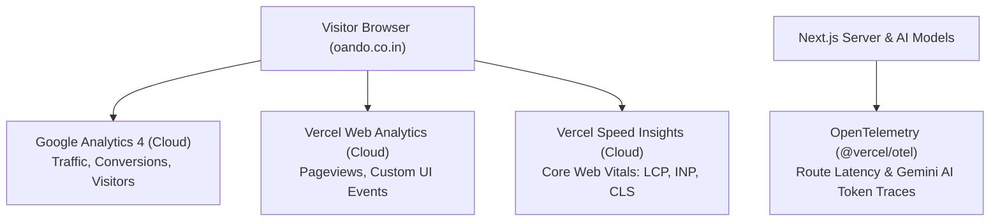

# Cloud Observability & Telemetry Guide

**Stack:** Next.js 16 (App Router) · Vercel Web Analytics · Vercel Speed Insights · Google Analytics 4 (GA4) · OpenTelemetry (`@vercel/otel`)

---

## 1. Cloud-First, Zero-Maintenance Architecture

Oando uses a **100% cloud-managed observability architecture**. 

You do **not** need to run Docker containers, install host daemons, or manage local Prometheus/Grafana databases. All monitoring is handled automatically in the cloud across three lightweight layers:



---

## 2. Active Cloud Monitoring Layers

### A. Google Analytics 4 (Business & Traffic)
- **Component:** [`site/components/analytics/GoogleAnalytics.tsx`](file:///D:/23082026/site/components/analytics/GoogleAnalytics.tsx) mounted in [`site/app/layout.tsx`](file:///D:/23082026/site/app/layout.tsx).
- **Measurement ID:** `G-CTPK6318CR` (set via `NEXT_PUBLIC_GA_MEASUREMENT_ID`).
- **What It Tracks:** Visitor traffic, geographic locations, referral sources, marketing attribution, and conversion funnels.
- **Where to View:** [analytics.google.com](https://analytics.google.com).

### B. Vercel Web Analytics & Speed Insights (Real-User Performance)
- **Component:** [`site/components/site/SiteAnalytics.tsx`](file:///D:/23082026/site/components/site/SiteAnalytics.tsx) mounted in marketing layouts.
- **Packages:** [`@vercel/analytics`](file:///D:/23082026/package.json#L123) and [`@vercel/speed-insights`](file:///D:/23082026/package.json#L125).
- **What It Tracks:**
  - Real-world Core Web Vitals: Largest Contentful Paint (LCP), Interaction to Next Paint (INP), and Cumulative Layout Shift (CLS).
  - Custom UI interaction events via [`site/lib/analytics/emitTransport.ts`](file:///D:/23082026/site/lib/analytics/emitTransport.ts) (consent-gated).
- **Where to View:** Your Vercel Project Dashboard under the **Analytics** and **Speed Insights** tabs. Zero server setup required.

### C. Backend OpenTelemetry (`@vercel/otel`)
- **Initialization:** Automatically started by Next.js via [`site/instrumentation.ts`](file:///D:/23082026/site/instrumentation.ts).
- **What It Tracks:** Server-side request execution times, Supabase database query durations, and Google Gemini / Mastra AI model latency.
- **Where to View:** Vercel deployment logs and server traces.

---

## 3. What is NOT Needed (No Local Complexity)

- **No Docker Required:** You do **not** need Docker, Prometheus, or Grafana running on your computer to develop, test, or deploy.
- **No Third-Party Vendor SDKs:** There is **no New Relic, Datadog, Sentry, or PostHog** installed. You don't have to manage third-party license keys or paid monitoring tiers.
- **No Heavy Client Agents:** Everything runs via native, lightweight Next.js and Google tags that do not degrade browser performance.

---

## 4. Environment Variables Checklist

For your cloud observability, you only need this single public key:

```ini
# Google Analytics 4
NEXT_PUBLIC_GA_MEASUREMENT_ID=G-CTPK6318CR
```

Vercel Analytics and Speed Insights configure themselves automatically when deployed to Vercel.
