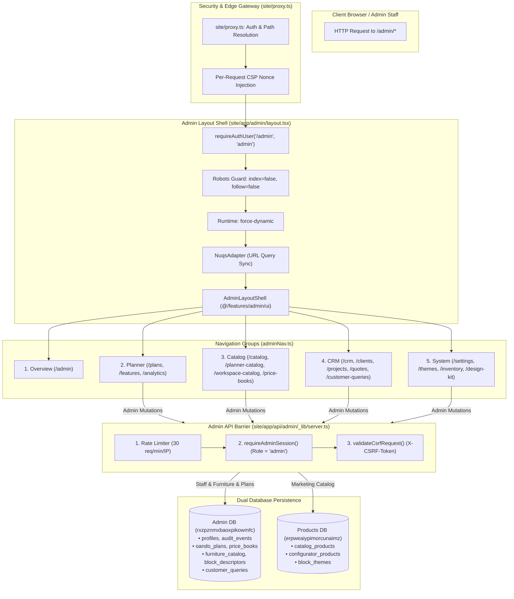

# Admin Portal Architecture & Control Plane Audit

**Target System:** Oando Administrative Control Plane (`site/app/admin/`, `site/features/admin/`, `site/app/api/admin/`)  
**Audit Scope:** Full architectural inventory, route graph, feature modules, authentication guards, mutation barriers, dual-database routing, and test verification suite.  
**Repository State:** Read-Only (`d:/23082026`) — Non-destructive inspection.

---

## 1. Executive Summary

The Oando Admin Portal ([`site/app/admin/`](file:///d:/23082026/site/app/admin)) constitutes the unified administrative control plane for operations, catalog merchandising, space planning governance, pricing, customer inquiry triage, and system diagnostics. It provides staff with high-density, accessible, FOCSS-native management surfaces while enforcing strict zero-trust boundaries between public client traffic, member sessions, and administrative mutations.



---

## 2. Route Inventory & Navigation Hierarchy

The control plane divides its capabilities across 5 functional groups defined in [`site/features/admin/ui/adminNav.ts`](file:///d:/23082026/site/features/admin/ui/adminNav.ts) and mounted in [`site/features/admin/ui/AdminLayoutShell.tsx`](file:///d:/23082026/site/features/admin/ui/AdminLayoutShell.tsx):

| Group | Route | Label | Target File | Primary Component | Primary Store / Data Source |
| :--- | :--- | :--- | :--- | :--- | :--- |
| **Overview** | `/admin` | **Dashboard** | [`site/app/admin/page.tsx`](file:///d:/23082026/site/app/admin/page.tsx) | `AdminDashboardView` | Admin DB (`audit_events`, `customer_queries`) |
| **Planner** | `/admin/plans` | **Plans** | [`site/app/admin/plans/page.tsx`](file:///d:/23082026/site/app/admin/plans/page.tsx) | `AdminPlansView` | Admin DB (`oando_plans` / disk dev mode) |
| **Planner** | `/admin/features` | **Features** | [`site/app/admin/features/page.tsx`](file:///d:/23082026/site/app/admin/features/page.tsx) | `AdminFeatureFlagsView` | Feature flag registry / Admin DB (`feature_flags`) |
| **Planner** | `/admin/analytics` | **Analytics** | [`site/app/admin/analytics/page.tsx`](file:///d:/23082026/site/app/admin/analytics/page.tsx) | `AdminAnalyticsView` | Prometheus metrics & analytics aggregation |
| **Catalog** | `/admin/catalog` | **Products** | [`site/app/admin/catalog/page.tsx`](file:///d:/23082026/site/app/admin/catalog/page.tsx) | `AdminCatalogView` | Products DB (`catalog_products`, `catalog_categories`) |
| **Catalog** | `/admin/planner-catalog` | **Configurator** | [`site/app/admin/planner-catalog/page.tsx`](file:///d:/23082026/site/app/admin/planner-catalog/page.tsx) | `AdminPlannerCatalogView` | Admin DB (`block_descriptors`, `furniture_catalog`) |
| **Catalog** | `/admin/workspace-catalog`| **Library** | [`site/app/admin/workspace-catalog/page.tsx`](file:///d:/23082026/site/app/admin/workspace-catalog/page.tsx) | `AdminWorkspaceCatalogView` | Products DB (`configurator_products`) |
| **Catalog** | `/oostudio` | **Furniture Studio** | [`site/app/oostudio/page.tsx`](file:///d:/23082026/site/app/oostudio/page.tsx) | `StudioCanvasRoot` | Studio Fork Tree (`site/components/Studio/`) |
| **Catalog** | `/admin/price-books` | **Prices** | [`site/app/admin/price-books/page.tsx`](file:///d:/23082026/site/app/admin/price-books/page.tsx) | `AdminPriceBooksView` | Admin DB (`price_books`, `price_book_tiers`) |
| **CRM** | `/admin/crm` | **Hub** | [`site/app/admin/crm/page.tsx`](file:///d:/23082026/site/app/admin/crm/page.tsx) | `CrmHubView` | CRM Browser demo store / Admin DB |
| **CRM** | `/admin/crm/clients` | **Clients** | [`site/app/admin/crm/clients/page.tsx`](file:///d:/23082026/site/app/admin/crm/clients/page.tsx) | `CrmClientsView` | CRM Browser demo / client registry |
| **CRM** | `/admin/crm/projects` | **Projects** | [`site/app/admin/crm/projects/page.tsx`](file:///d:/23082026/site/app/admin/crm/projects/page.tsx) | `CrmProjectsView` | CRM deals, linked planner projects |
| **CRM** | `/admin/crm/quotes` | **Quotes** | [`site/app/admin/crm/quotes/page.tsx`](file:///d:/23082026/site/app/admin/crm/quotes/page.tsx) | `CrmQuotesView` | Bill of Quantities (BOQ) drafts & quotes |
| **CRM** | `/admin/customer-queries` | **Queries** | [`site/app/admin/customer-queries/page.tsx`](file:///d:/23082026/site/app/admin/customer-queries/page.tsx) | `CustomerQueriesOpsPageView` | Admin DB (`customer_queries`) |
| **System** | `/admin/settings` | **Settings** | [`site/app/admin/settings/page.tsx`](file:///d:/23082026/site/app/admin/settings/page.tsx) | `AdminSettingsView` | App configuration, canvas bounds, flags |
| **System** | `/admin/themes` | **Themes** | [`site/app/admin/themes/page.tsx`](file:///d:/23082026/site/app/admin/themes/page.tsx) | `AdminThemesView` | Products DB (`block_themes`) |
| **System** | `/admin/inventory` | **Routes** | [`site/app/admin/inventory/page.tsx`](file:///d:/23082026/site/app/admin/inventory/page.tsx) | `AdminInventoryView` | Monorepo route and API manifest |
| **System** | `/admin/design-kit` | **Design Kit** | [`site/app/admin/design-kit/page.tsx`](file:///d:/23082026/site/app/admin/design-kit/page.tsx) | `AdminDesignKitView` | FOCSS living visual contract (`@focss/*`) |
| **External** | `http://localhost:3001` | **Tech Docs** | `tech-docs-generator/` | Astro Tech Docs SPA | Markdown docs + live repository symbols |

---

## 3. Subsystems & Feature Implementations

The administrative business logic is encapsulated in [`site/features/admin/`](file:///d:/23082026/site/features/admin/):

### 3.1 Catalog & Product Configurator
* **Managed Products (`features/admin/catalog/`):** Manages editable marketing catalog items (`catalog_products`), categorized across Workstations, Seating, Storage, and Collaborative furniture.
* **Parametric Block Descriptors (`features/admin/workspace-config/`):** Authors parametric and discrete block definitions (`block_descriptors`) consumed by the 2D canvas in Planner. Enforces snap geometry, connector vectors, and clearance bounds.
* **Static Workspace Library (`features/admin/workspace-catalog/`):** Maintains read-only foundational structural components (architectural walls, columns, doors, glass partitions).

### 3.2 Enterprise Pricing & BOQ Engine (`features/admin/pricing/`)
* **Price Books Lifecycle:** Implements a strict `draft` $\rightarrow$ `active` $\rightarrow$ `archived` state machine.
* **Volume Tiers:** Supports bracketed volume discounting (1–10 units, 11–50 units, 50+ units).
* **Currency & Region:** Multi-currency support (INR `₹`, USD `$`, EUR `€`) with automatic BOQ export formatting for customer proposals.

### 3.3 Customer Queries Ops Queue (`site/app/admin/customer-queries/`)
* **Inbound Triage:** Consumes contact form and quote inquiry submissions stored in `public.customer_queries` in the Admin DB.
* **Status Automation:** State transitions: `pending` $\rightarrow$ `in_review` $\rightarrow$ `resolved` $\rightarrow$ `archived`.
* **Security Isolation:** Provides both session-authenticated staff triage and token-authenticated headless polling via `CUSTOMER_QUERIES_ADMIN_TOKEN`.

### 3.4 Living Design Kit (`site/app/admin/design-kit/`)
* **FOCSS Visual Contract:** Renders live previews of CSS design tokens (`@focss/admin`), color semantic tokens, typography scales, touch target benchmarks (44px min), and focus ring contrast ratios.
* **Zero Shadcn / Radix:** Adheres to Phase 13 FOCSS-native architecture. All controls are native HTML / React Aria with zero Radix or Shadcn registry overhead.

---

## 4. Security & Access Control Floor

The admin surface enforces a defense-in-depth security model across the entire HTTP lifecycle:

### 4.1 Page-Level Protection (`site/app/admin/layout.tsx`)
1. **`requireAuthUser("/admin", "admin")`:** Server-side layout authentication guard:
   * Inspects Supabase Auth JWT cookie.
   * Confirms `user.role === 'admin'` or email presence in `ADMIN_EMAILS`.
   * Unauthenticated or non-admin requests trigger an immediate redirect to `/auth/login?redirect=/admin`.
2. **`robots: { index: false, follow: false }`:** Emits HTTP header and meta tag `noindex, nofollow` to prevent search engine indexing of administrative routes.
3. **`export const dynamic = "force-dynamic"`:** Prevents Next.js build-time static page pre-rendering, ensuring no admin data or layout skeletons are baked into static CDN caches.
4. **Local Dev Bypass (`DEV_AUTH_BYPASS=1`):** In local development (`NODE_ENV !== "production"`), allows instantaneous developer access without active email verification loops. The bypass is hard-coded to throw in production environments.

### 4.2 API Mutation Barrier (`site/app/api/admin/_lib/server.ts`)
All administrative mutating endpoints (`POST`, `PUT`, `PATCH`, `DELETE`) pass through `enforceAdminMutationGuard(req, scope, limit)`:

```typescript
export async function enforceAdminMutationGuard(
  req: NextRequest,
  scope: string,
  limit = 30,
): Promise<AdminMutationGuardResult>
```

The guard executes three sequential security checks:
1. **Sliding Window Rate Limiting:** Limits requests to 30 requests/minute per client IP (`admin:${scope}:${ip}`) via [`site/lib/rateLimit.ts`](file:///d:/23082026/site/lib/rateLimit.ts). Returns HTTP `429 Too Many Requests` on breach.
2. **Admin Role Context Validation:** Calls `resolveAuthContext("admin")`. Verifies the caller is an authenticated staff member. Returns HTTP `401 Unauthorized` or `403 Forbidden`.
3. **CSRF Token Validation:** Validates `X-CSRF-Token` header against the encrypted CSRF cookie via [`site/lib/security/csrf.ts`](file:///d:/23082026/site/lib/security/csrf.ts). If the token is missing or invalid, returns HTTP `403 Forbidden` with header `X-CSRF-Rejected: 1`.

---

## 5. Dual-Database Persistence Contract

Administrative actions follow strict database isolation:

| Administrative Action | Target Database | Schema / Table | Persistence Wrapper |
| :--- | :--- | :--- | :--- |
| **Price Book Activation** | **Admin DB** (`rxzpznmxbaoxpikowmfc`) | `public.price_books` | Drizzle ORM (`adminDb`) |
| **Catalog SKU Publishing** | **Products DB** (`erpweaiypimorcunaimz`) | `public.catalog_products` | Drizzle ORM (`productsDb`) |
| **Block Descriptor Edit** | **Admin DB** (`rxzpznmxbaoxpikowmfc`) | `public.block_descriptors` | `writeBlockDescriptor()` mode wrapper |
| **Furniture Catalog Upload**| **Admin DB** (`rxzpznmxbaoxpikowmfc`) | `public.furniture_catalog` | `writeFurnitureItem()` mode wrapper |
| **Inquiry Resolution** | **Admin DB** (`rxzpznmxbaoxpikowmfc`) | `public.customer_queries` | `createSupabaseAuthAdminClient()` |
| **Audit Trail Emission** | **Admin DB** (`rxzpznmxbaoxpikowmfc`) | `public.audit_events` | `logAuditEvent()` |

> [!CAUTION]
> **Production Read-Only Filesystem (`EROFS`):** When `DEV_AUTH_BYPASS=1` is disabled in production, disk writes will throw `EROFS`. All admin mutations must use mode-aware wrappers rather than raw `fs` helpers.

---

## 6. Verification & Test Suite Matrix

Admin portal reliability and access barriers are continuously enforced by both unit and end-to-end test lanes:

| Test Scope | File Path | Type | What It Verifies |
| :--- | :--- | :--- | :--- |
| **API Auth & Rate Limit** | [`tests/unit/app/api/admin/_lib/server.test.ts`](file:///d:/23082026/tests/unit/app/api/admin/_lib/server.test.ts) | Vitest Unit | Rate limit counters, 401 unauthenticated, 403 CSRF rejection headers. |
| **API Boundary Verification**| [`tests/unit/scripts/check-admin-api-auth.test.ts`](file:///d:/23082026/tests/unit/scripts/check-admin-api-auth.test.ts) | Vitest Unit | Validates that every file in `site/app/api/admin/` imports and applies the admin auth guard. |
| **Customer Queries Triage** | [`tests/integration/features/ops/CustomerQueriesOpsPageView.test.tsx`](file:///d:/23082026/tests/integration/features/ops/CustomerQueriesOpsPageView.test.tsx) | Vitest Integration | Query list rendering, status badges, resolution buttons, pagination. |
| **Workspace Config Envelopes**| [`tests/unit/features/admin/workspace-config/workspaceConfigurationEnvelope.test.ts`](file:///d:/23082026/tests/unit/features/admin/workspace-config/workspaceConfigurationEnvelope.test.ts) | Vitest Unit | Validates schema validation, JSON encoding, and parametric tolerances. |
| **E2E Smoke Suite** | [`tests/e2e/admin-smoke.spec.ts`](file:///d:/23082026/tests/e2e/admin-smoke.spec.ts) | Playwright E2E | Verifies `/admin` loads under `DEV_AUTH_BYPASS=1`, tabs navigate cleanly, and no console errors occur. |

---

## 7. Operational Findings & Recommendations

1. **Finding ADM-01 — Navigation Depth Consistency:**
   * *Status:* Healthy.
   * *Detail:* Navigation grouping in [`adminNav.ts`](file:///d:/23082026/site/features/admin/ui/adminNav.ts) uses a clean 5-group architecture (`Overview`, `Planner`, `Catalog`, `CRM`, `System`) with active path resolution that prevents multiple tabs highlighting simultaneously.
2. **Finding ADM-02 — Zero Radix / Shadcn Footprint:**
   * *Status:* Verified.
   * *Detail:* Admin shell is 100% FOCSS-native (`@focss/admin/entry.css`) with native React Aria primitives.
3. **Finding ADM-03 — Mutation Guard Uniformity:**
   * *Status:* Enforced.
   * *Detail:* `scripts/check-admin-api-auth.mjs` runs in CI (`pnpm run gate:fast`) to ratify that no unauthenticated route handlers exist under `site/app/api/admin/`.
