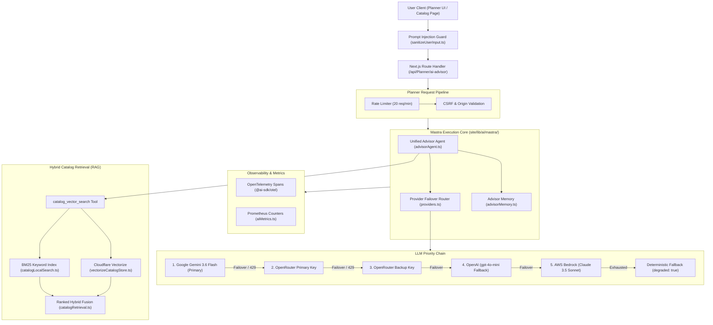

# AI Advisor & Machine Learning Subsystem Audit

**Target Subsystem:** Oando AI Advisor, Mastra Engine, Vector RAG Pipeline, and Multi-Provider LLM Chain (`site/lib/ai/`, `site/app/api/Planner/ai-advisor/`, `site/app/api/ai-advisor/`)  
**Audit Scope:** Module architecture, provider failover hierarchy, semantic vector store, catalog chunking, prompt injection mitigations, and test coverage.  
**Repository State:** Read-Only (`d:/23082026`) — Non-destructive verification.

---

## 1. Executive Summary

The Oando AI Advisor provides contextual design suggestions, workspace ergonomics recommendations, spatial density calculations, and catalog discovery without ever mutating plan state directly. The subsystem is built on **Mastra Core (`@mastra/core`)** paired with the **Vercel AI SDK**, featuring an automated 5-stage LLM failover chain, hybrid semantic retrieval over Cloudflare Vectorize, in-memory conversation memory, and end-to-end OpenTelemetry instrumentation.



---

## 2. Module Inventory & File Map

The subsystem lives under [`site/lib/ai/`](file:///d:/23082026/site/lib/ai/) and [`site/app/api/`](file:///d:/23082026/site/app/api/):

| File Path | Role | Key Exports / Types | Server-Only? |
| :--- | :--- | :--- | :---: |
| [`site/lib/ai/sanitizeUserInput.ts`](file:///d:/23082026/site/lib/ai/sanitizeUserInput.ts) | Prompt injection defense barrier. | `sanitizeUserInput(input, maxLen)` | No (Client Safe) |
| [`site/lib/ai/mastra/index.ts`](file:///d:/23082026/site/lib/ai/mastra/index.ts) | Subsystem entrypoint & `Mastra` dev instance. | `mastra`, `createAdvisorAgent`, `getAdvisorAgent` | Yes |
| [`site/lib/ai/mastra/advisorAgent.ts`](file:///d:/23082026/site/lib/ai/mastra/advisorAgent.ts) | Unified agent factory (`workspace` & `catalog` roles). | `getAdvisorAgent`, `createAdvisorAgent`, `AdvisorRole` | Yes |
| [`site/lib/ai/mastra/advisorMemory.ts`](file:///d:/23082026/site/lib/ai/mastra/advisorMemory.ts) | Request-scoped in-memory conversation glue. | `getAdvisorMemory()` | Yes |
| [`site/lib/ai/mastra/providers.ts`](file:///d:/23082026/site/lib/ai/mastra/providers.ts) | Provider allowlist, target builders, failover chain. | `resolveAdvisorModelChain`, `APPROVED_PROVIDER_MODELS` | Yes |
| [`site/lib/ai/mastra/requestAdvisorText.ts`](file:///d:/23082026/site/lib/ai/mastra/requestAdvisorText.ts)| Execution loop, token streaming, retry handler. | `requestAdvisorText`, `requestAdvisorMessages` | Yes |
| [`site/lib/ai/mastra/catalogRag.ts`](file:///d:/23082026/site/lib/ai/mastra/catalogRag.ts) | Vector chunking, batch embedding, RAG query tool. | `createCatalogVectorQueryTool`, `searchCatalogVectors` | Yes |
| [`site/lib/ai/mastra/catalogRetrieval.ts`](file:///d:/23082026/site/lib/ai/mastra/catalogRetrieval.ts)| Hybrid fusion combining vector and lexical hits. | `retrieveCatalogProducts`, `CatalogRetrievalResult` | Yes |
| [`site/lib/ai/mastra/catalogLocalSearch.ts`](file:///d:/23082026/site/lib/ai/mastra/catalogLocalSearch.ts)| In-memory BM25 lexical token index. | `createCatalogSearchIndex`, `searchCatalogDocuments` | Yes |
| [`site/lib/ai/mastra/embedder.ts`](file:///d:/23082026/site/lib/ai/mastra/embedder.ts) | Embedder model resolution (`768`-dimension). | `resolveEmbedderModel`, `resolveMastraEmbeddingModel` | Yes |
| [`site/lib/ai/mastra/vectorizeCatalogStore.ts`](file:///d:/23082026/site/lib/ai/mastra/vectorizeCatalogStore.ts)| Cloudflare Vectorize HTTP REST vector store. | `getCatalogVectorStore`, `CATALOG_VECTOR_INDEX_NAME` | Yes |
| [`site/lib/ai/mastra/plannerAdvisorClient.ts`](file:///d:/23082026/site/lib/ai/mastra/plannerAdvisorClient.ts)| Browser-safe client for calling `/api/Planner/ai-advisor`. | `callPlannerAdvisor`, `PLANNER_ADVISOR_API_PATH` | No (Browser Safe) |
| [`site/lib/ai/mastra/client.ts`](file:///d:/23082026/site/lib/ai/mastra/client.ts) | Re-export facade for browser client types. | Client types & error wrappers | No (Browser Safe) |
| [`site/app/api/Planner/ai-advisor/route.ts`](file:///d:/23082026/site/app/api/Planner/ai-advisor/route.ts)| Planner space planning advisor endpoint. | `POST`, `OPTIONS` (ndjson streaming & JSON) | Yes |
| [`site/app/api/ai-advisor/route.ts`](file:///d:/23082026/site/app/api/ai-advisor/route.ts) | Marketing catalog advisor endpoint. | `POST`, `OPTIONS` | Yes |

---

## 3. LLM Provider Hierarchy & Automated Failover

The provider chain in [`site/lib/ai/mastra/providers.ts`](file:///d:/23082026/site/lib/ai/mastra/providers.ts) strictly enforces the `APPROVED_PROVIDER_MODELS` allowlist:

| Priority | Provider | Target Model | API Endpoint | Credentials Source | Failure Trigger |
| :---: | :--- | :--- | :--- | :--- | :--- |
| **1** | **Google Gemini** | `gemini-3.6-flash` | `https://generativelanguage.googleapis.com/v1beta/openai/` | `GEMINI_API_KEY` / `GOOGLE_API_KEY` | HTTP 429, 404, or 10s timeout |
| **2** | **OpenRouter Primary** | `openrouter/free` (or configured) | `https://openrouter.ai/api/v1` | `OPENROUTER_API_KEY_PRIMARY` | Upstream rate limit / auth fail |
| **3** | **OpenRouter Backup** | `openrouter/free` | `https://openrouter.ai/api/v1` | `OPENROUTER_API_KEY_BACKUP` | Quota exhaustion |
| **4** | **OpenAI** | `gpt-4o-mini` | `https://api.openai.com/v1` | `OPENAI_API_KEY` | Balance / rate limit |
| **5** | **Amazon Bedrock** | `anthropic.claude-3-5-sonnet` | AWS Bedrock SDK Runtime | `AWS_ACCESS_KEY_ID` + `AWS_SECRET_ACCESS_KEY` | Network or AWS credential error |
| **Final** | **Degraded Fallback** | *Deterministic rule engine* | In-process | None (Hardcoded domain advice) | All network providers exhausted |

### Deterministic Degradation Contract
When every provider fails or no API keys are present, the advisor **fails open safely**:
```typescript
{
  success: true,
  data: {
    content: "I am having trouble connecting to my knowledge base right now. For workspace planning assistance, ensure standard desk clearance of 900mm to 1200mm between opposing workstations and 1500mm for main circulation paths.",
    degraded: true
  },
  correlationId: "corr-..."
}
```

---

## 4. Semantic Catalog RAG Pipeline

### 4.1 Embedding Specification
* **Model:** `google/gemini-embedding-001` (primary) or `openai/text-embedding-3-small` (fallback).
* **Vector Dimension:** `768` floats.
* **Batch Size:** `EMBEDDING_BATCH_SIZE = 20` (prevents upstream payload limits).
* **Description Budget:** `EMBEDDING_DESCRIPTION_MAX_CHARS = 300` characters per product.

### 4.2 Chunk Composition (`catalogRag.ts`)
Each embedded catalog vector document combines:
1. Product Title and SKU code
2. Category name and navigation hierarchy
3. Key ergonomic features and dimensional tags
4. Normalized description (truncated to 300 chars to maximize semantic density)

### 4.3 Hybrid Retrieval Fusion (`catalogRetrieval.ts`)
The catalog query tool executes hybrid search:
1. **Dense Vector Recall:** Vector search over Cloudflare Vectorize (`oando-catalog-vector`) using cosine similarity ($topK = 8$).
2. **Lexical BM25 Search:** Tokenized exact-match search over product titles and keywords (`catalogLocalSearch.ts`).
3. **Ranked Merge:** Blends vector and keyword hits, deduplicates on product slug, and injects direct deep links (`/products/{category}/{slug}`).

---

## 5. Mastra Development Server (`mastra dev`)

The repository supports standalone local Mastra execution via `pnpm run mastra:dev` (`npx -y mastra dev -d site/lib/ai/mastra`):

* **Studio UI:** [http://localhost:4111](http://localhost:4111) — Visual prompt sandbox, memory browser, and trace inspector.
* **OpenAPI Documentation:** [http://localhost:4111/api](http://localhost:4111/api) and `/api/openapi.json`.
* **Registered Agents:**
  * `workspace-advisor`: Planner advisor for spatial design and layout rules.
  * `catalog-advisor`: Merchandising consultant for furniture configuration.
* **Bound Tools:** `catalog_vector_search` tool dynamically connected to the vector store.

---

## 6. Security, Privacy & Defense-in-Depth

1. **Prompt-Injection Sanitization (`sanitizeUserInput.ts`):**
   * Strips delimiters `< > { }` that could alter prompt template semantics.
   * Replaces multi-line control characters (`\r\n`) with single spaces.
   * Caps user input strictly at 500 characters.
2. **System Prompt Guardrails:**
   * Read-only: strictly instructed never to output machine-readable floorplan JSON or modify database records.
   * Domain-bound: forbidden from recommending furniture outside the One & Only catalog.
3. **No PII Retention:**
   * Conversation memory is request-scoped (`InMemoryStore({ id: "advisor-memory-storage" })`). User inquiries are not stored permanently in the database.

---

## 7. Verification & Test Coverage Matrix

| Test Suite | Path | Type | Key Invariants Verified |
| :--- | :--- | :--- | :--- |
| **Advisor Pipeline Wiring** | [`tests/unit/app/api/Planner/ai-advisor/plannerAdvisorWiring.test.ts`](file:///d:/23082026/tests/unit/app/api/Planner/ai-advisor/plannerAdvisorWiring.test.ts) | Vitest Unit | Validates failover sequence, timeout handling, non-stream and ndjson stream parsing. |
| **Request Validation** | [`tests/unit/app/api/Planner/ai-advisor/plannerAdvisorValidation.property.test.ts`](file:///d:/23082026/tests/unit/app/api/Planner/ai-advisor/plannerAdvisorValidation.property.test.ts) | Vitest Property | Fuzz-tests input messages, malformed payloads, rate limit responses. |
| **AI Metrics & Telemetry** | [`tests/unit/lib/observability/aiMetrics.test.ts`](file:///d:/23082026/tests/unit/lib/observability/aiMetrics.test.ts) | Vitest Unit | Validates token usage counters, provider labels, latency histograms. |
| **Vector Store Store** | [`tests/unit/lib/catalog/publish/vectorizeCatalogStore.test.ts`](file:///d:/23082026/tests/unit/lib/catalog/publish/vectorizeCatalogStore.test.ts) | Vitest Unit | Verifies vector upsert formatting, dimension matching, error handling. |

---

## 8. Operational Status & Findings

* **Finding AI-01 — Gemini 3.6 Flash Upgrade:** Successfully upgraded from deprecated `gemini-2.5-flash` to `gemini-3.6-flash`, restoring live upstream model inference.
* **Finding AI-02 — Mastra CLI Instance Export:** `site/lib/ai/mastra/index.ts` exports `mastra`, enabling both in-app Next.js route consumption and standalone `mastra dev` exploration.
* **Finding AI-03 — Vector Store Index Fallback:** Vector recall fails closed gracefully to lexical BM25 search if Cloudflare Vectorize returns 404 on unseeded environments.
