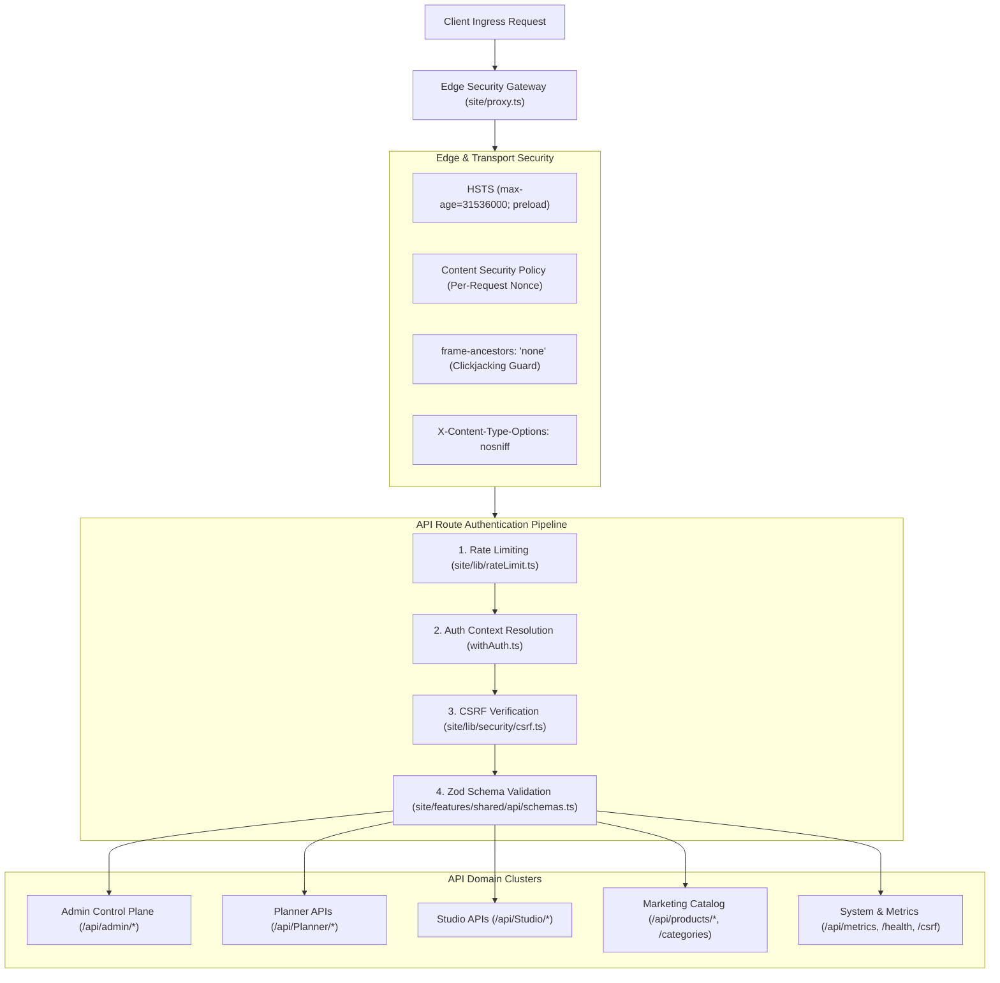

# API Routes & Security Architecture Audit

**Target System:** Oando Next.js API Surface (`site/app/api/`)  
**Audit Scope:** Exhaustive 59-route inventory, authentication wrappers, CSRF protection, sliding-window rate limiting, input validation, and security headers.  
**Repository State:** Read-Only (`d:/23082026`) — Non-destructive inspection.

---

## 1. Executive Summary

The Oando backend exposes 59 route handlers under [`site/app/api/`](file:///d:/23082026/site/app/api/). The surface is partitioned into six distinct domains: **System & Diagnostics**, **Marketing Catalog**, **Customer Engagement**, **Planner Services**, **Studio Services**, and the **Admin Control Plane**. 

The security architecture enforces defense-in-depth across every ingress request:

---

## 2. Complete 59-Route Taxonomy & Access Control Matrix

| Route Path | HTTP Methods | Auth Scope | Rate Limit | Primary Store | Mutating? | Description |
| :--- | :---: | :---: | :---: | :---: | :---: | :--- |
| **System & Health** | | | | | | |
| `/api/health` | `GET` | Public | None | In-memory | No | System liveness probe. |
| `/api/metrics` | `GET` | Ops / Bearer | None (Auth guarded) | Prometheus | No | Prometheus metric exposition. |
| `/api/csrf` | `GET` | Public | 60/min | Encrypted Cookie | No | Generates cryptographically signed CSRF token. |
| `/api/log-error` | `POST` | Public | 30/min | Server Logger | Yes | Ingests client browser runtime error reports. |
| `/api/git-user` | `GET` | Admin | None | Git Config | No | Local developer identity verification. |
| `/api/dev/auth-bypass-status` | `GET` | Dev only | None | Env | No | Reports `DEV_AUTH_BYPASS` state (404 in prod). |
| `/api/dev-tools/lighthouse` | `POST` | Dev only | None | Disk / Dev | Yes | Triggers local automated Lighthouse audits. |
| **Marketing Catalog** | | | | | | |
| `/api/products` | `GET` | Public | 120/min | Products DB | No | Paginated furniture catalog listing. |
| `/api/products/filter` | `POST` | Public | 120/min | Products DB | No | Multi-facet catalog search and filter. |
| `/api/categories` | `GET` | Public | 120/min | Products DB | No | Hierarchical product categories tree. |
| `/api/nav-categories` | `GET` | Public | 120/min | Products DB | No | Cached navigation bar category shortcuts. |
| `/api/nav-search` | `GET` | Public | 120/min | Products DB | No | Instant predictive search suggestions. |
| `/api/filter` | `GET` | Public | 120/min | Products DB | No | Filter facet metadata and bounds. |
| `/api/business-stats` | `GET` | Public | 60/min | Products DB | No | Current business statistics and client count. |
| `/api/theme/active` | `GET` | Public | 60/min | Products DB | No | Active theme token bundle. |
| `/api/theme/manage` | `POST` | Admin | 30/min | Products DB | Yes | Activates or switches theme palettes. |
| **Customer Engagement** | | | | | | |
| `/api/customer-queries` | `POST` | Public | 10/min | Admin DB | Yes | Inbound contact form inquiry submission. |
| `/api/customer-queries/manage` | `GET, PATCH` | Admin / Token | 30/min | Admin DB | Yes | Admin triage and query resolution endpoint. |
| `/api/tracking` | `POST` | Public | 120/min | In-memory | Yes | Zaraz and custom analytics event tracking. |
| `/api/audit` | `POST` | Member | 60/min | Admin DB | Yes | Client-side security and audit event logging. |
| **Planner Subsystem** | | | | | | |
| `/api/Planner/ai-advisor` | `POST, OPTIONS` | User / Guest | 20/min | Mastra / In-mem | No | Space planning advisory (NDJSON stream / JSON). |
| `/api/Planner/catalog` | `GET` | Public | 120/min | Admin DB | No | Catalog blocks with snap points for Planner canvas. |
| `/api/Planner/catalog/upload` | `POST` | Admin | 15/min | Admin DB / R2 | Yes | Custom 2D symbol SVG upload. |
| `/api/Planner/handoff` | `POST` | User | 20/min | Admin DB | Yes | Generates handoff package for sales review. |
| `/api/Planner/projects` | `GET, POST` | User | 60/min | Admin DB / Disk | Yes | Lists and creates floorplan design projects. |
| `/api/Planner/projects/[id]` | `GET, PUT, DELETE`| Owner | 60/min | Admin DB / Disk | Yes | Project document CRUD with revision CAS checks. |
| `/api/Planner/sketch-to-plan` | `POST` | User | 10/min | AI Vision | Yes | Experimental sketch-to-floorplan pipeline. |
| **Studio Subsystem** | | | | | | |
| `/api/Studio/furniture` | `GET, POST` | Member | 60/min | Admin DB / Disk | Yes | Furniture block models authored in Studio. |
| `/api/Studio/furniture/[id]` | `GET, PUT, DELETE`| Member | 60/min | Admin DB / Disk | Yes | Updates or archives Studio furniture model. |
| `/api/Studio/furniture/[id]/publish`| `POST` | Admin | 15/min | Admin DB | Yes | Promotes draft furniture block into live catalog. |
| `/api/Studio/furniture/upload` | `POST` | Member | 30/min | Admin DB / R2 | Yes | Uploads top-view SVG or texture map. |
| `/api/Studio/ai/generate` | `POST` | Member | 10/min | AI Subsystem | Yes | Generative furniture geometry assistant. |
| `/api/Studio/ai/restyle` | `POST` | Member | 10/min | AI Subsystem | Yes | Generative material and color restyling. |
| `/api/Studio/ai/suggest` | `POST` | Member | 20/min | AI Subsystem | No | Suggests dimensional and ergonomic tweaks. |
| **Admin Control Plane** | | | | | | |
| `/api/admin/analytics` | `GET` | Admin | 30/min | Analytics DB | No | Dashboard KPI and funnel metrics. |
| `/api/admin/catalogs/[type]` | `GET, POST` | Admin | 30/min | Products/Admin | Yes | Manages catalog items by family type. |
| `/api/admin/catalogs/[type]/[id]` | `PUT, DELETE` | Admin | 30/min | Products/Admin | Yes | Modifies or deletes specific catalog item. |
| `/api/admin/features` | `GET, POST` | Admin | 30/min | Admin DB | Yes | Toggles runtime feature flags. |
| `/api/admin/indexnow` | `POST` | Admin | 10/min | IndexNow API | Yes | Submits updated URLs to search engines. |
| `/api/admin/plans` | `GET` | Admin | 30/min | Admin DB | No | Global cross-tenant floorplan oversight. |
| `/api/admin/plans/[id]` | `GET, DELETE` | Admin | 30/min | Admin DB | Yes | Inspects or deletes problematic tenant plan. |
| `/api/admin/price-books` | `GET, POST` | Admin | 30/min | Admin DB | Yes | Price books directory and draft creation. |
| `/api/admin/price-books/[bookId]` | `GET, PUT` | Admin | 30/min | Admin DB | Yes | Price book rules and tier matrix editing. |
| `/api/admin/price-books/[bookId]/action`| `POST` | Admin | 15/min | Admin DB | Yes | State transitions (`activate`, `archive`). |
| `/api/admin/themes` | `GET, POST` | Admin | 30/min | Products DB | Yes | Theme preset management. |
| `/api/admin/themes/publish` | `POST` | Admin | 15/min | Products DB | Yes | Publishes theme changes to live storefront. |
| **Media & File Storage** | | | | | | |
| `/api/files/catalog/[...path]` | `GET` | Public | Cached CDN | Cloudflare R2 | No | Serves product photography and CAD symbols. |
| `/api/files/exports/[filename]` | `GET` | User | 60/min | R2 / Temp | No | Downloads exported DXF, PDF, or SVG files. |
| `/api/files/furniture/[filename]` | `GET` | Public | Cached CDN | Cloudflare R2 | No | Furniture thumbnail images. |
| `/api/files/projects/[filename]` | `GET` | Owner | 60/min | Admin DB / R2 | No | Project floorplan thumbnail preview. |
| `/api/files/uploads/[filename]` | `GET, POST` | Member | 30/min | Cloudflare R2 | Yes | General staff asset uploads. |

---

## 3. Authentication & Security Middleware Contract

### 3.1 Session Resolution (`site/features/shared/api/withAuth.ts`)
The server validates callers via `resolveAuthContext(requiredRole)`:
* **`public`:** Extracts optional session for personalization; never blocks.
* **`user`:** Requires valid Supabase Auth JWT; enforces row-level ownership.
* **`admin`:** Verifies `user.role === 'admin'` or presence in `ADMIN_EMAILS`. Rejects non-admin sessions with HTTP 403.
* **`devAuthBypass`:** In non-production environments (`DEV_AUTH_BYPASS=1`), injects a mock admin actor (`dev-admin@oando.local`). In production builds, `assertNoDevAuthBypassInProduction()` guarantees this code path immediately throws.

### 3.2 CSRF Protection (`site/lib/security/csrf.ts`)
* Implements the **Encrypted Double-Submit Cookie** pattern.
* `GET /api/csrf` issues an HMAC-SHA256 signed CSRF cookie.
* Every non-idempotent method (`POST`, `PUT`, `PATCH`, `DELETE`) must include header `X-CSRF-Token`.
* Missing or invalid tokens result in HTTP `403 Forbidden` with diagnostic header `X-CSRF-Rejected: 1`.

### 3.3 Rate Limiting (`site/lib/rateLimit.ts`)
* Memory-efficient in-process sliding-window counter.
* Scoped by operation and client IP: `${prefix}:${scope}:${ip}`.
* Returns HTTP `429 Too Many Requests` with `X-RateLimit-Reset` and `Retry-After` headers.

---

## 4. Verification & Test Suite Matrix

| Test Scope | File Path | Type | What It Verifies |
| :--- | :--- | :--- | :--- |
| **Auth Wrapper Rules** | [`tests/unit/features/shared/api/withAuth.test.ts`](file:///d:/23082026/tests/unit/features/shared/api/withAuth.test.ts) | Vitest Unit | Validates public, user, and admin authorization ladders. |
| **CSRF Token Validation**| [`tests/unit/lib/security/csrf.test.ts`](file:///d:/23082026/tests/unit/lib/security/csrf.test.ts) | Vitest Unit | HMAC signatures, token tampering, missing headers, cookie rotation. |
| **Rate Limit Counters** | [`tests/unit/lib/rateLimit.test.ts`](file:///d:/23082026/tests/unit/lib/rateLimit.test.ts) | Vitest Unit | Sliding window expiry, burst capacity, IP isolation. |
| **Admin API Gating** | [`tests/unit/app/api/admin/_lib/server.test.ts`](file:///d:/23082026/tests/unit/app/api/admin/_lib/server.test.ts) | Vitest Unit | Enforces rate limit + admin check + CSRF on admin endpoints. |
| **Dev Bypass Safety** | [`tests/unit/lib/auth/devAuthBypass.test.ts`](file:///d:/23082026/tests/unit/lib/auth/devAuthBypass.test.ts) | Vitest Unit | Hard assertion that bypass throws fatal error under `NODE_ENV=production`. |
| **Proxy Security Rules** | [`tests/unit/proxy.test.ts`](file:///d:/23082026/tests/unit/proxy.test.ts) | Vitest Unit | Tests HSTS, CSP nonce stamping, retired route 308 redirects. |

---

## 5. Security Findings & Risk Summary

* **Finding API-01 — Strict CSP Nonce Integration:** Every document request dynamically generates a cryptographically secure base64 nonce (`Buffer.from(crypto.randomUUID()).toString("base64")`) stamped on inline framework script tags.
* **Finding API-02 — Double Guard on Customer Queries:** `/api/customer-queries/manage` accepts both Supabase Admin session JWTs and the headless operational secret `CUSTOMER_QUERIES_ADMIN_TOKEN`, enabling secure background polling.
* **Finding API-03 — Fork Purity Across API Trees:** Verified by `scripts/scan-boundaries.mjs`: `/api/Planner/*` and `/api/Studio/*` remain 100% disjoint with zero cross-imports.
