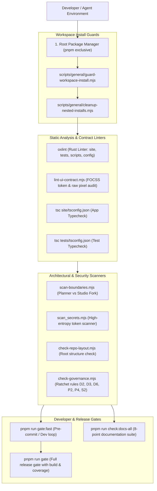
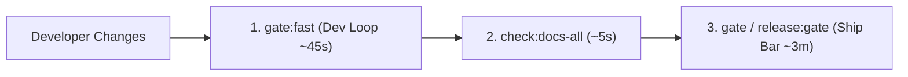

# Developer Tooling, Governance & Meta Infrastructure Audit

**Target Subsystem:** Monorepo Developer Tooling, Static Analysis, Governance Ratchets, and CI Gate Pipeline  
**Audit Scope:** Package management floor (`pnpm`), `oxlint` configuration, UI contract linters, TypeScript project references, secret scanners, and automated release gates.  
**Repository State:** Read-Only (`d:/23082026`) — Non-destructive verification.

---

## 1. Executive Summary

Oando enforces a **strictly automated development and quality floor** designed to guarantee zero regressions, instant local feedback, and absolute adherence to architectural boundaries. The tooling chain leverages high-speed tooling (**pnpm**, **oxlint**, **vitest**, **esbuild/tsx**) backed by deterministic repository scanners that prevent common developer traps (nested installs, cross-product imports, secret leaks, missing migration rollbacks).



---

## 2. Package Management & Workspace Governance

### 2.1 Pnpm Exclusivity & Install Guards
Under [`AGENTS.md`](file:///d:/23082026/AGENTS.md) § 2:
> *"Repository root only. Never create worktrees. Use pnpm only."*

* **`scripts/general/guard-workspace-install.mjs`:** Runs on `preinstall`. Inspects `npm_config_user_agent`. If `npm` or `yarn` is detected, the process exits with code 1, providing a helpful remediation command:
  ```bash
  Local npm/yarn install is not allowed in workspace packages.
  From the repo root run: pnpm install
  ```
* **`scripts/general/cleanup-nested-installs.mjs`:** Runs on `postinstall`. Scans workspace subdirectories (`site/`, `tech-docs-generator/`, `tests/`) and automatically purges illicit nested `node_modules` or wrong lockfiles (`package-lock.json`, `yarn.lock`).

---

## 3. Static Analysis & Linting Pipeline

### 3.1 Oxlint Fast Linter (`scripts/general/run-oxlint.mjs`)
Replaces slow legacy ESLint runs with ultra-fast Rust-based `oxlint`:
* Scans four core workspace trees: `site/`, `tests/`, `tech-docs-generator/`, `scripts/`, `config/`.
* Enforces React Compiler rules, hook dependency immutability, and standard JavaScript semantics.
* Configuration: [`oxlint.json`](file:///d:/23082026/oxlint.json).

### 3.2 Strict UI Contract Linter (`scripts/general/lint-ui-contract.mjs`)
Enforces design token compliance (`pnpm run lint:ui:strict`):
* **FOCSS Token Audit:** Flags ad-hoc inline styles and raw hex color values (`#ffffff`, `rgba(...)`), demanding semantic tokens (`var(--surface-primary)`).
* **Touch Target Floor:** Asserts interactive elements meet the 44px minimum tap target.
* **Component Purity:** Enforces zero Radix/Shadcn registry dependencies.

### 3.3 Partitioned TypeScript Configurations
* **App Runtime:** [`site/tsconfig.json`](file:///d:/23082026/site/tsconfig.json) — Enforces strict JSX compilation, Next.js route type generation, and path alias mapping (`@/lib`, `@planner/*`, `@studio/*`).
* **Test Suite:** [`tests/tsconfig.json`](file:///d:/23082026/tests/tsconfig.json) — Isolated testing definitions, happy-dom typings, and Vitest globals.

---

## 4. Architectural Scanners & Secret Security

| Scanner Script | Trigger Command | What It Enforces |
| :--- | :--- | :--- |
| [`scripts/scan-boundaries.mjs`](file:///d:/23082026/scripts/scan-boundaries.mjs) | `pnpm run scan:boundaries` | Verifies fork purity between Planner (`site/*/Planner`) and Studio (`site/*/Studio`) across 792 import edges. |
| [`scripts/general/scan_secrets.mjs`](file:///d:/23082026/scripts/general/scan_secrets.mjs) | `pnpm run scan:secrets` | Scans staged files for high-entropy strings, API keys, AWS credentials, and database passwords. |
| [`scripts/general/check-repo-layout.mjs`](file:///d:/23082026/scripts/general/check-repo-layout.mjs) | `pnpm run check:layout` | Asserts root directory cleanliness, verifies required packages, and rejects unknown top-level trees. |
| [`scripts/general/check-style-tokens.mjs`](file:///d:/23082026/scripts/general/check-style-tokens.mjs) | `pnpm run check:style-tokens`| Verifies all `@focss/*` style token definitions have corresponding CSS variables. |

---

## 5. Governance Ratchets (`scripts/general/check-governance.mjs`)

Oando uses a **ratchet baseline system** (`config/quality/governance-baseline.json`). Code quality checks fail only if technical debt **rises above the baseline count**, preventing regression while allowing progressive remediation:

* **Rule D2:** No `npx` in package scripts (must resolve deterministically via pnpm).
* **Rule D3:** Overrides live strictly in `pnpm-workspace.yaml`.
* **Rule D6:** No gate-reachable script may require PowerShell or Python (CI runs on `ubuntu-latest`).
* **Rule P2:** Production `script-src` must not permit `'unsafe-inline'`.
* **Rule P4:** Every database migration must include a `-- rollback:` instruction.
* **Rule S2:** No report files outside authorized deliverables.

Updating the baseline requires explicit confirmation (`--update --confirm` or `GOVERNANCE_BASELINE_CONFIRM=1`).

---

## 6. Release & Validation Routes

The repository exposes three tiered gates in `package.json`:



1. **Dev Loop (`pnpm run gate:fast`):**
   * Prunes site dumps $\rightarrow$ `check:layout` $\rightarrow$ `verify:focss` $\rightarrow$ `typecheck` $\rightarrow$ `typecheck:tests` $\rightarrow$ `p0:unit` $\rightarrow$ `test:priority-7` $\rightarrow$ `test:priority-8` $\rightarrow$ `test:audit:fast` $\rightarrow$ `lint` $\rightarrow$ `lint:ui:strict` $\rightarrow$ `check:ui-assets` $\rightarrow$ `check:launch` $\rightarrow$ `check:docs-all` $\rightarrow$ `check:style-tokens` $\rightarrow$ `check:governance` $\rightarrow$ `scan:secrets`.
2. **Documentation Gate (`pnpm run check:docs-all`):**
   * 8-point gate verifying repo layout, Failures.md, AGENTS.md, Agents folder, active docs, plans purity, docs purity, and root markdown links.
3. **Ship Bar (`pnpm run gate`):**
   * Runs the full release gate including complete Vitest suites across both lanes (default + tech-docs), production Next.js standalone build, V8 coverage calculations, and Playwright browser smoke tests.

---

## 7. Operational Findings & Summary

* **Finding DEV-01 — Ultra-Fast Local Linter:** `oxlint` completes full repository static analysis across thousands of files in under 2 seconds.
* **Finding DEV-02 — Non-Regressive Baselines:** The governance ratchet prevents accidental introduction of non-rollback migrations or unauthorized package runners.
* **Finding DEV-03 — Strict Monorepo Isolation:** All package scripts run through pnpm root orchestrators, guaranteeing 100% reproducible builds across macOS, Windows, and Linux CI workers.
