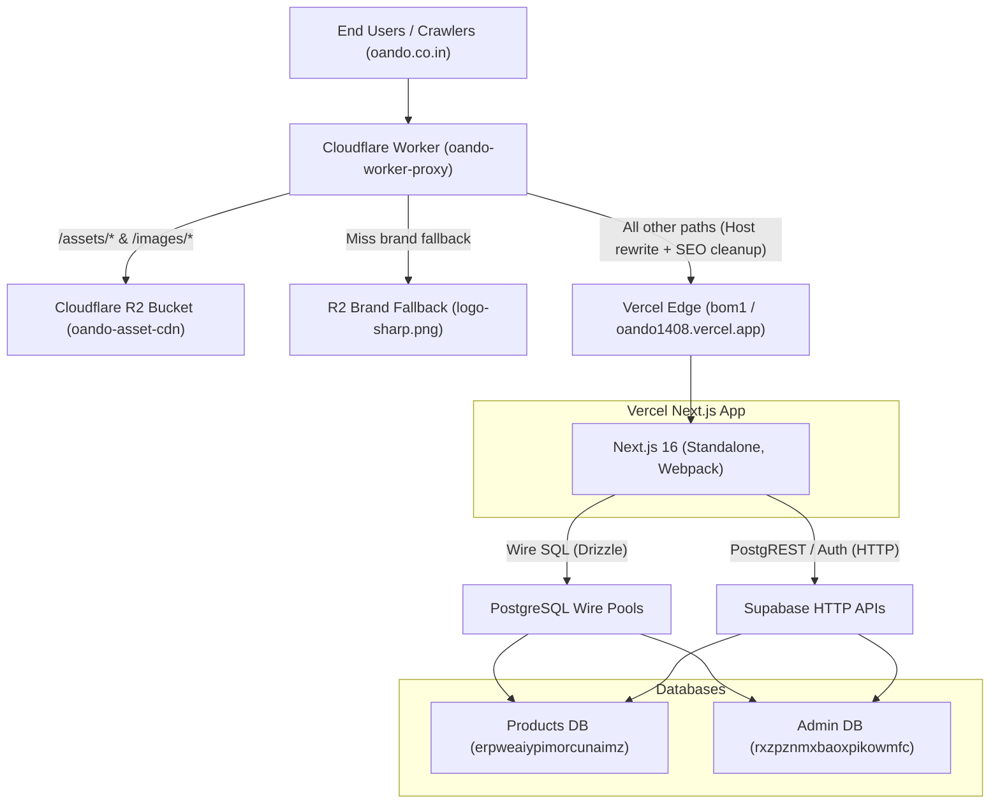

# Oando Infrastructure & Configuration Audit Report
**Target Systems:** Database (Supabase / Postgres), Cloudflare R2, Vercel, Cloudflare Worker (`oando-worker-proxy`)  
**Repository State:** Read-Only (`d:/23082026`) — Zero in-tree writes performed.

---

## Executive Summary

The Oando infrastructure employs a split-surface, edge-proxied cloud topology designed for high resilience, cost containment, and data isolation:



1. **Database:** Dual-Supabase architecture separating the public marketing catalog (**Products DB**: `erpweaiypimorcunaimz`) from operational/user/plan data (**Admin DB**: `rxzpznmxbaoxpikowmfc`). Production filesystem is read-only (`EROFS`); dev bypass routes to disk.
2. **Cloudflare R2:** Object storage bucket `oando-asset-cdn` handles catalog media, daily database dumps, catalog JSON snapshots, and offsite repository zip archives. Enforces strict intact-pair S3 credential resolution.
3. **Vercel:** Monorepo deployment on edge region `bom1` (Mumbai). Root `vercel.json` configures Next.js standalone build and injects `X-Robots-Tag: noindex, nofollow` for any `*.vercel.app` hostname to prevent duplicate content indexing.
4. **Cloudflare Worker:** Reverse proxy sits in front of Vercel, serving all static media directly from R2, intercepting asset 404s with a brand fallback (insulating Vercel from asset traffic bandwidth costs), and sanitizing upstream `X-Robots-Tag` headers to allow indexing on apex (`oando.co.in`).

---

## 1. Database Configuration

### 1.1 Dual Database Architecture

The repository enforces strict separation between two Supabase projects:

| Parameter | Products Database | Admin Database |
|:---|:---|:---|
| **Project Ref** | `erpweaiypimorcunaimz` | `rxzpznmxbaoxpikowmfc` |
| **Direct Postgres Wire Env** | `PRODUCTS_DATABASE_URL` | `SUPABASE_AUTH_DATABASE_URL` (or `PLANNER_DATABASE_URL`) |
| **HTTP / REST URL Env** | `SUPABASE_URL`, `NEXT_PUBLIC_SUPABASE_URL` | `NEXT_ADMIN_SUPABASE_URL`, `SUPABASE_AUTH_URL` |
| **Anon / Publishable Keys** | `NEXT_PUBLIC_SUPABASE_ANON_KEY`, `NEXT_PUBLIC_SUPABASE_PUBLISHABLE_KEY` | `NEXT_ADMIN_SUPABASE_ANON_KEY`, `NEXT_ADMIN_PUBLISHABLE_KEY` |
| **Service Role Keys** | `SUPABASE_SERVICE_ROLE_KEY` | `SUPABASE_ADMIN_SERVICE_ROLE_KEY` |
| **Migration Folder** | `site/platform/supabase/migrations/` | `site/platform/supabase/migrations.admin/` |
| **Drizzle Schema** | `site/platform/drizzle/schema/catalog.ts` | `site/platform/drizzle/schema/planner.ts` |
| **Primary Domain Data** | `catalog_products`, `catalog_categories`, `catalog_product_specs`, `configurator_products`, `planner_managed_products`, `business_stats_current` | `oando_plans`, `profiles`, `planner_handoffs`, `customer_queries`, `teams`, `price_books`, `furniture_catalog`, `block_descriptors`, `audit_events` |

### 1.2 Access Layers & Client Factories

The application defines specific client access boundaries:

- **Wire Clients (`postgres` / `drizzle-orm`):** Resolved via [`site/platform/drizzle/databaseUrls.ts`](file:///d:/23082026/site/platform/drizzle/databaseUrls.ts). Direct connection pools used for batch operations, catalog snapshot exports, and migration tracking.
- **REST Admin Clients:**
  - Products: `createSupabaseAdminClient()` in [`site/platform/supabase/supabaseAdmin.ts`](file:///d:/23082026/site/platform/supabase/supabaseAdmin.ts) using `SUPABASE_SERVICE_ROLE_KEY`.
  - Admin: `createSupabaseAuthAdminClient()` in [`site/platform/supabase/auth-admin.ts`](file:///d:/23082026/site/platform/supabase/auth-admin.ts) using `SUPABASE_ADMIN_SERVICE_ROLE_KEY`.
- **REST Public/Scoped Clients:**
  - `createSupabaseAuthAnonClient(accessToken)` in `auth-admin.ts`: passes caller bearer JWT to PostgREST to enforce per-user RLS policies.
  - `getPublicSupabaseEnv()` / `getAuthSupabaseEnv()` in [`site/platform/supabase/env.ts`](file:///d:/23082026/site/platform/supabase/env.ts).

### 1.3 Key Database Protections & Findings

1. **Security Guard (Finding 9.3):** [`site/platform/supabase/env.ts`](file:///d:/23082026/site/platform/supabase/env.ts#L20-L45) includes `assertNotServiceRoleKey()`. If a service-role JWT is accidentally placed into `NEXT_ADMIN_SUPABASE_ANON_KEY` or `NEXT_PUBLIC_SUPABASE_ANON_KEY`, the client fails closed immediately to prevent accidental global RLS bypass.
2. **Schema Traps:**
   - The `profiles` table has **no `email` and no `role` column**. Writing either column triggers `PGRST204` (column not found).
   - Furniture and block descriptors live strictly in the **Admin DB** (`furniture_catalog`, `block_descriptors`). Any lingering tables in Products DB are deprecated or archived (`archive.furniture_catalog`).
   - Retired tables (9 total: `plans`, `templates`, `users`, `plan_versions`, `plan_shares`, `plan_comments`, `projects`, `clients`, `quotes`) were moved to the `archive` schema via `20260801110000_archive_legacy_planner_tables.sql`. They are invisible to PostgREST. The active plan table is `public.oando_plans`.
3. **Migration Governance:**
   - Both databases track migrations using a dedicated table: `public._local_migration_history (filename text primary key, applied_at timestamptz)`.
   - Managed migration batches begin from `20260524` onward. Pre-batch files were executed out-of-band and are bypassed by `scripts/db_apply_migrations.ts`.
   - Every migration must include `-- rollback:` comments for governance compliance (`pnpm run check:governance`).
4. **Persistence Selector:**
   - Non-production environments use disk storage when `DEV_AUTH_BYPASS=1`.
   - Production filesystem is read-only (`EROFS`); writes bypass disk and target Supabase tables through mode-aware wrappers.

---

## 2. Cloudflare R2 Configuration

### 2.1 Storage Bucket & Endpoints

- **Canonical Bucket:** `oando-asset-cdn` (aliased across env vars: `CLOUDFLARE_R2_CATALOG_BUCKET`, `CLOUDFLARE_R2_BUCKET`, `R2_CATALOG_BUCKET`).
- **Endpoint:** `CLOUDFLARE_S3_URL` or dynamically resolved via `https://${CLOUDFLARE_ACCOUNT_ID}.r2.cloudflarestorage.com`.
- **Public CDN Base:** `NEXT_PUBLIC_ASSET_BASE_URL` (defaults to `https://oando.co.in`).

### 2.2 S3 API Credential Resolution Contract

Implementation in [`site/lib/storage/r2Catalog.ts`](file:///d:/23082026/site/lib/storage/r2Catalog.ts#L178-L200):
- Enforces **intact credential pairs**. Precedence order:
  1. `CLOUDFLARE_R2_ACCESS_KEY_ID` + `CLOUDFLARE_R2_SECRET_ACCESS_KEY`
  2. `CLOUDFLARE_ACCESS_KEY_ID` + `CLOUDFLARE_SECRET_ACCESS_KEY`
  3. Legacy typo aliases: `CLOULD_ACCESS_KEY_ID` + `CLOULDFLARE_S3_SECRET_ACCESS_KEY`
- Never mixes access keys and secrets across distinct env pairs.
- Never accepts Cloudflare API tokens (Bearer auth) as S3 secret access keys.

### 2.3 R2 Workflows & Object Layouts

1. **Asset Hosting & Fallbacks:**
   - Standard path: `/assets/*` and `/images/*`.
   - Path normalizer handles legacy seating taxonomy: rewrites `/seating/non-leather/SKU` to `/seating/{cafe|fabric|leather|mesh}/SKU`.
   - Missing assets serve fallback: `marketing/brand/logos/logo-sharp.png` with short TTL (300s) and header `x-oando-proxy: r2-fallback`.
2. **Database Dumps (`backup:supabase:r2`):**
   - Scheduled nightly at 02:15 UTC via [`.github/workflows/supabase-backup-r2.yml`](file:///d:/23082026/.github/workflows/supabase-backup-r2.yml).
   - Executes `pg_dump` on both databases.
   - Keys:
     - `backups/products/pgdump-products-<YYYYMMDDHHMMSS>.dump`
     - `backups/admin/pgdump-admin-<YYYYMMDDHHMMSS>.dump`
3. **Catalog Degraded-Mode Snapshots (`catalog:snapshot:r2`):**
   - Exports all rows from `catalog_products` into static JSON.
   - Keys:
     - `backups/catalog/catalog-latest.json`
     - `backups/catalog/catalog-<YYYYMMDDHHMMSS>.json`
   - Enables catalog browsing fallback if the Products database is unavailable.
4. **Repository Snapshot (`repo:backup:r2`):**
   - Produces clean git archive: `git archive --format=zip HEAD`.
   - Key: `backups/repo/oofplweb-<YYYYMMDDHHMMSS>.zip`.

---

## 3. Vercel Configuration

### 3.1 Project & Build Configuration

File: [`vercel.json`](file:///d:/23082026/vercel.json)

```json
{
  "$schema": "https://openapi.vercel.sh/vercel.json",
  "buildCommand": "pnpm run build:site",
  "installCommand": "pnpm install",
  "outputDirectory": "site/.next",
  "framework": "nextjs",
  "regions": ["bom1"],
  "git": {
    "deploymentEnabled": {
      "dependabot/**": false
    }
  },
  "headers": [
    {
      "source": "/(.*)",
      "has": [{ "type": "host", "value": ".*\\.vercel\\.app" }],
      "headers": [{ "key": "X-Robots-Tag", "value": "noindex, nofollow" }]
    }
  ]
}
```

- **Build Target:** `pnpm run build:site` (`node scripts/general/check-sharp.js && next build site --webpack && node scripts/general/prepare-standalone.cjs`).
- **Target Output:** `site/.next` (Next.js standalone bundle).
- **Target Region:** `bom1` (Mumbai, minimizing latency for primary Indian user base).
- **Robots Protection:** Automatically tags any direct `*.vercel.app` host with `X-Robots-Tag: noindex, nofollow` to prevent search engines from indexing preview environments or naked deployment origins.

### 3.2 Tech-Docs Auxiliary App

File: [`tech-docs-generator/vercel.json`](file:///d:/23082026/tech-docs-generator/vercel.json)
- Deployed as an independent Vite SPA.
- Output directory: `dist`.
- Rewrites all non-asset paths to `/index.html`.
- Production URL: `https://techdocsgenerator.vercel.app` (configured as fallback while `docs.oando.co.in` SSL certificate is in resolution).

### 3.3 Next.js Application Server Settings

File: [`site/next.config.js`](file:///d:/23082026/site/next.config.js) / [`config/build/next.config.js`](file:///d:/23082026/config/build/next.config.js)
- **Output Mode:** `standalone`.
- **Image Optimization:** In production (`VERCEL_ENV=production`), `unoptimized: true` is standard unless overridden, shifting image optimization to Cloudflare edge / R2.
- **Remote Image Domains:** Whitelists `*.supabase.co` (`/storage/v1/object/public/**`) and the configured R2 asset host.
- **Security Headers:** Strict CSP, HSTS (`max-age=31536000; includeSubDomains; preload`), `X-Frame-Options: DENY`, `X-Content-Type-Options: nosniff`.
- **Deploy Operations:** `pnpm run vercel:prod` triggers `pnpm run release:gate` as a mandatory pre-requisite before invoking `pnpm dlx vercel --prod --yes` using `VERCEL_TOKEN`.

---

## 4. Cloudflare Worker (`oando-worker-proxy`)

### 4.1 Worker Specification

File: [`workers/oando-worker-proxy/wrangler.toml`](file:///d:/23082026/workers/oando-worker-proxy/wrangler.toml)

- **Worker Name:** `oando-worker-proxy`
- **Entrypoint:** `src/index.js`
- **Compatibility Date:** `2024-01-01`
- **R2 Binding:** `ASSET_BUCKET = "oando-asset-cdn"`
- **Vectorize Binding:** `CATALOG_VECTORS = "catalog-nav"` (vector semantic catalog search)
- **Environment Variables:**
  - `VERCEL_ORIGIN`: `"https://oando1408.vercel.app"`
  - `PUBLIC_INDEXABLE_HOSTS`: `"oando.co.in,www.oando.co.in"`

### 4.2 Edge Proxy Routing & Logic

File: [`workers/oando-worker-proxy/src/index.js`](file:///d:/23082026/workers/oando-worker-proxy/src/index.js)

1. **Protocol Sanitization:** Immediately returns HTTP 400 for protocol-relative paths (`//`) to prevent open redirects or origin host contamination.
2. **Apex Redirect:** Redirects `www.oando.co.in` to `https://oando.co.in` with HTTP 308.
3. **RFC 9116 `security.txt`:** Directly serves `.well-known/security.txt` at edge with 24-hour cache control.
4. **Asset Interception & Cost Guard:**
   - Any request starting with `/assets/` or `/images/` is resolved against R2 bucket `ASSET_BUCKET`.
   - On match: Returns with `x-oando-proxy: r2` and `Cache-Control: public, max-age=31536000, immutable`.
   - On miss: Does **not** pass request through to Vercel (preventing origin bandwidth billing). Returns fallback logo (`marketing/brand/logos/logo-sharp.png`) with 5-minute TTL (`x-oando-proxy: r2-fallback`) or 404 (`x-oando-proxy: r2-miss`).
5. **Origin Reverse Proxying to Vercel:**
   - Routes non-asset requests to `VERCEL_ORIGIN`.
   - Upstream headers: Sets `host` to Vercel origin (`oando1408.vercel.app`) and preserves original client host in `x-forwarded-host`.
6. **SEO Indexing Header Restoration:**
   - Because `host` sent to Vercel matches `*.vercel.app`, Vercel's `vercel.json` adds `X-Robots-Tag: noindex, nofollow`.
   - The worker intercepts the response, strips origin `X-Robots-Tag`, and for apex hosts (`oando.co.in`), explicitly sets:
     - `X-Robots-Tag: all`
     - `x-oando-indexable: 1`
   - For preview/worker hosts, it restores `X-Robots-Tag: noindex, nofollow`.

---

## 5. Active Blockers & Configuration Risks

### 5.1 Hard Blocker Resolution: `CF-TOKEN-01` (RESOLVED & VERIFIED)
- **Status:** **RESOLVED** (Re-verified live on 2026-09-04).
- **Investigation & Finding:**
  - Two tokens were evaluated across environment configurations:
    1. **Legacy Token (`cfat_2Ma...` in `oando1408`):** Expired/revoked token returning `Invalid access token [code: 9109]`. This caused the historical failure recorded on 2026-09-01.
    2. **Active Token (`cfat_tyy...` in `.env.local`):** Fully operational **Account-Owned API Token** (`cfat_`) scoped to Account `78e07661362639e5e9008dadd85a3f2d` (`Mayoite@gmail.com's Account`).
- **Live Verification Evidence (Observed 2026-09-04):**
  - **Account API:** HTTP 200 `success: true` against account `78e07661362639e5e9008dadd85a3f2d`.
  - **Vectorize API & Wrangler:** `npx wrangler vectorize list` exited code 0, confirming `catalog-nav` (768 dimensions, cosine metric) exists and is healthy.
  - **R2 API & Wrangler:** `npx wrangler r2 bucket list` exited code 0, confirming active access to buckets `oando-asset-cdn` and `oando-recovery-20260805`.
  - **Workers API:** Confirmed read/write permissions for `oando-worker-proxy`.
  - **Zones API:** Confirmed management permissions for zones `oando.co.in` and `oando.in`.
- **Conclusion:** `CF-TOKEN-01` is no longer a blocker. Worker deployment (`pnpm run worker:deploy`) is unblocked.

### 5.2 Worker Dependency Decoupling
- [`workers/oando-worker-proxy`](file:///d:/23082026/workers/oando-worker-proxy/README.md) is **not** a member of the root pnpm workspace. It maintains its own `package-lock.json`.
- Running `pnpm install` at repo root does not install worker dependencies. Operators must run `npm ci` inside `workers/oando-worker-proxy` before deploying.

### 5.3 Single Source of Truth for Vercel Origin
- `VERCEL_ORIGIN` is configured in `workers/oando-worker-proxy/wrangler.toml` as `https://oando1408.vercel.app`.
- If a new production domain or new primary Vercel project is provisioned, `wrangler.toml` must be updated and the worker redeployed. A missing or mismatched origin results in an immediate HTTP 500 (`x-oando-proxy: config-error`).

---

## 6. Audit Summary Matrix

| Domain | Configuration File | Key Components / Endpoints | Health / Constraints |
|:---|:---|:---|:---|
| **Products DB** | `site/platform/drizzle/schema/catalog.ts` | Ref: `erpweaiypimorcunaimz`<br>Tables: `catalog_products`, specs, stats | RLS enabled; public select, service-role write. |
| **Admin DB** | `site/platform/drizzle/schema/planner.ts` | Ref: `rxzpznmxbaoxpikowmfc`<br>Tables: `oando_plans`, `profiles`, `furniture_catalog` | RLS enabled; `profiles` has no email/role; 9 legacy tables archived. |
| **R2 Storage** | `site/lib/storage/r2Catalog.ts` | Bucket: `oando-asset-cdn`<br>Layouts: assets, snapshots, pgdump, repo zip | Intact credential resolution; S3 client with retry wrappers. |
| **Vercel** | `vercel.json` | Project: `site`<br>Region: `bom1`<br>Build: `pnpm run build:site` | `site/.next` output; automatic preview noindex headers. |
| **Cloudflare Worker** | `workers/oando-worker-proxy/wrangler.toml` | Target: `https://oando1408.vercel.app`<br>Bindings: `ASSET_BUCKET`, `CATALOG_VECTORS` | **HEALTHY / UNBLOCKED**. Live token verified across Workers, R2, Vectorize (`catalog-nav`), and Zones (`oando.co.in`). |
