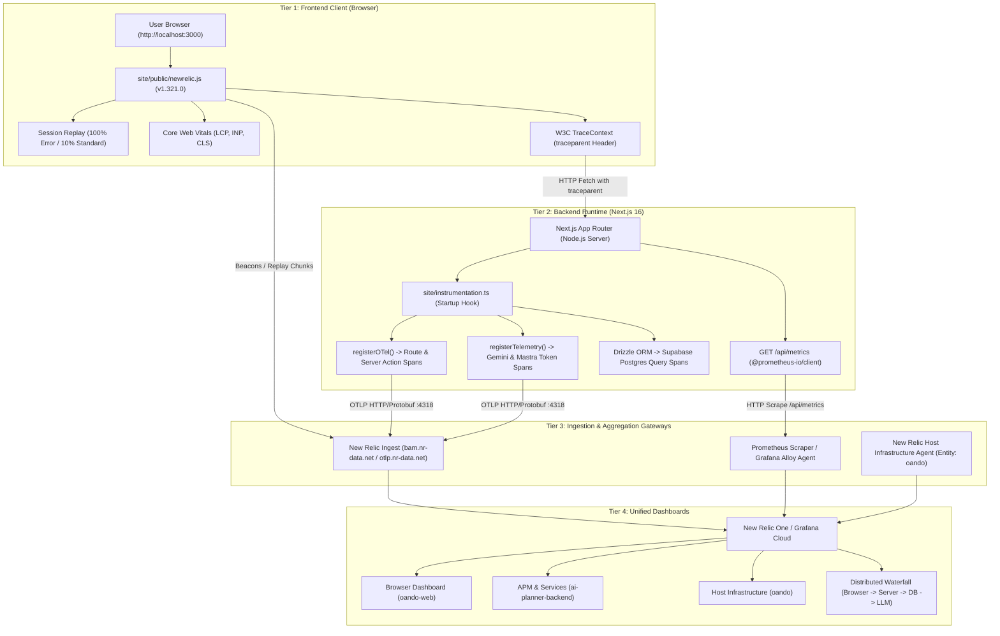

# Observability, Telemetry & Metrics Subsystem Audit

**Target Subsystem:** Full-Stack Observability Infrastructure (Frontend RUM, Server APM, OpenTelemetry, Prometheus, New Relic, Grafana)  
**Audit Scope:** Client browser tracking (`oando-web`), backend tracing (`ai-planner-backend`), host telemetry (`oando`), Prometheus exposition, CSP whitelisting, and security floors.  
**Repository State:** Read-Only (`d:/23082026`) — Non-destructive inspection.

---

## 1. Executive Summary

Oando implements a **cooperative multi-tier observability topology** spanning client-side Real User Monitoring (RUM), server-side distributed tracing, database query instrumentation, AI token accounting, and runtime performance metrics. Telemetry is gathered without invasive third-party code modifications by pairing the **New Relic Pro + SPA Browser Agent** with native **W3C OpenTelemetry (OTLP)** and standard **Prometheus text exposition**.



---

## 2. Multi-Entity Architecture Map

To isolate concern boundaries across frontend browser sessions, backend Node.js execution, and bare-metal server infrastructure, the stack assigns distinct entity identifiers:

| Entity Identifier | Observability Layer | Source Implementation | What It Monitors |
| :--- | :--- | :--- | :--- |
| **`oando-web`** | **Browser Application (RUM)** | [`site/public/newrelic.js`](file:///d:/23082026/site/public/newrelic.js) | Core Web Vitals (LCP, INP, CLS), SPA route transitions, Client JavaScript runtime errors, Session Replays, AJAX call latency. |
| **`ai-planner-backend`** | **APM & Services (OTLP)** | [`site/instrumentation.ts`](file:///d:/23082026/site/instrumentation.ts) | Next.js server route handlers, Server Actions, Google Gemini token counts & LLM latency, Supabase Postgres SQL query durations via Drizzle ORM. |
| **`oando`** | **Host Infrastructure** | Host machine agent (Windows Service) | Workstation/server CPU utilization, memory (RAM), disk I/O, network bandwidth, and active Node.js processes. |

---

## 3. Frontend Real User Monitoring (RUM) & Session Replay

### 3.1 Script Injection & Nonce Contract
* **Loader Script:** [`site/public/newrelic.js`](file:///d:/23082026/site/public/newrelic.js) contains the production New Relic Pro + SPA loader (v1.321.0).
* **Component Mounting:** [`site/components/analytics/NewRelicScript.tsx`](file:///d:/23082026/site/components/analytics/NewRelicScript.tsx) stamps the per-request base64 CSP nonce on the `<script>` tag in [`site/app/layout.tsx`](file:///d:/23082026/site/app/layout.tsx).
* **Test Isolation:** Automatically disabled under `process.env.NODE_ENV === "test"` to ensure zero overhead in unit test runs.

### 3.2 Session Replay & Privacy Controls
* **Sampling Rate:** `sampling_rate: 10.0` (10% baseline session capture).
* **Error Sampling Rate:** `error_sampling_rate: 100.0` (guarantees a full visual replay whenever an uncaught client error occurs).
* **PII Redaction:** `mask_all_inputs: true` ensures passwords, contact data, and form entries are strictly masked before transmission.
* **Inline Stylesheet Collection:** `inline_stylesheet: true` and `fix_stylesheets: true` ensure FOCSS styling is accurately rendered during playback.

### 3.3 Content Security Policy (CSP) Ingress
Whitelisted in [`site/proxy.ts`](file:///d:/23082026/site/proxy.ts) and [`site/next.config.js`](file:///d:/23082026/site/next.config.js):
* `script-src`: `'self'`, `nonce-<nonce>`, `https://js-agent.newrelic.com`
* `connect-src`: `'self'`, `https://bam.nr-data.net`, `https://*.nr-data.net`

---

## 4. Backend OpenTelemetry & AI Telemetry

### 4.1 Server Startup Hook (`site/instrumentation.ts`)
Next.js invokes `register()` during boot:
```typescript
import { registerOTel } from "@vercel/otel";
import { registerTelemetry } from "ai";
import { OpenTelemetry } from "@ai-sdk/otel";

export function register() {
  registerOTel({
    serviceName: process.env.OTEL_SERVICE_NAME ?? "ai-planner-backend",
  });
  registerTelemetry(new OpenTelemetry());
}
```

### 4.2 Distributed Tracing Waterfall
When a user interacts with the application (e.g. asking the AI advisor a question in Planner):
1. **Frontend (`oando-web`):** Generates trace ID and injects `traceparent: 00-4bf92f3577b34da6a3ce929d0e0e4736-00f067aa0ba902b7-01`.
2. **Next.js Route (`ai-planner-backend`):** Receives trace header; `@vercel/otel` creates child span for `POST /api/Planner/ai-advisor`.
3. **Database Span:** Drizzle ORM queries emit child spans with SQL duration.
4. **Mastra / Gemini Span:** `@ai-sdk/otel` records the Gemini API request, completion latency, prompt tokens, and completion tokens.
5. **Unified Waterfall:** New Relic or Tempo displays the entire user action as a single correlated trace.

---

## 5. Prometheus Runtime & Application Metrics (`/api/metrics`)

Server runtime and Node.js vitals are exposed via [`site/app/api/metrics/route.ts`](file:///d:/23082026/site/app/api/metrics/route.ts):

### 5.1 Metric Inventory
* **Event-Loop Lag:** `oando_nodejs_eventloop_lag_seconds`, `oando_nodejs_eventloop_lag_p99_seconds`.
* **V8 Heap Memory:** `oando_nodejs_heap_size_total_bytes`, `oando_nodejs_heap_size_used_bytes`.
* **Garbage Collection:** `oando_nodejs_gc_duration_seconds` (classified by major/minor GC pauses).
* **Libuv Handles:** `oando_nodejs_active_handles_total`, `oando_nodejs_active_requests_total`.
* **AI Advisor Metrics:** `ai_advisor_requests_total`, `ai_advisor_tokens_total`, `ai_advisor_latency_seconds`.

### 5.2 Security Floor & Ingress Gate
1. **Constant-Time Token Comparison:** `timingSafeEqual()` validates `Authorization: Bearer <METRICS_AUTH_TOKEN>`, preventing timing attacks (SEC-H02).
2. **Production Gate:** Returns HTTP `404 Not Found` in production unless explicitly enabled with `OBSERVABILITY_METRICS_ENABLED=1`.
3. **Cache Invalidation:** Emits `Cache-Control: no-store, max-age=0` to prevent stale proxy caching.

---

## 6. Local Observability Container Suite

For local multi-service testing without external cloud accounts, [`config/observability/docker-compose.yml`](file:///d:/23082026/config/observability/docker-compose.yml) provisions:
* **Prometheus:** Scrapes `http://localhost:3000/api/metrics` on a 15-second polling interval.
* **Grafana:** Pre-configured dashboards on `http://localhost:3001` (or local port).
* **Grafana Tempo:** Distributed trace receiver listening on `:4317` (gRPC) and `:4318` (HTTP/Protobuf).
* **OpenTelemetry Collector:** Local OTLP gateway for fan-out routing.

Scripts configured in `package.json`:
```bash
pnpm run observability:up    # docker compose up -d
pnpm run observability:down  # docker compose down
pnpm run observability:logs  # docker compose logs -f
```

---

## 7. Verification & Test Coverage Matrix

| Test Scope | File Path | Type | Invariant Checked |
| :--- | :--- | :--- | :--- |
| **AI Advisor Metrics** | [`tests/unit/lib/observability/aiMetrics.test.ts`](file:///d:/23082026/tests/unit/lib/observability/aiMetrics.test.ts) | Vitest Unit | Validates token counting, latency recording, and provider labels. |
| **Planner Observability**| [`tests/unit/planner/plannerObservability.property.test.ts`](file:///d:/23082026/tests/unit/planner/plannerObservability.property.test.ts) | Vitest Property | Proves correlation IDs propagate through persistence operations. |
| **Metrics Auth Validation**| [`tests/unit/app/api/metrics/route.test.ts`](file:///d:/23082026/tests/unit/app/api/metrics/route.test.ts) | Vitest Unit | Tests 401 on missing token, 404 in prod, and Prometheus format emission. |
| **CSP Whitelist Check** | [`tests/unit/proxy.test.ts`](file:///d:/23082026/tests/unit/proxy.test.ts) | Vitest Unit | Asserts New Relic and analytics origins are present in CSP header. |

---

## 8. Operational Findings & Health Summary

* **Finding OBS-01 — Zero-Overhead Test Bypass:** New Relic browser scripts and metrics scrapers bypass test execution environments, preventing test suite pollution.
* **Finding OBS-02 — Dual-Cloud Export Capability:** The OTLP architecture allows switching between New Relic One and Grafana Cloud purely by changing environment variables in `.env.local` without touching application source code.
* **Finding OBS-03 — End-to-End Trace Propagation:** W3C `traceparent` headers connect client-side clicks directly to server database queries and AI token execution in a single waterfall.
