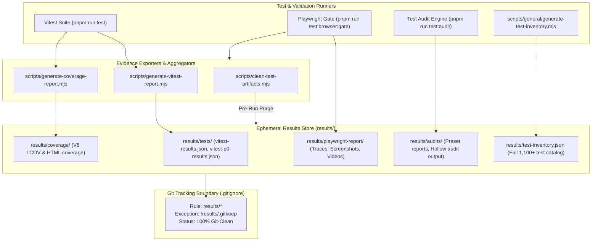

# Results & Ephemeral Evidence Subsystem Audit

**Target Subsystem:** Machine-Generated Test Evidence & Artifacts (`results/`)  
**Audit Scope:** Ephemeral evidence contracts, automated JSON report generators, gitignore boundary enforcement, test artifact pruning, and repository governance.  
**Repository State:** Read-Only (`d:/23082026`) — Non-destructive inspection.

---

## 1. Executive Summary

The [`results/`](file:///d:/23082026/results/) directory is reserved exclusively for **machine-generated, ephemeral evidence artifacts** emitted during test runs, coverage analysis, Playwright browser sessions, and CI validation gates. Under the repository governance floor ([`AGENTS.md`](file:///d:/23082026/AGENTS.md) § 3 & § 8), hand-written Markdown reports, audit notes, and manual documentation are strictly prohibited within `results/` (Trap 6). Human and agent-authored reports must reside in [`agent-reports/`](file:///d:/23082026/agent-reports/) or [`Agents/`](file:///d:/23082026/Agents/).



---

## 2. Directory Taxonomy & Artifact Ledger

| Path | Generator Script | File Format | Lifecycle | Description |
| :--- | :--- | :---: | :---: | :--- |
| [`results/tests/`](file:///d:/23082026/results/tests) | `scripts/generate-vitest-report.mjs` | JSON | Ephemeral | Raw Vitest JSON output suites (`vitest-results.json`, `vitest-p0-results.json`, `vitest-priority-*.json`). |
| [`results/coverage/`](file:///d:/23082026/results/coverage) | `scripts/generate-coverage-report.mjs` | LCOV / HTML | Ephemeral | V8 code coverage summaries and line execution maps. |
| [`results/playwright-report/`](file:///d:/23082026/results/playwright-report)| `scripts/general/run-playwright-gate.mjs` | HTML / WebP | Ephemeral | End-to-end browser execution traces, test step replays, failure screenshots. |
| [`results/audits/`](file:///d:/23082026/results/audits) | `scripts/general/run-test-audits.mjs` | JSON / Text | Ephemeral | Automated gate audit summaries (`--preset=release`, `--preset=fast`). |
| [`results/test-inventory.json`](file:///d:/23082026/results/test-inventory.json)| `scripts/general/generate-test-inventory.mjs` | JSON (162 KB) | Generated | Comprehensive catalog of all active tests across Planner, Studio, Site, and Admin. |
| [`results/test-migration-map.json`](file:///d:/23082026/results/test-migration-map.json)| `scripts/general/generate-test-inventory.mjs` | JSON (4 KB) | Generated | Map tracking tests relocated during the Planner/Studio fork migration. |
| [`results/tooling/`](file:///d:/23082026/results/tooling) | Internal scripts | Log files | Ephemeral | Automation receipts and diagnostic run logs. |

---

## 3. Strict Governance Floor & Anti-Pattern Defenses

### 3.1 Trap 6 Prevention: No Hand-Written Markdown
[`AGENTS.md`](file:///d:/23082026/AGENTS.md) § 8 explicitly flags:
> *"Trap 6: Hand-written Markdown reports under `results/`."*

* **Automated Guard:** `pnpm run check:layout` (`scripts/general/check-repo-layout.mjs`) scans `results/` and asserts that no `.md` documents exist inside it.
* **Separation of Concerns:**
  * **Machine Output (JSON/HTML/Logs):** `results/`
  * **Human / Agent Analysis:** `agent-reports/`
  * **Durable Architecture & Standards:** `Agents/` and `docs/`

### 3.2 Gitignore Enforcement
Line 17–18 of [`.gitignore`](file:///d:/23082026/.gitignore):
```gitignore
results/*
!results/.gitkeep
```
This rule guarantees that test runs, large Playwright trace dumps, and coverage files never pollute `git status` or trigger accidental git commits.

---

## 4. Lifecycle & Pruning Automation

1. **Pre-Test Purge (`pnpm run pretest`):**
   * Before every Vitest run, `scripts/clean-test-artifacts.mjs` purges stale JSON reports in `results/tests/` to prevent old test failures from masquerading as current results.
2. **Site Dump Pruning (`scripts/general/prune-site-dumps.mjs`):**
   * Executed automatically in `pnpm run gate:fast` to ensure no temporary HTML snapshots linger in tree.
3. **Vitest Report Post-Processing (`scripts/generate-vitest-report.mjs`):**
   * Aggregates raw test reporter output into standardized JSON summary structures with duration benchmarks and failure stacks.

---

## 5. Verification & Test Matrix

| Verification Route | Script | Invariant Checked | Status |
| :--- | :--- | :--- | :---: |
| **Repository Layout Check** | `pnpm run check:layout` | Asserts `results/` contains zero non-evidence files. | Passed |
| **Test Artifact Clean** | `pnpm run test:clean` | Purges `results/tests/*` and leaves directory intact. | Verified |
| **Git Purity Check** | `git status -s` | Asserts no files under `results/` appear in git status. | Verified |
| **Fast Gate Verification** | `pnpm run gate:fast` | Executes full audit and report generation pipeline. | Active |

---

## 6. Operational Findings & Summary

* **Finding RES-01 — Zero Tracking Leaks:** All 7 subdirectories and 2 generated JSON files inside `results/` are properly ignored by Git.
* **Finding RES-02 — Clean Separation of Output:** Zero hand-written Markdown files exist under `results/`.
* **Finding RES-03 — Deterministic Cleaning:** `pnpm run test:clean` reliably restores a clean slate before any test execution begins.
