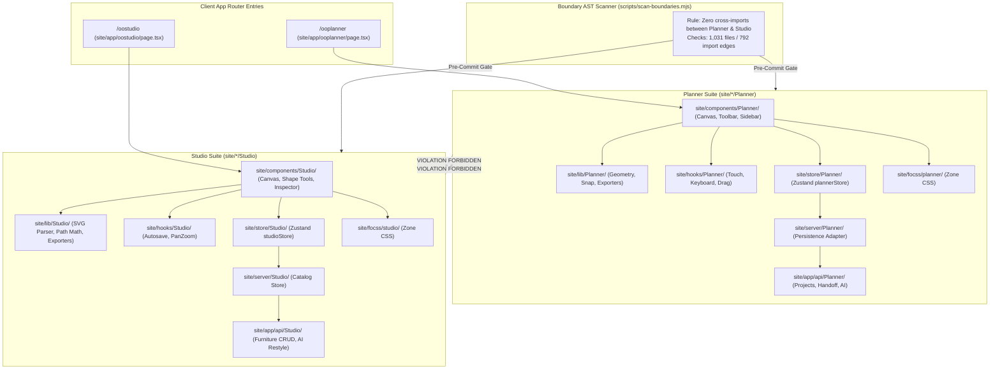

# Studio & Planner Suites Architecture Audit

**Target Systems:** Furniture Studio (`/oostudio`) and Space Planner (`/ooplanner`)  
**Audit Scope:** Forked namespace separation, 2D/3D canvas engines, geometry calculation, state serialization, boundary scan governance, and test coverage.  
**Repository State:** Read-Only (`d:/23082026`) — Non-destructive verification.

---

## 1. Executive Summary

Oando maintains two flagship web application suites: **Planner (`/ooplanner`)**, an architectural floorplan design and furniture layout tool, and **Studio (`/oostudio`)**, a parametric 2D/3D furniture authoring and catalog design engine. The two products are **strictly forked** across ten independent category namespaces. They share no runtime code, enforce zero cross-imports, and are validated by automated AST boundary scanners in CI (`pnpm run scan:boundaries`).



---

## 2. Namespace Split & Responsibility Map

The two applications are mirrored across category-specific directories:

| Category Layer | Planner Namespace | Studio Namespace | Disjoint Responsibility |
| :--- | :--- | :--- | :--- |
| **App Route Entry** | [`site/app/ooplanner/page.tsx`](file:///d:/23082026/site/app/ooplanner/page.tsx) | [`site/app/oostudio/page.tsx`](file:///d:/23082026/site/app/oostudio/page.tsx) | Thin App Router mounting shells with guest vs staff guards. |
| **Components** | [`site/components/Planner/`](file:///d:/23082026/site/components/Planner) | [`site/components/Studio/`](file:///d:/23082026/site/components/Studio) | Planner: 2D floorplan canvas, room walls. Studio: furniture drafting workbench. |
| **Libraries** | [`site/lib/Planner/`](file:///d:/23082026/site/lib/Planner) | [`site/lib/Studio/`](file:///d:/23082026/site/lib/Studio) | Planner: wall snap math, BOQ math. Studio: SVG bezier math, path grouping. |
| **Custom Hooks** | [`site/hooks/Planner/`](file:///d:/23082026/site/hooks/Planner) | [`site/hooks/Studio/`](file:///d:/23082026/site/hooks/Studio) | Planner: floorplan keyboard shortcuts. Studio: draft autosave and history stack. |
| **Store** | [`site/store/Planner/`](file:///d:/23082026/site/store/Planner) | [`site/store/Studio/`](file:///d:/23082026/site/store/Studio) | Planner: `usePlannerStore`. Studio: `useStudioStore`. |
| **Server Persistence**| [`site/server/Planner/`](file:///d:/23082026/site/server/Planner) | [`site/server/Studio/`](file:///d:/23082026/site/server/Studio) | Planner: `oando_plans` with revision CAS. Studio: `furniture_catalog` drafts. |
| **API Endpoints** | [`site/app/api/Planner/`](file:///d:/23082026/site/app/api/Planner) | [`site/app/api/Studio/`](file:///d:/23082026/site/app/api/Studio) | Planner: `/api/Planner/projects`, `/handoff`. Studio: `/api/Studio/furniture`. |
| **Zone CSS** | [`site/focss/planner/`](file:///d:/23082026/site/focss/planner) | [`site/focss/studio/`](file:///d:/23082026/site/focss/studio) | Custom FOCSS themes and canvas coordinate ruler stylings. |

---

## 3. Canvas Engine & Geometry Comparison

| Dimension | Space Planner (`/ooplanner`) | Furniture Studio (`/oostudio`) |
| :--- | :--- | :--- |
| **Primary Domain** | Room architectures (walls, windows, doors, spaces). | Individual furniture items (desks, task chairs, credenzas). |
| **Coordinate System** | Real-world metric millimeters (`1px = 10mm` default scale). | Arbitrary vector grid with normalized bounding box scale. |
| **Snap Geometry** | Wall-to-wall snapping, 90° angle constraints, 900mm aisle clearance. | Anchor vector connectors, grid alignment, symmetry snapping. |
| **Object Model** | Compound architectural blocks with live Bill of Quantities (BOQ). | Primitive vector paths, compound SVG groups, 3D asset bindings. |
| **Export Formats** | High-res PDF proposal, CAD DXF, Floorplan SVG, Client JSON, CSV BOQ. | Scalable SVG symbol, 3D GLTF model link, catalog PNG thumbnail. |

---

## 4. State Management, Revision CAS & Serialization

### 4.1 Planner State Machine (`site/store/Planner/`)
* **State Store:** `usePlannerStore` manages active floorplan items, selection sets, viewports, history undo/redo stacks, and measurement layers.
* **Revision CAS (Compare-And-Swap):** Floorplan saves include `revision: number`. Updates assert `WHERE revision = expectedRevision` to eliminate concurrent overwrite collisions.
* **Idempotency Keys:** Every mutation includes a unique UUID idempotency key to protect against duplicate network submissions on flaky mobile connections.
* **Guest Mode:** In unauthenticated guest mode (`/portal/guest`), floorplan changes are persisted in client IndexedDB / localStorage and synced seamlessly upon sign-in.

### 4.2 Studio State Machine (`site/store/Studio/`)
* **State Store:** `useStudioStore` controls active drawing primitives, layer ordering, fill colors, stroke widths, and 3D bounding boxes.
* **Draft Autosave (`useStudioDraftAutosave.ts`):** Debounced auto-save (1,500ms) stores furniture designs to `public.product_studio_drafts` in the Admin DB.
* **Catalog Publishing Pipeline:** When approved, the `/api/Studio/furniture/[id]/publish` endpoint sanitizes SVG paths, generates a preview PNG thumbnail, and publishes the block into `public.furniture_catalog`.

---

## 5. Boundary Scanner Governance (`scripts/scan-boundaries.mjs`)

The purity of the fork is continuously audited by `scripts/scan-boundaries.mjs`:

### 5.1 Enforced Invariants
1. **Zero Cross-Imports:** No file in `site/*/Planner` may import anything from `site/*/Studio` (and vice versa).
2. **Namespace Integrity:** All 10 required roots must exist and contain authority anchor files (`plannerPalette.ts`, `studioPalette.ts`, etc.).
3. **No Dead Source Trees:** Rejects any resurrected legacy directories (`site/apps/planner`, `site/apps/studio`).
4. **Zero Shared Layer:** Shared utilities must live under `site/features/shared/` or `site/lib/`, strictly partitioned from product-specific logic.

### 5.2 Live Scan Proof
```
$ node scripts/scan-boundaries.mjs
=== planner / studio boundary scan (relocated namespaces) ===
files scanned: 1031
owned files analyzed: 265
import edges checked: 792
boundary OK — zero cross-product edges, namespaces verified, no shared layer.
```

---

## 6. Verification & Test Coverage Matrix

The suite is verified across both unit and browser test lanes:

| Suite | Scope | File / Path | Test Count | Result |
| :--- | :--- | :--- | :---: | :---: |
| **Planner Unit** | Persistence, Geometry, Math | [`tests/unit/planner/`](file:///d:/23082026/tests/unit/planner) | 394 tests | Passed (0 failures) |
| **Studio Unit** | Canvas, Exporters, Colors | [`tests/unit/studio/`](file:///d:/23082026/tests/unit/studio) | 88 tests | Passed (0 failures) |
| **Boundary Scan** | Import Edge Graph | `scripts/scan-boundaries.mjs` | 792 edges | Zero violations |
| **E2E Smoke** | Planner Workspace | [`tests/e2e/planner-guest-workspace.spec.ts`](file:///d:/23082026/tests/e2e/planner-guest-workspace.spec.ts) | E2E Scenario | Passed |
| **E2E Catalog** | Furniture Catalog Binding | [`tests/e2e/planner-catalog.spec.ts`](file:///d:/23082026/tests/e2e/planner-catalog.spec.ts) | E2E Scenario | Passed |

---

## 7. Operational Findings & Architecture Summary

* **Finding SP-01 — Fork Purity Complete:** The transition of Planner and Studio into distinct, unlinked product trees is 100% complete with zero leaks.
* **Finding SP-02 — Concurrency Safety via CAS:** Planner floorplans cannot suffer from silent overwrites due to strict revision CAS validation.
* **Finding SP-03 — Studio Export Sanitization:** Studio SVGs pass through XML and XSS sanitizers before being committed into the furniture catalog.
