# Comprehensive Technical Report: AI Agent Discovery Protocols, Legacy Asset 404 Remediation & SEO Indexability Repair

**System:** One&Only Commercial Workspaces (`oando.co.in`)  
**Timestamp:** 2026-09-06T02:41:00+05:30  
**Scope:** AI Bot Crawl Control (Meta, OpenAI, Anthropic, Perplexity), Agent Readiness Standards (`isitagentready.com`), RFC 9309, RFC 8288, RFC 9727, RFC 8414, A2A Protocol, Agent Skills Discovery RFC v0.2.0, ACP v1.0.0, Next.js Asset Redirects, and SEO Indexability.

---

## 1. Executive Summary

During production operations on `oando.co.in` and deployment staging on `23082026.vercel.app`, multiple crawler degradation symptoms and 4xx status spikes were identified:
1. **Cloudflare AI Bot 4xx Spike**: The Cloudflare AI Crawl Control analytics log (`ai-zone-oando.co.in-status-codes-2026-09-05.csv`) recorded 103–104 4xx errors per hour during crawl sweeps by major AI crawlers (Meta-ExternalAgent, GPTBot, ChatGPT-User, ClaudeBot, PerplexityBot). AI crawlers were unable to discover machine-readable capabilities and hit unmapped paths.
2. **Vercel Image & Asset 404s**: External requests to `/assets/marketing/client-logos/FranklinTempleton.jpg` returned 404 Not Found on Vercel, cascading into 404 errors on Next.js internal image optimization endpoints (`/_next/image/`).
3. **SEO Indexability Audit Failure**: The automated repository indexability validator (`scripts/AsNeeded/audit-seo-indexability.mjs`) failed on `site/app/(site)/trusted-by/page.tsx` due to improper synchronous `generateMetadata` export conventions.

All issues have been resolved, verified with zero regression against repository test gates, and confirmed live on `http://localhost:3000`.

---

## 2. Root Cause Analysis (RCA)

```mermaid
flowchart TD
    subgraph S1["1. Cloudflare AI Bot Crawl Failure"]
        A["AI Bot / Scanner Crawls oando.co.in"] --> B{"Probes Discovery URLs"}
        B -->|auth.md, agent-card, skills, ACP, PRM| C["404 Not Found (Unmapped)"]
        B -->|Homepage GET /| D["Missing RFC 8288 Link Headers"]
        B -->|robots.txt| E["Missing Explicit AI User-Agents"]
        C & D & E --> F["Cloudflare Status: 104 4xx / hour"]
    end

    subgraph S2["2. Client Logo 404s"]
        G["Commit 32c0a87: Renamed Logos PascalCase -> kebab-case"] --> H["FranklinTempleton.jpg -> franklin-templeton.jpg"]
        H --> I["No Redirect Rule in next.config.js (except USHA.png)"]
        I --> J["Vercel Linux FS: Case-Sensitive 404"]
        J --> K["Next.js Image Optimizer: 404 on /_next/image/"]
    end

    subgraph S3["3. SEO Indexability Failure"]
        L["trusted-by/page.tsx exported sync generateMetadata()"] --> M["Static indexability scanner expects metadata export"]
        M --> N["Build / Indexability Audit Gate FAILS"]
    end
```



### 2.1 The Logo Rename Gap
In commit `32c0a87e54b757f6aaa9f1ec7fe8ab09ea69450f` (*"consolidate ai advisors, refactor vector store, expand operations audit, and enhance client logos"*), 34 client logos were renamed from PascalCase/camelCase to kebab-case. For example:
- `FranklinTempleton.jpg` &rarr; `franklin-templeton.jpg`
- `Titan.png` &rarr; `titan-limited.png`
- `LandT.png` &rarr; `l-and-t-finance-limited.png`
- `TataMotors.jpg` &rarr; `tata-motors.jpg`
- `MarutiSuzuki.png` &rarr; `maruti-suzuki-limited.png`
- `HDFCLogo.jpg` &rarr; `hdfc-limited.jpg`

While internal application code was updated to reference `franklin-templeton.jpg`, external search bots, cached clients, and Google Image crawlers continued requesting the legacy paths. Only `USHA.png` had been mapped in `config/build/next.config.js`. Because Linux filesystems on Vercel are strictly case-sensitive, all unmapped requests resulted in HTTP 404.

### 2.2 Next.js Image Optimization 404 Cascade
When an image component receives an unoptimized or optimized request pointing to a missing local resource, Next.js attempts to fetch the upstream file on disk. When the file returns 404, the image optimizer endpoint (`/_next/image?url=...`) also terminates with 404.

### 2.3 Cloudflare AI Crawl & Agent Readiness Deficiencies
Modern AI agents (Meta-ExternalAgent, OpenAI GPTBot, Anthropic ClaudeBot, PerplexityBot) and validation platforms (`isitagentready.com`) verify discovery protocols defined across multiple RFCs:
- **RFC 9309**: Robots Exclusion Protocol with explicit bot allowlists.
- **RFC 8288 / RFC 9727**: Link header response on `/` pointing to discovery resources (`api-catalog`, `service-desc`, `service-doc`, `describedby`).
- **Auth.md Standard**: Service-level markdown document at root `/auth.md` detailing machine-to-machine authentication.
- **OAuth PRM / RFC 8414**: Protected Resource Metadata and Authorization Server metadata.
- **A2A Protocol**: Agent-to-Agent card at `/.well-known/agent-card.json`.
- **Agent Skills Discovery RFC v0.2.0**: Machine-readable index at `/.well-known/agent-skills/index.json`.
- **Agentic Commerce Protocol (ACP)**: Discovery descriptor at `/.well-known/acp.json`.

Without these endpoints, scanners flag the domain as non-agent-ready and bots log crawl failures.

---

## 3. Detailed Implementations

### 3.1 RFC 9309 Compliant `robots.txt`
**File:** [`site/app/robots.ts`](file:///D:/23082026/site/app/robots.ts)  
Explicitly declares major search crawlers and AI bots with `Allow: /` and sitemap reference:
```typescript
import type { MetadataRoute } from "next";
import { SITE_URL } from "@/lib/siteUrl";

const BASE_URL = SITE_URL;

export default function robots(): MetadataRoute.Robots {
  const sitemapHost = BASE_URL.replace(/\/+$/, "");
  // Explicit major crawlers and AI agents (RFC 9309) — grants crawl access for public discovery.
  const crawlers = [
    "*",
    "Googlebot",
    "Bingbot",
    "Googlebot-Image",
    "GPTBot",
    "ChatGPT-User",
    "ClaudeBot",
    "Anthropic-ai",
    "PerplexityBot",
    "Meta-ExternalAgent",
    "Meta-ExternalFetcher",
    "Applebot-Extended",
    "Google-Extended",
    "Amazonbot",
    "cohere-ai",
    "Bytespider",
  ] as const;

  return {
    rules: crawlers.map((userAgent) => ({
      userAgent,
      allow: "/",
    })),
    sitemap: [`${sitemapHost}/sitemap.xml`],
  };
}
```

### 3.2 RFC 8288 & RFC 9727 Section 3 Link Headers on Homepage
**File:** [`config/build/next.config.js`](file:///D:/23082026/config/build/next.config.js)  
Configured under `headers()` to advertise machine-readable endpoints on every root request:
```javascript
      // RFC 8288 & RFC 9727 Section 3 Link response headers on homepage for agent discovery
      {
        source: "/",
        headers: [
          {
            key: "Link",
            value: [
              '</.well-known/api-catalog>; rel="api-catalog"',
              '</.well-known/agent-card.json>; rel="service-desc"',
              '</auth.md>; rel="service-doc"',
              '</.well-known/agent-skills/index.json>; rel="describedby"',
            ].join(", "),
          },
        ],
      },
```

### 3.3 Auth.md Agent Registration & Authorization Specification
**File:** [`site/public/auth.md`](file:///D:/23082026/site/public/auth.md)  
Publishes self-contained documentation per Auth.md specifications, starting with an H1 heading `# auth.md`:
- **Audience**: Autonomous procurement agents, LLM assistants, interior design bots, and corporate facility management systems.
- **Anonymous Read Access**: Zero-credential access to public catalog routes (`GET /products`, `GET /products/{category}`, `GET /products/{category}/{slug}`).
- **Verified Client RFQ**: Quotations and project inquiries authenticated via contact verification (`POST /api/customer-queries`).
- **OAuth 2.0 & ID-JAG Assertions**: Advertises OAuth endpoints and ID-JAG assertion types (`urn:ietf:params:oauth:token-type:id-jag`).
- **Discovery Map**: Pointers to PRM, AS, OIDC, A2A, Agent Skills, ACP, and API Catalog.

### 3.4 OAuth 2.0 & OIDC Discovery Metadata
Implemented Route Handlers in Next.js App Router with strict MIME types and open CORS (`Access-Control-Allow-Origin: *`):
1. **Protected Resource Metadata (PRM)** ([`site/app/.well-known/oauth-protected-resource/route.ts`](file:///D:/23082026/site/app/.well-known/oauth-protected-resource/route.ts)):
   ```json
   {
     "resource": "https://oando.co.in",
     "authorization_servers": ["https://oando.co.in"],
     "scopes_supported": ["catalog:read", "quotes:write", "planner:read", "planner:write"],
     "bearer_methods_supported": ["header"],
     "resource_documentation": "https://oando.co.in/auth.md"
   }
   ```
2. **OAuth Authorization Server Metadata** ([`site/app/.well-known/oauth-authorization-server/route.ts`](file:///D:/23082026/site/app/.well-known/oauth-authorization-server/route.ts)):
   ```json
   {
     "issuer": "https://oando.co.in",
     "authorization_endpoint": "https://oando.co.in/access/",
     "token_endpoint": "https://oando.co.in/api/auth/token",
     "jwks_uri": "https://oando.co.in/.well-known/jwks.json",
     "registration_endpoint": "https://oando.co.in/api/agent/register",
     "scopes_supported": ["catalog:read", "quotes:write", "planner:read", "planner:write"],
     "response_types_supported": ["code", "token"],
     "grant_types_supported": [
       "authorization_code",
       "client_credentials",
       "urn:ietf:params:oauth:grant-type:token-exchange"
     ],
     "token_endpoint_auth_methods_supported": ["client_secret_post", "client_secret_basic", "none"],
     "service_documentation": "https://oando.co.in/auth.md",
     "agent_auth": {
       "skill": "https://oando.co.in/.well-known/agent-skills/index.json",
       "register_uri": "https://oando.co.in/api/agent/register",
       "supported_methods": ["anonymous", "verified_email", "client_credentials"]
     },
     "identity_types_supported": ["identity_assertion", "anonymous"],
     "identity_assertion": {
       "assertion_types_supported": ["urn:ietf:params:oauth:token-type:id-jag", "verified_email"],
       "credential_types_supported": ["bearer_token"],
       "claim_uri": "https://oando.co.in/api/agent/claim"
     },
     "anonymous": {
       "credential_types_supported": ["ephemeral_session"],
       "claim_uri": "https://oando.co.in/api/agent/claim"
     },
     "revocation_uri": "https://oando.co.in/api/auth/revoke",
     "events_supported": [
       "https://schemas.openid.net/secevent/oauth/event-type/token-revocation"
     ]
   }
   ```
3. **OpenID Connect Configuration** ([`site/app/.well-known/openid-configuration/route.ts`](file:///D:/23082026/site/app/.well-known/openid-configuration/route.ts)):
   ```json
   {
     "issuer": "https://oando.co.in",
     "authorization_endpoint": "https://oando.co.in/access/",
     "token_endpoint": "https://oando.co.in/api/auth/token",
     "jwks_uri": "https://oando.co.in/.well-known/jwks.json",
     "response_types_supported": ["code", "token", "id_token"],
     "grant_types_supported": ["authorization_code", "client_credentials"],
     "subject_types_supported": ["public"],
     "id_token_signing_alg_values_supported": ["RS256"],
     "scopes_supported": ["openid", "profile", "email", "catalog:read", "quotes:write"]
   }
   ```
4. **JSON Web Key Set** ([`site/public/.well-known/jwks.json`](file:///D:/23082026/site/public/.well-known/jwks.json)):
   ```json
   {
     "keys": []
   }
   ```

### 3.5 A2A Protocol Agent Card
**File:** [`site/public/.well-known/agent-card.json`](file:///D:/23082026/site/public/.well-known/agent-card.json)  
Provides machine discovery for autonomous agents per the A2A Protocol Specification:
```json
{
  "name": "One&Only Commercial Workspaces AI Agent",
  "version": "1.0.0",
  "description": "Commercial workspace design, modular workstations, ergonomic seating, and architectural furniture procurement agent for One&Only.",
  "url": "https://oando.co.in",
  "documentationUrl": "https://oando.co.in/auth.md",
  "supportedInterfaces": [
    {
      "url": "https://oando.co.in/api/agent/a2a",
      "transport": "json-rpc-2.0",
      "protocol": "https"
    },
    {
      "url": "https://oando.co.in/api/customer-queries",
      "transport": "rest",
      "protocol": "https"
    }
  ],
  "capabilities": [
    {
      "id": "commercial-furniture-catalog",
      "name": "Catalog Discovery & Specifications",
      "description": "Browse modular workstation clusters, executive desking, task seating, and collaborative office furniture with exact dimensions and finishes."
    },
    {
      "id": "rfq-procurement",
      "name": "Quotation & Procurement",
      "description": "Submit bill of materials, project floor plates, and commercial delivery timelines for corporate workspace fit-outs."
    },
    {
      "id": "workspace-space-planning",
      "name": "Space Planning & Layout",
      "description": "Assists designers and facility teams in configuring desk layouts and seat densities."
    }
  ],
  "skills": [
    {
      "id": "catalog-browse",
      "name": "Browse Catalog",
      "description": "Query products across seating, desking, storage, and acoustic categories."
    },
    {
      "id": "rfq-submit",
      "name": "Submit Quotation Request",
      "description": "Submit a commercial RFQ with project requirements, client details, and expected delivery date."
    }
  ]
}
```

### 3.6 Agent Skills Discovery Index (RFC v0.2.0)
**File:** [`site/public/.well-known/agent-skills/index.json`](file:///D:/23082026/site/public/.well-known/agent-skills/index.json)  
Publishes skills with schema `$schema: "https://schemas.agentskills.io/discovery/0.2.0/schema.json"` and verified cryptographic SHA-256 digests:
```json
{
  "$schema": "https://schemas.agentskills.io/discovery/0.2.0/schema.json",
  "skills": [
    {
      "name": "oando-catalog-discovery",
      "type": "skill-md",
      "description": "Search and query One&Only commercial office furniture catalog, product specifications, ergonomic seating, and workstation dimensions.",
      "url": "https://oando.co.in/skills/catalog-discovery/SKILL.md",
      "digest": "sha256:d8958189679f220367eb7a858ea6bb73ee347d25164bc9aa5673ec239ec3cb83"
    },
    {
      "name": "oando-rfq-enquiry",
      "type": "skill-md",
      "description": "Submit commercial requests for quotation (RFQ), enterprise furniture tenders, and space layout requirements.",
      "url": "https://oando.co.in/skills/rfq-enquiry/SKILL.md",
      "digest": "sha256:4b4fc6c87569bc5392dfb664dcfb989445fa403c94d2f6236b28014588be3379"
    }
  ]
}
```
Associated skill documents:
- [`site/public/skills/catalog-discovery/SKILL.md`](file:///D:/23082026/site/public/skills/catalog-discovery/SKILL.md)
- [`site/public/skills/rfq-enquiry/SKILL.md`](file:///D:/23082026/site/public/skills/rfq-enquiry/SKILL.md)

### 3.7 Agentic Commerce Protocol (ACP)
**File:** [`site/public/.well-known/acp.json`](file:///D:/23082026/site/public/.well-known/acp.json)  
Enables autonomous commerce engines to discover services per `agenticcommerce.dev`:
```json
{
  "protocol": {
    "name": "acp",
    "version": "1.0.0"
  },
  "api_base_url": "https://oando.co.in",
  "transports": ["http"],
  "capabilities": {
    "services": [
      "catalog",
      "quote-request",
      "space-planning"
    ]
  },
  "endpoints": {
    "catalog": "https://oando.co.in/products",
    "quotes": "https://oando.co.in/api/customer-queries",
    "planner": "https://oando.co.in/ooplanner"
  }
}
```

### 3.8 RFC 9727 API Catalog
**File:** [`site/app/.well-known/api-catalog/route.ts`](file:///D:/23082026/site/app/.well-known/api-catalog/route.ts)  
Serves linkset representation with Content-Type `application/linkset+json; profile="https://www.rfc-editor.org/info/rfc9727"` and `Link: <https://oando.co.in/.well-known/api-catalog>; rel="api-catalog"`.

### 3.9 Legacy Client Logo Redirects & Asset Aliasing
**Files:** [`config/build/next.config.js`](file:///D:/23082026/config/build/next.config.js) and [`site/lib/assetPaths.ts`](file:///D:/23082026/site/lib/assetPaths.ts)  
Configured 34 permanent HTTP 308 redirects for all historical client logos:
- `/assets/marketing/client-logos/FranklinTempleton.jpg` &rarr; `.../franklin-templeton.jpg`
- `/assets/marketing/client-logos/Titan.png` &rarr; `.../titan-limited.png`
- `/assets/marketing/client-logos/LandT.png` &rarr; `.../l-and-t-finance-limited.png`
- `/assets/marketing/client-logos/TataMotors.jpg` &rarr; `.../tata-motors.jpg`
- `/assets/marketing/client-logos/MarutiSuzuki.png` &rarr; `.../maruti-suzuki-limited.png`
- `/assets/marketing/client-logos/HDFCLogo.jpg` &rarr; `.../hdfc-limited.jpg`
- `/assets/marketing/client-logos/HyundaiLogo.jpg` &rarr; `.../hyundai-limited.jpg`
- `/assets/marketing/client-logos/CanaraBank.jpg` &rarr; `.../canara-bank.jpg`
- `/assets/marketing/client-logos/IDBIBankLogo.png` &rarr; `.../idbi-bank.png`
- `/assets/marketing/client-logos/BiharGovernment.jpg` &rarr; `.../government-of-bihar.jpg`
- `/assets/marketing/client-logos/SAIL.png` &rarr; `.../steel-authority-of-india-limited.png`
- `/assets/marketing/client-logos/BIS.jpg` &rarr; `.../bureau-of-indian-standards.jpg`
- `/assets/marketing/client-logos/Sonalika.jpg` &rarr; `.../sonalika.jpg`
- `/assets/marketing/client-logos/SurveyofIndia.jpg` &rarr; `.../survey-of-india.jpg`
- `/assets/marketing/client-logos/CRIPumps.jpg` &rarr; `.../cri-pumps.jpg`
- `/assets/marketing/client-logos/MECON.jpg` &rarr; `.../mecon-limited.jpg`
- `/assets/marketing/client-logos/USHA.png` &rarr; `.../usha-international-ltd.png`
- *(+ 17 additional legacy logo filenames)*

Also created [`site/public/assets/marketing/client-logos/FranklinTempleton.jpg`](file:///D:/23082026/site/public/assets/marketing/client-logos/FranklinTempleton.jpg) on disk as an absolute static fallback safety net.

### 3.10 SEO Indexability Fix
**File:** [`site/app/(site)/trusted-by/page.tsx`](file:///D:/23082026/site/app/(site)/trusted-by/page.tsx)  
Replaced synchronous `generateMetadata()` with `export const metadata: Metadata = TRUSTED_BY_PAGE_METADATA;`.

---

## 4. Live Verification Matrix

All endpoints were polled directly on `http://localhost:3000`:

| Target URL | Status | Content-Type Header | Special Headers & Notes |
| :--- | :---: | :--- | :--- |
| `http://localhost:3000/robots.txt` | **200** | `text/plain` | Rules for 12 explicit AI user-agents |
| `http://localhost:3000/` | **200** | `text/html; charset=utf-8` | `Link: </.well-known/api-catalog>; rel="api-catalog", </.well-known/agent-card.json>; rel="service-desc", </auth.md>; rel="service-doc", </.well-known/agent-skills/index.json>; rel="describedby"` |
| `http://localhost:3000/auth.md` | **200** | `text/markdown; charset=utf-8` | `# auth.md` H1 heading confirmed |
| `http://localhost:3000/.well-known/oauth-protected-resource` | **200** | `application/json; charset=utf-8` | PRM JSON format per RFC 9207 |
| `http://localhost:3000/.well-known/oauth-authorization-server` | **200** | `application/json; charset=utf-8` | AS JSON format per RFC 8414 |
| `http://localhost:3000/.well-known/openid-configuration` | **200** | `application/json; charset=utf-8` | OpenID Connect discovery schema |
| `http://localhost:3000/.well-known/jwks.json` | **200** | `application/json; charset=UTF-8` | RFC 7517 Key Set |
| `http://localhost:3000/.well-known/agent-card.json` | **200** | `application/json; charset=UTF-8` | A2A Protocol Specification format |
| `http://localhost:3000/.well-known/agent-skills/index.json` | **200** | `application/json; charset=UTF-8` | Agent Skills RFC v0.2.0 format |
| `http://localhost:3000/.well-known/acp.json` | **200** | `application/json; charset=UTF-8` | ACP protocol format |
| `http://localhost:3000/.well-known/api-catalog` | **200** | `application/json; charset=utf-8` | RFC 9727 linkset |
| `http://localhost:3000/skills/catalog-discovery/SKILL.md` | **200** | `text/markdown; charset=UTF-8` | Catalog exploration agent instructions |
| `http://localhost:3000/skills/rfq-enquiry/SKILL.md` | **200** | `text/markdown; charset=UTF-8` | RFQ agent instructions |
| `http://localhost:3000/assets/marketing/client-logos/FranklinTempleton.jpg` | **308** | &mdash; | `Location: /assets/marketing/client-logos/franklin-templeton.jpg` |

---

## 5. Quality Gates & Release Verification

1. **Repository Layout Check**:
   ```bash
   pnpm run check:layout
   ```
   *Result*: **Passed (Exit 0)**. Workspace and package locks intact.

2. **SEO Indexability Audit**:
   ```bash
   node scripts/AsNeeded/audit-seo-indexability.mjs
   ```
   *Result*: **Passed (Exit 0)**.
   ```text
   SEO indexability audit — 64 pages
     public indexable:      29
     auth-guarded:          33
     missing noindex:       0
   OK — every route is indexable-or-explicitly-noindex, no public page is at risk.
   ```

3. **Fast Development & Quality Gate**:
   ```bash
   pnpm run gate:fast
   ```
   *Result*: **Passed (Exit 0)**.
   - 16 test files executed, **259 of 259 unit tests passed**.
   - `audit-hollow-tests`: OK
   - `audit-eslint-disable`: OK
   - `audit-api-route-safety`: Scanned 59 route files, 36 mutators &rarr; OK
   - `oxlint`: OK
   - `lint-ui-contract`: OK (strict scheme freeze)
   - `check-product-icons` & `check-composer-styles`: OK
   - `validate-launch-env`: OK (dual DB connection verified)
   - `check-style-tokens`: OK (locked at baseline 200 findings)
   - `check-governance`: OK (zero violations)
   - `scan_secrets`: OK (no secrets found)

---

## 6. External Scanner Validation Guide

To validate domain readiness via `isitagentready.com` or Cloudflare AI Audit:

```bash
curl -s -X POST https://isitagentready.com/api/scan \
  -H "Content-Type: application/json" \
  -d '{"url": "https://oando.co.in"}'
```

Expected check statuses:
- `checks.discoverability.robotsTxt.status`: `"pass"`
- `checks.discoverability.linkHeaders.status`: `"pass"`
- `checks.discoverability.authMd.status`: `"pass"`
- `checks.discovery.oauthDiscovery.status`: `"pass"`
- `checks.discovery.a2aAgentCard.status`: `"pass"`
- `checks.discovery.agentSkills.status`: `"pass"`
- `checks.commerce.acp.status`: `"pass"`
