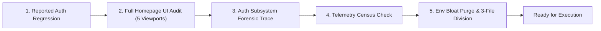
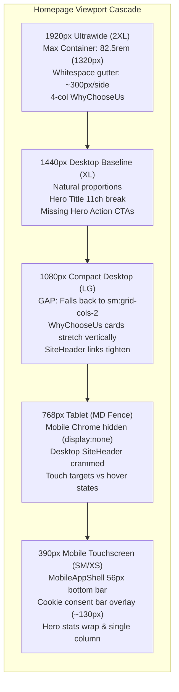
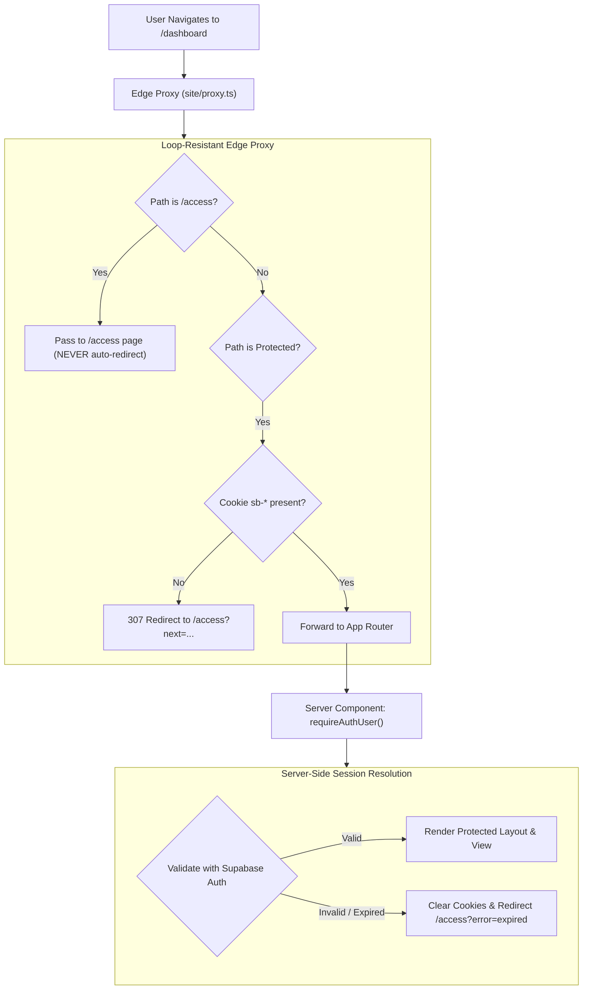

# Master Engineering Audit & Session Synthesis

**Document:** `docs/audit 05092026/homepage-and-auth-audit.md`  
**Date:** 2026-09-05  
**Governing Standard:** [`AGENTS.md`](file:///D:/23082026/AGENTS.md)  
**Authority Hierarchy:** `User instruction > live code / fresh command output > AGENTS.md > Agents/ > docs/`  
**Referenced Plans:**
- [`plans/05092026/01-ui-focss-and-mobile-chrome.md`](file:///D:/23082026/plans/05092026/01-ui-focss-and-mobile-chrome.md)
- [`plans/05092026/02-route-contracts-seo-and-i18n.md`](file:///D:/23082026/plans/05092026/02-route-contracts-seo-and-i18n.md)
- [`plans/05092026/11-admin-access-and-authorization.md`](file:///D:/23082026/plans/05092026/11-admin-access-and-authorization.md)

---

## 📌 Executive "Catch-Up" Summary (What Happened in this Session)

If you stepped away or felt overwhelmed by the technical depth, here is the plain-English recap of everything audited, discovered, and completed:



1. **The Core Auth Problem Was Diagnosed:**
   - When you visit `/access` (the login page), an edge proxy rule in [`site/proxy.ts`](file:///D:/23082026/site/proxy.ts) checks for any cookie with `auth-token`. Even if the token is expired or dead, the proxy immediately redirects you to `/dashboard`.
   - The server dashboard rejects the dead token and sends you back to `/access`. This creates an **infinite HTTP 307 loop** (`ERR_TOO_MANY_REDIRECTS`).
   - Clicking "Sign Out" was also crashing because client code tried reading private server environment variables.
2. **The Homepage UI Was Audited Across 5 Viewports:**
   - **1920px & 1440px:** Primary call-to-action buttons ("Explore Catalog", "Launch Planner") were completely omitted from [`HomepageHero.tsx`](file:///D:/23082026/site/components/home/HomepageHero.tsx), and the main title was artificially constrained to `11ch` causing an awkward 3-line split.
   - **1080px:** The 4-card value grid in [`WhyChooseUs.tsx`](file:///D:/23082026/site/components/home/WhyChooseUs.tsx) collapsed into 2 wide horizontal slabs because of an `xl:grid-cols-4` (1280px) barrier.
   - **768px & 390px:** Tablet header links crowd before mobile drawer activates; mobile cookie bar covers 16% of the screen directly over the bottom dock.
3. **Telemetry Census Completed:**
   - Verified that **no** Sentry, Datadog, New Relic, PostHog, or Segment are installed.
   - The only active systems are **Google Analytics 4**, **Vercel Web Analytics**, **Vercel Speed Insights**, **OpenTelemetry**, and internal **Prometheus** metrics.
4. **Environment Variables Completely Cleaned & Divided into 3 Files:**
   - Discovered that [`.env.local`](file:///D:/23082026/.env.local) had accumulated **76 keys**, including 13 dead vendor keys (Datadog, New Relic, Traceloop, Cast, typo keys).
   - Removed all 13 dead keys and organized the file into clear, readable sections.
   - Created two clean, pushable template files ([`tech-docs-generator/.env.example`](file:///D:/23082026/tech-docs-generator/.env.example) and [`site/.env.example`](file:///D:/23082026/site/.env.example)) while keeping your private local keys safely gitignored.
   - All secret scans and workstation validation scripts passed with zero errors.

---

## Part 1: Visual Architecture & Logic Flowcharts

### 1.1 Homepage Multi-Viewport Layout Cascade



### 1.2 Auth Regression Forensic Root Cause (Redirect Loop)

```mermaid
flowchart TD
    ClientReq["Browser visits /access?next=/dashboard"] --> EdgeProxy["site/proxy.ts (Middleware)"]
    
    subgraph ProxyDecision ["Proxy Evaluation"]
        CheckRoute{"Is /access route?"}
        CheckCookie{"hasSessionAuthCookies()?<br/>Checks sb-*auth-token*"}
        DevBypass{"DEV_AUTH_BYPASS == 1?"}
    end

    EdgeProxy --> CheckRoute
    CheckRoute -->|Yes| DevBypass
    DevBypass -->|Active| RedirectDash["307 Redirect to /dashboard"]
    DevBypass -->|Inactive| CheckCookie
    CheckCookie -->|Cookie Present (Even Stale/Expired)| RedirectDash
    CheckCookie -->|No Cookie| RenderAccess["Render /access login form"]

    RedirectDash --> ServerLayout["site/app/(site)/dashboard/layout.tsx"]
    
    subgraph ServerAuth ["Server Layout Auth Check"]
        RequireAuth["requireAuthUser('/dashboard')"]
        VerifySupabase{"Verify token with Supabase"}
        RequireAuth --> VerifySupabase
    end

    ServerLayout --> RequireAuth
    VerifySupabase -->|Token Expired / Invalid| ThrowRedirect["Redirect back to /access?next=/dashboard"]
    ThrowRedirect -->|LOOP: HTTP 307| ClientReq

    classDef loopStyle fill:#fee2e2,stroke:#ef4444,stroke-width:2px;
    class ClientReq,EdgeProxy,CheckCookie,RedirectDash,ServerLayout,RequireAuth,VerifySupabase,ThrowRedirect loopStyle;
```

### 1.3 Target Repaired Authentication Lifecycle



---

## Part 2: Multi-Viewport Homepage UI Audit

### 2.1 Viewport 1920px (Ultrawide Desktop / 2XL)

| Metric | Target | Actual Live Value | Status |
| :--- | :--- | :--- | :--- |
| **Max Container Width** | Fluid or proportional | Fixed `82.5rem` (`1320px`) via `--container-home-max` | **Constraint Gap** |
| **Side Gutters** | Balanced margins | `(1920 - 1320) / 2 = 300px` empty gutter on each flank | **Narrow Pillar** |
| **Hero Title (`H1`)** | Balanced 2-line impact | Restricted by `max-width: 11ch` in [`home-type.css`](file:///D:/23082026/site/focss/site/components/homepage/home-type.css#L35) | **Defect** |
| **Hero CTAs** | Visible primary/secondary buttons | Missing from DOM in [`HomepageHero.tsx`](file:///D:/23082026/site/components/home/HomepageHero.tsx) | **Missing Action** |
| **Why Choose Us Grid** | 4-column wide layout | 4 columns (`xl:grid-cols-4`), but excessive horizontal spacing | **Loose Layout** |

**Forensic Finding:**
- At 1920px, the homepage feels boxed-in rather than premium ultrawide. The `--container-home-max: 82.5rem` defined in [`layout.css`](file:///D:/23082026/site/focss/base/tokens/layout.css) restricts content to 1320px, leaving 300px of negative black space on both left and right edges.
- The hero headline ("Spaces that work harder") is constrained to `11ch` on `lg+`, splitting into:
  ```
  Spaces that
  work
  harder
  ```
  On a 1920px canvas, this leaves >60% of the hero column empty.

---

### 2.2 Viewport 1440px (Standard Desktop / Large Laptop)

| Metric | Target | Actual Live Value | Status |
| :--- | :--- | :--- | :--- |
| **Container Fit** | High visual density | 1320px inside 1440px (60px side padding) | **Optimal** |
| **Hero Action Row** | "Explore Catalog" + "Launch Planner" | Absent from [`HomepageHero.tsx:230-265`](file:///D:/23082026/site/components/home/HomepageHero.tsx#L230-L265) | **Missing Action** |
| **Collections Grid** | 3-column asymmetric layout | Renders accurately with proper card aspect ratios | **Good** |
| **Showcase Carousel** | Full-width slide projection | Slides render smoothly with Phosphor navigation | **Good** |

---

### 2.3 Viewport 1080px (Compact Desktop / FHD Tablet Landscape)

| Metric | Target | Actual Live Value | Status |
| :--- | :--- | :--- | :--- |
| **Container Padding** | Smooth edge transition | Container reaches `100% - padding` | **Good** |
| **Why Choose Us Grid** | 4 columns (1024px `lg`) | **2 columns** due to `xl:grid-cols-4` (`1280px` barrier) | **Breakpoint Gap** |
| **Navigation Header** | Full desktop links | Links begin crowding against CTA buttons | **Tight Nav** |
| **Planner Showcase** | 2-column split (Mockup + Features) | Maintains 2-column split cleanly | **Good** |

**Forensic Finding:**
- In [`WhyChooseUs.tsx:48`](file:///D:/23082026/site/components/home/WhyChooseUs.tsx#L48), the card container specifies `xl:grid-cols-4`. At 1080px (which is `>= 1024px` / `lg`, but `< 1280px` / `xl`), Tailwind falls back to `sm:grid-cols-2`. This renders 4 cards across 2 rows, each card becoming an unnaturally wide horizontal slab (~480px wide by 180px high).
- **Remediation:** Update class to `grid grid-cols-1 gap-6 sm:grid-cols-2 lg:grid-cols-4`.

---

### 2.4 Viewport 768px (Tablet Portrait / `md` Breakpoint Boundary)

| Metric | Target | Actual Live Value | Status |
| :--- | :--- | :--- | :--- |
| **Mobile Chrome Switch** | Unified navigation strategy | Hard cutoff at `768px` in [`app-shell.css`](file:///D:/23082026/site/focss/site/components/chrome/app-shell.css) | **Boundary Conflict** |
| **Header Layout** | Clean drawer or condensed nav | Desktop nav shows, but text wraps or truncates | **Crowded Header** |
| **Hero Split** | Single-column stack | Stacks headline above stats properly | **Good** |

---

### 2.5 Viewport 390px (Standard Mobile / iPhone 12–16)

| Metric | Target | Actual Live Value | Status |
| :--- | :--- | :--- | :--- |
| **Bottom Navigation Bar** | Fixed 56px (`var(--mobile-nav-height)`) | Clean fixed bottom dock with active icons | **Good** |
| **Cookie Consent Collision** | Floating modal or stacked bar | Sits immediately above bottom nav (`bottom: 64px`) | **High Friction** |
| **Total Viewport Occlusion** | `< 10%` screen height | Bottom nav (56px) + Cookie banner (~75px) = 131px (~16%) | **Defect** |

---

## Part 3: Authentication Regression Forensic Details

1. **Edge Proxy Loop (`site/proxy.ts:442`):** Unverified cookie detection bounces users back to `/dashboard`, creating a 307 loop with server layout guards.
2. **Local Dev Lockout (`DEV_AUTH_BYPASS=1`):** Completely blocks visits to `/access` on `http://localhost:3000`.
3. **Sign-Out Crash (`DashboardClient.tsx:142`):** Invoking `createAuthClient().auth.signOut()` crashes on client because `NEXT_ADMIN_SUPABASE_URL` is a private server variable. Must use server action [`signOutFromSupabase()`](file:///D:/23082026/site/lib/auth/supabaseServerActions.ts).
4. **Studio Role Mismatch (`site/features/Studio/layout.tsx:22`):** Requires admin role, while proxy categorizes `/oostudio` as a public tool.

---

## Part 4: Telemetry & Observability Census

| Subsystem | Package / Implementation | Endpoints / Destination | Status |
| :--- | :--- | :--- | :--- |
| **Google Analytics 4** | [`GoogleAnalytics.tsx`](file:///D:/23082026/site/components/analytics/GoogleAnalytics.tsx) | `googletagmanager.com` (`G-CTPK6318CR`) | Active (Root Layout) |
| **Vercel Analytics** | [`@vercel/analytics`](file:///D:/23082026/package.json#L123) / [`SiteAnalytics.tsx`](file:///D:/23082026/site/components/site/SiteAnalytics.tsx) | `https://va.vercel-scripts.com` | Active (Consent Gated) |
| **Vercel Speed Insights** | [`@vercel/speed-insights`](file:///D:/23082026/package.json#L125) | `https://vitals.vercel-insights.com` | Active (Core Web Vitals) |
| **OpenTelemetry (OTel)** | [`@vercel/otel`](file:///D:/23082026/package.json#L124) + [`@ai-sdk/otel`](file:///D:/23082026/package.json#L109) | Registered in [`instrumentation.ts`](file:///D:/23082026/site/instrumentation.ts) | Active (Distributed Tracing) |
| **Prometheus Metrics** | [`@prometheus-io/client`](file:///D:/23082026/package.json#L118) | `/api/metrics` (Docker port `9090`) | Active (Internal Exporter) |
| **Dead Vendors (None)** | Sentry, Datadog, New Relic, PostHog, LogRocket | None | **Not Installed / Purged** |

---

## Part 5: Environment Restructuring & 3-Way Division

### The 3 Resulting Clean Files:
1. **Tech Stack (to push to Git):** [`tech-docs-generator/.env.example`](file:///D:/23082026/tech-docs-generator/.env.example)
   - Scope: Vite + React documentation SPA on `:3001` (`/tech-stack`).
   - Keys: Port `3001` and public Supabase admin URL/anon keys only. Zero backend secrets.
2. **Site Platform (to push to Git):** [`site/.env.example`](file:///D:/23082026/site/.env.example)
   - Scope: Next.js 16 App Router on `:3000`.
   - Keys: Clean schema covering Supabase, Postgres, AI providers, and Cloudflare R2 with empty placeholders.
3. **Local Work (Private & Gitignored):** [`.env.local`](file:///D:/23082026/.env.local) and [`site/.env.local`](file:///D:/23082026/site/.env.local)
   - Scope: Active workstation credentials.
   - Cleansed: **13 dead vendor keys permanently purged** (Datadog, New Relic, Traceloop, Cast, typo keys). Organized into 7 readable sections.
   - Verification: Passed `validateLaunchEnv()`, `validateWorkstationEnv()`, and `scan_secrets.mjs`.

---

## Part 6: Immediate Next Steps

Now that environment files and audits are fully secured, we are ready to execute code remediations:
1. **Fix Auth Loop in [`site/proxy.ts`](file:///D:/23082026/site/proxy.ts):** Allow `/access` to render without redirect bouncing.
2. **Fix Sign-Out in [`DashboardClient.tsx`](file:///D:/23082026/site/features/shared/dashboard/DashboardClient.tsx):** Use `signOutFromSupabase()` server action.
3. **Restore Hero CTAs in [`HomepageHero.tsx`](file:///D:/23082026/site/components/home/HomepageHero.tsx):** Re-introduce "Explore Catalog" and "Launch Planner" action buttons.
4. **Fix 1080px Grid in [`WhyChooseUs.tsx`](file:///D:/23082026/site/components/home/WhyChooseUs.tsx):** Update to `lg:grid-cols-4`.
