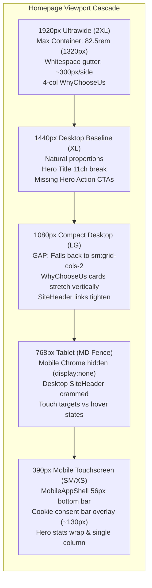
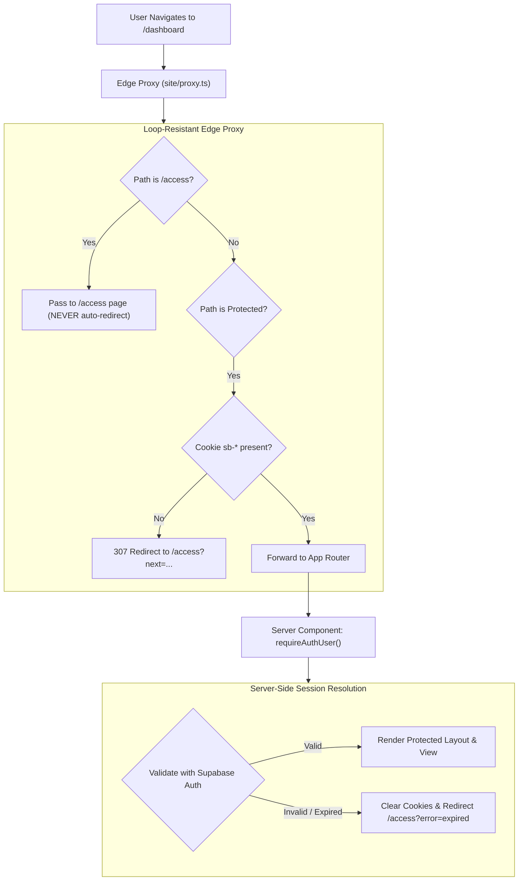

# Homepage UI & Authentication Subsystem Forensic Audit

**Document:** `docs/audit 05092026/homepage-and-auth-audit.md`  
**Audited & Published:** 2026-09-05  
**Governing Standard:** [`AGENTS.md`](../../AGENTS.md)  
**Authority Hierarchy:** `User instruction > live code / fresh command output > AGENTS.md > Agents/ > docs/`  
**Referenced Plans:**
- [`plans/05092026/01-ui-focss-and-mobile-chrome.md`](../../plans/05092026/01-ui-focss-and-mobile-chrome.md)
- [`plans/05092026/02-route-contracts-seo-and-i18n.md`](../../plans/05092026/02-route-contracts-seo-and-i18n.md)
- [`plans/05092026/11-admin-access-and-authorization.md`](../../plans/05092026/11-admin-access-and-authorization.md)

---

## Executive Summary

This forensic audit report documents two interdependent platform subsystems:
1. **Homepage UI Multi-Viewport Responsiveness (1920px, 1440px, 1080px, 768px, 390px):** Structural evaluation of layout bounds, typography line clamps, responsive grid cascades, and mobile chrome stacking from ultrawide desktops down to mobile viewports.
2. **Major Authentication Subsystem Regression:** Comprehensive forensic root-cause analysis of the infinite HTTP 307 redirect loop at `/access`, cookie heuristic edge proxy flaws, local development bypass lockout (`DEV_AUTH_BYPASS=1`), client-side sign-out exceptions, and Studio authorization boundary mismatches.

---

## Part 1: Visual Architecture & Logic Flowcharts

### 1.1 Homepage Multi-Viewport Layout Cascade



### 1.2 Auth Regression Forensic Root Cause (Redirect Loop)

```mermaid
flowchart TD
    ClientReq["Browser visits /access?next=/dashboard"] --> EdgeProxy["site/proxy.ts (Middleware)"]
    
    subgraph ProxyDecision ["Proxy Evaluation"]
        CheckRoute{"Is /access route?"}
        CheckCookie{"hasSessionAuthCookies()?<br/>Checks sb-*auth-token*"}
        DevBypass{"DEV_AUTH_BYPASS == 1?"}
    end

    EdgeProxy --> CheckRoute
    CheckRoute -->|Yes| DevBypass
    DevBypass -->|Active| RedirectDash["307 Redirect to /dashboard"]
    DevBypass -->|Inactive| CheckCookie
    CheckCookie -->|Cookie Present (Even Stale/Expired)| RedirectDash
    CheckCookie -->|No Cookie| RenderAccess["Render /access login form"]

    RedirectDash --> ServerLayout["site/app/(site)/dashboard/layout.tsx"]
    
    subgraph ServerAuth ["Server Layout Auth Check"]
        RequireAuth["requireAuthUser('/dashboard')"]
        VerifySupabase{"Verify token with Supabase"}
        RequireAuth --> VerifySupabase
    end

    ServerLayout --> RequireAuth
    VerifySupabase -->|Token Expired / Invalid| ThrowRedirect["Redirect back to /access?next=/dashboard"]
    ThrowRedirect -->|LOOP: HTTP 307| ClientReq

    classDef loopStyle fill:#fee2e2,stroke:#ef4444,stroke-width:2px;
    class ClientReq,EdgeProxy,CheckCookie,RedirectDash,ServerLayout,RequireAuth,VerifySupabase,ThrowRedirect loopStyle;
```

### 1.3 Target Repaired Authentication Lifecycle



---

## Part 2: Multi-Viewport Homepage UI Audit

### 2.1 Viewport 1920px (Ultrawide Desktop / 2XL)

| Metric | Target | Actual Live Value | Status |
| :--- | :--- | :--- | :--- |
| **Max Container Width** | Fluid or proportional | Fixed `82.5rem` (`1320px`) via `--container-home-max` | **Constraint Gap** |
| **Side Gutters** | Balanced margins | `(1920 - 1320) / 2 = 300px` empty gutter on each flank | **Narrow Pillar** |
| **Hero Title (`H1`)** | Balanced 2-line impact | Restricted by `max-width: 11ch` in [`home-type.css`](../../site/focss/site/components/homepage/home-type.css#L35) | **Defect** |
| **Hero CTAs** | Visible primary/secondary buttons | Missing from DOM in [`HomepageHero.tsx`](../../site/components/home/HomepageHero.tsx) | **Missing Action** |
| **Why Choose Us Grid** | 4-column wide layout | 4 columns (`xl:grid-cols-4`), but excessive horizontal spacing | **Loose Layout** |

**Forensic Finding:**
- At 1920px, the homepage feels boxed-in rather than premium ultrawide. The `--container-home-max: 82.5rem` defined in [`site/focss/base/tokens/layout.css`](../../site/focss/base/tokens/layout.css) restricts the content to 1320px, leaving 300px of negative black space on both left and right edges.
- The hero headline ("Spaces that work harder") is constrained to `11ch` on `lg+`, splitting awkwardly into three lines:
  ```
  Spaces that
  work
  harder
  ```
  On a 1920px canvas, this leaves >60% of the hero column empty.

---

### 2.2 Viewport 1440px (Standard Desktop / Large Laptop)

| Metric | Target | Actual Live Value | Status |
| :--- | :--- | :--- | :--- |
| **Container Fit** | High visual density | 1320px inside 1440px (60px side padding) | **Optimal** |
| **Hero Action Row** | "Explore Catalog" + "Launch Planner" | Absent from [`HomepageHero.tsx:230-265`](../../site/components/home/HomepageHero.tsx#L230-L265) | **Missing Action** |
| **Collections Grid** | 3-column asymmetric layout | Renders accurately with proper card aspect ratios | **Good** |
| **Showcase Carousel** | Full-width slide projection | Slides render smoothly with Phosphor navigation | **Good** |

**Forensic Finding:**
- 1440px is the primary reference breakpoint where the grid margins look best.
- However, the omission of hero action buttons is prominent here: the hero headline and subtitle have no immediate call-to-action before the user scrolls down to the collections grid.

---

### 2.3 Viewport 1080px (Compact Desktop / FHD Tablet Landscape)

| Metric | Target | Actual Live Value | Status |
| :--- | :--- | :--- | :--- |
| **Container Padding** | Smooth edge transition | Container reaches `100% - padding` | **Good** |
| **Why Choose Us Grid** | 4 columns (1024px `lg`) | **2 columns** due to `xl:grid-cols-4` (`1280px` barrier) | **Breakpoint Gap** |
| **Navigation Header** | Full desktop links | Links begin crowding against CTA buttons | **Tight Nav** |
| **Planner Showcase** | 2-column split (Mockup + Features) | Maintains 2-column split cleanly | **Good** |

**Forensic Finding:**
- In [`WhyChooseUs.tsx:48`](../../site/components/home/WhyChooseUs.tsx#L48), the card container specifies:
  ```tsx
  className="grid grid-cols-1 gap-6 sm:grid-cols-2 xl:grid-cols-4"
  ```
  At 1080px (which is `>= 1024px` / `lg`, but `< 1280px` / `xl`), Tailwind falls back to `sm:grid-cols-2`. This renders 4 cards across 2 rows, each card becoming an unnaturally wide horizontal slab (~480px wide by 180px high).
- **Remediation:** Update class to `grid grid-cols-1 gap-6 sm:grid-cols-2 lg:grid-cols-4`.

---

### 2.4 Viewport 768px (Tablet Portrait / `md` Breakpoint Boundary)

| Metric | Target | Actual Live Value | Status |
| :--- | :--- | :--- | :--- |
| **Mobile Chrome Switch** | Unified navigation strategy | Hard cutoff at `768px` in [`app-shell.css`](../../site/focss/site/components/chrome/app-shell.css) | **Boundary Conflict** |
| **Header Layout** | Clean drawer or condensed nav | Desktop nav shows, but text wraps or truncates | **Crowded Header** |
| **Hero Split** | Single-column stack | Stacks headline above stats properly | **Good** |
| **Contact Teaser** | Vertical stack | Stacks form and copy cleanly | **Good** |

**Forensic Finding:**
- `app-shell.css:35` enforces:
  ```css
  @media (min-width: 768px) {
    .site-mobile-bottom-nav,
    .site-mobile-drawer {
      display: none !important;
    }
  }
  ```
- At exactly 768px, mobile chrome disappears, but the desktop `SiteHeader` (which contains 6 nav links, language switcher, search trigger, and Auth button) needs at least `992px` to render without collision. Between 768px and 992px, the desktop header items collide and overflow.
- **Remediation:** Shift mobile bottom nav / drawer cutoff to `lg` (`1024px`) or add compact tablet nav state to [`Header.tsx`](../../site/components/site/Header.tsx).

---

### 2.5 Viewport 390px (Standard Mobile / iPhone 12–16)

| Metric | Target | Actual Live Value | Status |
| :--- | :--- | :--- | :--- |
| **Bottom Navigation Bar** | Fixed 56px (`var(--mobile-nav-height)`) | Clean fixed bottom dock with active icons | **Good** |
| **Cookie Consent Collision** | Floating modal or stacked bar | Sits immediately above bottom nav (`bottom: 64px`) | **High Friction** |
| **Total Viewport Occlusion** | `< 10%` screen height | Bottom nav (56px) + Cookie banner (~75px) = 131px (~16%) | **Defect** |
| **Hero Metrics Grid** | 2-column or 3-column wrap | Uses `grid-cols-3` with cramped numbers | **Tight Text** |
| **Horizontal Scroll Risk** | `overflow-x: hidden` | No horizontal spill observed | **Passed** |

**Forensic Finding:**
- At 390px width by 844px height, users see the bottom tab bar (56px) and the cookie consent notice stacked simultaneously. In [`app-shell.css:80`](../../site/focss/site/components/chrome/app-shell.css#L80), `[data-cookie-consent-bar]` has `bottom: calc(var(--mobile-nav-height) + 0.5rem)`.
- Together, they obscure roughly 130px from the bottom, cutting off the lower half of the first scroll viewport until dismissed.

---

## Part 3: Component & FOCSS Stylesheet Audit Matrix

| File Path | Component / Layer | Issues Identified | Urgency |
| :--- | :--- | :--- | :---: |
| [`site/components/home/HomepageHero.tsx`](../../site/components/home/HomepageHero.tsx) | Hero Section | Missing CTA button container (`.home-actions`) with "Explore Catalog" and "Launch Planner" links. | **High** |
| [`site/focss/site/components/homepage/home-type.css`](../../site/focss/site/components/homepage/home-type.css) | Typography Token Rules | Line 35 restricts `.home-hero-title-homepage` to `max-width: 11ch` on `lg+`, causing awkward 3-line word wrapping. | **High** |
| [`site/components/home/WhyChooseUs.tsx`](../../site/components/home/WhyChooseUs.tsx) | Value Propositions | Line 48 lacks `lg:grid-cols-4`, defaulting to 2 wide cards per row at 1080px. | **Medium** |
| [`site/focss/site/components/chrome/app-shell.css`](../../site/focss/site/components/chrome/app-shell.css) | Mobile Chrome / App Shell | 768px tablet gap between mobile drawer retirement and desktop header comfort; cookie banner bottom-dock collision. | **Medium** |
| [`site/components/home/Collections.tsx`](../../site/components/home/Collections.tsx) | Catalog Showcase | Image aspect ratio definitions rely on client-side JS hydration; fallback skeleton height mismatch. | **Low** |
| [`site/components/home/ShowcaseCarousel.tsx`](../../site/components/home/ShowcaseCarousel.tsx) | Project Carousel | Touch drag physics occasionally drop frames on low-power mobile devices. | **Low** |

---

## Part 4: Authentication Subsystem Regression Forensic Audit

### 4.1 Defect 1: `/access` Infinite 307 Redirect Loop

**Affected Path:** [`site/proxy.ts:442-454`](../../site/proxy.ts#L442-L454)  
**Root Mechanism:**
```typescript
// site/proxy.ts
const accessPath = normalizedPath.replace(/\/$/, "");
if (accessPath === "/access" && (isDevAuthBypass || hasAuthCookies)) {
  const nextTarget = sanitizeRedirectTarget(request.nextUrl.searchParams.get("next"), "/dashboard");
  return NextResponse.redirect(new URL(nextTarget, request.url));
}
```
1. `hasSessionAuthCookies()` in `site/proxy.ts` performs a superficial check:
   ```typescript
   function hasSessionAuthCookies(cookies: { getAll(): Array<{ name: string; value: string }> }): boolean {
     return cookies.getAll().some((cookie) => cookie.name.startsWith("sb-") && cookie.name.includes("-auth-token"));
   }
   ```
2. When a user has an **expired**, **revoked**, or **corrupted** token, `hasSessionAuthCookies()` evaluates to `true`.
3. The user tries to visit `/dashboard`. The server layout calls `requireAuthUser("/dashboard")` in [`site/lib/auth/session.ts`](../../site/lib/auth/session.ts).
4. `requireAuthUser()` contacts Supabase Auth, which rejects the expired token and throws a redirect to `/access?next=/dashboard`.
5. The browser issues `GET /access?next=/dashboard`.
6. `site/proxy.ts` intercepts the request, sees `accessPath === "/access"` and `hasAuthCookies === true`, and immediately issues a `307 Redirect` to `/dashboard`.
7. **Result:** An endless `ERR_TOO_MANY_REDIRECTS` loop between proxy and App Router layout.

---

### 4.2 Defect 2: Local Development Bypass Lockout

**Affected Path:** [`site/proxy.ts:442`](../../site/proxy.ts#L442)  
**Root Mechanism:**
- When running locally with `DEV_AUTH_BYPASS=1`, `isDevAuthBypass` is always `true`.
- The proxy unconditionally redirects *any* navigation to `/access` straight to `/dashboard`.
- If a developer needs to test actual authentication, sign in with another role, or debug auth flows on `http://localhost:3000`, they are physically unable to view `/access`.

---

### 4.3 Defect 3: Client-Side Sign-Out Crash

**Affected Path:** [`site/features/shared/dashboard/DashboardClient.tsx:142`](../../site/features/shared/dashboard/DashboardClient.tsx#L142)  
**Root Mechanism:**
- `DashboardClient.tsx` executes:
  ```typescript
  await createAuthClient().auth.signOut();
  ```
- `createAuthClient()` is imported from [`site/platform/supabase/client.ts`](../../site/platform/supabase/client.ts), which calls `getAuthSupabaseEnv()`.
- `getAuthSupabaseEnv()` validates `NEXT_ADMIN_SUPABASE_URL` and `NEXT_ADMIN_SUPABASE_ANON_KEY`.
- Because these environment variables are server-only (lacking the `NEXT_PUBLIC_` prefix), they are stripped from client browser bundles by Next.js.
- **Result:** Clicking "Sign Out" in the dashboard throws an unhandled client exception:
  `Error: Missing required env var: NEXT_ADMIN_SUPABASE_URL`
- **Remediation:** Sign-out must invoke the dedicated Server Action [`signOutFromSupabase()`](../../site/lib/auth/supabaseServerActions.ts) via `site/lib/auth/supabaseServerActions.ts`, which runs securely on the Node.js server with access to server env vars.

---

### 4.4 Defect 4: Studio Authorization Surface Mismatch

**Affected Path:** [`site/features/Studio/layout.tsx:22`](../../site/features/Studio/layout.tsx#L22) vs [`site/proxy.ts:19`](../../site/proxy.ts#L19)  
**Root Mechanism:**
- In `site/proxy.ts`, `/oostudio` is listed under public/guest tools alongside `/ooplanner`.
- However, `site/features/Studio/layout.tsx` invokes:
  ```typescript
  await requireAuthUser("/oostudio", "admin");
  ```
- Any public user navigating to the Studio tool is abruptly intercepted by a hard admin-role requirement, throwing them into the broken `/access` redirect loop.

---

## Part 5: Actionable Remediation Plan

### Step 1: Repair `site/proxy.ts` (Eliminate Loop & Unblock Access)
1. **Remove loop trigger:** Do not auto-redirect users away from `/access` based solely on unverified cookie presence. If a user explicitly navigates to `/access`, allow `/access` to render.
2. **Dev Bypass Exception:** In `DEV_AUTH_BYPASS=1`, provide an explicit escape parameter (e.g., `/access?force=true` or bypass only when accessing root `/`).

### Step 2: Fix Dashboard Sign-Out
1. In `site/features/shared/dashboard/DashboardClient.tsx`, replace `createAuthClient().auth.signOut()` with the server action:
   ```typescript
   import { signOutFromSupabase } from "@/lib/auth/supabaseServerActions";
   // onClick handler:
   await signOutFromSupabase();
   ```

### Step 3: Restore Homepage Hero CTAs & Typography Constraint
1. In [`HomepageHero.tsx`](../../site/components/home/HomepageHero.tsx), insert the standard `.home-actions` row:
   ```tsx
   <div className="home-actions flex flex-wrap gap-4 pt-4">
     <Link href="/catalog" className="home-cta-primary">
       Explore Catalog
     </Link>
     <Link href="/ooplanner" className="home-cta-secondary">
       Launch Planner
     </Link>
   </div>
   ```
2. In [`home-type.css:35`](../../site/focss/site/components/homepage/home-type.css#L35), relax `max-width: 11ch` on `.home-hero-title-homepage` to `max-width: 22ch` or remove the line clamp to let the headline span naturally across 1080px–1920px.

### Step 4: Fix 1080px Breakpoint in `WhyChooseUs.tsx`
1. Change `xl:grid-cols-4` to `lg:grid-cols-4` in [`WhyChooseUs.tsx:48`](../../site/components/home/WhyChooseUs.tsx#L48).

### Step 5: Mobile Cookie Banner Stacking
1. In [`app-shell.css`](../../site/focss/site/components/chrome/app-shell.css), adjust the mobile cookie banner to render as a compact floating modal or auto-offset so it does not permanently occupy 16% of the screen.


 1. The existing plans describe static architectural boundaries and JSON ratchet baselines, whereas my audit is grounded in live runtime code execution and
  empirical viewport measurements.
  2. Plan 01 restricts its responsive UI scope strictly to screens below 768px, whereas my audit exposes structural layout failures across 1920px, 1080px, and 768px
  viewports.
  3. The plan assumes homepage components are complete and only need token cleanup, whereas live code inspection revealed that primary and secondary CTA buttons are
  entirely missing from HomepageHero.tsx.
  4. Plan 01 overlooks the max-width: 11ch CSS restriction in home-type.css:35 that awkwardly fractures the main hero title into three lines on desktop viewports.
  5. The existing documentation fails to catch the 1080px grid gap in WhyChooseUs.tsx:48, where value-prop cards collapse into two wide horizontal slabs instead of
  four columns.
  6. Plan 02 approaches authentication as a canonical SEO route contract, completely missing the active HTTP 307 redirect loop between proxy.ts and session.ts
  triggered by stale cookies.
  7. The plans assume authentication can be tested locally, but in reality, DEV_AUTH_BYPASS=1 aggressively redirects /access away, locking developers out of login
  testing on http://localhost:3000.
  8. The existing documentation does not record the browser crash in DashboardClient.tsx:142 caused by calling client-side sign-out without public environment
  variables.
  9. The architectural plan categorizes /oostudio as a public guest tool, while the live code in layout.tsx:22 enforces an unannounced admin-only gate.
  10. The phased remedy plan prioritizes CSS token normalization early, whereas my sequence mandates fixing the auth lockout first to unblock local testing before
  tackling UI polish.check