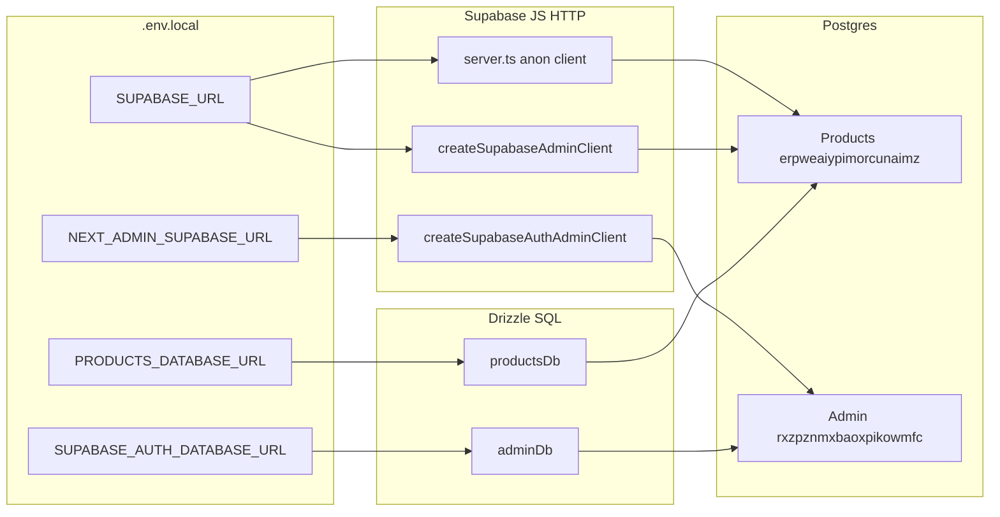
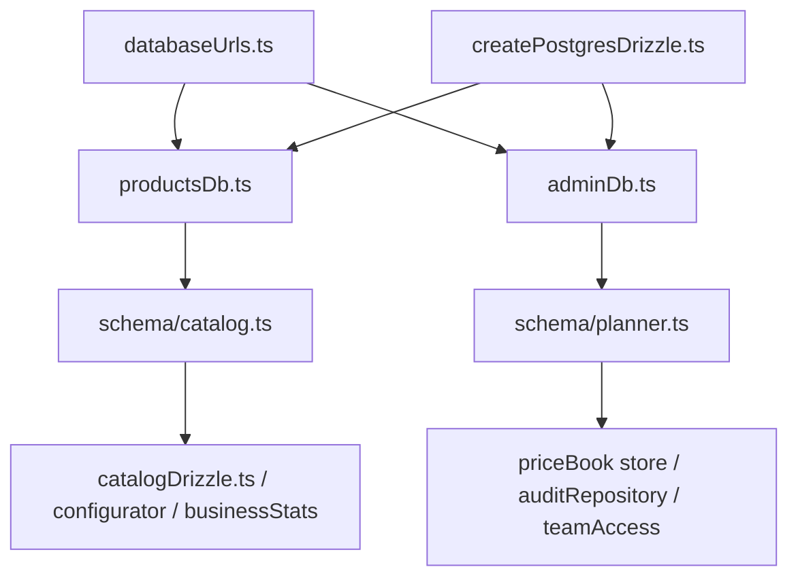
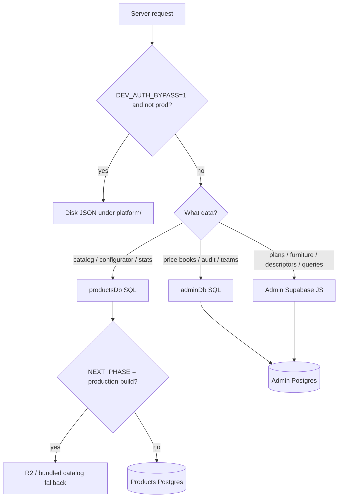

# Drizzle and database access

This explanation describes the two Supabase projects, their Drizzle and Supabase JavaScript access paths, and the exclusive persistence selectors. Live code under `site/platform/drizzle/`, `site/platform/supabase/`, and `site/lib/**PersistenceMode.ts` controls when details differ.

Tables and row-level security (RLS): [database schema](./schema.md). Safe operating procedures: [database operations](./ops.md).

Two separate Supabase Postgres projects. Two ways to talk to them. Disk only when `DEV_AUTH_BYPASS=1` (non-prod). Never dual-write. Production filesystem is read-only.

---

## Two databases

| Role | Project ref | Postgres URL | HTTP URL + key | SQL migrations | Drizzle schema |
|------|-------------|--------------|----------------|----------------|----------------|
| **Products** | `erpweaiypimorcunaimz` | `PRODUCTS_DATABASE_URL` | `SUPABASE_URL` + server-only `SUPABASE_SERVICE_ROLE_KEY` | `site/platform/supabase/migrations/` | `schema/catalog.ts` |
| **Admin** | `rxzpznmxbaoxpikowmfc` | `SUPABASE_AUTH_DATABASE_URL` (fallback `PLANNER_DATABASE_URL`) | `NEXT_ADMIN_SUPABASE_URL` + server-only `SUPABASE_ADMIN_SERVICE_ROLE_KEY` | `site/platform/supabase/migrations.admin/` | `schema/planner.ts` |

Staff / customers / furniture / descriptors → **Admin**. Marketing catalog / configurator / flags / themes → **Products**.

---

## Two access paths

| Path | Protocol | Client | Env it uses | Bypasses RLS? |
|------|----------|--------|-------------|---------------|
| **Drizzle** | Postgres wire | `postgres` + `drizzle-orm/postgres-js` | `*_DATABASE_URL` | Yes (direct SQL) |
| **Supabase JS** | HTTP PostgREST | `@supabase/supabase-js` | `*_SUPABASE_URL` + service-role or anon key | Service-role yes; anon no |

Server-only service-role credentials bypass RLS and must remain absent from client code, browser output, and client-visible configuration. HTTP URLs are for Auth and REST; Drizzle uses only Postgres wire URLs.

---

## How Drizzle is wired

Factory is one function. Two lazy singletons wrap it. A `Proxy` so `productsDb.select` / `adminDb.insert` work without calling `get*()` first.

| File | Job |
|------|-----|
| `site/platform/drizzle/createPostgresDrizzle.ts` | `postgres(url, { prepare: false, max: 1 })` → `drizzle(client)` |
| `site/platform/drizzle/databaseUrls.ts` | Resolve the two wire URLs. HTTP URLs are not used here. |
| `site/platform/drizzle/productsDb.ts` | Cache + `productsDb` proxy. Throws if `PRODUCTS_DATABASE_URL` missing. `server-only`. |
| `site/platform/drizzle/adminDb.ts` | Same for Admin / Planner. `server-only`. |
| `site/platform/drizzle/schema/catalog.ts` | Products table map |
| `site/platform/drizzle/schema/planner.ts` | Admin table map (`plans` → `oando_plans`) |
| `site/platform/drizzle/schema/index.ts` | Re-exports both. Admin `block_descriptors` aliased `adminBlockDescriptors`. |
| `site/platform/drizzle/drizzle.config.ts` | drizzle-kit only. Credentials = planner URL. Not the apply path. |

Pool knobs: `DRIZZLE_POOL_MAX` (default 1), idle 20s, connect 10s.

---

## What uses which path

| Data | Live store | Runtime path | Disk when `DEV_AUTH_BYPASS=1` |
|------|------------|--------------|-------------------------------|
| Marketing catalog | Products `catalog_products` + images / specs / aliases | **Drizzle** `catalogDrizzle.ts` | Bundled / R2 fallback (`sources.ts`) |
| Configurator | Products `configurator_products` | **Drizzle** `configuratorCatalog.server.ts` | — |
| Homepage stats | Products `business_stats_current` | **Drizzle** `features/crm/businessStats.ts` | — |
| Planner documents | Admin `oando_plans` | **Supabase JS** `projectsStore.supabase.ts` | `site/platform/Planner/data/projects/` |
| Furniture library | Admin `furniture_catalog` | **Supabase JS** (mode wrapper) | `site/platform/shared/data/furniture/` |
| Descriptors | Admin `block_descriptors` | **Supabase JS** (mode wrapper) | `site/inventory/descriptors/` |
| Price books | Admin `price_books` / `price_book_versions` | **Drizzle** `priceBookDrizzleStore.server.ts` | — |
| Audit events | Admin `audit_events` | **Drizzle** `auditRepository.ts` | — |
| Team membership | Admin `team_members` | **Drizzle** `teamAccess.ts` | — |
| Contact form | Admin `customer_queries` | **Supabase JS** | — |

Mode selectors: `plannerPersistenceMode.ts`, `furnitureCatalogMode.ts`.

Catalog Drizzle is skipped during `next build` (`canQueryCatalogDatabase()` is false when `NEXT_PHASE=phase-production-build`) so SSG does not open Postgres.

---

## Schema files vs live tables

Drizzle `pgTable(...)` is a TypeScript map, not the migration. Apply SQL with `ops db:apply` / `db:apply:admin`. `ops db:sync-drizzle` only **checks** that expected tables exist.

| Drizzle export | SQL table | Database |
|----------------|-----------|----------|
| `catalogProducts` | `catalog_products` | Products |
| `catalogCategories` | `catalog_categories` | Products |
| `catalogProductSpecs` | `catalog_product_specs` | Products |
| `catalogProductImages` | `catalog_product_images` | Products |
| `catalogProductSlugAliases` | `catalog_product_slug_aliases` | Products |
| `configuratorProducts` | `configurator_products` | Products |
| `businessStatsCurrent` | `business_stats_current` | Products |
| `plannerManagedProducts` | `planner_managed_products` | Products |
| `svgRevisions` / artifacts / v2 SVG tables | residual SVG | Products |
| `plans` | `oando_plans` | Admin |
| `profiles` | `profiles` | Admin |
| `teams` / `teamMembers` / `invites` | teams | Admin |
| `priceBooks` / `priceBookVersions` | price books | Admin |
| `auditEvents` | `audit_events` | Admin |
| `furnitureCatalog` | `furniture_catalog` | Admin |
| `blockDescriptors` (planner) | `block_descriptors` | Admin |

`catalog.ts` still declares a `blockDescriptors` table. Live Products `public` no longer has `block_descriptors` or `furniture_catalog` (moved to Admin; Products leftover is `archive.furniture_catalog`). Trust migrations + generated types over a stale `pgTable`.

Generated types (PostgREST shape, not Drizzle):

| File | Source |
|------|--------|
| `site/platform/types/database.types.ts` | `ops db:types` — Products project id from `.env.local` `SUPABASE_URL` |
| `site/platform/types/database.admin.types.ts` | `ops db:types:admin` — SQL introspection of Admin |

---

## Commands

| Goal | Command |
|------|---------|
| Apply Products SQL | `pnpm run db:apply -- --dry`, then `pnpm run db:apply` after review and authorization |
| Apply Admin SQL | `pnpm run db:apply:admin -- --dry`, then `pnpm run db:apply:admin` after review and authorization |
| Check configured Drizzle tables | `pnpm run ops db:sync-drizzle` |
| Regenerate Products types | `pnpm run db:types` |
| Regenerate Admin types | `pnpm run db:types:admin` |
| Seed furniture (Admin) | `pnpm run seed:furniture` |

drizzle-kit ledger under `site/platform/drizzle/migrations/` is **not** what `db:apply` runs.

---

## Not this file

- Table-by-table RLS → [`schema.md`](./schema.md)
- Seed / backup / restore → [`ops.md`](./ops.md)
- Proof that a migration ran in an environment requires a separately authorized observation; this file records no such result.
